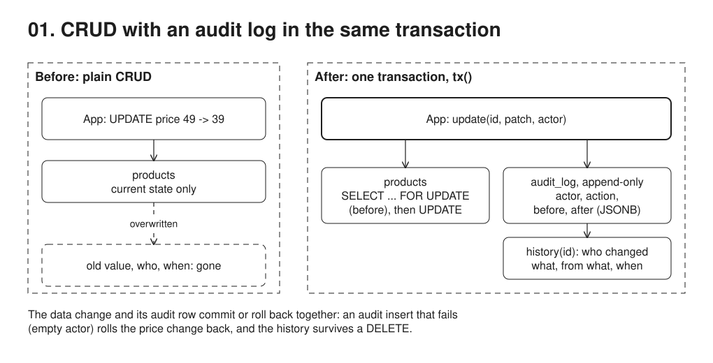

# 01. CRUD with audit log



**Pain: lost history.** An `UPDATE` or `DELETE` overwrites the old value, so nobody can later say who changed what, when, or what it was before.

**Reach for it when** support or compliance asks who changed what, and reads of current state dominate: most business apps, with one service and one database.

**Do not reach for it when** the history is the domain and you need to rebuild state or add read models later (03). Writes that bypass the app must be audited too: use triggers (with `SET LOCAL app.actor` for the user) or `pgaudit`. Several services need one central trail (17).

`products` CRUD where each create/update/delete writes an `audit_log` row (`actor`, `action`, `before`, `after` as JSONB) in the same transaction, so an app write and its audit row commit or roll back together.

## Run

One shot with proof: `./run-01-crud-audit.sh` from the repo root (log in [`../logs/01-crud-audit.log`](../logs/01-crud-audit.log)).

Each claim in the Proof section below is also a `check(label, condition)` in the code. A failed check marks the process failed, so the script exits non-zero; the log ends each process with `N checks passed` or `FAILED: ...`.

By hand, from this folder (ports: Postgres 55434):

```sh
docker compose up -d --wait
npm i
npm start
```

## Files

- `src/db.ts` schema + `tx` helper.
- `src/products.ts` CRUD + `history(id)`.

## Concepts

- **CRUD**: the table holds only the *current* state. `UPDATE` overwrites, `DELETE` erases. On its own, the database cannot tell you what a row looked like yesterday or who changed it.
- **Audit log**: a second, append-only table. Every write adds one row: `entity`, `entity_id`, `action` (create/update/delete), `actor`, `before` and `after` snapshots as JSONB, and `at`. Append-only is a convention here; in production enforce it (`REVOKE UPDATE, DELETE ON audit_log`, or a trigger that rejects them).
- **Ordering**: `at` is `now()`, the transaction start time, so it can be out of order under contention; `history()` orders by `id`, which the row lock keeps in order per entity.
- **Same transaction**: the data change and its audit row are committed together (`tx()` in `src/db.ts`). Either both exist or neither does. That is what makes the log trustworthy. If you write the audit afterwards, a crash between the two leaves a silent gap.
- **Capturing `before`**: an update first runs `SELECT ... FOR UPDATE`. That locks the row, so no concurrent writer can change it between reading `before` and writing `after`.
- **Trade-off**: the audit is only as complete as the code paths that call it. A manual `psql` UPDATE or another service writing the same table bypasses it. The alternatives are DB triggers (catch every writer, but only know the DB role unless the app passes the user in, e.g. `SET LOCAL app.actor = 'bob'` read with `current_setting('app.actor')`) and CDC (10, reads the WAL). The audit also stores snapshots, not intent: it says the price went 49 -> 39, not *why*.

## Proof (`logs/01-crud-audit.log`)

The audit insert fails (an empty actor violates `CHECK (actor <> '')`), so the price change rolls back with it:

```
## 3. Atomicity
   concept: if the audit insert fails (empty actor violates CHECK), the data change rolls back with it
   rejected: new row for relation "audit_log" violates check constraint "audit_log_actor_check"
   price still: 39.00
```

After the delete, `products` is empty but the history survives. Note id `4` is missing from `audit_log`: the rolled-back insert used up a sequence value and then vanished with its transaction.

```
 id | name | price
----+------+-------
(0 rows)

 id | entity  | entity_id | action | actor |                        before                        |                        after
----+---------+-----------+--------+-------+------------------------------------------------------+------------------------------------------------------
  1 | product | 1         | create | alice |                                                      | {"id": 1, "name": "Keyboard", "price": "49.00"}
  2 | product | 1         | update | bob   | {"id": 1, "name": "Keyboard", "price": "49.00"}      | {"id": 1, "name": "Keyboard", "price": "39.00"}
  3 | product | 1         | update | alice | {"id": 1, "name": "Keyboard", "price": "39.00"}      | {"id": 1, "name": "Mech Keyboard", "price": "39.00"}
  5 | product | 1         | delete | carol | {"id": 1, "name": "Mech Keyboard", "price": "39.00"} |
```

The self-checks, one line per claim, then one summary per process; any failed check makes the run script exit non-zero:

```
   check ok: create writes one audit row: before=null, after=the new row
   check ok: each update writes one audit row with the before and after values
   check ok: the update with an empty actor is rejected
   check ok: the rolled-back update left the price unchanged and wrote no audit row
   check ok: the row is gone from products after the delete
   check ok: the history survives the delete: one audit row per change (create, update, update, delete), the last one keeping the final value
   check ok: audit_log holds no row from the rolled-back change
7 checks passed
```

## Origins and further reading

- Article: "Audit Log", Martin Fowler, 2004. https://martinfowler.com/eaaDev/AuditLog.html
- Article: "Temporal Patterns", Martin Fowler, mid-2000s. https://martinfowler.com/eaaDev/timeNarrative.html
- Book: *Developing Time-Oriented Database Applications in SQL*, Richard T. Snodgrass, 1999 (free PDF from the author). https://www2.cs.arizona.edu/~rts/tdbbook.pdf
