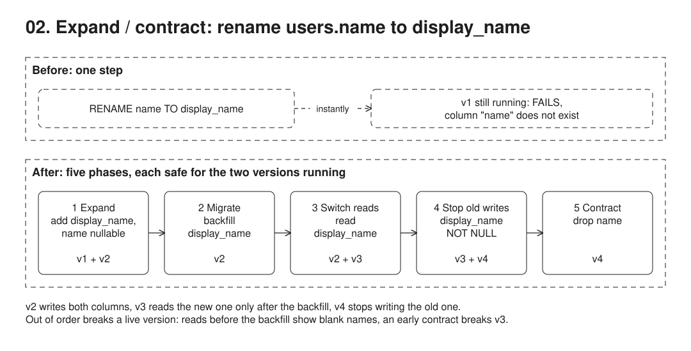

# 02. Expand / contract schema change



**Pain: deploy breakage.** During a rolling deploy or a rollback, old and new app versions run against the same schema, so a plain `RENAME` or type change breaks whichever version expects the other shape.

**Reach for it when** you change a schema (rename, split, type change) on a system where old and new app versions, or other readers of the table, run at the same time.

**Do not reach for it when** you can take downtime, or the app and schema deploy as one unit with no other readers (pre-launch, internal tool): the multi-release dance is pure cost. The change is purely additive (a new nullable column): it is already backward compatible and needs no contract phase. Nobody will schedule the contract step: a half-done migration leaves two columns and the write-both code in place forever.

Zero-downtime rename of `users.name` to `display_name`. Four app versions (`src/versions.ts`) and four migrations; in every phase the two versions that overlap during a rolling deploy both keep working. Also shows the naive `RENAME` breaking v1, a premature read switch, and a premature contract.

| Phase | Migration | Versions running |
| --- | --- | --- |
| 1 expand | add `display_name`, drop `NOT NULL` on `name` | v1 + v2 |
| 2 migrate | backfill `display_name` | v2 |
| 3 switch reads | none | v2 + v3 |
| 4 stop old writes | `display_name SET NOT NULL` | v3 + v4 |
| 5 contract | drop `name` | v4 |

## Run

One shot with proof: `./run-02-expand-contract.sh` from the repo root (log in [`../logs/02-expand-contract.log`](../logs/02-expand-contract.log)).

Each claim in the Proof section below is also a `check(label, condition)` in the code. A failed check marks the process failed, so the script exits non-zero; the log ends each process with `N checks passed` or `FAILED: ...`.

By hand, from this folder (ports: Postgres 55438):

```sh
docker compose up -d --wait
npm i
npm start
```

## Files

- `src/versions.ts` the four app versions, each writing and reading one or both columns.
- `src/index.ts` the migration of each phase, the versions that overlap in it, and the naive rename, premature read switch and premature contract probes.

## Concepts

- **Rolling deploy**: new instances start while old ones still serve traffic, so two app versions always share one schema for a while. A schema change is safe only if it works for both the version before and the version after.
- **Why a plain `RENAME` fails**: it is atomic for the database but instant breakage for every instance still running the old code. The same holds for dropping a column, adding a `NOT NULL` column without a default, or changing a type.
- **Expand**: only additive, backward-compatible changes. Add `display_name` as nullable, and relax `NOT NULL` on `name` so a future version can stop writing it.
- **Dual write**: v2 writes both columns and still reads the old one. It runs next to v1, which knows nothing about `display_name`. Unlike the dual-write problem in 09, both columns go in one statement, so they cannot diverge.
- **Backfill**: once v1 is fully retired, copy `name` into `display_name` for old rows (`UPDATE ... WHERE display_name IS NULL`; batch it on big tables). Doing it earlier would leave gaps, because v1 keeps writing rows without the new column.
- **Switch reads**: v3 reads `display_name`. It is only safe after the backfill; the demo probes a premature switch and finds blank names.
- **Tighten**: when every writer fills `display_name`, make it `NOT NULL`. Then v4 stops writing `name`. On a big table, `SET NOT NULL` scans under an exclusive lock: first add `CHECK (display_name IS NOT NULL) NOT VALID`, then `VALIDATE CONSTRAINT` (no blocking lock); from Postgres 12, `SET NOT NULL` reuses that check and skips the scan. Run migrations with a short `lock_timeout`.
- **Contract**: when no running version touches `name`, drop it. Each phase is a separate deploy that can be paused or rolled back one step; once v4 stops writing `name`, rolling back past v3 would show blanks, and the contract step is fully one-way.
- **Trade-offs**: one logical change becomes three app deploys (v2, v3, v4) and four migrations spread over days. Tools like `pgroll` and `reshape` automate the pattern with views and triggers so both schema versions are served at once.

## Proof (`logs/02-expand-contract.log`)

The naive rename breaks the running v1 instantly:

```
   migration naive: ALTER TABLE users RENAME COLUMN name TO display_name
   v1 (write name, read name): FAILS: column "name" of relation "users" does not exist
```

Every phase keeps both overlapping versions working, and reading the new column before the backfill would show blanks (abridged):

```
## 1. Expand
   v1 (write name, read name): write ok, read 2 rows, all have a name
   v2 (write both, read name): write ok, read 3 rows, all have a name
   probe v3 (write both, read display_name): 2 rows WITHOUT a name
## 3. Switch reads
   v2 (write both, read name): write ok, read 5 rows, all have a name
   v3 (write both, read display_name): write ok, read 6 rows, all have a name
## 4. Stop writing the old column
   v3 (write both, read display_name): write ok, read 7 rows, all have a name
   v4 (write display_name, read display_name): write ok, read 8 rows, all have a name
```

Contracting too early would have broken v3, which is why each phase waits for the previous version to be fully gone:

```
## Why the order matters
   v3 (write both, read display_name): FAILS: column "name" of relation "users" does not exist
```

The self-checks, one line per claim, then one summary per process; any failed check makes the run script exit non-zero:

```
   check ok: v1 writes and reads a name for every row
   check ok: the naive rename breaks the running v1 the moment it commits
   check ok: v1 and v2 each write and read a name for every row
   check ok: before the backfill, a reader of display_name sees rows without a name
   check ok: v2 writes and reads a name for every row
   check ok: v2 and v3 each write and read a name for every row
   check ok: v3 and v4 each write and read a name for every row
   check ok: v4 writes and reads a name for every row
   check ok: contracting while v3 still ran would have broken it
   check ok: the final schema has only id and display_name, NOT NULL
   check ok: every row written by every version in every phase has a display_name (9 rows)
11 checks passed
```

## Origins and further reading

- Article: "Parallel Change", Danilo Sato, 2014 (the name for expand/contract). https://martinfowler.com/bliki/ParallelChange.html
- Book: *Refactoring Databases: Evolutionary Database Design*, Scott Ambler and Pramod Sadalage, 2006. https://www.martinfowler.com/books/refactoringDatabases.html
- Article: "Evolutionary Database Design", Pramod Sadalage and Martin Fowler, revised 2016. https://www.martinfowler.com/articles/evodb.html
- Article: "Online migrations at scale", Jacqueline Xu (Stripe), 2017 (a data migration in four dual-write steps, a close cousin of expand/contract). https://stripe.com/blog/online-migrations
