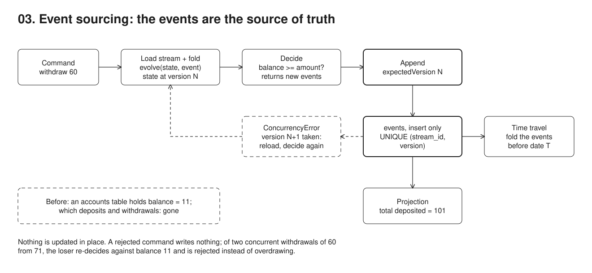

# 03. Event sourcing



**Pain: lost business history.** A current-state table keeps only the latest values, so what happened (`MoneyWithdrawn`, `OrderCancelled`) and in what order is gone. An audit log beside it (01) records snapshots, not intent, and is not the source of truth, so nothing guarantees it replays into the current state.

**Reach for it when** the history is the domain (ledgers, bookings, workflows) and you need to rebuild state, answer "what was it at time T", or build new read models from events already stored.

**Do not reach for it when** the domain is plain CRUD and you only need to know who changed what: 01 is far cheaper. You would apply it to a whole system by default: every event schema is a contract you version forever, and every current-state query needs a projection that lags the write. You want it as the way services talk to each other: publish separate integration events through an outbox (09) instead of exposing the event store.

Bank account aggregate. Commands (`open`, `deposit`, `withdraw`) validate against state rebuilt from events and return new events. Nothing is updated in place.

## Run

One shot with proof: `./run-03-event-sourcing.sh` from the repo root (log in [`../logs/03-event-sourcing.log`](../logs/03-event-sourcing.log)).

By hand, from this folder (ports: Postgres 55433):

```sh
docker compose up -d --wait
npm i
npm start
```

## Files

- `src/store.ts` event store: `append(streamId, expectedVersion, events)`, `readStream`. A stale `expectedVersion` hits the unique constraint -> `ConcurrencyError`.
- `src/account.ts` events, `evolve` (fold), command handlers.
- `src/index.ts` demo: happy path, rejected withdrawal, concurrent-write conflict, retry that re-decides on conflict, time travel by date (`readStream(id, before)`), a projection (total deposited).

## Concepts

- **Events are the source of truth**: there is no `accounts` table. The `events` table stores facts in the past tense (`AccountOpened`, `MoneyDeposited`, `MoneyWithdrawn`). Rows are only ever inserted, never updated or deleted (by convention here; enforce it with `REVOKE UPDATE, DELETE` or a trigger).
- **Mistakes are fixed with new events**: a wrong deposit is corrected by a compensating event (a reversal), never by editing history.
- **Stream**: all events of one aggregate (one account), keyed by `stream_id`, ordered by `version` 1, 2, 3...
- **Rehydrate / fold**: current state = a `reduce` over the events that applies `evolve` and counts versions (`rehydrate` in `src/account.ts`). `evolve` is a pure function `(state, event) -> state`.
- **Command -> decide -> append**: a command (`withdraw 30`) loads the stream, rebuilds state, checks invariants (enough balance?), and returns *new events*. Only those events are persisted. A rejected command writes nothing.
- **Optimistic concurrency**: the writer says "I decided based on version N", so its events get versions N+1, N+2... `UNIQUE (stream_id, version)` makes a second writer that also read N fail with `ConcurrencyError`. That writer reloads, decides again against the fresh state, and appends (`handleWithRetry`, bounded, retries only `ConcurrencyError`). Re-deciding matters: of two concurrent withdrawals of 60 from 71, the loser's retry sees 11 and is rejected instead of overdrawing. No locks are held while deciding.
- **Time travel**: state at any past point = fold only the events before it. Business asks by date ("end of March"), so `readStream(id, before)` filters on `at` (recorded time, with an explicit timezone for the boundary). If the question is about effective time (backdated entries), the event needs its own effective date and the filter runs on that (bitemporal). Filtering by version is the same fold over a prefix.
- **Projections / read models**: new views (a balance table, a "total deposited" report, a search index) are built by replaying the events. They can be thrown away and rebuilt at any time, including views nobody thought of when the events were written. The demo's projection is an in-memory sum; a real read model lives in its own table with a checkpoint (last position applied) and lags slightly behind the writes. Separate write and read models is **CQRS**.
- **Trade-offs**: queries across aggregates need projections, events are forever (so schema evolution/upcasting matters, and personal data in them can only be erased by crypto-shredding, 18), and long streams need snapshots to stay fast. `global_position` orders events across streams, but a BIGSERIAL can have gaps and can commit out of order under concurrent writers, so a projection that tails it needs a guard (a single writer, or reading only up to the oldest in-flight transaction).

## Proof (`logs/03-event-sourcing.log`)

The invariant is checked against rebuilt state, and two writers race:

```
## 2. Invariants are checked against rebuilt state
   rejected: insufficient funds: balance 70, asked 500

## 3. Optimistic concurrency
   writer A and writer B both read v3
   writer A appended v4
   writer B: ConcurrencyError=true (stream account-... moved past v3)

## 3b. Retry
   v4 balance=71 -> appended {"type":"MoneyWithdrawn","amount":60}
   writer B: conflict on attempt 1 (stream account-... moved past v4), reloading and deciding again
   writer B rejected: insufficient funds: balance 11, asked 60
```

State at any point in time, plus a projection derived after the fact:

```
   current state: { owner: 'alice', balance: 11, version: 5 }
   as of 2026-09-27T16:28:50.483Z: { owner: 'alice', balance: 70, version: 3 }
   by version is the same fold over a prefix, e.g. as of v1: { owner: 'alice', balance: 0, version: 1 }
   total deposited = 101
```

The raw table has exactly 5 facts: nothing from the rejected withdrawals and nothing from any losing writer. The gap at `global_position` 5 is losing writer B of step 3: its failed insert still consumed a sequence value, which is the BIGSERIAL gap mentioned above. The constraint doing the work is shown below it (stream_id column omitted).

```
 global_position | version |      type      |        data
               1 |       1 | AccountOpened  | {"owner": "alice"}
               2 |       2 | MoneyDeposited | {"amount": 100}
               3 |       3 | MoneyWithdrawn | {"amount": 30}
               4 |       4 | MoneyDeposited | {"amount": 1}
               6 |       5 | MoneyWithdrawn | {"amount": 60}

 events_stream_id_version_key | UNIQUE (stream_id, version)
```

## Origins and further reading

- Article: "Event Sourcing", Martin Fowler, 2005. https://martinfowler.com/eaaDev/EventSourcing.html
- Talk: "CQRS and Event Sourcing", Greg Young, Code on the Beach 2014. https://www.youtube.com/watch?v=JHGkaShoyNs
- Talk: "Event Sourcing", Greg Young, GOTO Aarhus 2014. https://www.youtube.com/watch?v=8JKjvY4etTY
- Talk: "A Decade of DDD, CQRS, Event Sourcing", Greg Young, DDD Europe 2016. https://www.youtube.com/watch?v=LDW0QWie21s
