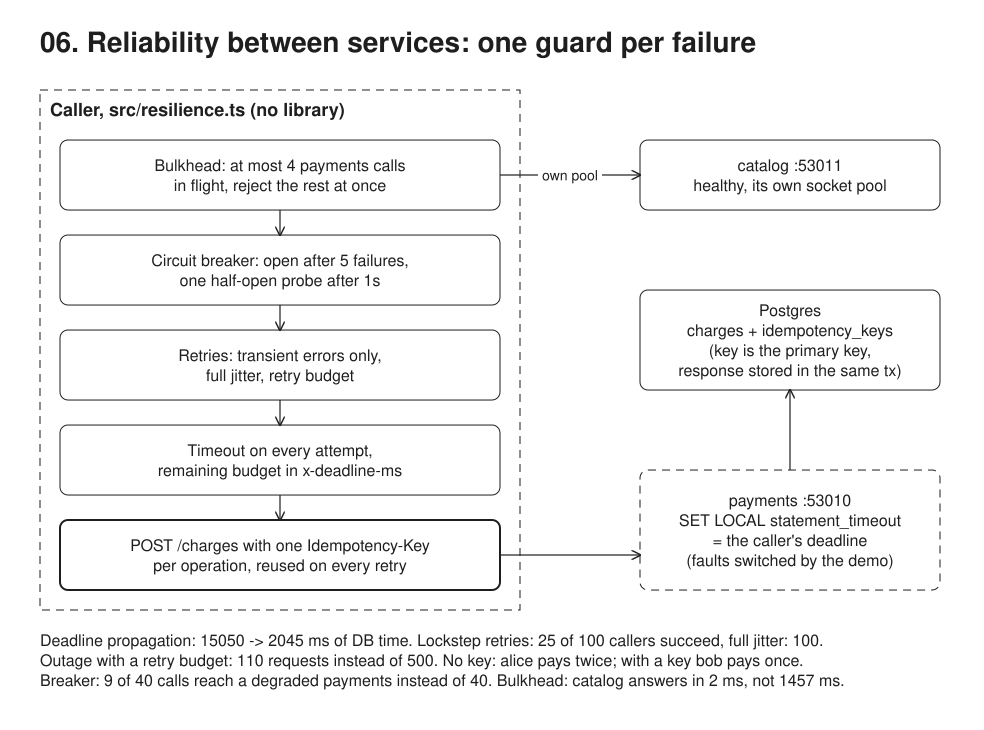

# 06. Reliability between services



**Pain: one flaky dependency takes the caller down.** A call with no deadline waits as long as a hung dependency does, and every waiting call holds a socket the healthy dependencies need. Naive retries turn a blip into an outage, and retrying a POST that timed out after the server committed charges the customer twice.

**Reach for it when** a service calls another over the network on a request path: every such call needs a timeout, a retry policy that knows which failures are transient, and, for writes, an idempotency key. Add a breaker and a bulkhead when one dependency's outage must not slow down or starve everything else.

**Do not reach for it when** the work does not need an answer now: put it on a queue or an outbox (09) and let a consumer retry at its own pace. The operation spans services that each commit their own data: retries make each step safe, a saga (08) handles the whole. A service mesh or client library already gives you timeouts, retries and breakers: configure it rather than hand-rolling a second layer, and make sure only one layer retries.

A caller process against `payments`, a separate HTTP process with its own Postgres database that the demo degrades, overloads, kills and restarts. The retry, backoff, retry budget, breaker and bulkhead are written by hand in `src/resilience.ts`, with no resilience library. Idempotency keys live in a Postgres table whose primary key is the key, with the stored response written in the same transaction as the charge.

## Run

One shot with proof: `./run-06-service-reliability.sh` from the repo root (log in [`../logs/06-service-reliability.log`](../logs/06-service-reliability.log)).

By hand, from this folder (ports: Postgres 55445, HTTP 53010 payments, 53011 catalog):

```sh
docker compose up -d --wait
npm i
npm run setup    # database payments: charges, idempotency_keys
npm run demo     # starts payments (npm run payments) as a child process, runs the 6 scenarios, stops it
```

## Files

- `src/resilience.ts` `call()` with a timeout and the `x-deadline-ms` header, `isRetryable`, `withRetries` (full jitter, max attempts, overall deadline, `Retry-After`, `RetryBudget`), `CircuitBreaker`, `Bulkhead`.
- `src/payments.ts` the dependency: `/quote`, `POST /charges` with idempotency keys, a fault switch (`PUT /_faults`) and counters (`GET /_stats`) the demo reads.
- `src/demo.ts` the caller: each scenario with and without the protection, and the numbers the dependency saw.

## Concepts

- **Timeout on every call**: without one, the caller waits as long as the dependency does (1.5s here, forever if it hangs), holding a socket and the user's request the whole time. `call()` passes `AbortSignal.timeout()` to `http.request`, so the deadline also covers time spent queued for a socket.
- **Deadline propagation**: a timeout frees the caller but not the dependency, which keeps working for nobody (10 queries ran their full 1500ms, 10 answers written to a closed connection). The caller sends its remaining budget in `x-deadline-ms`, a relative duration like gRPC's `grpc-timeout`, so no clock sync is needed. Payments applies it as `SET LOCAL statement_timeout`, and Postgres cancels the query at the deadline: 2045ms of database time instead of 15050ms. A service that calls further down passes on what is left of its own budget.
- **Bulkhead**: sockets (or threads, or pool connections) shared across dependencies are the path a failure spreads along. With one pool of 10 sockets, 10 slow payment calls make the healthy catalog wait 1457ms. `Bulkhead` caps payments at 4 calls in flight and rejects the rest at once, and catalog has its own pool, so it answers in 2ms. Rejecting beyond the limit is the point: a queue would just move the wait.
- **Retry only what can succeed next time**: `isRetryable` accepts timeouts, connection errors (reset, refused), 429, 502, 503, 504, and 409 when the same idempotency key is still in flight. A 400 or 422 fails the same way forever and is not retried. `withRetries` also stops at max attempts, and before a backoff that would overshoot the caller's overall deadline. Each attempt's timeout is the smaller of the per-attempt limit and what is left of that deadline. A `Retry-After` header is a floor on the next delay.
- **Backoff with full jitter**: without jitter, callers that failed together retry together (100, 200, 400, 800ms), so every wave hits the dependency's capacity at the same instant and most of it is shed again: 25 of 100 callers succeeded. Full jitter (`random(0, min(cap, base * 2^attempt))`, Marc Brooker) spreads the same retries over the gaps: 100 of 100 succeeded, with fewer requests. Immediate retries are the worst case: 465 requests in 32ms and only 10 successes.
- **Retry budget**: max attempts still multiplies load by up to 5 during a real outage (500 requests for 100 callers, none of which could succeed). A budget caps retries as a share of traffic across the whole caller: each request earns 0.1 token, a retry costs 1, at most 10 are banked (Finagle's `RetryBudget`, gRPC's retry throttling). The same outage then costs 110 requests. It only protects if every caller runs one, and only one layer of the stack should retry.
- **Idempotency key**: a timeout says nothing about whether the server committed. Payments commits alice's charge, answers late, the caller retries, and alice pays twice. The caller creates one `Idempotency-Key` per logical operation and reuses it on every retry. Payments claims the key (`INSERT ... ON CONFLICT (key) DO NOTHING`, the key is the primary key), then inserts the charge and stores the response in one transaction. A retry gets the stored response back (`idempotent-replayed: true`) and no new charge. A concurrent duplicate that arrives while the first is in flight gets `409` with `Retry-After: 1`, retries, and gets the replay. The same key with a different body (by request hash) gets `422`, which is not retried. Status codes follow the IETF Idempotency-Key draft and Stripe.
- **What the idempotency sketch leaves out**: if payments crashes between claiming the key and committing, the key stays in flight forever. Brandur Leach's design adds a `locked_at` lease that a later request may take over. Keys should be scoped to the authenticated account, not global, and expired after a retention window (Stripe keeps them 24 hours).
- **Circuit breaker**: while the dependency is degraded, every call still pays the full 200ms timeout, and the dependency still receives all 40 requests. After 5 consecutive failures `CircuitBreaker` opens, and calls fail in 0ms without reaching payments (9 of 40 did). After a 1000ms cooldown it goes half-open and lets exactly one probe through: a failed probe reopens it, a successful one closes it. The run shows the probe failing on a timeout, then on `ECONNREFUSED` while the process is dead, and then succeeding after the restart. Only dependency failures (timeouts, connection errors, 5xx) count. A 4xx is the caller's fault and does not trip it. The cost shows too: after the restart, requests keep failing fast until the next probe (14 of 30 in the healed window). Nygard's *Release It!* named the pattern; Hystrix, resilience4j and Polly are the usual libraries.
- **What the demo simplifies**: the caller and its "users" are one process, and faults are switched by an admin endpoint instead of arising by themselves. A production breaker usually trips on a failure rate over a sliding window rather than a consecutive count, and bulkheads, breakers and budgets are kept per dependency (often per endpoint) and exported as metrics.

## Proof (`logs/06-service-reliability.log`)

A timeout frees the caller. Only the propagated deadline also stops the dependency's work:

```
   no timeout                     caller: waited 1526-1529ms, 10 ok
                                  payments: 10 queries ran to completion, 0 cancelled at the deadline, 15204ms of DB time in total, 0 answers written to a closed connection
   200ms timeout                  caller: waited 201-203ms, 10 timeout (no reply within 200ms)
                                  payments: 10 queries ran to completion, 0 cancelled at the deadline, 15050ms of DB time in total, 10 answers written to a closed connection
   200ms timeout + x-deadline-ms  caller: waited 201-202ms, 10 timeout (no reply within 200ms)
                                  payments: 0 queries ran to completion, 10 cancelled at the deadline, 2045ms of DB time in total, 10 answers written to a closed connection
```

A shared pool lets slow payments starve healthy catalog. The bulkhead rejects instead:

```
   one shared pool (10 sockets)  payments: 10 ok; catalog waited 1457-1458ms (queued behind payments)
   bulkhead (payments limit 4)   payments: 4 ok, 6 bulkhead-full (4 calls already in flight), rejections took 0ms; catalog waited 2ms
```

Transient failures are retried, a 400 is not (abridged):

```
   payments will answer: connection reset, then ok
      attempt 1: network (socket hang up) -> retry in 18ms
      => ok after 21ms; payments received 2 request(s)
   payments will answer: 400 bad request
      attempt 1: HTTP 400 invalid amount -> not retryable, give up
      => failed: HTTP 400 invalid amount after 0ms; payments received 1 request(s)
```

100 callers at once against 5 requests per 25ms. Lockstep retries arrive as spikes and most are shed again. Full jitter spreads them and everyone gets through. During a full outage, the budget cuts the load from 500 requests to 110:

```
   immediate retries
      arrivals per 100ms: 465
      465 requests reached payments for 100 callers; 10 succeeded, 90 gave up; slowest caller done after 32ms
   exponential backoff, no jitter (100, 200, 400, 800ms: every caller retries at the same instants)
      arrivals per 100ms: 100  95   0  90   0   0   0  85   0   0   0   0   0   0   0  80
      450 requests reached payments for 100 callers; 25 succeeded, 75 gave up; slowest caller done after 1523ms
   exponential backoff, full jitter (random between 0 and 100, 200, 400, 800ms)
      arrivals per 100ms: 211  42  41  15  10   7   3   3   0   2   1   1
      336 requests reached payments for 100 callers; 100 succeeded, 0 gave up; slowest caller done after 1136ms
   payments is fully down (503 for everything): retries cannot help, they only multiply the load
   full jitter, no budget
      arrivals per 100ms: 220  73  48  27  30  30  17   7  10  17  10   8   3
      500 requests reached payments for 100 callers; 0 succeeded, 100 gave up; slowest caller done after 1288ms
   full jitter + retry budget (each request earns 0.1 retry token, a retry costs 1, at most 10 banked)
      arrivals per 100ms: 109   1
      110 requests reached payments for 100 callers; 0 succeeded, 100 gave up; slowest caller done after 99ms
```

The same fault, a commit followed by a late answer, with and without a key. Then a concurrent duplicate and a reused key:

```
   alice, no key. payments commits the charge, then answers after 1000ms
      attempt 1: timeout (no reply within 300ms) -> retry in 67ms
      => 201 {"id":2,"customer":"alice","amount":"42.00"}
   bob, key charge-bob-1. same fault
      attempt 1: timeout (no reply within 300ms) -> retry in 85ms
      => 201 {"id":3,"amount":"42.00","customer":"bob"} (idempotent-replayed: stored response, no new charge)
   carol, key charge-carol-1 sent twice at once (a double click). payments holds the first transaction open for 1000ms
      attempt 1: HTTP 409 a request with this key is in flight -> retry in 1000ms
      => 201 {"id":4,"customer":"carol","amount":"42.00"}
      => 201 {"id":4,"amount":"42.00","customer":"carol"} (idempotent-replayed: stored response, no new charge)
   bob again, same key charge-bob-1 but amount 99.00
      attempt 1: HTTP 422 idempotency key reused with a different request -> not retryable, give up
```

```
 customer | charges | total
 alice    |       2 | 84.00
 bob      |       1 | 42.00
 carol    |       1 | 42.00

      key       | response_status |                   response_body
 charge-bob-1   |             201 | {"id": 3, "amount": "42.00", "customer": "bob"}
 charge-carol-1 |             201 | {"id": 4, "amount": "42.00", "customer": "carol"}
```

Without a breaker, all 40 calls reach the degraded payments. With one, 9 do. It probes through the crash and closes after the restart:

```
   without a breaker, 2s: 40 timeout (no reply within 200ms); each took 200-202ms; payments received 40 requests
      t+ 408ms breaker closed -> open (5 consecutive failures)
      t+1427ms breaker open -> half-open (1000ms cooldown over, let one probe through)
      t+1629ms breaker half-open -> open (probe failed: timeout (no reply within 200ms))
   with a breaker, 2s degraded: 9 timeout (no reply within 200ms), 31 breaker-open; payments received 9 requests; fast failures took 0ms
   [payments pid 55069] killed
      t+2647ms breaker open -> half-open (1000ms cooldown over, let one probe through)
      t+2648ms breaker half-open -> open (probe failed: network (ECONNREFUSED))
   ...
   [payments pid 55334] listening on :53010, catalog on :53011
   t+3976ms payments restarted, healthy
      t+4685ms breaker open -> half-open (1000ms cooldown over, let one probe through)
      t+4687ms breaker half-open -> closed (probe succeeded)
   with a breaker, 1.5s healed: 14 breaker-open, 16 ok
```

## Origins and further reading

- Article: "Exponential Backoff And Jitter", Marc Brooker, AWS Architecture Blog, 2015 (full jitter). https://aws.amazon.com/blogs/architecture/exponential-backoff-and-jitter/
- Article: "Timeouts, retries, and backoff with jitter", Marc Brooker, Amazon Builders' Library. https://aws.amazon.com/builders-library/timeouts-retries-and-backoff-with-jitter/
- Article: "Making retries safe with idempotent APIs", Malcolm Featonby, Amazon Builders' Library. https://aws.amazon.com/builders-library/making-retries-safe-with-idempotent-APIs/
- Article: "Implementing Stripe-like Idempotency Keys in Postgres", Brandur Leach, 2017 (409 for in-flight keys, lock leases, recovery). https://brandur.org/idempotency-keys
- Spec: "The Idempotency-Key HTTP Header Field", IETF httpapi draft (409 for a concurrent request, 422 for a reused key with a different payload). https://datatracker.ietf.org/doc/draft-ietf-httpapi-idempotency-key-header/
- Book: *Release It!* (2nd ed.), Michael Nygard, 2018 (circuit breaker, bulkhead, timeouts as stability patterns). https://pragprog.com/titles/mnee2/release-it-second-edition/
- Article: "Circuit Breaker", Martin Fowler, 2014. https://martinfowler.com/bliki/CircuitBreaker.html
- Docs: "Deadlines", gRPC (deadline propagation to downstream calls). https://grpc.io/docs/guides/deadlines/
- Docs: Finagle clients, retries and `RetryBudget`. https://twitter.github.io/finagle/guide/Clients.html#retries
