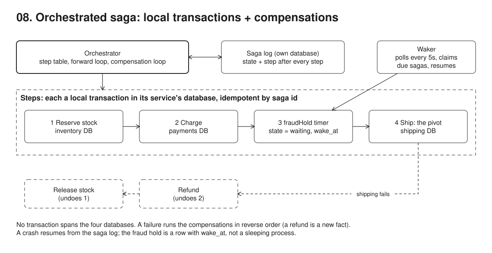

# 08. Saga, orchestrated



**Pain: partial failure.** Each service owns its database, so no transaction covers the whole order. A failure halfway leaves stock reserved and money taken for an order that will never ship.

**Reach for it when** one business operation spans services that each own their data, including long-running flows that wait (the `fraudHold` timer here).

**Do not reach for it when** the data lives in one database: use a transaction. The operation needs isolation, so nobody may see or act on the half-done state: a saga has none (ACD, not ACID), so draw the service boundary around that data instead. The flow has many branches, long waits or human steps: use a workflow engine (Temporal) rather than a hand-rolled step table. Other teams' services should react to the same facts rather than be commanded: choreograph it (12).

Places an order across inventory, payments and shipping without a distributed transaction: an orchestrated saga across three services, each with its own Postgres database (`inventory`, `payments`, `shipping`), plus the orchestrator's saga log (`orchestrator`). Steps: reserve stock, charge, ship; compensations: release, refund. Every step is idempotent by saga id, so recovery can safely re-run it. A `fraudHold` timer step parks a saga in the log (`state = 'waiting'`, `wake_at`) instead of blocking a process; a separate waker polls and resumes it. Services are in-process functions standing in for remote microservices; each call logs `-> HTTP`.

## Run

One shot with proof: `./run-08-saga.sh` from the repo root (log in [`../logs/08-saga.log`](../logs/08-saga.log)).

By hand, from this folder (ports: Postgres 55439):

```sh
docker compose up -d --wait
npm i
npm run setup    # create the 4 databases and tables, stock = 10
npm run demo     # happy path, payment failure, shipping failure, then a crash mid-saga (exit 1)
npm run resume   # new process: reload unfinished sagas from the log and finish them
npm run timer    # start order-E with a 30s hold; it parks as a row and the process exits
npm run waker    # poll every 5s, wake due sagas, exit when none is waiting
```

## Files

- `src/orchestrator.ts` step table, forward loop, compensation loop, saga log updates.
- `src/services.ts` the three services' local transactions and compensations.
- `src/waker.ts` the poller that claims due sagas and resumes them.

## Concepts

- **No transaction spans services**: each service owns its database (here, 4 real Postgres databases), so a `BEGIN ... COMMIT` cannot cover all three steps. Two-phase commit exists but couples every service's availability and is rarely used across services.
- **Saga**: a sequence of local transactions (`reserveInventory`, `chargePayment`, `createShipment`, with a `fraudHold` timer before shipping). Each commits on its own. If a later step fails, earlier ones are undone by **compensating actions** (`release`, `refund`), run in reverse order. Coined by Garcia-Molina and Salem ("Sagas", SIGMOD 1987) for long-lived transactions inside one database; microservices reuse the idea across databases.
- **Compensation is semantic, not a rollback**: a refund is a new fact; the charge still happened. Some steps cannot be compensated (an email already sent), so order steps as compensatable ones, then one pivot (the go/no-go step, here `createShipment`, which has no compensation), then retriable ones that must eventually succeed (Richardson's taxonomy).
- **Orchestration vs choreography**: here a central orchestrator (`src/orchestrator.ts`) tells each service what to do next. In choreography, services react to each other's events instead, each through its own outbox; 12 runs this same order flow that way. Orchestration is easier to follow and change; choreography has no central component.
- **Saga log**: the orchestrator persists `state` and `step` after every step in its own database. After a crash, it reloads unfinished sagas and continues forward or keeps compensating. This assumes a single orchestrator; with several, claim a saga first (`SELECT ... FOR UPDATE SKIP LOCKED` or a lease column), or run one active orchestrator under a leader lease (19).
- **Idempotent steps**: a crash between "step ran" and "log updated" means the step runs again on recovery. Each step and compensation is keyed by saga id (steps: `INSERT ... ON CONFLICT DO NOTHING`; compensations: `DELETE ... RETURNING`, `UPDATE ... WHERE status = 'charged'`), so running it twice has the effect of running it once. `reserve` puts its insert and stock update in one local transaction so the pair is all-or-nothing.
- **Trade-offs**: no isolation. Other transactions can see intermediate states (stock reserved, payment not yet taken). Countermeasures include semantic locks (a `PENDING` status) and ordering steps so the riskiest come first. Also, a failed or timed-out step may have committed anyway; real orchestrators retry it or also run its (idempotent) compensation.
- **Toy services**: every `-> HTTP` log line stands for a network call to a separate microservice with its own remote database. Here each service is a function in `src/services.ts`, and each database is a separate Postgres database in one local container.
- **Durable timer**: a saga that has to wait (a fraud hold, a payment deadline, days in real life) must not keep a process alive for that long. The `fraudHold` step (`holdSec` in the order) writes `state = 'waiting'` and `wake_at` to the saga log, and `runSaga` returns. The wait is now a row, so any process can crash or be redeployed without losing it.
- **Waker**: `src/waker.ts` polls every 5s, claims due sagas in one statement (`UPDATE ... SET state = 'running' WHERE state = 'waiting' AND wake_at <= now() RETURNING id`, so two wakers cannot claim the same saga) and calls `runSaga`, which continues at the step after the timer. It wakes up to one poll interval late. Deliberately missing: a waker that crashes after claiming leaves the saga in `running` with no owner (a lease with an expiry fixes that), plus retries, heartbeats for long steps, and waiting for an external event (a signal) instead of a time. Temporal's server is essentially this loop with those pieces added: durable timers, task queues with leases, and signals.

## Proof (`logs/08-saga.log`)

Payment failure compensates one step; shipping failure compensates two, in reverse:

```
      -> HTTP POST payments-service/charges/order-B
   [order-B] step 2 chargePayment: FAILED (card declined for 5000.00) -> compensate 1 completed step(s)
      -> HTTP DELETE inventory-service/reservations/order-B
   [order-B] compensate reserveInventory: ok
   [order-B] aborted

      -> HTTP POST shipping-service/shipments/order-C
   [order-C] step 4 createShipment: FAILED (address not deliverable: nowhere) -> compensate 3 completed step(s)
   [order-C] compensate fraudHold: timer, nothing to undo
      -> HTTP POST payments-service/charges/order-C/refund
   [order-C] compensate chargePayment: ok
      -> HTTP DELETE inventory-service/reservations/order-C
   [order-C] compensate reserveInventory: ok
   [order-C] aborted
```

The process is killed after charging order-D but before logging it. The log says step 1, yet the charge exists:

```
   [order-D] CRASH after chargePayment ran, before the saga log recorded it
 order-D | running   |    1 |

 saga_id | amount | status
 order-D |  42.00 | charged
```

A new process resumes from the log. It re-runs `chargePayment`, which is idempotent, and completes:

```
   [order-D] found running at step 1, resuming
      -> HTTP POST payments-service/charges/order-D
   [order-D] step 2 chargePayment: ok
   [order-D] step 3 fraudHold: no hold, skipped
      -> HTTP POST shipping-service/shipments/order-D
   [order-D] step 4 createShipment: ok
   [order-D] completed
```

order-E has a 30s fraud hold. The process that starts it parks it and exits:

```
   19:50:04 [order-E] step 3 fraudHold: sleep 30s -> saga log says waiting, wake_at 19:50:34; this process stops driving it
   19:50:04 timer process exits; order-E now exists only as a row
 order-E | waiting |    3 | 2026-09-27 19:50:34.125534+00
```

A first waker is killed 10s in and the row is untouched. A second waker process picks order-E up when it is due and finishes it:

```
   19:50:09 tick: order-E due in 25s
   19:50:14 waker #1 killed (exit 143)
 order-E | waiting |    3 | 2026-09-27 19:50:34.125534+00

## waker (pid 79440)
   19:50:14 tick: order-E due in 20s
   ...
   19:50:29 tick: order-E due in 5s
   19:50:34 [order-E] due, claimed (waiting -> running, 0.5s after wake_at because of the poll interval)
      -> HTTP POST shipping-service/shipments/order-E
   [order-E] step 4 createShipment: ok
   [order-E] completed
```

Every database ends consistent: stock `10 - 2 (A) - 1 (D) - 1 (E) = 6`, C refunded, D charged exactly once, B never charged, only A, D and E shipped:

```
 keyboard |         6

 order-A |  84.00 | charged
 order-C | 126.00 | refunded
 order-D |  42.00 | charged
 order-E |  42.00 | charged

 order-A | Paris
 order-D | Lyon
 order-E | Lille
```

## Origins and further reading

- Paper: "Sagas", Hector Garcia-Molina and Kenneth Salem, SIGMOD 1987. https://dl.acm.org/doi/10.1145/38713.38742
- Article: "Pattern: Saga", Chris Richardson, microservices.io. https://microservices.io/patterns/data/saga.html
- Talk: "Distributed Sagas: A Protocol for Coordinating Microservices", Caitie McCaffrey, J On The Beach 2017. https://www.youtube.com/watch?v=0UTOLRTwOX0
- Talk: "Using sagas to maintain data consistency in a microservice architecture", Chris Richardson, 2017. https://www.youtube.com/watch?v=YPbGW3Fnmbc
- Article: "The definitive guide to Durable Execution", Temporal blog (what Temporal adds on top of the timer and waker). https://temporal.io/blog/what-is-durable-execution
- Article: "Designing a Workflow Engine from First Principles", Maxim Fateev (Temporal). https://temporal.io/blog/workflow-engine-principles
