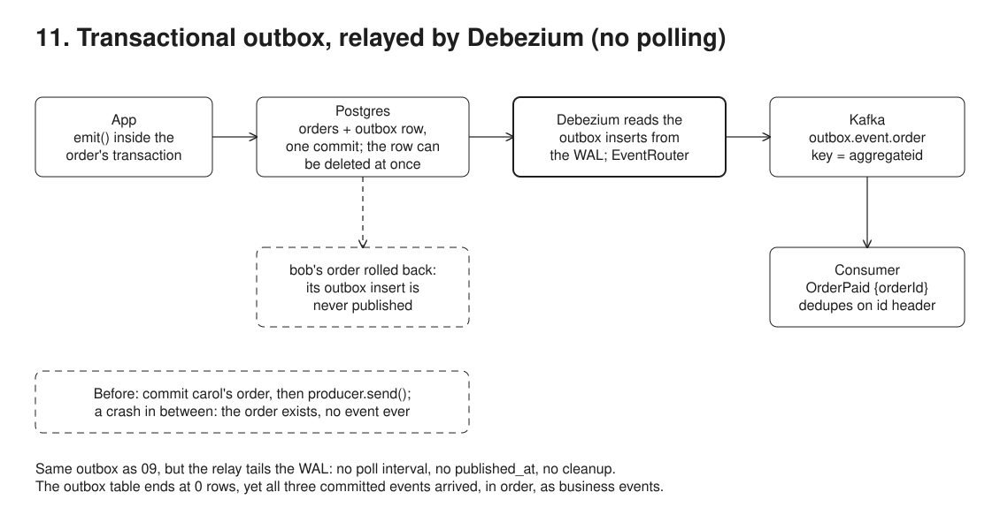

# 11. Transactional outbox, CDC relay



**Pain: polling overhead.** 09's relay adds poll latency and query load, and its outbox table keeps growing until something cleans it up.

**Reach for it when** you have 09's need and poll latency, query load or table cleanup start to hurt, or Debezium is already running for 10.

**Do not reach for it when** nobody is ready to run Kafka Connect and watch a replication slot: 09 is enough for most volumes. You would delete outbox rows at once but cannot afford to lose an event: a dropped slot then loses them for good, so keep rows until shipped and poll them, as 17 does.

Same outbox idea as 09, but the relay is Debezium reading the WAL (10) instead of a polling loop: the log-tailing version of `09-outbox-polling`. The app writes the business row and an `outbox` row in one Postgres transaction. Debezium tails the WAL, and its `EventRouter` transform turns each outbox insert into a business event on `outbox.event.<aggregatetype>`.

## Run

One shot with proof: `./run-11-outbox-debezium.sh` from the repo root (log in [`../logs/11-outbox-debezium.log`](../logs/11-outbox-debezium.log)).

By hand, from this folder (ports: Postgres 55436, Kafka 59093, Kafka Connect 58084):

```sh
docker compose up -d --wait
npm i
npm run setup     # orders + outbox tables, register connector with EventRouter
npm run consume   # terminal 1
npm run app       # terminal 2
```

## Files

- `src/app.ts` `emit()` inserts into `outbox` inside the caller's transaction.
- `src/setup.ts` connector: `table.include.list=public.outbox`, `transforms=outbox` (EventRouter), payload JSON expanded, `type` put in the `eventType` header.
- `src/consumer.ts` dedupes by the `id` header (delivery is at-least-once).

## Concepts

- **Log-tailing relay**: instead of polling `outbox`, Debezium reads outbox inserts from the WAL through a replication slot (10). No poll interval, no query load, no `published_at` column to maintain.
- **Outbox row shape** (Debezium's convention): `id` (event id, uuid), `aggregatetype` (routes to the topic), `aggregateid` (becomes the Kafka key, so all events of one order stay ordered on one partition), `type` (event name), `payload` (JSON).
- **EventRouter SMT**: a Kafka Connect transform. It unwraps Debezium's `{before, after, op}` envelope and emits just the payload to `outbox.event.<aggregatetype>`, with the event `id` and `eventType` as headers. Consumers see `OrderPaid {orderId}`, not a row diff. `setup.ts` relies on the defaults for routing, key and topic (`route.by.field=aggregatetype`, `table.field.event.key=aggregateid`, `route.topic.replacement=outbox.event.${routedByValue}`); only the payload expansion and the `eventType` header are configured.
- **Outbox vs raw CDC**: raw CDC (10) publishes table changes, so consumers couple to your schema and must guess intent. The outbox publishes explicit, versionable business events: the table is private, the event is the public contract.
- **Immediate cleanup**: the outbox row can be deleted in the same transaction it was inserted in. The insert is already in the WAL, so Debezium still publishes it, and EventRouter ignores deletes. The table never grows. Catch: this relies on the replication slot. If the connector is created after the writes, or the slot is dropped, Debezium re-snapshots the table and already-deleted events are gone for good; 09's polling table would still have them.
- **At-least-once + idempotent consumer**: same as 09. Debezium can re-send after a restart (it resumes from its last flushed offset), so consumers dedupe on the event `id` header (`seen` set in `src/consumer.ts`; no duplicate occurs in this run).
- **Trade-offs vs 09**: lower latency, no DB polling, no table cleanup, but Kafka Connect, Debezium and a replication slot to run and monitor. Both share the core limit: every write path must remember to emit.

## Proof (`logs/11-outbox-debezium.log`)

The app wrote four outbox rows. One was rolled back (bob), and in step 4 all of alice's rows were deleted: OrderShipped in the same transaction that inserted it, the two earlier ones after they had committed (their inserts are already in the WAL). The app also committed carol's order without an outbox row (the dual-write simulation).

```
   outbox <- OrderPlaced id=<alice-placed>
   outbox <- OrderPaid id=<alice-paid>
   outbox <- OrderPlaced id=<bob-placed>
   rejected: payment provider down, order 2 aborted
   outbox <- OrderShipped id=<alice-shipped>
   all outbox rows for this order deleted, OrderShipped in the transaction that inserted it (the WAL still has every insert)
   order 3 committed to Postgres
   process crashes before producer.send(OrderPlaced) -> nothing will ever publish it
```

Exactly the three committed events arrived, in order, keyed by order id, as business events:

```
consumer: outbox.event.order[0] key=1 eventType=OrderPlaced id=<alice-placed> payload={"total":"42.50","orderId":1,"customer":"alice"}
consumer: outbox.event.order[0] key=1 eventType=OrderPaid id=<alice-paid> payload={"orderId":1}
consumer: outbox.event.order[0] key=1 eventType=OrderShipped id=<alice-shipped> payload={"carrier":"UPS","orderId":1}
```

- bob's rolled-back `OrderPlaced` (`<bob-placed>`) never arrived, and bob has no order row.
- carol's order exists but has no event: that is the dual-write loss the outbox prevents.
- The `outbox` table has 0 rows, yet all three events were delivered.
- The only app topic is `outbox.event.order` (no raw `app.public.outbox`).

```
 id | customer | status  | total
  1 | alice    | shipped | 42.50
  3 | carol    | placed  |  5.00

 outbox_rows
           0
```

## Origins and further reading

- Article: "Reliable Microservices Data Exchange With the Outbox Pattern", Gunnar Morling, Debezium blog, 2019. https://debezium.io/blog/2019/02/19/reliable-microservices-data-exchange-with-the-outbox-pattern/
- Docs: "Outbox Event Router", Debezium. https://debezium.io/documentation/reference/stable/transformations/outbox-event-router.html
- Talk: "Ins and Outs of the Outbox Pattern", Gunnar Morling, 2025. https://www.youtube.com/watch?v=PkrzOR_tIQI
