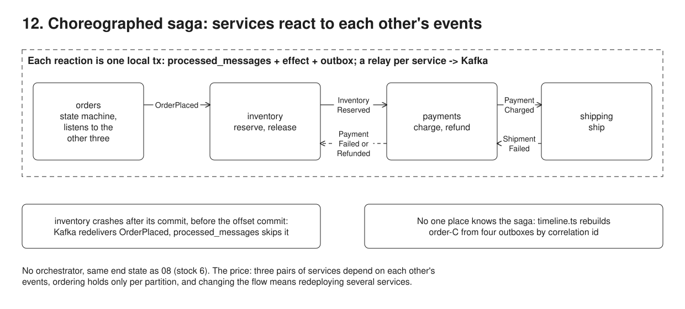

# 12. Saga, choreographed



**Pain: one coordinator owns every reaction.** 08's orchestrator calls every service's API and holds the whole flow, so anything else that should happen after a step (an email, loyalty points, an analytics feed) is a change to that one component, and the team that owns it becomes the queue. Removing it naively (services calling each other, or publishing to Kafka straight from code) brings back partial failure and dual writes.

**Reach for it when** a few services, owned by different teams, react to each other's business events in a short, stable flow (three or four steps, one or two failure paths), and the events are useful beyond this one flow.

**Do not reach for it when** the flow has many steps, branches, timers or human steps, or changes often: every change touches several services, and no one place shows the flow; use 08 or a workflow engine. You need to answer "where is order X right now?" in one query, or to reason about the failure paths in one file: choreography spreads both across services. The services form cycles (here three pairs listen to each other): an orchestrator removes them.

08's order flow (reserve stock, charge, ship; release and refund on failure), same inputs and same final stock, with no orchestrator. Four services (`orders`, `inventory`, `payments`, `shipping`), each with its own Postgres database, react to events and publish their own. Each handler inserts the incoming `event_id` into `processed_messages`, applies its effect and writes its outgoing event into its own `outbox`, in one local transaction; a relay per service (09's) sends the outbox to that service's Kafka topic, keyed by order id. The four services run in one process for the toy.

## Run

One shot with proof: `./run.sh` in this folder, or `./12-choreographed-saga/run.sh` from the repo root (log in [`../logs/12-choreographed-saga.log`](../logs/12-choreographed-saga.log)).

Each claim in the Proof section below is also a `check(label, condition)` in the code. A failed check marks the process failed, so the script exits non-zero; the log ends each process with `N checks passed` or `FAILED: ...`.

By hand, from this folder (ports: Postgres 55446, Kafka 59095):

```sh
docker compose up -d --wait
npm i
npm run setup      # 4 databases, 4 topics with 3 partitions each, stock = 10
npm run demo       # wiring, happy path, payment failure, shipping failure, then inventory crashes before its offset commit (exit 3)
npm run resume     # new process: Kafka redelivers, processed_messages makes it a no-op; then one topic lags (out-of-order events)
npm run timeline -- order-C order-D order-E   # rebuild each saga from the four outboxes
npm run verify     # check every service database once all sagas are done
```

## Files

- `src/services.ts` the four services: which events each reacts to, its effect, what it publishes, and the order state machine.
- `src/bus.ts` idempotent consumer (effect + processed event + outgoing event in one transaction), outbox relay, settle.
- `src/timeline.ts` rebuilds one order's saga by correlation id (order id) and causation id.

## Concepts

- **Choreography**: no service tells another what to do. `orders` publishes `OrderPlaced`; `inventory` reacts and publishes `InventoryReserved`; `payments` reacts and publishes `PaymentCharged` or `PaymentFailed`; `shipping` reacts and publishes `ShipmentCreated` or `ShipmentFailed`. The flow is not written down anywhere: it is the sum of the `on:` maps in `src/services.ts`. The client's only call is `POST /orders`, which returns as soon as the order is `pending`.
- **Compensation by events**: `PaymentFailed` makes `inventory` release and `orders` reject. `ShipmentFailed` makes `payments` refund, whose `PaymentRefunded` makes `inventory` release. That is the reverse order, as in 08, but each hop is a service reacting to an event, not a loop in one process.
- **Outbox per service, one transaction per reaction**: `handle()` in `src/bus.ts` opens one local transaction. It inserts the incoming `event_id` into `processed_messages`, runs the effect (reservation, charge, shipment) and inserts the outgoing event into that service's `outbox`. A relay per service (09's polling relay) sends the outbox to the service's topic. There is no dual write: effect, "I handled this" and "tell the others" commit together or not at all.
- **Offset commit vs redelivery**: Kafka learns that a consumer handled a message only when the consumer commits its offset, after the handler returns. The run kills `inventory` right after its transaction commits and before the offset commit. On restart Kafka redelivers `OrderPlaced`; its `event_id` is already in `processed_messages`, so the handler is skipped and nothing is reserved twice. The `InventoryReserved` row that the crashed transaction had committed is published by the relay, and the saga goes on. The ~5.7s gap in order-D's timeline is the restart plus the consumer group rebalance (session timeout 6s).
- **Ordering is per partition, not per saga**: events are keyed by order id, so one order's events stay in order within one topic (order-A lands on partition 2 of every topic, since all four have 3 partitions). Across topics there is no order at all. When `orders` stops reading `inventory-events` for a while (a slow partition, a lagging consumer), it sees `PaymentCharged` and `ShipmentCreated` for order-E before `InventoryReserved`.
- **The order service's own state machine**: `orders` tracks `pending -> reserved -> paid -> completed`, or `rejected`, from the events it hears. It only moves forward (a rank per status). An event that skips ahead jumps the status, and a late event that would move it back is recorded as processed and ignored. Duplicates never reach the state machine: `processed_messages` drops them first. The status is the order service's view, not the saga's state: order-C is `rejected` while the refund and the release are still in flight in two other services.
- **No single place knows the saga**: 08 answers "where is order-C?" with one row. Here the answer is spread over four outboxes and four `processed_messages` tables. Every event carries a correlation id (the order id: Kafka key and `outbox.order_id`) and a causation id (the event it reacted to). `src/timeline.ts` joins them into one timeline. In production that is distributed tracing or a consumer of every topic, and someone has to build and run it. `InventoryReleased` is processed by nobody, so no service ever learns that the compensation finished.
- **Cyclic dependencies**: the wiring printed at startup finds three pairs that listen to each other: `orders <-> inventory`, `inventory <-> payments`, `payments <-> shipping`. Each side must know the other's event names and payloads, so a schema change on one side is a coordinated change on both. Events also carry the whole order (event-carried state), so `shipping` receives the amount it never uses.
- **Changing the flow is harder**: in 08, adding a fraud check between reserve and charge is one line in `STEPS`. Here `payments` must stop reacting to `InventoryReserved` and react to `FraudCleared`; `inventory` must also release on `FraudRejected`; the `orders` state machine gains a status. That is three services redeployed in a safe order, while events published under the old flow are still in the topics.
- **When orchestration (08) is better**: long or branching flows, timers (08's durable `fraudHold` has no natural home here), human steps, flows that change often, and any need to see or query one saga's state. A common split is to orchestrate inside one team's bounded context and use events between contexts.
- **Toy services**: the four services run in one process with separate pools, relays and consumer groups. Each database is a separate Postgres database in one container. The demo waits for "settled" (outboxes drained, `processed_messages` counts stable) between scenarios so the log reads in order. Handlers are not retried on errors, and an out-of-stock path is left out.

## Proof (`logs/12-choreographed-saga.log`)

The wiring, read from the handlers. No step table, and three cycles:

```
   orders    publishes order-events (OrderPlaced), listens to inventory-events, payment-events, shipping-events
   inventory publishes inventory-events (InventoryReserved, InventoryReleased), listens to order-events, payment-events
   payments  publishes payment-events (PaymentCharged, PaymentFailed, PaymentRefunded), listens to inventory-events, shipping-events
   shipping  publishes shipping-events (ShipmentCreated, ShipmentFailed), listens to payment-events
   cycles, each side depends on the other's events: orders <-> inventory, inventory <-> payments, payments <-> shipping
```

The happy path, all by reaction. Every order-A event is on partition 2 of its topic:

```
   [orders] order-A pending, outbox <- OrderPlaced; the HTTP call returns here, the rest happens by events
   [inventory] <- OrderPlaced order-A (order-events p2 @0): reserved 2 keyboard, outbox <- InventoryReserved
   [orders] <- InventoryReserved order-A (inventory-events p2 @0): order pending -> reserved
   [payments] <- InventoryReserved order-A (inventory-events p2 @0): charged 84.00, outbox <- PaymentCharged
   [orders] <- PaymentCharged order-A (payment-events p2 @0): order reserved -> paid
   [shipping] <- PaymentCharged order-A (payment-events p2 @0): shipment to Paris, outbox <- ShipmentCreated
   [orders] <- ShipmentCreated order-A (shipping-events p2 @0): order paid -> completed
```

Shipping fails for order-C; refund, then release, each triggered by an event:

```
   [shipping] <- PaymentCharged order-C (payment-events p0 @1): address not deliverable: nowhere, outbox <- ShipmentFailed
   [orders] <- PaymentCharged order-C (payment-events p0 @1): order reserved -> paid
   [payments] <- ShipmentFailed order-C (shipping-events p0 @0): refunded 126.00, outbox <- PaymentRefunded
   [orders] <- ShipmentFailed order-C (shipping-events p0 @0): order paid -> rejected
   [inventory] <- PaymentRefunded order-C (payment-events p0 @2): released 3 keyboard, outbox <- InventoryReleased
```

`inventory` is killed after its transaction commits, before its offset commit. The reservation, the unpublished `InventoryReserved` and the processed `OrderPlaced` all exist, yet Kafka has no committed offset for that partition:

```
   [inventory] <- OrderPlaced order-D (order-events p1 @0): reserved 1 keyboard, outbox <- InventoryReserved
   [inventory] CRASH after the transaction committed, before Kafka got the offset of OrderPlaced order-D

 order-D  | keyboard |   1
 InventoryReserved | order-D  |
 OrderPlaced | order-D

TOPIC             PARTITION CURRENT-OFFSET LOG-END-OFFSET LAG
order-events      1         -              1              -
```

A new process gets `OrderPlaced` again and skips it; the saga continues from the committed outbox row:

```
   [inventory] <- OrderPlaced order-D (order-events p1 @0): DUPLICATE event_id=cd4c53ca already in processed_messages, skipped
   [orders] <- InventoryReserved order-D (inventory-events p1 @0): order pending -> reserved
   [payments] <- InventoryReserved order-D (inventory-events p1 @0): charged 42.00, outbox <- PaymentCharged
   ...
   [orders] <- ShipmentCreated order-D (shipping-events p1 @0): order paid -> completed
```

With `orders` paused on `inventory-events`, events for order-E arrive out of order; the state machine jumps forward and ignores the late one:

```
   [orders] <- PaymentCharged order-E (payment-events p0 @3): order pending -> paid (jumped: an earlier event has not arrived yet)
   [orders] <- ShipmentCreated order-E (shipping-events p0 @1): order paid -> completed
   [orders] resumed on inventory-events
   [orders] <- InventoryReserved order-E (inventory-events p0 @4): order is already completed, a late InventoryReserved cannot move it back to reserved, ignored
```

order-C's saga, rebuilt from four databases. The orders table says `rejected`, and nobody consumes the event that ends the compensation:

```
   order-C (the orders table only says: rejected)
   +    0ms orders    OrderPlaced       after the HTTP call                processed by inventory
   +  101ms inventory InventoryReserved after orders OrderPlaced           processed by orders, payments
   +  209ms payments  PaymentCharged    after inventory InventoryReserved  processed by orders, shipping
   +  395ms shipping  ShipmentFailed    after payments PaymentCharged      processed by orders, payments
   +  518ms payments  PaymentRefunded   after shipping ShipmentFailed      processed by inventory
   +  562ms inventory InventoryReleased after payments PaymentRefunded     processed by nobody
```

Same end state as 08: stock `10 - 2 (A) - 1 (D) - 1 (E) = 6`, C refunded, B never charged, only A, D and E shipped, D processed once:

```
 keyboard |         6

 order-A  |  84.00 | charged
 order-C  | 126.00 | refunded
 order-D  |  42.00 | charged
 order-E  |  42.00 | charged

 order-A  | Paris
 order-D  | Lyon
 order-E  | Lille

 OrderPlaced | order-D
(1 row)
```

The self-checks, one line per claim, then one summary per process; any failed check makes the run script exit non-zero:

```
   check ok: order-A completed: 2 reserved (stock 8), 84.00 charged, shipped
   check ok: order-B rejected; the release left stock, charges and shipments as before it
   check ok: order-C rejected; refund then release left stock and shipments as before it
   check ok: order-C's charge is kept as refunded
4 checks passed
   check ok: after the crash order-D is pending, yet inventory committed its reservation and the processed OrderPlaced
   check ok: after the restart order-D completed, reserved once (stock 10 - 2 - 1 = 7) and charged once
   check ok: order-E completed, and the late InventoryReserved did not move it back
3 checks passed
   check ok: orders: A, D, E completed; B, C rejected
   check ok: inventory: 10 - 2 (A) - 1 (D) - 1 (E) = 6 left, reservations only for A, D, E
   check ok: payments: C refunded, B never charged
   check ok: shipping: only A, D, E
   check ok: inventory processed OrderPlaced for order-D once, although Kafka delivered it twice
   check ok: every outbox is drained
6 checks passed
```

## Origins and further reading

- Article: "Pattern: Saga", Chris Richardson, microservices.io (choreography-based and orchestration-based sagas). https://microservices.io/patterns/data/saga.html
- Article: "Saga design pattern", Azure Architecture Center, Microsoft (choreography vs orchestration trade-offs, including the risk of cyclic dependencies). https://learn.microsoft.com/en-us/azure/architecture/patterns/saga
- Article: "Pattern: Idempotent Consumer", Chris Richardson, microservices.io (the processed-message table in the handler's transaction). https://microservices.io/patterns/communication-style/idempotent-consumer.html
- Article: "What do you mean by 'Event-Driven'?", Martin Fowler, 2017 (a flow over event notifications is not explicit in any program text). https://martinfowler.com/articles/201701-event-driven.html
- Talk: "Complex Event Flows in Distributed Systems", Bernd Ruecker, QCon London 2019. https://www.infoq.com/presentations/event-flow-systems/
- Article: "How to tame event-driven microservices", Bernd Ruecker, 2019 (adding a step to an event chain still means changing and redeploying other services). https://www.infoworld.com/article/2260429/how-to-tame-event-driven-microservices.html
- Article: "Choreography vs Orchestration in the land of serverless", Yan Cui, 2020 (orchestrate within a bounded context, choreograph between them). https://theburningmonk.com/2020/08/choreography-vs-orchestration-in-the-land-of-serverless/
