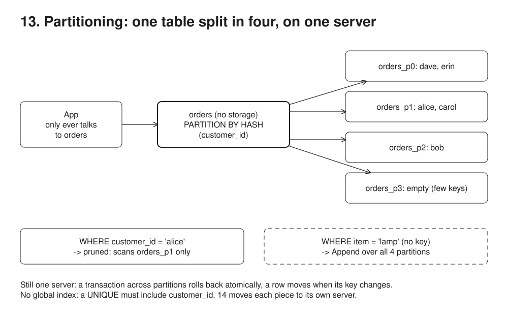

# 13. Partitioning, one server



**Pain: table too big.** One huge table means huge indexes, slow vacuum and expensive retention deletes.

**Reach for it when** one table got big enough that indexes, vacuum or retention hurt, and the hot queries filter on one key. Old data expires by time (`RANGE` by month, then `DROP` old partitions instead of a huge `DELETE`).

**Do not reach for it when** the table is small or a better index would fix the slow query: partitioning adds planning cost and rules for nothing. Most queries do not filter on the partition key, so each one scans every partition. You would cut it into thousands of small partitions: planning time and memory grow with the count. You need more CPU, RAM or write throughput: it is still one machine (14).

Splits one table into four on the same Postgres: native hash partitioning, `orders PARTITION BY HASH (customer_id)` into 4 partitions. The app only ever talks to `orders`; Postgres routes every row and prunes every query. This is the first of two steps: here the split is local; in `14-sharding-replicas` each piece moves to its own server.

## Run

One shot with proof: `./run-13-partitioning.sh` from the repo root (log in [`../logs/13-partitioning.log`](../logs/13-partitioning.log)).

Each claim in the Proof section below is also a `check(label, condition)` in the code. A failed check marks the process failed, so the script exits non-zero; the log ends each process with `N checks passed` or `FAILED: ...`.

By hand, from this folder (ports: Postgres 55440):

```sh
docker compose up -d --wait
npm i
npm run setup   # orders + orders_p0..orders_p3
npm run demo    # routing, pruning, full scan, unique limit, cross-partition tx, row move
```

## Files

- `src/setup.ts` the parent table and its 4 `FOR VALUES WITH (MODULUS 4, REMAINDER n)` partitions.
- `src/demo.ts` each scenario, with `EXPLAIN` plans.

## Concepts

- **Declarative partitioning**: `orders` is a parent with no storage of its own (`SELECT count(*) FROM ONLY orders` is 0). `PARTITION BY HASH (customer_id)` plus one `CREATE TABLE ... PARTITION OF orders FOR VALUES WITH (MODULUS 4, REMAINDER n)` per piece. The app reads and writes `orders`; Postgres picks the partition. `HASH` spreads keys evenly; `RANGE` (by month, for retention: `DETACH`/`DROP` an old month instantly instead of a huge `DELETE`) and `LIST` (by region, tenant) are the other two kinds.
- **Partition key**: the column the split is based on. Choose it from the queries: every hot query should filter on it. The same key becomes the shard key in 14.
- **Pruning**: `WHERE customer_id = 'alice'` plans a scan of one partition. A query without the key (`WHERE item = 'lamp'`) becomes an `Append` over all partitions. In 14 the same query would have to go to every shard.
- **Uniqueness includes the key**: each partition has its own indexes, so there is no global index. A primary key or unique constraint must contain the partition key, which is why the key is `(customer_id, id)`; `UNIQUE (id)` is rejected.
- **Still one server**: one transaction can touch several partitions and rolls back atomically, and changing the key moves the row between partitions in one statement. Both stop being free once the pieces live on different servers (14).
- **What it does not buy**: CPU, RAM, disk and write throughput are those of one machine. Partitioning makes big tables manageable (smaller indexes, vacuum per partition, cheap retention); it does not scale out.
- **Uneven with few keys**: 5 customers over 4 partitions left `orders_p3` empty. Hash evens out with many keys, not few, and one very large customer stays one hot partition.

## Proof (`logs/13-partitioning.log`)

The app inserts into `orders`, Postgres routes; the key lookup is pruned to one partition, the non-key one scans all four:

```
   alice keyboard -> orders_p1 (id 1)
   bob   screen   -> orders_p2 (id 3)
   dave  chair    -> orders_p0 (id 5)

     Bitmap Heap Scan on orders_p1 orders
       Recheck Cond: (customer_id = 'alice'::text)

     Append
       ->  Seq Scan on orders_p0 orders_1
       ->  Seq Scan on orders_p1 orders_2
       ->  Seq Scan on orders_p2 orders_3
       ->  Seq Scan on orders_p3 orders_4
```

No global uniqueness, but atomic transactions across partitions (alice's insert in `orders_p1` rolls back with bob's failed one in `orders_p2`):

```
   rejected: unique constraint on partitioned table must include all partitioning columns

   rejected: null value in column "item" of relation "orders_p2" violates not-null constraint
   alice's cable rows after rollback: 0
```

The self-checks, one line per claim, then one summary per process; any failed check makes the run script exit non-zero:

```
   check ok: the parent table owns no rows; one customer's rows always land in the same partition
   check ok: a lookup by the partition key touches one partition, alice's (orders_p1)
   check ok: a lookup without the key scans all 4 partitions
   check ok: UNIQUE (id) without the partition key is refused
   check ok: alice's insert in orders_p1 rolled back with bob's failed one in orders_p2
   check ok: the row moved from orders_p0 to orders_p2, and exists once
6 checks passed
```

## Origins and further reading

- Docs: "Table Partitioning", PostgreSQL documentation. https://www.postgresql.org/docs/current/ddl-partitioning.html
- Talk: "PostgreSQL Partitioning: Slicing and Dicing for Performance and Easier Maintenance", Ryan Booz, POSETTE 2024. https://www.youtube.com/watch?v=dKJyMj_P-XA
- Slides: "Declarative Partitioning Has Arrived!", Amit Langote and Ashutosh Bapat, PGConf.ASIA 2017 (Langote led the Postgres 10 work). https://www.pgconf.asia/JA/2017/wp-content/uploads/sites/2/2017/12/D2-A4-2.pdf
- Article: "Partitioning with Native Postgres and pg_partman", Crunchy Data. https://www.crunchydata.com/blog/native-partitioning-with-postgres
