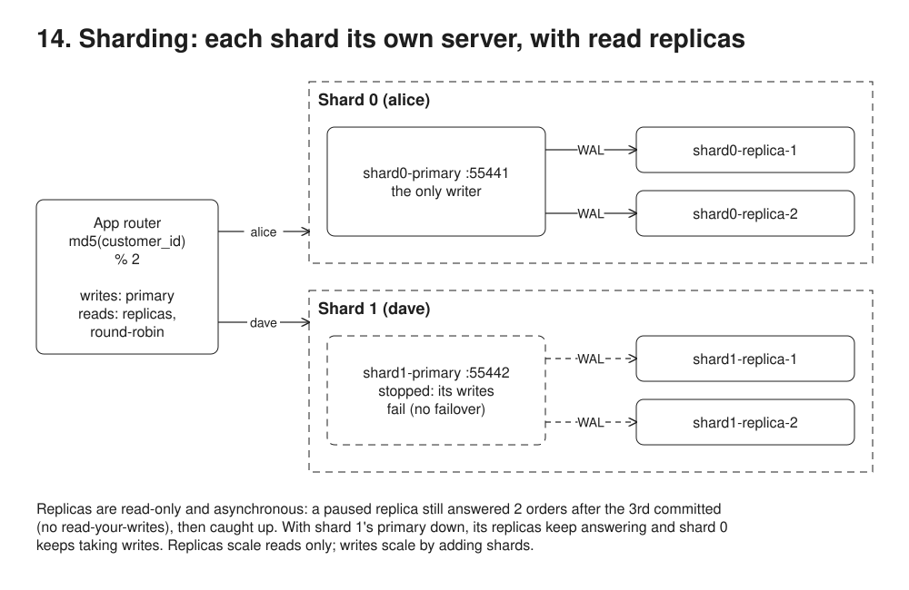

# 14. Sharding with read replicas



**Pain: one-machine ceiling.** Writes, storage and reads eventually exceed one Postgres server, and partitioning (13) does not help because it stays on that server.

**Reach for it when** one server can no longer hold the data or absorb the writes, after a bigger machine, partitioning (13) and replicas, and almost every query stays within one key (tenant, customer).

**Do not reach for it when** a bigger machine, partitioning (13) or read replicas would do: sharding is the most expensive step to undo. Transactions or joins routinely span shard keys: pick another key, and send cross-shard reports to a warehouse. The key is skewed, so one tenant or one hot value outgrows its shard (move that tenant to its own database instead, 15). Every read must see the latest write: serve it from the primary, not a replica.

The four partitions of `13-partitioning`, reduced to two, each moved onto its own server (a shard), and each shard given read replicas fed by built-in streaming replication. Everything is vanilla Postgres plus a small router in the app: it hashes `customer_id` to a shard, sends writes to that shard's primary and spreads reads over its replicas. No Citus, no proxy, no failover. Scope: no query or transaction spans shards; cross-shard reads would need fan-out and merge in the router, cross-shard writes a saga (08).

## Run

One shot with proof: `./run.sh` in this folder, or `./14-sharding-replicas/run.sh` from the repo root (log in [`../logs/14-sharding-replicas.log`](../logs/14-sharding-replicas.log)).

Each claim in the Proof section below is also a `check(label, condition)` in the code. A failed check marks the process failed, so the script exits non-zero; the log ends each process with `N checks passed` or `FAILED: ...`.

By hand, from this folder (ports: Postgres 55441 shard 0 primary, 55442 shard 1 primary, replicas on random ports):

```sh
docker compose up -d --wait                                                  # 2 primaries, 2 replicas each
npm i
npm run setup                                                                # orders on each primary, wait for replicas
npm run demo                                                                 # routing, read-only replicas, round-robin, stale read, catch-up
docker compose up -d --wait --no-recreate --scale shard0-replica=4 --scale shard1-replica=3
npm run scaled                                                               # router discovers the new replicas
docker compose stop shard1-primary
npm run outage                                                               # shard 1 writes fail, its reads still work
docker compose start shard1-primary
npm run verify                                                               # each shard holds only its customers, replicas caught up
```

## Files

- `docker-compose.yml` the primary settings (`wal_keep_size`, `max_wal_senders`, `hba_file`; `wal_level=replica` is the default, set for visibility) and the replica service (`deploy.replicas: 2`, random host port so it can scale).
- `scripts/primary-init.sql` the `replicator` role; `scripts/pg_hba.conf` lets it connect for replication.
- `scripts/replica.sh` on first start, `pg_basebackup -R` clones the primary and writes `standby.signal` + `primary_conninfo`; then it starts Postgres as a hot standby.
- `src/topology.ts` primaries on fixed ports, replicas discovered from `docker compose ps`.
- `src/router.ts` `shardFor`, `write` (primary only), `read` (replicas, round-robin, skip a dead one).

## Concepts

- **Shard = partition on its own server**: same `orders` table, same key, but now two independent Postgres primaries (ports 55441, 55442) that know nothing about each other. Postgres no longer routes: the app does (`src/router.ts`, `md5(customer_id) % 2`). Nothing stops a buggy caller from writing bob into the wrong shard; the router is the only guard.
- **What is config and what is code**: replication is config. What it actually needs: a `REPLICATION` role, a `pg_hba` line for it (`all` does not match replication connections) and `pg_basebackup -R` on the replica (writes `standby.signal` + `primary_conninfo`). `wal_level=replica` and `hot_standby=on` are Postgres 16 defaults, set explicitly in `docker-compose.yml` for visibility. Sharding is code: shard choice, write/read routing, replica discovery. Postgres has no built-in multi-server sharding. Its closest built-in piece is `postgres_fdw` foreign tables as partitions, which gets routing and pruning but no cross-shard atomicity; Citus is the extension that does the full job.
- **Streaming replication**: each replica connects to its primary and replays its WAL (10) byte for byte, so it is an exact, read-only copy of that shard (`cannot execute INSERT in a read-only transaction`). It is asynchronous by default: the primary commits without waiting for replicas.
- **One writer per shard (CP writes)**: every write for a key goes to one primary, so writes to a shard are serialized in one place and never conflict. When that primary is unreachable, writes to that shard fail instead of going somewhere else: consistency over availability. The other shard keeps accepting writes, so an outage costs a fraction of the keys, not all of them.
- **Replicas answer anyway (AP reads)**: a lagging or cut-off replica still answers, with the data it has replayed so far. Reads stay available and are eventually consistent. What that costs: no read-your-writes (step 5: alice's write committed, the next read said 2 orders, not 3) and two reads can go backwards in time if they hit different replicas. Where a read must be fresh, send it to the primary, or wait until the replica's `pg_last_wal_replay_lsn()` passes the write's LSN (what `waitForReplay` does).
- **CAP shorthand**: "CP writes / AP reads" is per operation (PACELC-style), not a CAP class of the whole system. Strictly, clients reading async replicas never get linearizability even without a partition, and "CP" here means single leader: unavailable when the leader is lost, whether by crash or partition.
- **Lag**: `pg_last_wal_receive_lsn()` vs `pg_last_wal_replay_lsn()` on the replica, `replay_lsn` in `pg_stat_replication` on the primary. Step 5 pauses replay to make lag deterministic: the WAL has arrived, it is just not applied yet.
- **Retained WAL**: without a replication slot, the primary keeps only `wal_keep_size` (128MB here) of old WAL. A replica down longer than that can never catch up and must be re-cloned, and nothing here notices (it stays healthy and serves ever older data). A slot per replica retains WAL until it is consumed, at the cost of filling the primary's disk if a replica never comes back (cap with `max_slot_wal_keep_size`).
- **Scaling reads**: a new replica is `pg_basebackup` + start, with no change on the primary. Each streaming replica holds one WAL sender and a running `pg_basebackup -X stream` two, so `max_wal_senders=10` (the default) caps a shard at about 8 replicas. Raising it on the primary means raising it on every replica too: a hot standby refuses to start with a lower value than its primary. Here `docker compose --scale` starts it and the router discovers it from `docker compose ps` (in production: DNS, a service registry or a proxy such as pgcat or HAProxy). Replicas scale reads only. Writes scale only by adding shards.
- **No failover, on purpose**: promoting a replica (`pg_promote()`, or Patroni/repmgr automatically) would bring writes back, but with async replication any commits the replica had not received are lost, and a primary that was only partitioned away (not dead) could keep taking writes: split brain. Failover needs fencing and a consensus store (etcd for Patroni). Here the shard just waits for its primary; after `docker compose start` the replicas reconnect by themselves.
- **Replica names**: `pg_stat_replication.application_name` is the container id (`$HOSTNAME`), because scaled containers share one config; the router names them from compose's container number instead.
- **Per-shard ids**: each primary has its own `BIGSERIAL`, so `id 1` exists on both shards. That is why the key stays `(customer_id, id)`; globally unique ids need UUIDs or a shard prefix.
- **Deliberately missing**: queries across shards (fan-out and merge in the router), transactions across shards (sagas, 08, or two-phase commit) and resharding. With `% N`, going from 2 to 3 shards moves about two thirds of the keys. Real systems hash into many fixed buckets and map buckets to shards, so resharding moves whole buckets.

## Proof (`logs/14-sharding-replicas.log`)

Writes land on the key's primary; replicas reject writes and share the reads:

```
   alice keyboard -> shard0-primary (id 1)
   dave  chair    -> shard1-primary (id 1)

   shard0-replica-1 rejected: cannot execute INSERT in a read-only transaction

   read alice -> shard0-replica-1: 2 orders
   read alice -> shard0-replica-2: 2 orders
```

With replay paused on one replica, the committed write is visible on the primary and the other replica only. The router still serves the stale one, and after resume it converges:

```
   shard0-primary     3 orders (source of truth)
   shard0-replica-1   2 orders
   shard0-replica-2   3 orders
   read alice -> shard0-replica-1: 2 orders
   read alice -> shard0-replica-2: 3 orders

   shard0-replica-1   3 orders
```

After `--scale shard0-replica=4 --scale shard1-replica=3`, reads spread over the new replicas:

```
   shard 0 (4 replicas), 8 reads of alice: shard0-replica-1=2, shard0-replica-2=2, shard0-replica-3=2, shard0-replica-4=2
   shard 1 (3 replicas), 6 reads of dave: shard1-replica-1=2, shard1-replica-2=2, shard1-replica-3=2
```

With `shard1-primary` stopped, its writes fail, shard 0 is unaffected, and shard 1's replicas keep answering without being promoted:

```
   write dave -> shard1-primary rejected: connect ECONNREFUSED 127.0.0.1:55442
   write alice -> shard0-primary ok (id 6): the other shard is unaffected

   read dave -> shard1-replica-1: 1 orders (in recovery: true)
```

The self-checks, one line per claim, then one summary per process; any failed check makes the run script exit non-zero:

```
   check ok: every write went to the primary of the customer's shard, and both shards got writes
   check ok: a replica refuses writes
   check ok: reads alternate over the shard's replicas, never the primary
   check ok: the paused replica still answers, with old data (2 orders); the others have all 3
   check ok: after resume every replica converges on the primary
5 checks passed
   check ok: shard 0: the router found all 4 replicas and spread the reads evenly
   check ok: shard 1: the router found all 3 replicas and spread the reads evenly
   check ok: the scaled cluster has 4 replicas on shard 0 and 3 on shard 1
3 checks passed
   check ok: a write for dave is refused while shard 1's primary is down (no replica takes over)
   check ok: a write for alice on shard 0 still succeeds
   check ok: every shard 1 replica still answers reads of dave (1 order), and stays a replica
3 checks passed
   check ok: shard 0 holds only its own customers (alice, bob, carol)
   check ok: shard 0: all 4 replicas are read-only copies with the primary's 6 orders
   check ok: shard 1 holds only its own customers (dave, erin)
   check ok: shard 1: all 3 replicas are read-only copies with the primary's 2 orders
4 checks passed
```

## Origins and further reading

- Book: *Designing Data-Intensive Applications*, Martin Kleppmann, 2017 (chapter 5 replication, chapter 6 partitioning, in the first edition; a second edition with Chris Riccomini came out in 2026). https://dataintensive.net/
- Article: "Herding elephants: lessons learned from sharding Postgres at Notion", Notion, 2021. https://www.notion.com/blog/sharding-postgres-at-notion
- Article: "How Figma's databases team lived to tell the scale", Figma, 2024 (vertical split first, horizontal sharding later). https://www.figma.com/blog/how-figmas-databases-team-lived-to-tell-the-scale/
- Talk: "Scaling Instagram Infrastructure", Lisa Guo, QCon 2016/2017. https://www.youtube.com/watch?v=hnpzNAPiC0E
