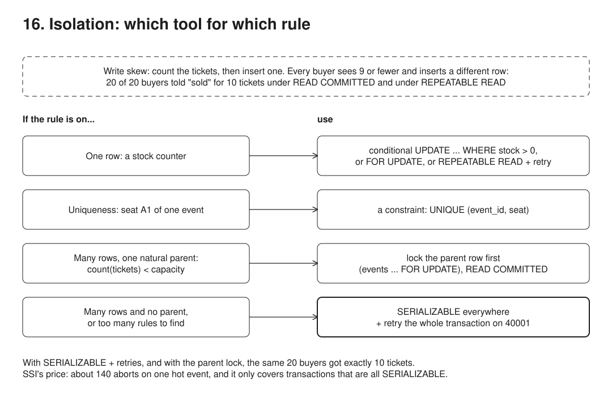

# 16. SERIALIZABLE: when it is a must



**Pain: write skew.** Concurrent transactions each check a rule over several rows ("fewer than 10 tickets sold?", "someone else still on call?"), each write a different row, and all commit, so the rule breaks. Postgres's default READ COMMITTED, and even REPEATABLE READ, let it through.

**Reach for it when** an invariant spans several rows or depends on rows that do not exist yet (capacity, overbooking, on-call rules) and cannot be a constraint or a lock on one parent row, or when there are too many such rules to find and guard each one by hand.

**Do not reach for it when** the rule is about one row, or is uniqueness or no overlap: a conditional `UPDATE`, `FOR UPDATE` or a constraint (`UNIQUE`, `EXCLUDE`) is enough. The app cannot retry the whole transaction on `40001`: SERIALIZABLE then turns races into errors users see. Many writers hit the same hot spot: aborts and retries pile up, so lock the parent row instead (scenario 8). Some writers of those tables would stay at READ COMMITTED: SSI only protects transactions that all run SERIALIZABLE.

When SERIALIZABLE is a must and when it is not, on the "never sell more than we have" rule: 10 keyboards or 10 concert tickets, 20 concurrent buyers, 8 scenarios. Each one reports what the buyers were told and what the database recorded, and exits 1 if a scenario does not end as expected. Back to one server: isolation levels are a guarantee of one Postgres, so under sharding (14) the rule must live inside one shard (here, `event_id` as the shard key).

## Run

One shot with proof: `./run-16-serializable.sh` from the repo root (log in [`../logs/16-serializable.log`](../logs/16-serializable.log)).

By hand, from this folder (ports: Postgres 55443):

```sh
docker compose up -d --wait
npm i
npm run setup   # products (stock counter), events (capacity), tickets (UNIQUE (event_id, seat))
npm run demo    # lost update, 3 cheaper fixes, write skew under RC and RR, SERIALIZABLE + retry, parent row lock
```

## Files

- `src/db.ts` `tx()` with an explicit isolation level, `withRetry()` on SQLSTATE 40001/40P01, `race()` (N pre-connected clients started together).
- `src/demo.ts` each scenario. A `pg_sleep(0.1)` between the check and the write widens the race window so every run shows the same outcome.

## Concepts

- **Postgres's three levels** (READ UNCOMMITTED behaves as READ COMMITTED; no level shows dirty reads):
  - `READ COMMITTED` (default): each statement sees what was committed when it started.
  - `REPEATABLE READ`: snapshot isolation. One snapshot for the whole transaction, so it also hides other transactions' new rows (stronger than the SQL standard, which allows phantoms here). First updater wins: a transaction that updates, deletes or locks (`FOR UPDATE`) a row another transaction is changing waits for it; if that one commits, the waiter gets `40001`, if it rolls back, the waiter goes ahead.
  - `SERIALIZABLE` (SSI, Serializable Snapshot Isolation): REPEATABLE READ plus tracking of read/write dependencies between concurrent transactions. It aborts one transaction at least whenever the result could differ from running them one at a time (sometimes more often, see false positives).
- **Lost update** (1): read a value, compute in the app, write it back. Two buyers both read 10 and both write 9. Under READ COMMITTED 20 buyers were told "sold" and the stock only dropped by 1. The conflict is on **one row**.
- **One-row rules do not need SERIALIZABLE**:
  - `REPEATABLE READ` + retry (2): the second writer of the row is aborted, retries and reads the new stock.
  - One conditional statement (3): `UPDATE ... SET stock = stock - 1 WHERE stock > 0`. The row lock makes concurrent updates wait, and READ COMMITTED re-checks the `WHERE` against the committed row before writing. No retry at all.
  - `SELECT ... FOR UPDATE` then update: same idea, in two statements.
- **Uniqueness does not need it either** (4): for one specific seat the app's "is A1 free?" check is still racy, but `UNIQUE (event_id, seat)` rejects every second insert at any isolation level (under SERIALIZABLE the loser may get `40001` instead of the unique violation `23505`, so handle both). Prefer a constraint whenever the rule can be expressed as one (`UNIQUE`, `CHECK`, `EXCLUDE USING gist` for "no overlapping bookings").
- **Write skew** (5, 6): the rule spans many rows or depends on rows that do not exist yet. "Count tickets, if fewer than capacity, insert one." Every buyer reads 9 or fewer, every buyer inserts a different new row, and no two transactions write the same row. Nothing conflicts, so READ COMMITTED oversells, and so does REPEATABLE READ: its snapshot keeps reads stable but still does not show the others' inserts. Locking the counted ticket rows cannot help: the rows that would conflict do not exist yet (and `SELECT count(*) ... FOR UPDATE` is rejected: `FOR UPDATE is not allowed with aggregate functions`). Lock a parent row instead (8). Classic cases: capacity and overbooking, "at least one doctor on call", "balance across accounts stays positive", "username not taken" without a unique index.
- **SERIALIZABLE fixes write skew** (7): SSI takes SIREAD locks on what each transaction scanned (here index and heap pages, not an exact range) and records a read/write dependency when a concurrent transaction writes into them without the reader having seen it. When one transaction has such a dependency both in and out (a "dangerous structure"), one side is aborted with `could not serialize access due to read/write dependencies among transactions` (`40001`). The rule holds with no extra lock in the code. The cost:
  - **Retries are mandatory**: any statement, `COMMIT` included, can raise `40001`. The app must retry the whole transaction, not the failing statement (`withRetry` in `src/db.ts`).
  - **Wasted work under contention**: 20 buyers on one event caused about 140 aborts in this run (the exact number varies). SSI is cheap when conflicts are rare, not on a hot spot.
  - **Everyone must opt in**: the check only covers transactions that are themselves SERIALIZABLE. One READ COMMITTED writer on the same tables slips past it.
  - **False positives**: SIREAD locks cover whole pages for index and bitmap scans, and are promoted to coarser locks past `max_pred_locks_per_transaction`, so buyers of two different events sharing a page can abort each other. And a dangerous structure triggers an abort before a real cycle is proven.
  - **Act only after `COMMIT`**: a SERIALIZABLE transaction's reads are only guaranteed consistent once it commits. `buyByCount` tells the buyer "sold out" from an uncommitted read, which is safe here only because the ticket count never goes down.
  - **Not on replicas**: a hot standby (14) refuses SERIALIZABLE, so reads served by replicas are outside SSI. `SERIALIZABLE READ ONLY DEFERRABLE` on the primary gives long reports a snapshot that can never abort.
- **Materializing the conflict** (8): turn the many-row rule into a one-row lock. `SELECT ... FROM events WHERE id = 'concert' FOR UPDATE` first, then count and insert, all under READ COMMITTED. Buyers queue on the event row: no aborts, no retries, but no parallelism per event. A `sold` counter column (`UPDATE events SET sold = sold + 1 WHERE id = $1 AND sold < capacity`, in the same transaction as the insert) is the same idea: buyers still queue on the row, but hold the lock for less time since there is no `count(*)`. Every writer must go through it, and refunds must decrement it.
- **Choosing**: the rule is on one row → conditional `UPDATE` or `FOR UPDATE`. The rule is uniqueness or no overlap → a constraint. The rule spans rows and has one natural parent → lock the parent. The rule spans rows with no single parent, or there are many such rules and you do not want to find every one → `SERIALIZABLE` everywhere, plus a retry loop.

## Proof (`logs/16-serializable.log`)

The lost update oversells under READ COMMITTED; write skew oversells under both READ COMMITTED and REPEATABLE READ:

```
## 1. Lost update (READ COMMITTED)
   20 buyers: 20 told "sold", 0 told "sold out"
   database: 1 recorded as sold for 10 available -> OVERSOLD
   stock left: 9 (every buyer read 10 and wrote 9)

## 5. Write skew (READ COMMITTED)
   database: 20 recorded as sold for 10 available -> OVERSOLD

## 6. Write skew (REPEATABLE READ)
   database: 20 recorded as sold for 10 available -> OVERSOLD
```

The same count-then-insert code is correct once it runs SERIALIZABLE with retries, and so is the parent-row lock under READ COMMITTED:

```
## 7. Needed: SERIALIZABLE, with retries
   20 buyers: 10 told "sold", 10 told "sold out"
   database: 10 recorded as sold for 10 available -> correct

## 8. Alternative: lock the parent row
   20 buyers: 10 told "sold", 10 told "sold out"
   database: 10 recorded as sold for 10 available -> correct
```

Each level raises its own `40001`: REPEATABLE READ for two writers of one row, SERIALIZABLE for a read/write dependency:

```
   aborted with: could not serialize access due to concurrent update
   aborted with: could not serialize access due to read/write dependencies among transactions
```

## Origins and further reading

- Paper: "Serializable Isolation for Snapshot Databases", Michael J. Cahill, Uwe Röhm, Alan Fekete, SIGMOD 2008. https://dl.acm.org/doi/10.1145/1376616.1376690
- Paper: "Serializable Snapshot Isolation in PostgreSQL", Dan R. K. Ports and Kevin Grittner, VLDB 2012. https://arxiv.org/abs/1208.4179
- Talk: "Transactions: myths, surprises and opportunities", Martin Kleppmann, Strange Loop 2015. https://www.youtube.com/watch?v=5ZjhNTM8XU8
- Article and repo: "Hermitage: Testing the 'I' in ACID", Martin Kleppmann, 2014. https://martin.kleppmann.com/2014/11/25/hermitage-testing-the-i-in-acid.html
