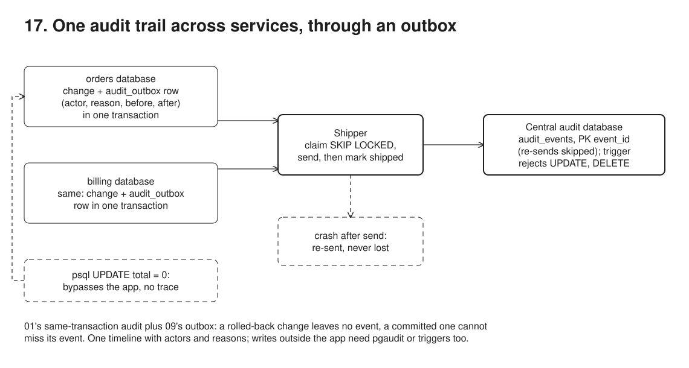

# 17. Audit trail through the outbox



**Pain: scattered audit logs.** Each service can audit itself in the same transaction (01), but compliance and support need one trail across services, with the actor, that cannot miss a change made through the app or be edited afterwards. Sending it to a central store straight from app code is a dual write that loses events (09).

**Reach for it when** the audit trail of record spans several services and needs the actor and the reason from the app, a guarantee that no change made through the app exists without its audit event, and one central, append-only store.

**Do not reach for it when** there is one service and one database: 01's audit table is enough, with no shipper to run. You need to catch writes that bypass the app (psql, scripts, migrations): run `pgaudit` or triggers alongside this. The central trail must show a change the instant it commits, or in one exact order across services: shipping adds lag, and cross-service order is only as good as the clocks.

01's audit table combined with 09's outbox. Two services (`orders`, `billing`), each with its own Postgres database, write an audit event (actor, reason, before, after) into their own `audit_outbox` in the same transaction as the change. `src/shipper.ts` copies the events into a central `audit` database, where `audit_events` dedupes by `event_id` and a trigger rejects any update or delete.

## Run

One shot with proof: `./run-17-audit-outbox.sh` from the repo root (log in [`../logs/17-audit-outbox.log`](../logs/17-audit-outbox.log)).

Each claim in the Proof section below is also a `check(label, condition)` in the code. A failed check marks the process failed, so the script exits non-zero; the log ends each process with `N checks passed` or `FAILED: ...`.

By hand, from this folder (ports: Postgres 55444):

```sh
docker compose up -d --wait
npm i
npm run setup    # databases orders, billing, audit
npm run demo     # app writes with actors, plus a rolled-back change
npm run ship     # copy outbox rows to the central store (add -- --crash-after-send to simulate a crash, exit 3)
npm run verify -- final   # central log, append-only, the psql gap, drained outboxes (crashed: after a crashed pass)
```

## Files

- `src/services.ts` business writes and their audit events, one transaction each.
- `src/shipper.ts` send first, mark shipped second: duplicates possible, loss not.
- Writes that bypass the app (psql, scripts) are not captured; the run shows the gap.

## Concepts

- **Audit event in the same transaction**: `audit()` in `src/services.ts` inserts into the service's `audit_outbox` using the business transaction's client. The app supplies what the database cannot know: the actor (`bob (support)`, `system:billing`), the reason (`goodwill discount after late delivery`) and the before/after snapshots. A rolled-back change (mallory's) leaves no audit event, and a committed app change cannot be missing its event.
- **The outbox is a temporary local copy**: rows wait with `shipped_at IS NULL` (partial index, as in 09). Once shipped they can be deleted on a retention schedule. The central store is the permanent record, so personal data in its before/after snapshots can only be erased by crypto-shredding (18).
- **Shipper**: `src/shipper.ts` loops per service: claim up to 100 unshipped rows (`FOR UPDATE SKIP LOCKED`), insert them into `audit_events`, mark them shipped, commit, until a claim comes back empty. Send first, mark second: a crash in between means a re-send, never a loss. In production a broker (Kafka) usually sits between the shippers and the store; the guarantees are the same.
- **Dedupe by `event_id`**: `event_id` is the central table's primary key and the insert is `ON CONFLICT (event_id) DO NOTHING`. The re-sent events after the crash are skipped, so the trail has exactly one row per event.
- **Append-only, enforced**: a trigger rejects `UPDATE`, `DELETE` and `TRUNCATE` on `audit_events`. The table owner or a superuser can still disable or bypass it (`ALTER TABLE ... DISABLE TRIGGER`, `session_replication_role = replica`, `DROP TABLE`), so in production the shipper connects with a non-owner role granted `INSERT` only, and the store has its own credentials that no service holds. Hash-chaining rows makes tampering detectable too.
- **The bypass gap**: the trail only contains what app code emits. The run's manual `psql` UPDATE sets the order total to 0 and leaves no trace: the audit trail's last word stays 38.25. Database-level auditing (`pgaudit`, or triggers) catches such writes, with the database role instead of the user; run it alongside, not instead.
- **Order is per entity, not global**: the central row keeps `source_id` (the outbox `id`). For one entity the row lock (`FOR UPDATE` in `changeTotal`) serializes writers, so `source_id` gives that entity's exact order. Across entities it does not: a `BIGSERIAL` is assigned at insert, not at commit. Across services, `occurred_at` (`clock_timestamp()` on each service's clock) is only as good as clock sync. A global timeline is approximate.

## Proof (`logs/17-audit-outbox.log`)

The shipper crashes after storing the orders events and before marking them. Locally they are still unshipped, centrally they are already stored; the next pass re-sends them and the store skips them (abridged):

```
shipper: orders #2 order 1 update by bob (support) -> stored
shipper: CRASH after sending the orders events, before marking them shipped
  1 |
  2 |
 stored_centrally
                2
shipper: orders #1 order 1 create by alice -> DUPLICATE, already in the central log, skipped
shipper: orders #2 order 1 update by bob (support) -> DUPLICATE, already in the central log, skipped
shipper: orders marked 2 shipped
shipper: billing #1 invoice 1 create by system:billing -> stored
```

One timeline across both services, with actors and reasons. There is no row for mallory's rolled-back change (before/after columns cut):

```
 service | source_id | entity  | entity_id | action |     actor      |                reason
 orders  |         1 | order   | 1         | create | alice          | checkout
 orders  |         2 | order   | 1         | update | bob (support)  | goodwill discount after late delivery
 billing |         1 | invoice | 1         | create | system:billing | order total confirmed
```

The store refuses edits, and the psql UPDATE is the gap:

```
ERROR:  audit_events is append-only: UPDATE rejected
ERROR:  audit_events is append-only: DELETE rejected
ERROR:  audit_events is append-only: TRUNCATE rejected

 id | customer | total
  1 | alice    |  0.00

 last_audited_total
 38.25
```

The self-checks, one line per claim, then one summary per process; any failed check makes the run script exit non-zero:

```
   check ok: orders' outbox holds one audit event per committed change, with the actor
   check ok: billing's outbox holds its own event
   check ok: mallory's change rolled back together with its audit event: total still 38.25, no event
3 checks passed
   check ok: after the crash orders' 2 events are still unshipped locally, yet already stored centrally
1 check passed
   check ok: the central log has one row per event (3) despite the re-send
   check ok: the timeline spans both services, with no event from mallory's rolled-back change
   check ok: the central log is append-only: UPDATE, DELETE and TRUNCATE are all rejected
   check ok: the gap: the psql UPDATE set the total to 0 and left no audit trace (last audited total 38.25)
   check ok: both local outboxes are drained
5 checks passed
```

## Origins and further reading

- Article: "Pattern: Audit logging", Chris Richardson, microservices.io. https://microservices.io/patterns/observability/audit-logging.html
- Article: "Pattern: Transactional outbox", Chris Richardson, microservices.io (the transport half; this sample composes the two, it is not a separately named pattern). https://microservices.io/patterns/data/transactional-outbox.html
- Article: "Building Audit Logs with Change Data Capture and Stream Processing", Gunnar Morling, Debezium blog, 2019 (the CDC route, with the actor added through a transaction metadata table). https://debezium.io/blog/2019/10/01/audit-logs-with-change-data-capture-and-stream-processing/
- Tool: pgAudit (statement and session logging to the Postgres log, not before/after rows). https://github.com/pgaudit/pgaudit
