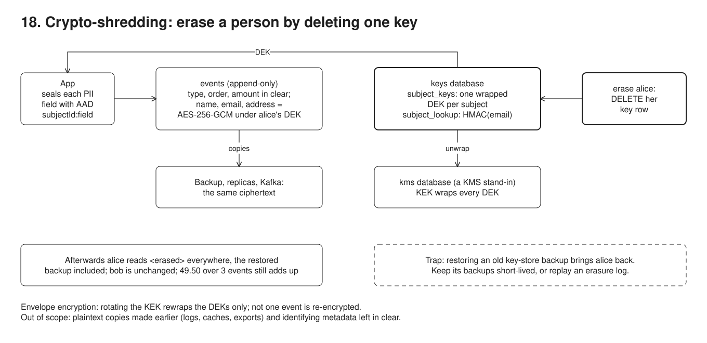

# 18. Crypto-shredding



**Pain: erasure versus immutable data.** GDPR's right to erasure says a customer's personal data must go, but it sits in places you must not or cannot rewrite: an append-only event log (03), an append-only audit store (17), Kafka topics, and every backup taken since.

**Reach for it when** personal data lands in stores that are append-only, replicated or backed up for years, and erasing a person must reach every copy without rewriting any of them.

**Do not reach for it when** the data lives in one mutable table you can `DELETE` from and your backups expire within the erasure deadline: a plain delete is simpler. You need to search, sort or aggregate on the personal fields in the database: ciphertext supports none of that beyond exact-match blind indexes. The identifying part is the metadata (amounts, timestamps, locations): encryption of the named fields does not make the rest anonymous. Your counsel does not accept key deletion as erasure (EU guidance treats encrypted personal data as still personal data): keep the PII in a deletable side store the events point to (forgettable payloads) instead.

Each customer (data subject) gets a random data key (DEK). Personal fields in the append-only `events` table are AES-256-GCM ciphertext under that DEK; event type, order and amount stay in clear. DEKs live in a separate `keys` database, wrapped by a key-encryption key (KEK) from a `kms` database standing in for a KMS (envelope encryption). Erasing alice deletes one key row, and every copy of her events, including an old backup, becomes unreadable.

## Run

One shot with proof: `./run-18-crypto-shredding.sh` from the repo root (log in [`../logs/18-crypto-shredding.log`](../logs/18-crypto-shredding.log)).

By hand, from this folder (ports: Postgres 55448):

```sh
docker compose up -d --wait
npm i
npm run setup                        # databases events, keys, kms
npm run demo                         # two customers, encrypted events, blind index, IV and AAD checks
npm run rotate                       # new KEK, DEKs rewrapped, events untouched
npm run erase -- alice@example.com   # delete alice's DEK
npm run read -- --email alice@example.com   # read everything back (add --events / --keys to read restored copies)
```

## Files

- `src/crypto.ts` AES-256-GCM `seal`/`open` (random 12-byte IV, AAD) and HMAC.
- `src/keys.ts` the key store: per-subject DEKs wrapped by the current KEK, the email blind index, erase, KEK rotation.
- `src/events.ts` append with PII sealed per field under `subjectId:field`; read decrypts or shows `<erased>`.
- The key store's backups undo the erasure; the run restores one to show it.

## Concepts

- **Envelope encryption**: data is encrypted with a DEK, and the DEK is stored only encrypted ("wrapped") by a KEK. In production the KEK stays inside a KMS or HSM and you call it to wrap and unwrap; here `kms_keys` hands the KEK to the process, which a real KMS never does. The key store (`subject_keys`) holds `wrapped_dek` and `kek_id`, never a plaintext key.
- **One DEK per subject**: this is what makes erasure selective. Deleting alice's row in `subject_keys` makes her ciphertext undecryptable everywhere: the live table, replicas, Kafka topics, the backup restored into `events_restored`. Bob's key is untouched, so his reads are unchanged. Her rows stay, so history, counts and amounts (49.50 over 3 events) still add up.
- **Why not just delete the rows**: the events table is append-only, enforced by a trigger as in 17, and backups cannot be edited anyway. The run's `DELETE` is rejected.
- **AES-256-GCM with a unique IV**: `seal()` in `src/crypto.ts` draws a random 12-byte IV per call and stores `iv | tag | ciphertext`. Encrypting the same email twice gives two different ciphertexts, so equal values cannot be spotted. Reusing an IV under one GCM key breaks both confidentiality and authentication. Random 96-bit IVs are safe up to about 2^32 encryptions per key, and one key per subject stays far below that.
- **AAD**: each field is sealed with additional authenticated data `subjectId:field`, and each wrapped DEK with `dek:subjectId`. The AAD is not stored in the ciphertext; the reader must supply it, and a mismatch fails authentication. Alice's email pasted into her name field fails, and so does a single flipped bit. Bob's ciphertext in alice's row also fails, mainly because of the per-subject DEK. The subject part of the AAD is defence in depth, and it becomes essential once keys are shared (per tenant, per table).
- **Blind index for lookups**: ciphertext cannot be indexed or compared, so lookup by email goes through `HMAC(blind-index key, trim(lowercase(email)))`. That key is separate from the DEKs, and the index lives in `subject_lookup` in the key store. It cascades on erasure, so after erasure `lookup alice@example.com -> no subject`. Do not put a global-key HMAC in the immutable store: anyone holding that key and the email could still find the erased person's rows. Blind indexes only support exact match, and they leak equality: two rows with the same hash have the same email.
- **KEK rotation**: `npm run rotate` adds KEK 2, unwraps each DEK with its old KEK, rewraps it under the new one, and updates only `subject_keys`. The events' PII fingerprint (md5 over every ciphertext) is identical before and after: not one event was re-encrypted. Once every DEK is rewrapped, the old KEK can be destroyed, which also makes key-store backups wrapped under it useless.
- **The key store's backups undo erasure**: restoring the pre-erasure `keys` dump brings alice back in full (the cautionary step of the run). The key store needs its own backup policy: short retention within the erasure deadline, or an erasure log replayed after every restore. The same holds for its WAL archives and replicas. The flip side: the key store is now the one database whose loss makes every subject's data unreadable, and every read of PII depends on it, so it needs replicas and backups that are durable yet short-lived. A deleted Postgres row also stays in the heap until `VACUUM` reclaims it.
- **Derived plaintext copies**: anything that decrypted the data and kept it (projections, caches, search indexes, analytics exports, application logs) is outside the shredding. This run's own log still shows "Alice Martin", printed before the erasure. Such copies must hold only ciphertext or ids, or be rebuilt from the events after an erasure.
- **What it does not cover**: data already exported or sent to third parties, and metadata left in clear. Alice's amounts, order ids and timestamps are still in the log, and together they can identify a person. Encrypted personal data may also still count as personal data legally (see Verraes below), so check with counsel.

## Proof (`logs/18-crypto-shredding.log`)

The events table holds ciphertext for PII and clear values for the rest; the key store holds wrapped DEKs and HMACs (abridged):

```
 id | subject  |        type        |                data                 |                           pii
  1 | ac3c12a0 | CustomerRegistered | {}                                  | {"name": "TrZkzifAMuS8a8VDWpwLNLchdz3Gbi0WpjnXU1t7rPRgDW
  3 | ac3c12a0 | OrderPlaced        | {"order": "A-1", "amount": "42.50"} | {"ship_to": "r9Yd10wUCkHOHSxo017vhsouoDS5QHsOFYrAaQgAKuo

 subject  |       wrapped_dek        | kek_id
 ac3c12a0 | YoLHwmhQYNGd/Rzt0WTHMQTj |      1
 389b4036 | dZ7xvu8547Tg0I4ydIeT70Qr |      1
```

A fresh IV every time, and AAD rejects moved or edited ciphertext:

```
   seal("alice@example.com") #1 = X5vOeziT8vOcj+7rJDD4WwLVVbnvIEV1...
   seal("alice@example.com") #2 = 2PWzM9YB+0ALWwanZuJB7sVr4f31ei+Q...
   alice's email, read as alice's email: ok, "alice@example.com"
   alice's email ciphertext, pasted into her name field: rejected, Unsupported state or unable to authenticate data
   bob's email ciphertext, pasted into alice's email (wrong DEK and wrong AAD): rejected, Unsupported state or unable to authenticate data
   alice's email with one bit flipped: rejected, Unsupported state or unable to authenticate data
```

KEK rotation rewraps the DEKs; the events are byte for byte the same:

```
 events |         pii_fingerprint
      5 | e03c50d380239956d689c5561ab3a3ee
rotate: new KEK 2 in the kms, 2 DEKs unwrapped and rewrapped under it; not one event re-encrypted
 subject  |       wrapped_dek        | kek_id
 ac3c12a0 | dhwoDgMox5CnrMr4tiWgRtT4 |      2
 389b4036 | z/UPAS0KzQ50yCW6hqVtlwCU |      2
 events |         pii_fingerprint
      5 | e03c50d380239956d689c5561ab3a3ee
```

The nightly events backup holds no plaintext PII, but the amounts are in it:

```
lines matching Alice|alice@|Lilas: 0
lines matching 42.50: 1
```

Alice is erased. Her rows cannot be deleted, they are still there, and her PII is gone; bob is untouched:

```
erase: alice@example.com -> subject ac3c12a0-5fa5-4098-a1c5-97a8123a4375, DEK deleted from the key store (its blind-index row cascades)
ERROR:  events is append-only: DELETE rejected
read: lookup alice@example.com -> no subject
   #1 ac3c12a0 CustomerRegistered                          | name=<erased> email=<erased>
   #2 389b4036 CustomerRegistered                          | name=Bob Keller email=bob@example.com
   #3 ac3c12a0 OrderPlaced        order=A-1 amount=42.50   | ship_to=<erased>
   #4 389b4036 OrderPlaced        order=B-1 amount=19.90   | ship_to=3 Hauptstrasse, Bern
   #5 ac3c12a0 OrderPlaced        order=A-2 amount=7.00    | ship_to=<erased>
 subject  | events | total_amount
 389b4036 |      2 |        19.90
 ac3c12a0 |      3 |        49.50
```

The pre-erasure backup, restored into `events_restored`, is just as unreadable for alice. Restoring the key store's backup too brings her back:

```
read: events from database events_restored, keys from database keys
   #1 ac3c12a0 CustomerRegistered                          | name=<erased> email=<erased>
...
read: events from database events_restored, keys from database keys_restored
read: lookup alice@example.com -> ac3c12a0-5fa5-4098-a1c5-97a8123a4375
   #1 ac3c12a0 CustomerRegistered                          | name=Alice Martin email=alice@example.com
   #3 ac3c12a0 OrderPlaced        order=A-1 amount=42.50   | ship_to=12 rue des Lilas, Lyon
```

## Origins and further reading

- Regulation: GDPR Article 17, "Right to erasure ('right to be forgotten')". https://gdpr-info.eu/art-17-gdpr/
- Article: "Eventsourcing Patterns: Crypto-Shredding", Mathias Verraes, 2019 (includes the legal caveat that encrypted personal data is still personal data). https://verraes.net/2019/05/eventsourcing-patterns-throw-away-the-key/
- Article: "Eventsourcing Patterns: Forgettable Payloads", Mathias Verraes, 2019 (the alternative: PII in a deletable side store). https://verraes.net/2019/05/eventsourcing-patterns-forgettable-payloads/
- Article: "How to deal with privacy and GDPR in Event-Driven systems", Oskar Dudycz, 2023 (crypto-shredding next to retention, compaction and forgettable payloads). https://event-driven.io/en/gdpr_in_event_driven_architecture/
- Docs: "AWS KMS cryptography essentials", section "Envelope encryption", AWS. https://docs.aws.amazon.com/kms/latest/developerguide/kms-cryptography.html#enveloping
- Article: "Building Searchable Encrypted Databases with PHP and SQL", Scott Arciszewski, Paragon Initiative, 2017 (blind indexes, with a key distinct from the encryption key). https://paragonie.com/blog/2017/05/building-searchable-encrypted-databases-with-php-and-sql
- Standard: NIST SP 800-38D, "Recommendation for Block Cipher Modes of Operation: Galois/Counter Mode (GCM) and GMAC", Morris Dworkin, 2007 (IV uniqueness, AAD). https://csrc.nist.gov/pubs/sp/800/38/d/final
