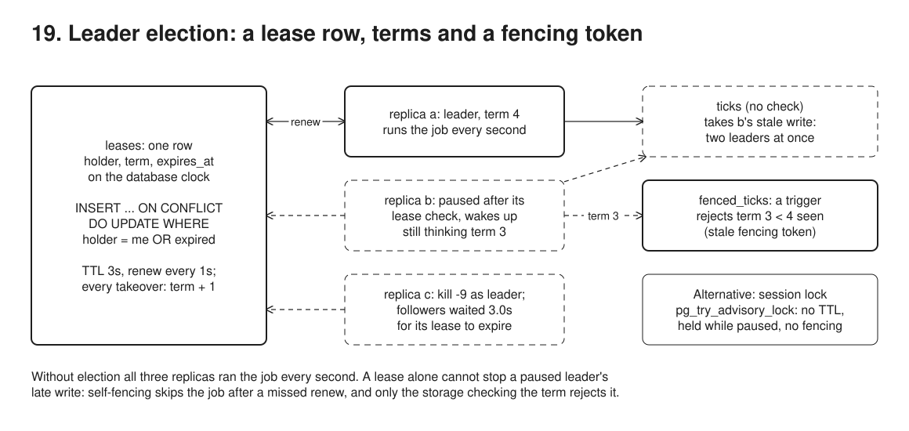

# 19. Leader election



**Pain: a job that fires N times, or a single point of failure.** Run three replicas of a cron-like scheduler and each one fires: three emails, three charges, three reports. Run one and it is a single point of failure. Work that must stay in order, like 09's relay, cannot simply be shared out either.

**Reach for it when** exactly one instance among several should do a piece of work at a time (a cron-like scheduler, a relay that must keep per-aggregate order, a partition owner), and you already run Postgres or a coordination service.

**Do not reach for it when** the work can be split instead: let every replica claim its own rows (09's relay with `FOR UPDATE SKIP LOCKED` when order does not matter, 08's waker with a conditional `UPDATE`), which scales and needs no leader. Two instances briefly overlapping would corrupt something that cannot check a fencing token: fix the storage side first, since no lease alone guarantees one leader. Consensus itself (replicated state, not just who leads) is the need: use etcd, ZooKeeper or Consul, never a hand-rolled protocol. Each run can claim itself: insert a `(job, scheduled_slot)` row under a unique key and let the replicas that lose the insert skip, so overlap is harmless and no leader is needed. A few seconds of outage are acceptable: one replica under a supervisor that restarts it costs about what a lease failover (the TTL) costs, with nothing to elect.

Three real OS processes (`src/replica.ts`, spawned by the run script) compete for one row in a `leases` table. The holder runs the job (a row in `ticks` every second); the run script kills it, pauses it with `SIGSTOP` and stops it gracefully, and the followers take over. Every acquisition bumps a `term`, which `fenced_ticks` checks as a fencing token. `src/advisory.ts` shows the session-based alternative, `pg_try_advisory_lock`.

## Run

One shot with proof: `./run-19-leader-election.sh` from the repo root (log in [`../logs/19-leader-election.log`](../logs/19-leader-election.log)).

Each claim in the Proof section below is also a `check(label, condition)` in the code. A failed check marks the process failed, so the script exits non-zero; the log ends each process with `N checks passed` or `FAILED: ...`.

By hand, from this folder (ports: Postgres 55449):

```sh
docker compose up -d --wait
npm i
npm run setup                  # leases, ticks, fenced_ticks and its fencing trigger
npm run replica -- a           # run in 3 terminals with a, b, c; kill, pause (kill -STOP / -CONT) and stop them
npm run advisory -- hold       # hold pg_try_advisory_lock(18) in this session
npm run advisory -- take 4000  # try for 4s from another session (add held or free to check the outcome)
npm run advisory -- pooler     # session lock vs transaction lock behind a pool
npm run verify -- terms        # after the replicas ran: at most one leader per term, fencing, failover gaps
```

## Files

- `src/replica.ts` the lease statement (acquire, renew or bump the term, on the database clock), the self-fencing check, the job, release on SIGTERM. `SIGUSR2` and `SIGUSR1` make it stop itself right after its next renew or right after its lease check, so the pause lands at an exact spot.
- `src/setup.ts` the `check_fencing_token` trigger: `fenced_ticks` rejects a term lower than the highest it has seen.
- `src/narrate.ts` (`npm run step`) prints the `## N. title` and `concept:` header for each step of the run script.
- `src/advisory.ts` session lock held, paused, killed; unlock on the wrong pooled connection; `pg_try_advisory_xact_lock`.

## Concepts

- **The lease row**: `leases (name, holder, term, renewed_at, expires_at)`. Every second each replica runs one statement (`src/replica.ts`): `INSERT ... ON CONFLICT (name) DO UPDATE ... WHERE l.holder = EXCLUDED.holder OR l.expires_at <= now()`. It extends my own lease, takes an expired one, or returns no row, which means I am a follower. The conflicting row is locked and the `WHERE` is re-checked against its latest version, so two followers racing for an expired lease cannot both win. `expires_at = now() + TTL` uses the database clock, so replica clocks never get compared with each other. TTL 3s, renew every 1s.
- **Failover costs the TTL**: a `kill -9`ed leader cannot hand anything over. Followers wait for `expires_at` to pass, so the job stops for up to TTL + one renew interval (3.0s in the run, because the followers poll in step with the leader). That is the trade-off to tune. A short TTL means fast failover but more false failovers: a GC pause, a slow disk or a busy database longer than the TTL deposes a healthy leader. A long TTL means fewer false failovers but a longer outage when the leader really dies. Renew several times per TTL (client-go's defaults: 15s lease, 10s renew deadline, 2s retry), so one lost heartbeat is not a failover.
- **Terms**: every acquisition, even by the previous holder after its lease expired, runs `term = term + 1`; a renewal keeps it. The term is a monotonic leadership number, like Raft's term or Chubby's sequencer.
- **Self-fencing**: a leader that cannot confirm a renew must stop before the lease could have expired, without waiting to be told. Before each job run, the replica compares a monotonic clock (`performance.now()`) against the moment it *sent* its last successful renew. Measuring from the send time is conservative, because the server stamped `expires_at` later. Past the TTL, it skips the job. This relies on bounded clock drift: rates, not absolute times. The leader's second must not run much longer than the database's, so real systems stop a margin before the TTL (client-go: `RenewDeadline` < `LeaseDuration`).
- **Fencing tokens** (Kleppmann): self-fencing cannot close the gap between "my check passed" and "my write arrived". A GC pause, a swap-in or a delayed packet in that gap delivers a write from a leader that is no longer one. The fix belongs in the storage. It remembers the highest term it has seen (`fence.max_term`) and rejects anything older: `check_fencing_token`, a `BEFORE INSERT` trigger that locks the fence row, raises `stale fencing token` if `NEW.term < max_term`, and otherwise stores the new maximum. `ticks` has no such check and takes the stale write; `fenced_ticks` rejects it. Every resource the leader touches (a table, an object store, an API) must check the token, or it is not protected.
- **Graceful release**: on `SIGTERM` the leader sets `expires_at = now()` (only if it still holds that term) before exiting. A planned deploy then costs one renew interval, not a TTL. Kubernetes controllers do the same (`ReleaseOnCancel`).
- **Session lock, `pg_try_advisory_lock`**: no table, no TTL, no heartbeat. The lock lives exactly as long as the database session that took it. A killed process loses it at once, because the kernel closes its socket. A paused process keeps it indefinitely, because its session is alive, so there is no failover at all. A client that vanished without closing its connection (host crash, cable pulled, a NAT that dropped the flow) is a half-open connection. The server keeps its session, and the lock, until TCP keepalive gives up. By default that is the OS setting: 7200s idle + 9 probes x 75s on Linux, over two hours. Set `tcp_keepalives_idle` / `_interval` / `_count`, `tcp_user_timeout` or `idle_session_timeout` to shorten it. The lock also does not fence. When the session dies, a new holder can take the lock while the old process still believes it leads, and writes it sends over other connections carry no term. Writes over the locking connection itself fail once that session is gone. Pair the lock with a counter bumped on acquisition if the protected resource must reject stale writes.
- **Pooler trap**: a transaction-mode pooler (PgBouncer `pool_mode = transaction`) gives each transaction whichever server connection is free. A session lock taken in one transaction stays on that server connection, the unlock lands on another (`you don't own a lock of type ExclusiveLock`), and the lock stays held by an idle pooled connection that no code owns. PgBouncer lists session-level advisory locks as unsupported in transaction mode. `pg_try_advisory_xact_lock` does work there, but it ends with the transaction, so it guards one job run, not a leadership term. Take the session lock on a dedicated direct connection, or use the lease row.
- **Why not roll your own consensus**: this sample borrows a linearizable store (one Postgres primary) and builds a lease on it. Electing a leader among peers without such a store needs a consensus protocol (Paxos, Raft, Zab). Those are notoriously hard to get right: quorum, persistence, membership changes, and the failure cases Jepsen keeps finding. If Postgres is the dependency anyway, a lease row in it is fine. The database is then the single point of failure, and a failover to a lagging replica can reset terms unless replication is synchronous. With a dedicated coordination service, use its recipes. etcd has a lease with keepalive plus `concurrency.Election`, and the revision serves as a fencing token. ZooKeeper has ephemeral sequential znodes, and the zxid or znode version serves as a token. Consul has sessions and `lock`. On Kubernetes, use a `coordination.k8s.io/v1` Lease object with client-go's `leaderelection`, whose docs state it tolerates clock skew but not skew rate, and does not guarantee a single acting leader (no fencing).

## Proof (`logs/19-leader-election.log`)

Without election, all three replicas run the job every second:

```
  second  | runs |   by
 00:54:40 |    3 | a, b, c
 00:54:41 |    3 | a, b, c
 00:54:42 |    3 | a, b, c
```

With the lease, one leader; the row's times come from the database clock:

```
   00:54:45 [c] acquired the lease, term 1
   00:54:45 [a] follower, c leads (term 1)
   00:54:45 [c] job ran, term 1
   00:54:45 [b] follower, c leads (term 1)

   name    | holder | term | renewed_at | expires_at | expires_in_s
 scheduler | c      |    1 | 00:54:48.8 | 00:54:51.8 |          2.8
```

`kill -9` the leader: nobody runs the job until its lease expires, then a follower takes term 2:

```
   00:54:50 kill -9 c (pid 12728)
   00:54:52 [b] acquired the lease, term 2; c's lease had expired 0.1s ago
   00:54:53 [a] follower, b leads (term 2)
```

The leader freezes right after a renew. On resume its own check stops it before any write, and its next renew is refused:

```
   00:54:56 [b] renewed term 2, before the job's lease check: SIGSTOP now (a GC pause stand-in)
   00:55:00 [a] acquired the lease, term 3; b's lease had expired 1.0s ago
   00:55:02 kill -CONT b, after a took over
   00:55:02 [b] SIGCONT: resumed
   00:55:02 [b] self-fenced: last renew was sent 5.9s ago, past the 3s TTL, so the lease may be someone else's; job skipped
   00:55:03 [b] renew refused: a holds term 3; stepping down
```

The leader freezes after its check passed. On resume it writes with term 3 while term 4 leads: the unfenced table takes it, the fenced one rejects it:

```
   00:55:06 [a] lease check passed for term 3, before the write: SIGSTOP now (a GC pause stand-in)
   00:55:10 [b] acquired the lease, term 4; a's lease had expired 0.9s ago
   00:55:12 [a] SIGCONT: resumed
   00:55:12 [a] job ran, term 3: ticks accepted it, fenced_ticks REJECTED it (stale fencing token: term 3 < term 4 already seen)
   00:55:13 [a] renew refused: b holds term 4; stepping down
```

The same window in both tables, `ticks` first, then `fenced_ticks`. `ticks` shows two leaders writing (row 27); in `fenced_ticks` the rejected insert only burned id 18 (abridged):

```
 id | holder | term |     at
 24 | a      |    3 | 00:55:05.9
 25 | b      |    4 | 00:55:10.8
 26 | b      |    4 | 00:55:11.8
 27 | a      |    3 | 00:55:12.6
 28 | b      |    4 | 00:55:12.8

 id | holder | term |     at
 15 | a      |    3 | 00:55:05.9
 16 | b      |    4 | 00:55:10.8
 17 | b      |    4 | 00:55:11.8
 19 | b      |    4 | 00:55:12.8
```

Every change of writer in `ticks`, with the time since the previous job run: 3.1s after the kill, 5.0s and 4.9s across the pauses, 0.8s for the graceful release (rows 27 and 28 are a's stale write in between):

```
 id | holder | term |     at     | gap_s
 10 | c      |    1 | 00:54:45.8 |
 15 | b      |    2 | 00:54:52.9 |   3.1
 19 | a      |    3 | 00:55:00.9 |   5.0
 25 | b      |    4 | 00:55:10.8 |   4.9
 27 | a      |    3 | 00:55:12.6 |   0.8
 28 | b      |    4 | 00:55:12.8 |   0.2
 32 | a      |    5 | 00:55:16.6 |   0.8

   00:55:15 [b] SIGTERM: released the lease (term 4) so a follower need not wait for the TTL; exiting
   00:55:16 [a] acquired the lease, term 5; b's lease had expired 0.8s ago
```

The session lock: a paused holder keeps it, a killed one loses it at once; the defaults leave a vanished client's session to the OS keepalive:

```
   00:55:22 [taker] pg_try_advisory_lock(18) still false after 0.0s: another session holds it
   00:55:22 kill -STOP the holder (pid 26484)
   00:55:27 [taker] pg_try_advisory_lock(18) still false after 4.1s: another session holds it
   00:55:27 kill -CONT, then kill -9 the holder
   00:55:27 [taker] pg_try_advisory_lock(18) = true on backend 678 after 0.0s

 idle_session_timeout    | 0       | ms
 tcp_keepalives_count    | 0       |
 tcp_keepalives_idle     | 0       | s
 tcp_keepalives_interval | 0       | s
 tcp_user_timeout        | 0       | ms
tcp_keepalive_time:7200
tcp_keepalive_intvl:75
tcp_keepalive_probes:9
```

Behind a pool, the unlock lands on the wrong connection:

```
   00:55:29 [pooler] transaction 1 runs on backend 706: pg_try_advisory_lock(18) = true
   00:55:29 [pooler] server says: you don't own a lock of type ExclusiveLock
   00:55:29 [pooler] transaction 2 runs on backend 707: pg_advisory_unlock(18) = false
   00:55:29 [pooler] the lock is still held by backend 706, an idle pooled connection; it stays held until that connection closes
   00:55:29 [pooler] pg_try_advisory_xact_lock(18) = true inside a transaction on backend 707; backend 706 meanwhile gets false
```

The self-checks, one line per claim, then one summary per process; any failed check makes the run script exit non-zero:

```
   check ok: without election all 3 replicas run the job, so it fires several times in the same second
1 check passed
   check ok: one lease row; its holder is the only replica that ran the job, in term 1
   check ok: expires_at is renewed_at + the 3s TTL, both from the database clock
2 checks passed
   check ok: there is never more than one leader per term (terms 1 to 5, in ticks and in fenced_ticks)
   check ok: after kill -9 nobody ran the job until the lease expired (3.1s gap, TTL 3s)
   check ok: the leader paused after its renew wrote nothing once term 3 began (self-fenced)
   check ok: ticks took the stale term-3 write after term 4 began: two leaders wrote
   check ok: fenced_ticks never went back to a lower term: the stale write was rejected
   check ok: after SIGTERM the follower took over before the TTL (0.8s gap)
   check ok: the lease ended at term 5, and the fence has seen term 5
7 checks passed
   check ok: another session holds the lock
1 check passed
   check ok: the paused holder's session still holds the lock after 4s
1 check passed
   check ok: the killed holder's lock is free at once
1 check passed
   check ok: an unlock that lands on another pooled connection fails, and the lock stays held by the first
   check ok: a transaction-level lock excludes the other connection while the transaction runs
   check ok: after COMMIT the transaction-level lock is released by itself
3 checks passed
```

## Origins and further reading

- Paper: "Leases: An Efficient Fault-Tolerant Mechanism for Distributed File Cache Consistency", Cary G. Gray and David R. Cheriton, SOSP 1989 (where leases come from, including the clock-drift assumption). https://dl.acm.org/doi/10.1145/74851.74870
- Paper: "The Chubby lock service for loosely-coupled distributed systems", Mike Burrows, OSDI 2006 (coarse-grained locks, sequencers, lock-delay). https://research.google/pubs/the-chubby-lock-service-for-loosely-coupled-distributed-systems/
- Article: "How to do distributed locking", Martin Kleppmann, 2016 (fencing tokens, why a lock with a timeout alone is unsafe). https://martin.kleppmann.com/2016/02/08/how-to-do-distributed-locking.html
- Docs: "Leases", Kubernetes (Lease objects for leader election of control-plane components and your own controllers). https://kubernetes.io/docs/concepts/architecture/leases/
- Docs: client-go `leaderelection` package (LeaseDuration, RenewDeadline, RetryPeriod; tolerant to clock skew, not skew rate; no fencing guarantee). https://pkg.go.dev/k8s.io/client-go/tools/leaderelection
- Docs: "Advisory Locks", PostgreSQL 16 (session-level vs transaction-level). https://www.postgresql.org/docs/16/explicit-locking.html
- Docs: PgBouncer features (session-level advisory locks are not supported in transaction pooling). https://www.pgbouncer.org/features.html
