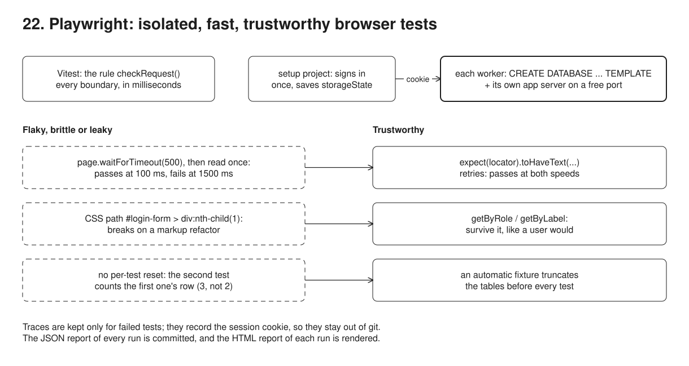
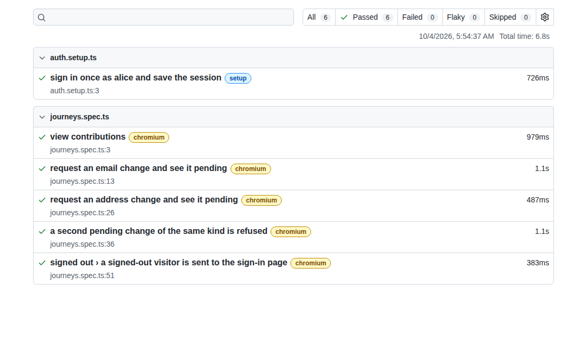
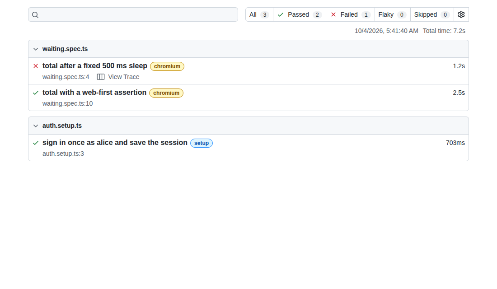
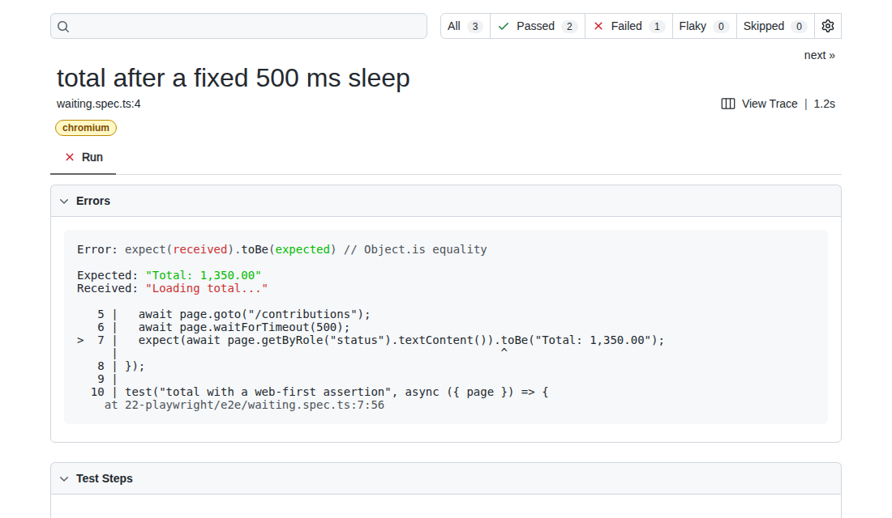

# 22. End-to-end tests with Playwright



**Pain: end-to-end tests nobody trusts.** They pass on a laptop and fail on CI because of a fixed `sleep`. They break when someone renames a CSS class. They pass alone and fail together because one test leaves rows that the next one counts. Every test signs in through the login page, so the suite is slow, and when one fails there is nothing to look at but a stack trace.

**Reach for it when** a few user journeys must keep working release after release (sign in, see my contributions, request a change and see it pending) and you want them checked in a real browser, in parallel, on every change.

**Do not reach for it when** the behaviour is a rule you can call directly: test it with a unit test (here, Vitest), which runs in milliseconds and can cover every edge case. Keep browser tests to one journey per outcome.

A small member portal (`node:http`, server-rendered HTML, Postgres) with two test suites: Vitest for the rule that accepts or refuses a change request, and `@playwright/test` for the journeys. Each Playwright worker clones its own database from a template and starts its own app server; a setup project signs in once and saves the session. The demo runs the suites six times in different configurations and checks each outcome: green; with the per-test reset turned off; a fixed sleep against a fast and then a slow API; CSS selectors against a markup refactor.

## Run

One shot with proof: `./run.sh` in this folder, or `./22-playwright/run.sh` from the repo root (log in [`../logs/22-playwright.log`](../logs/22-playwright.log)).

By hand, from this folder (ports: Postgres 55452, HTTP 53032 portal (hand run; test workers use free ports)):

```sh
docker compose up -d --wait
npm i
npm run setup      # template database portal_template, and portal for the hand-run server
npm run server     # http://localhost:53032 (alice / alice-password)
npm run test:unit  # vitest
npm run test:e2e   # playwright, every spec
npm run demo       # the runs the log shows: green, leaking, flaky, brittle
```

## Files

- `src/app.ts` the portal: sign-in, contributions (the total arrives through a delayed `fetch`), request a change, list requests. `MARKUP=v2` serves a refactored sign-in form; `API_DELAY_MS` delays the total.
- `src/rules.ts` and `src/rules.test.ts` the change-request rule and its unit tests.
- `src/session.ts` a signed session cookie, valid on every worker's server; `src/db.ts` template cloning; `src/setup.ts` the template, with a partial unique index that enforces one pending change per kind under concurrent submits; `src/server.ts` the hand-run server.
- `playwright.config.ts` workers, `trace: "retain-on-failure"`, the `setup` project and `storageState`, and the reporters: list, JSON and HTML.
- `e2e/fixtures.ts` the worker-scoped database and server, and the per-test reset.
- `e2e/auth.setup.ts` signs in once and saves `.auth/alice.json`.
- `e2e/journeys.spec.ts` the journeys, with role and label locators.
- `e2e/waiting.spec.ts` a fixed sleep next to a web-first assertion; `e2e/locators.spec.ts` CSS selectors next to role and label locators.
- `src/demo.ts` runs the suites in the configurations the log shows and checks each outcome.
- `reports/*.json` the Playwright JSON report of each run in the log, committed. `reports/html/<run>/` (the HTML report of each run), `test-results/` (the traces of the failing runs) and `.auth/` (the saved session) stay local: all three carry the session cookie.
- `screenshots/take.mjs` opens two of the HTML reports from disk in Chromium; `run.sh` runs it after the demo.

## Concepts

- **Unit tests for the rule, browser tests for the journey**: `checkRequest()` (a real calendar date, none in the past, at most 90 days ahead, one pending change per kind, email format) is a pure function, tested with Vitest at its boundaries (the 90th day passes, the 91st fails; 2026-02-30 is refused, not rolled over to March). Two concurrent submissions can both pass the check, so a partial unique index (`member_id, kind WHERE status = 'pending'`) backs the one-pending-per-kind rule and its violation gets the same message. The browser suite checks only that the journey reaches each outcome once: a request goes through and shows Pending, a duplicate is refused with a message.
- **Role and label locators**: `getByRole("button", { name: "Sign in" })`, `getByLabel("Username")`, `getByRole("table", { name: "Change requests" })` find elements the way a user and a screen reader do (21). They survive restyling and restructuring, and fail when the page really changed for users, for example when a label is lost. CSS paths like `#login-form > div:nth-child(1) > input` encode the DOM structure; the demo's `MARKUP=v2` refactor keeps every label and button text, and only the CSS test breaks.
- **Auto-waiting and web-first assertions**: Playwright actions wait for their element to be attached, visible, stable and enabled; `expect(locator).toHaveText()` retries until the text matches or the timeout passes. `page.waitForTimeout(500)` followed by reading `textContent()` checks once at an arbitrary moment. Whether it passes depends on how fast the server answers. The demo makes that deterministic: the total is loaded by a `fetch` delayed by `API_DELAY_MS`, and the sleep passes at 100 ms and fails at 1500 ms, while the web-first assertion passes at both.
- **Test isolation, a database per worker**: a worker-scoped fixture clones `portal_template` (`CREATE DATABASE ... TEMPLATE`, which copies the template's pages instead of replaying the schema and seed) and starts the app in the worker on a free port, so parallel workers never share rows. Workers are separate processes that live across many tests; the fixture drops the database when the worker ends.
- **Reset without a transaction**: wrapping each test in a transaction that rolls back does not work for browser tests: the app serves the browser's requests on its own connections, which cannot see an uncommitted transaction. An automatic test-scoped fixture truncates the tables tests write instead. Without it (`NO_RESET=1`) the address test counts the email test's leftover row and fails, but only in that order: an order-dependent failure is the signature of a leaking fixture.
- **Login once, `storageState`**: a `setup` project signs in through the real form once and saves the cookies to `.auth/alice.json`; the `chromium` project depends on it and starts every test with that state. The session is a signed cookie any worker's server can verify. Tests about signing in override it with an empty state.
- **Traces on failure**: `trace: "retain-on-failure"` records every action, a DOM snapshot before and after it, network, console and source, and keeps the file only when the test fails. `npx playwright show-trace` replays it; the log lists its actions and shows the total's request had no response yet when the assertion ran.
- **Reports**: the list reporter for the console, a JSON reporter per run, which the demo reads to check which tests failed and on which worker, and an HTML report per run (`npx playwright show-report reports/html/<run>`) for people: filters by status, the error with its source line, and the trace one click away. Playwright replaces a worker after a failure, which is why the leaky run's next test passes on a fresh database.
- **Trade-offs**: one database per worker multiplies setup time and connections; the template must be rebuilt when the schema changes. Truncating is simple but must list every table tests write. The app runs inside the test worker here, so tests can reach its pool; against a deployed environment you seed through an API or a test-only endpoint instead. Retries (`retries: 2`) hide flakes rather than fix them: Playwright reports a test that passes on retry as "flaky", and those reports are worth reading.

## Proof (`logs/22-playwright.log`)

Six tests (setup plus five journeys) on two workers, each worker with its own database and app server; the setup signs in once and the journeys start from the saved state:

```
   [worker 0] database portal_w0, app on http://localhost:42995
  ✓  1 [setup] › e2e/auth.setup.ts:3:1 › sign in once as alice and save the session (685ms)
   [worker 1] database portal_w1, app on http://localhost:44493
   [worker 2] database portal_w2, app on http://localhost:35071
  ✓  2 [chromium] › e2e/journeys.spec.ts:3:1 › view contributions (774ms)
  ✓  3 [chromium] › e2e/journeys.spec.ts:13:1 › request an email change and see it pending (531ms)
  ✓  4 [chromium] › e2e/journeys.spec.ts:26:1 › request an address change and see it pending (489ms)
...
   storageState .auth/alice.json: cookie sid=1.DyFqWL... httpOnly=true sameSite=Lax; journeys ran on workers 1, 2
```

Without the reset, on one worker, the second writer sees the first one's row; the worker that replaces it starts clean:

```
  ✓  3 [chromium] › e2e/journeys.spec.ts:13:1 › request an email change and see it pending (531ms)
  ✘  4 [chromium] › e2e/journeys.spec.ts:26:1 › request an address change and see it pending (5.3s)
   [worker 2] database portal_w2, app on http://localhost:46577
  ✓  5 [chromium] › e2e/journeys.spec.ts:36:1 › a second pending change of the same kind is refused (771ms)
...
    Error: expect(locator).toHaveCount(expected) failed

    Locator:  getByRole('table', { name: 'Change requests' }).getByRole('row')
    Expected: 2
    Received: 3
```

The fixed sleep fails once the API takes 1500 ms; the web-first assertion waits and passes:

```
  ✘  3 [chromium] › e2e/waiting.spec.ts:4:1 › total after a fixed 500 ms sleep (1.2s)
  ✓  2 [chromium] › e2e/waiting.spec.ts:10:1 › total with a web-first assertion (2.5s)
...
    Expected: "Total: 1,350.00"
    Received: "Loading total..."
```

After the markup refactor, the CSS test cannot find its input; the role and label test still passes:

```
  ✓  3 [chromium] › e2e/locators.spec.ts:13:1 › sign in with role and label locators (848ms)
  ✘  2 [chromium] › e2e/locators.spec.ts:5:1 › sign in with CSS selectors (5.5s)
    TimeoutError: locator.fill: Timeout 5000ms exceeded.
    Call log:
      - waiting for locator('#login-form > div:nth-child(1) > input')
```

A trace was kept for each failure only, and the flaky test's trace shows why it failed:

```
test-results/leaky/journeys-request-an-address-change-and-see-it-pending-chromium/trace.zip
test-results/locators-v2/locators-sign-in-with-CSS-selectors-chromium/trace.zip
test-results/waiting-slow/waiting-total-after-a-fixed-500-ms-sleep-chromium/trace.zip
...
  step: Navigate to "/contributions"
  step: Wait for timeout
  step: Get text content getByRole('status')
  step: Expect "toBe"
...
  GET /contributions -> 200 in 55 ms
  GET /api/contributions/total -> no response yet when the test ended
```

The per-worker databases are gone after the runs; only the template and the hand-run database remain:

```
     datname
-----------------
 portal
 portal_template
 postgres
```

## Screenshots

Taken in Chromium by `screenshots/take.mjs` at the end of `run.sh`. The HTML reports themselves (`reports/html/<run>/`) stay local: the failing runs' reports embed their traces, which record the session cookie.

The green run: setup plus five journeys, all passed.



The slow-API run: the fixed sleep failed, with its trace one click away; the web-first assertion passed.



The failed test opened: the text it read, "Loading total...", against the one it expected, and the line that read it.



## Origins and further reading

- Docs: "Best Practices", Playwright (user-facing locators, web-first assertions, isolation). https://playwright.dev/docs/best-practices
- Docs: "Auto-waiting" (actionability checks), Playwright. https://playwright.dev/docs/actionability
- Docs: "Authentication" (setup project, `storageState`), Playwright. https://playwright.dev/docs/auth
- Docs: "Fixtures" (worker-scoped and automatic fixtures), Playwright. https://playwright.dev/docs/test-fixtures
- Docs: "Trace viewer", Playwright. https://playwright.dev/docs/trace-viewer
- Docs: "Template Databases", PostgreSQL 16. https://www.postgresql.org/docs/16/manage-ag-templatedbs.html
- Docs: Vitest. https://vitest.dev/guide/
- Article: "Eradicating Non-Determinism in Tests", Martin Fowler, 2011. https://martinfowler.com/articles/nonDeterminism.html
- Article: "The Practical Test Pyramid", Ham Vocke, 2018. https://martinfowler.com/articles/practical-test-pyramid.html
- Article: "Write tests. Not too many. Mostly integration.", Kent C. Dodds, 2017 (and the Testing Library guiding principle behind role queries). https://kentcdodds.com/blog/write-tests
