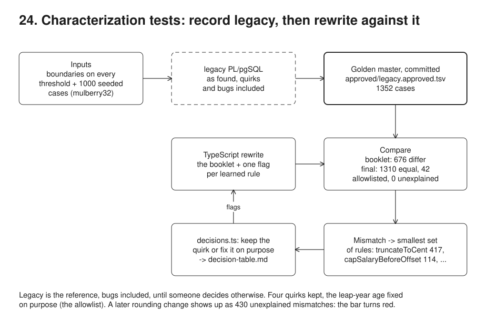

# 24. Characterization tests and a golden master



**Pain: rewriting rules nobody can state.** The contribution calculation lives in a PL/pgSQL function written years ago. The booklet describes it in one sentence, and the code does something else: it truncates instead of rounding, skips the month for members who join after the 15th, caps the salary before the offset instead of after, drops amounts under 10.00, and counts age as days / 365. A rewrite from the booklet differs on half the cases, and without a record of what legacy does, those differences reach members' statements first.

**Reach for it when** you rewrite or refactor logic whose behaviour is only known by running it (a calculation, an eligibility rule, a stored procedure), the logic is deterministic, and you can call it with inputs you choose.

**Do not reach for it when** the rules are already specified and tested: write the tests from the spec (23). The output depends on time, randomness or external state you cannot pin. Nobody will keep any of the legacy behaviour: a golden master of answers you have decided are wrong is only a list of differences to ignore. You need real traffic rather than generated inputs: run both side by side in production (04).

The legacy function (`sql/legacy.sql`) is loaded into Postgres as found. The demo generates inputs, records the legacy outputs into a committed approval file, runs the TypeScript rewrite against it, explains every mismatch with a rule, records a decision per rule, and ends with a rewrite that matches legacy except where a documented decision fixes a bug on purpose. The learned rules are written out as a decision table.

## Run

One shot with proof: `./run-24-characterization.sh` from the repo root (log in [`../logs/24-characterization.log`](../logs/24-characterization.log)).

By hand, from this folder (ports: Postgres 55454):

```sh
docker compose up -d --wait
npm i
npm run setup    # legacy_monthly_contribution() and the cases table
npm run demo     # inputs, golden master, booklet rewrite, discovered rules, final rewrite, decision table
```

## Files

- `sql/legacy.sql` the legacy PL/pgSQL, with its undocumented rules and its leap-year bug.
- `src/inputs.ts` the input generator: boundary values for every threshold (salary cap, offset, minimum amount, 35th and 50th birthdays, join day 15/16, month ends, 29 February) and 1000 cases from a seeded PRNG (mulberry32), so the same inputs come back on every run.
- `src/golden.ts` records legacy outputs (`unnest` insert, one `UPDATE` calling the function) to `approved/legacy.received.tsv`, compares with `approved/legacy.approved.tsv`, and approves on the first run.
- `src/contribution.ts` the rewrite. The booklet version with every rule flag off, and one flag per behaviour learned from legacy. Integer cents throughout.
- `src/decisions.ts` one decision per learned rule: keep the quirk or fix it on purpose, with the reason. The fixes are the allowlist.
- `src/dates.ts` calendar arithmetic: age on a date, month ends, days between.
- `src/demo.ts` the steps: mismatches of the booklet version, the smallest set of rules explaining each, the final check (equal, allowlisted, unexplained), a regression caught, the decision table.
- `approved/legacy.approved.tsv` the golden master (committed). `decision-table.md` the generated decision table.

## Concepts

- **Characterization test**: a test that records what the code *does*, not what it should do. You do not judge the output while recording; legacy is the reference, bugs included, until someone decides otherwise.
- **Golden master / approval file**: run many inputs through legacy once and store inputs and outputs in a file under version control (`approved/legacy.approved.tsv`, 1352 cases). Each run writes `legacy.received.tsv` and compares; a difference means the legacy code or the generator changed, and approving the new file is a reviewed commit. The rewrite is then checked against the file, not against the legacy system, so the check still runs after legacy is switched off.
- **Inputs that find the rules**: boundary values on every threshold the code might have (salary 5,999.99 / 6,000.00 / 6,000.01, 149,999.99 / 150,000.00 / 150,000.01, the amounts where the monthly result crosses 10.00 at each rate, 35th and 50th birthdays shifted by 1 to 31 days, join days 15 and 16, month ends, 29 February), plus 1000 cases from a seeded PRNG (mulberry32, seed 2026) so the file is the same on every run. Random cases alone rarely hit an exact boundary; boundaries alone miss interactions between rules.
- **From mismatches to rules**: each pattern in the mismatches becomes a hypothesis, implemented as a flag in the rewrite (`truncateToCent`, `midMonthCutoff`, ...). A mismatch is explained by the smallest set of flags that reproduces the legacy output exactly; a mismatch nothing explains means a rule is still undiscovered. Two of the groups need two rules at once (an amount truncated to 9.99 and then dropped as under 10.00).
- **Keep the quirk or fix it on purpose**: every learned rule gets a decision with a reason in `src/decisions.ts`. Kept rules become the rewrite's behaviour, even when they look odd (truncation, the 15th cut-off), because members, employers and past statements already depend on them. Fixed rules (the leap-year age) form the allowlist: their mismatches are expected, and only those.
- **Green bar**: every case is equal, or differs only where a documented fix says it must. Zero unexplained mismatches. A later change that silently alters behaviour (rounding instead of truncating) produces unexplained mismatches and turns the check red.
- **Decision table**: the rules written for people, one row per condition and outcome, with where each came from and what was decided (`decision-table.md`). It is the spec the booklet should have been, and the input to the conversation with the business about each fix.
- **Trade-offs**: a golden master only covers the inputs you generated; a rule triggered by a combination you never produced stays hidden, which is why production comparison (04) is the next step. It pins behaviour, not intent, so it makes every change look like a regression until someone decides; keep the allowlist small and reasoned. Generated inputs must be realistic enough (valid dates, plausible salaries) or the mismatches are noise.

## Proof (`logs/24-characterization.log`)

The rewrite from the booklet differs from legacy on half the cases; one example per pattern:

```
   676 of 1352 cases differ
   #19    salary    7333.33  born 1995-06-15  joined 2010-01-04  period 2024-02-01  legacy     0.00  rewrite     5.56
   #27    salary    7714.28  born 1965-06-15  joined 2010-01-04  period 2024-02-01  legacy    12.85  rewrite    12.86
   #55    salary  156000.00  born 1995-06-15  joined 2010-01-04  period 2024-02-01  legacy   600.00  rewrite   625.00
   #63    salary   48000.00  born 1989-02-02  joined 2010-01-04  period 2024-02-01  legacy   245.00  rewrite   175.00
   #86    salary   48000.00  born 1980-06-15  joined 2024-02-16  period 2024-02-01  legacy     0.00  rewrite   245.00
```

Every mismatch is explained by the smallest set of hypotheses that reproduces the legacy output:

```
    417  truncateToCent
    114  capSalaryBeforeOffset
     53  midMonthCutoff
     41  ageByDaysOver365
     38  deMinimis
     12  truncateToCent + deMinimis
      1  ageByDaysOver365 + truncateToCent
```

The final rewrite keeps four quirks and fixes one; the remaining differences are all on the allowlist. A regression is caught (abridged):

```
   1352 cases: 1310 equal, 42 allowlisted (ageByDaysOver365), 0 unexplained

## 7. The golden master catches a regression
   430 unexplained mismatches, for example:
   #21    salary    7333.33  born 1965-06-15  joined 2010-01-04  period 2024-02-01  legacy     0.00  rewrite    10.00
```

The leap-year bug, read from the golden master in SQL: legacy counts days / 365, so members are charged the next band's rate up to 9 days before their 35th birthday and 13 days before their 50th:

```
 legacy_age | real_age | count | min_days_to_birthday | max_days_to_birthday | legacy | rewrite
------------+----------+-------+----------------------+----------------------+--------+---------
         35 |       34 |    15 |                    1 |                    9 | 245.00 |  175.00
         50 |       49 |    26 |                    1 |                   13 | 315.00 |  245.00
```

The rates implied by the legacy outputs, by calendar age: the bands are 5/7/9%, except for the members the bug moved up early:

```
 calendar_age | implied_rate | count
--------------+--------------+-------
 under 35     |         0.05 |   310
 under 35     |         0.07 |    15
 35 to 49     |         0.07 |   290
 35 to 49     |         0.09 |    27
 50 and over  |         0.09 |   434
```

The decision table, generated from the decisions and the mismatch counts (two rows shown):

```
   | R3 | joined in the period's month after the 15th | 0.00 for that month | legacy, 53 mismatches | keep: payroll closes on the 15th; the booklet never said so, but every employer's payroll relies on it |
   | R5 | age on the 1st of the period: under 35 / 35 to 49 / 50 and over | rate 5% / 7% / 9% of pensionable salary | legacy, 42 mismatches | fix: legacy counts age as days / 365, so leap days make members older: up to 9 days before a 35th birthday and 13 before a 50th they pay the higher rate |
```

## Origins and further reading

- Book: *Working Effectively with Legacy Code*, Michael Feathers, 2004 (characterization tests, chapter 13). https://www.oreilly.com/library/view/working-effectively-with/0131177052/
- Docs: ApprovalTests, Llewellyn Falco (approved and received files). https://approvaltests.com/
- Kata: Gilded Rose refactoring kata, Emily Bache (a classic golden-master exercise). https://github.com/emilybache/GildedRose-Refactoring-Kata
- Article: "Patterns of Legacy Displacement", Ian Cartwright, Rob Horn and James Lewis, 2022-2024. https://martinfowler.com/articles/patterns-legacy-displacement/
- Docs: Decision Model and Notation (DMN), OMG, the standard form of decision tables. https://www.omg.org/dmn/
