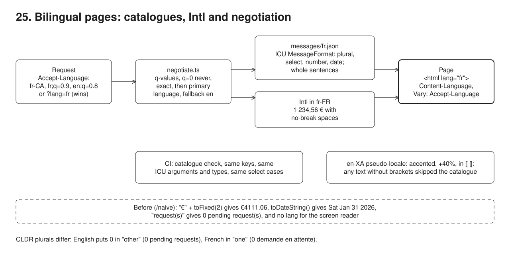

# 25. Bilingual English/French



**Pain: a "translated" page that is still English underneath.** The strings were translated, but the code concatenates `"€" + amount.toFixed(2)`, prints `date.toDateString()`, builds plurals as `"request(s)"`, hard-codes a few labels and sets no `lang`. French members see `€4111.06`, `Sat Jan 31 2026` and `You have 0 pending request(s)` on a page a screen reader reads with the wrong voice. A translator renames `{count}` to `{nombre}` and the page breaks at runtime; the French button label does not fit the fixed-width button.

**Reach for it when** a product serves more than one language (bilingual regions often require it by law, or members live in several countries), or will: retrofitting catalogues, `Intl` formatting and `lang` later means touching every view.

**Do not reach for it when** there is one language and no plan for another: still format numbers and dates with `Intl` (it costs nothing), but a catalogue and negotiation layer are overhead. You need right-to-left scripts, translation memory or a translation management workflow: this sample covers the code side only.

A `node:http` server (`src/server.ts`) renders the same member page in English and French: messages in ICU MessageFormat (`messages/en.json`, `messages/fr.json`) formatted with `intl-messageformat`, numbers, money and dates with `Intl`, the locale chosen from `Accept-Language` or `?lang=`. `/naive` is the page as first written. A client (`src/demo.ts`) fetches both with different headers, checks the catalogues against each other, and scans a pseudo-localised render for anything that skipped the catalogue.

## Run

One shot with proof: `./run-25-bilingual.sh` from the repo root (log in [`../logs/25-bilingual.log`](../logs/25-bilingual.log)).

By hand, from this folder (ports: HTTP 53035 member page):

```sh
npm i
npm run server   # :53035, / and /naive, ?lang=en|fr|en-XA, ?member=alice|bob|carol
npm run demo     # in another terminal: negotiation, formats, plurals, catalogue check, pseudo-localisation, lang
npm run check    # the catalogue check alone, exits 1 on any problem (for CI)
```

## Files

- `messages/en.json`, `messages/fr.json` the catalogues: plural, select, number and date arguments, gender-free French wording (`Membre`, `Administration employeur`, `Dernière connexion le ...`), no-break spaces before `:` and `%`.
- `src/negotiate.ts` `Accept-Language` parsing: q-values, `q=0` (never chosen, also not through `*`), exact match then primary language, fallback.
- `src/i18n.ts` the translator for a locale: messages through `IntlMessageFormat`, money and dates through `Intl`, the formatting locale per language (`en` formats as `en-GB`, `fr` as `fr-FR`).
- `src/catalogues.ts` loads catalogues and compares them: same keys, every message parses, same ICU arguments with the same types, same select cases.
- `src/check-catalogues.ts` the CI gate (`npm run check`).
- `src/pseudo.ts` the `en-XA` pseudo-locale generated from English: literal text accented and padded by 40% inside `⟦ ⟧`, ICU arguments, plurals and `#` left intact (parse, transform the AST, print it back).
- `src/pages.ts` the page (`lang`, a language switcher marked with its own `lang`, `translate="no"` on data) and the naive page.
- `src/scan.ts` a minimal HTML text-node scanner for the checks.
- `fixtures/fr.broken.json` a French catalogue with seven typical translation mistakes.

## Concepts

- **ICU MessageFormat**: one message per sentence, with typed arguments: `{count, plural, one {# pending request} other {# pending requests}}`, `{role, select, member {...} employer {...} other {...}}`, `{amount, number, ::currency/EUR}`, `{date, date, long}`. The translator gets the whole sentence and can reorder it; the code never concatenates fragments.
- **CLDR plural rules**: categories differ by language. English puts 0 in `other` (`0 pending requests`), French in `one` (`0 demande en attente`). Hand-written `count === 1 ? "" : "s"` is wrong in French and in most other languages (Polish has four categories, Arabic six).
- **Gender-free wording**: French adjectives and many nouns agree with the person's gender, which the portal does not know and should not ask. The French catalogue names functions instead of people (`Administration employeur` rather than administrateur/administratrice), uses epicene nouns (`Membre`), and rephrases verbs (`Dernière connexion le ...` rather than "vous vous êtes connecté(e)"). A `select` on gender would also work but needs data the portal does not keep.
- **`Intl` formatting**: `Intl.NumberFormat` and `Intl.DateTimeFormat` know the separators, currency position and month names: `€1,234.56` in `en-GB`, `1 234,56 €` in `fr-FR`, where the group separator is U+202F (narrow no-break space) and the space before `€` is U+00A0, so the amount never wraps. French typography also puts a no-break space before `:` (the catalogue carries it) and `%` (`Intl` adds it). The language decides the catalogue; the formatting locale (`en` formats as `en-GB`) decides the formats.
- **Locale negotiation**: `Accept-Language` lists ranges with q-values (RFC 9110). Sort by q, drop `q=0` ("not this one"), match the exact tag then the primary language (`fr-CA` gets `fr`, RFC 4647 lookup), and fall back to a default. A language refused with `q=0` is never chosen, also not through `*` ("anything else"): `en;q=0, *` gets French, not the English default. An explicit choice (`?lang=`, a link, a saved preference) wins over the header, because people often browse with a browser set to a language they do not prefer. The response says `Content-Language` and `Vary: Accept-Language`, so caches keep one copy per language.
- **Catalogue check**: the reference catalogue (English) defines the keys and the arguments. Every other catalogue must have exactly the same keys, every message must parse, use the same arguments with the same types (a `{amount}` that lost `number` prints `1234.56`), and the same `select` cases. Run as `npm run check` in CI, so a broken translation fails the build instead of the page.
- **Pseudo-localisation**: a generated locale (`en-XA`) where every catalogue string is accented, 40% longer and wrapped in `⟦ ⟧`, with ICU arguments, plurals and `#` kept (parse, transform the literal nodes, print the AST back). It is readable, so anyone can click through the app in it before any translation exists; any readable text without brackets skipped the catalogue, and anything that overflows will overflow in French or German. The scanner skips text marked `translate="no"` (employer names, data) and text in another declared language.
- **`lang` attribute**: `<html lang>` selects the screen reader voice, hyphenation and quotes (WCAG 3.1.1). A passage in another language carries its own `lang` (3.1.2): the language switcher shows `Français` with `lang="fr"` on the English page.
- **Trade-offs**: ICU syntax is strict and translators need tooling that understands it (a message with a stray `{` does not parse). Catalogues as flat JSON with dotted keys are simple but give translators no context; add descriptions or screenshots. The pseudo-locale catches what the server renders; strings built in client-side code need the same check in the browser.

## Proof (`logs/25-bilingual.log`)

Locale negotiation: the best supported range wins, `q=0` excludes (also from `*`), unknown languages fall back to English, an explicit choice overrides the header (abridged):

```
   GET /          Accept-Language: fr-CA,fr;q=0.9,en;q=0.8            -> Content-Language: fr, <html lang="fr">, Vary: Accept-Language
   GET /          Accept-Language: de-DE,de;q=0.9,fr;q=0.5,en;q=0.3   -> Content-Language: fr, <html lang="fr">, Vary: Accept-Language
   GET /          Accept-Language: fr;q=0,en;q=0.5                    -> Content-Language: en, <html lang="en">, Vary: Accept-Language
   GET /          Accept-Language: de-CH                              -> Content-Language: en, <html lang="en">, Vary: Accept-Language
   GET /          Accept-Language: en;q=0, *                          -> Content-Language: fr, <html lang="fr">, Vary: Accept-Language
   GET /?lang=fr  Accept-Language: en-GB,en;q=0.9                     -> Content-Language: fr, <html lang="fr">, Vary: Accept-Language
```

The same data in both locales, and the naive page in French (⍽ is U+202F, · is U+00A0):

```
   en              total: Total: €4,111.06       rate: Contribution rate: 7%          row: 31 Jan 2026 | €1,234.56    Last signed in on 28 September 2026
   fr              total: Total·: 4⍽111,06·€     rate: Taux de cotisation·: 7·%       row: 31 janv. 2026 | 1⍽234,56·€ Dernière connexion le 28 septembre 2026
   fr, naive page  total: Total: €4111.06        rate: (none)                         row: Sat Jan 31 2026 | €1234.56 
```

Plural categories from CLDR, and the role `select` with gender-free French:

```
   alice  en: 0 pending requests   Hello Alice, Member                  fr: 0 demande en attente   Bonjour Alice, Membre
   bob    en: 1 pending request    Hello Bob, Employer administrator    fr: 1 demande en attente   Bonjour Bob, Administration employeur
   carol  en: 2 pending requests   Hello Carol, Portal staff            fr: 2 demandes en attente  Bonjour Carol, Équipe du portail
```

The catalogue check on a French catalogue with typical translation mistakes, then on the real one:

```
   fixtures/fr.broken.json: missing key "action.logout"
   fixtures/fr.broken.json: unknown key "action.logoff" (not in the reference)
   fixtures/fr.broken.json: "greeting" does not parse: EXPECT_ARGUMENT_CLOSING_BRACE
   fixtures/fr.broken.json: "role" select {role} has cases [member,other], the reference [employer,member,other]
   fixtures/fr.broken.json: "pending" lacks argument {count}
   fixtures/fr.broken.json: "pending" uses argument {nombre} that the code never passes
   fixtures/fr.broken.json: "contributions.total" formats {amount} as string, the reference as number
   messages/fr.json against messages/en.json: 0 problems
```

Pseudo-localisation finds what skipped the catalogue on the naive page, and the button that will not fit; the fixed page is clean (abridged):

```
   /naive?lang=en-XA: 9 hard-coded strings, 1 overflow
     hard-coded: "You have 0 pending request(s)"
     hard-coded: "Sat Jan 31 2026"
     hard-coded: "Total: €4111.06"
     hard-coded: "Sign out"
     overflow: <button> "⟦Ŕéqúéšţ á çĥáñğé·······⟧" is 25 characters in a 18ch box
     overflow in real French too: <button> "Demander une modification" is 25 characters in a 18ch box
   /?lang=en-XA: 0 hard-coded strings, 0 overflow
     sample: ⟦Ýóúŕ mémƀéŕ áççóúñţ········⟧  ⟦0 péñðíñğ ŕéqúéšţš·······⟧  ⟦Ţóţáļ: €4,111.06···⟧
```

## Origins and further reading

- Docs: ICU User Guide, Formatting Messages (MessageFormat). https://unicode-org.github.io/icu/userguide/format_parse/messages/
- Docs: CLDR Language Plural Rules, Unicode. https://www.unicode.org/cldr/charts/latest/supplemental/language_plural_rules.html
- Docs: FormatJS `intl-messageformat` and the ICU message parser. https://formatjs.github.io/docs/intl-messageformat/
- Docs: `Intl` on MDN. https://developer.mozilla.org/en-US/docs/Web/JavaScript/Reference/Global_Objects/Intl
- RFC: RFC 4647, Matching of Language Tags, Addison Phillips and Mark Davis, 2006. https://www.rfc-editor.org/rfc/rfc4647 ; RFC 9110 section 12.5.4, Accept-Language, 2022. https://www.rfc-editor.org/rfc/rfc9110#name-accept-language
- Article: "Declaring language in HTML", Richard Ishida, W3C Internationalization. https://www.w3.org/International/questions/qa-html-language-declarations
- Docs: WCAG 2.2 Understanding 3.1.1 Language of Page and 3.1.2 Language of Parts. https://www.w3.org/WAI/WCAG22/Understanding/language-of-page.html
- Article: "Pseudo Localization @ Netflix", Tim Brandall, 2017. https://netflixtechblog.com/pseudo-localization-netflix-12fff76fbcbe
- Docs: MessageFormat 2, the Unicode working group's successor syntax. https://github.com/unicode-org/message-format-wg
