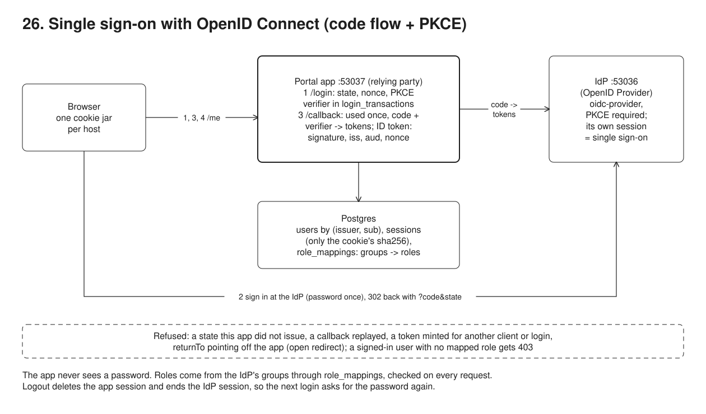

# 26. Single sign-on with OpenID Connect



**Pain: every app keeps its own passwords, and a hand-rolled login trusts whatever comes back.** Members, employer HR staff and the IT team each have one more password per app, nobody can switch an account off in one place, and roles are granted by hand in each app. When an app does delegate login, the first version takes the `code` from the redirect and the claims from the token without checking which browser started the login, whether the code was already used, who the token was minted for, or whether it was altered.

**Reach for it when** people already have an account in an identity provider (Entra ID, Keycloak, Okta, an organisation's own IdP) and the app should sign them in through it, with roles derived from groups the IdP manages, and several apps should share one sign-in.

**Do not reach for it when** the caller is a machine, not a person: use the client credentials grant or mTLS. The app is a single-page or mobile app with no server side: the flow is the same but the client is public (no secret) and the tokens live on the device, so put a backend-for-frontend in front if you can. The app has a handful of local users and no IdP to delegate to: passwords with a second factor, or passkeys, are simpler than running an IdP.

Two processes and a client: an OpenID Provider (`src/idp.ts`, `oidc-provider`, its own process on :53036, reached as `127.0.0.1`) with four accounts, and a member portal (`src/app.ts`, Express on :53037, reached as `localhost`) that uses `openid-client` as the relying party and keeps users, role mappings, login transactions and sessions in Postgres. The demo (`src/demo.ts`) plays the browsers with `fetch` and a cookie jar per host (`src/browser.ts`), follows every redirect by hand and logs each hop. The two hostnames keep the IdP's cookies and the app's cookies apart, as on two real sites.

## Run

One shot with proof: `./run-26-sso.sh` from the repo root (log in [`../logs/26-sso.log`](../logs/26-sso.log)).

By hand, from this folder (ports: Postgres 55456, HTTP 53036 IdP, 53037 app):

```sh
docker compose up -d --wait
npm i
npm run setup
npm run idp      # :53036
npm run app      # :53037, after the IdP (it reads the discovery document at start)
# then open http://localhost:53037/me in a browser and sign in as alice / alice-pw (also bob, carol, dave)
npm run demo     # starts both itself (stop the two above first)
```

The app's routes:

```
GET  /login?returnTo=        state, nonce, PKCE verifier stored in login_transactions -> 302 to the IdP
GET  /callback               one-time transaction, code + verifier -> tokens, ID token checked, user upserted, session cookie
GET  /me                     role member: the member's own record
GET  /employers/:code/members  role employer-admin of :code, or staff
GET  /admin/users            role staff
POST /logout                 session deleted -> 303 to the IdP's end_session_endpoint
```

## Files

- `src/app.ts` the relying party: discovery, login transaction, callback with `authorizationCodeGrant` (state, PKCE, nonce, signature), user provisioning, session cookie, role checks, logout.
- `src/idp.ts` the provider: one confidential client, PKCE required, a `portal` scope with `groups` and `member_no`, a login page, no consent screen for this first-party client, RP-initiated logout.
- `src/browser.ts` a cookie jar per host and a redirect follower that logs each hop.
- `src/demo.ts` the 8 steps and their checks; `src/config.ts` ports, URLs, client credentials; `src/setup.ts` the tables.

## Concepts

- **Relying party and OpenID Provider**: the app (relying party, RP) never sees a password. It sends the browser to the IdP (OpenID Provider, OP), which authenticates the person and sends the browser back with a short-lived authorization code. The app then calls the IdP's token endpoint directly, with its client secret, and receives an ID token (who signed in) and an access token.
- **Discovery**: the app reads `/.well-known/openid-configuration` at start and takes the endpoints, the signing keys (`jwks_uri`) and the supported methods from it. Only the issuer URL, the client id and the secret are configured.
- **Authorization code flow with PKCE**: before redirecting, the app makes a random `code_verifier`, keeps it server-side and sends only its SHA-256 (`code_challenge`, `S256`). Redeeming the code requires the verifier, so a code that leaks (from a log, a proxy, a browser history, a malicious app registered on the same redirect) is useless on its own. The IdP here requires PKCE even from this confidential client, as OAuth 2.1 and the OAuth security BCP (RFC 9700) recommend.
- **State**: a random value the app stores with the login and the IdP echoes back. A callback whose state the app did not issue is rejected, so an attacker cannot make a victim's browser complete the attacker's login (login CSRF).
- **Nonce**: a random value sent in the authorization request that the IdP copies into the ID token. The app accepts the ID token only if it carries the nonce of this login, so a token minted for another login cannot be injected.
- **Login transaction**: state, nonce, verifier and `returnTo` are a row in `login_transactions`, found through an HttpOnly `login_tx` cookie scoped to `/callback` and deleted as it is read (`DELETE ... RETURNING`). A callback is therefore usable once, and only in the browser that started it. A login abandoned at the IdP never reaches the callback; its row expires after 10 minutes and the next `/login` deletes it. `returnTo` is resolved against the app's origin the way the browser will resolve the redirect (`/\evil.example` and `//evil.example` both name another host) and kept, as path and query, only if it stays on the app; anything else becomes `/`, so the login cannot be turned into an open redirect.
- **ID token validation**: a JWT signed by the IdP. The app checks the signature against the key from `jwks_uri` (`kid`), `iss` (this IdP), `aud` (this client), `exp` and `iat`, and the nonce. Over TLS from the token endpoint the signature check is optional (the TLS connection authenticates the IdP); the demo runs over plain HTTP, so `enableNonRepudiationChecks` turns it on.
- **Session cookie**: after the callback the app creates its own session: a random 256-bit id in an `HttpOnly; SameSite=Lax` cookie (add `Secure` over HTTPS), with only its SHA-256 stored in Postgres, so a database leak does not leak live sessions. A new id is issued at every login (no session fixation). The ID token is kept with the session for logout and is never in a cookie, but it does reach the browser once: as `id_token_hint` in the logout redirect to the IdP, so it appears in that URL and in the browser history (it identifies the user to the IdP, it does not grant access to the app).
- **Single sign-on**: the IdP has its own session cookie. When an app (or a second app) sends the browser to the IdP again, the IdP answers at once with a new code, without asking for the password.
- **Roles from a claim**: the IdP sends `groups` (and `member_no` for members) in a custom `portal` scope. `role_mappings` in Postgres turns groups into app roles: `member`, `employer-admin` of one employer, `staff`. The mapping is evaluated on every request, so changing it takes effect without a new login. Authenticated without a mapped role is 403, not a redirect to login, and an `employer-admin` is checked against the employer in the URL as well as the role.
- **Just-in-time provisioning**: a user row is upserted at each login, keyed by `(issuer, sub)`, never by email: `sub` is the IdP's stable id, an email can change or be reused.
- **Logout**: the app deletes its session row (a replayed cookie is then worthless), then sends the browser to the IdP's `end_session_endpoint` with `id_token_hint` and `post_logout_redirect_uri` (RP-initiated logout); the IdP ends its own session, so the next login asks for the password again.
- **Trade-offs**: the IdP becomes a dependency of every login, so its availability is now yours. Logout only reaches the apps the browser passes through; other apps' sessions live until they expire unless you add back-channel or front-channel logout, and this sample's logout ends only the current app session (other sessions of the same user expire on their own; a "sign out everywhere" deletes all of the user's rows). The IdP here keeps its state in memory (oidc-provider says so at start); a real one uses a persistent adapter. Groups in the ID token grow with the number of groups (Entra ID switches to an overage claim past 200); map few, coarse groups. Roles are checked at login and per request against the mapping, but group changes at the IdP only arrive at the next login.

## Proof (`logs/26-sso.log`)

Alice signs in. The authorization request carries state, nonce and the S256 code challenge, never the verifier; the IdP asks for her password, then redirects back with a code; the app sets its own HttpOnly session cookie:

```
   alice: GET localhost:53037/login?returnTo=/me -> 302 -> 127.0.0.1:53036/auth?redirect_uri=http://localhost:53037/callback&scope=openid ema...&state=cojUcQbnDK...&nonce=5rmgg2e4xB...&code_challenge=rkipKjgzec...&code_challenge_method=S256&client_id=member-portal&response_type=code [set-cookie: login_tx (HttpOnly)]
   alice: GET 127.0.0.1:53036/auth?redirect_uri=http://localhost:53037/callback&scope=openid ema...&state=cojUcQbnDK...&nonce=5rmgg2e4xB...&code_challenge=rkipKjgzec...&code_challenge_method=S256&client_id=member-portal&response_type=code -> 303 -> 127.0.0.1:53036/interaction/<uid> [set-cookie: _interaction (HttpOnly), _interaction.sig (HttpOnly), _interaction_resume (HttpOnly), _interaction_resume.sig (HttpOnly)]
   alice: GET 127.0.0.1:53036/interaction/<uid> -> 200
   alice: POST 127.0.0.1:53036/interaction/<uid>/login -> 303 -> 127.0.0.1:53036/auth/<uid>
   alice: GET 127.0.0.1:53036/auth/<uid> -> 303 -> localhost:53037/callback?code=99ikucdi_f...&state=cojUcQbnDK...&iss=http://127... [set-cookie: _interaction_resume (HttpOnly), _interaction_resume.sig (HttpOnly), _session (HttpOnly), _session.sig (HttpOnly)]
   alice: GET localhost:53037/callback?code=99ikucdi_f...&state=cojUcQbnDK...&iss=http://127... -> 302 -> localhost:53037/me [set-cookie: login_tx, sid (HttpOnly)]
   alice: GET localhost:53037/me -> 200
   alice /me -> 200 {"member_no":"M0001","employer":"acme","name":"Alice Martin","address":"1 rue des Lilas, Lyon"}
   app cookie sid is opaque (43 chars), HttpOnly, SameSite=Lax; Postgres stores only its sha256. Login transactions left: 0
```

The ID token, and the same validation run on modified copies: changing the groups breaks the signature, another audience and a later time are refused:

```
   header: {"alg":"RS256","kid":"idp-key-1"}
   claims: {"iss":"http://127.0.0.1:53036","aud":"member-portal","sub":"alice","nonce":"5rmgg2e4xB...","groups":["portal-members"],"member_no":"M0001","lifetime_s":300}
   the token as issued                                        -> valid
   groups changed to it-staff, original signature             -> rejected: signature verification failed
   presented to another app (audience other-app)              -> rejected: unexpected "aud" claim value
   presented 10 minutes later                                 -> rejected: "exp" claim timestamp check failed
```

Single sign-on: with the app session gone but the IdP session alive, the IdP answers with a code at once:

```
   alice: GET localhost:53037/login?returnTo=/me -> 302 -> 127.0.0.1:53036/auth?redirect_uri=http://localhost:53037/callback&scope=openid ema...&state=6sZ8IF3PU5...&nonce=5xJiFFzz_h...&code_challenge=4rsrAQYJD5...&code_challenge_method=S256&client_id=member-portal&response_type=code [set-cookie: login_tx (HttpOnly)]
   alice: GET 127.0.0.1:53036/auth?redirect_uri=http://localhost:53037/callback&scope=openid ema...&state=6sZ8IF3PU5...&nonce=5xJiFFzz_h...&code_challenge=4rsrAQYJD5...&code_challenge_method=S256&client_id=member-portal&response_type=code -> 303 -> localhost:53037/callback?code=HeyCV6rWBT...&state=6sZ8IF3PU5...&iss=http://127... [set-cookie: _session (HttpOnly), _session.sig (HttpOnly)]
   alice: GET localhost:53037/callback?code=HeyCV6rWBT...&state=6sZ8IF3PU5...&iss=http://127... -> 302 -> localhost:53037/me [set-cookie: login_tx, sid (HttpOnly)]
   alice: GET localhost:53037/me -> 200
   password asked: false
```

Roles from the `groups` claim: each user sees only the routes their mapped role allows; dave is signed in but has no mapped role, so everything is 403:

```
   alice GET /me                        -> 200 {"member_no":"M0001","employer":"acme","name":"Alice Martin","address":"1 rue des Lilas, Lyon"}
   alice GET /employers/acme/members    -> 403 {"error":"forbidden","need":["employer-admin","staff"],"have":["member"],"groups":["portal-members"]}
   alice GET /employers/globex/members  -> 403 {"error":"forbidden","need":["employer-admin","staff"],"have":["member"],"groups":["portal-members"]}
   alice GET /admin/users               -> 403 {"error":"forbidden","need":["staff"],"have":["member"],"groups":["portal-members"]}
   bob   GET /me                        -> 403 {"error":"forbidden","need":["member"],"have":["employer-admin"],"groups":["acme-hr"]}
   bob   GET /employers/acme/members    -> 200 [{"member_no":"M0001","name":"Alice Martin"},{"member_no":"M0002","name":"Erin Laurent"}]
   bob   GET /employers/globex/members  -> 403 {"error":"forbidden","detail":"employer-admin of acme cannot read globex"}
   bob   GET /admin/users               -> 403 {"error":"forbidden","need":["staff"],"have":["employer-admin"],"groups":["acme-hr"]}
   carol GET /me                        -> 403 {"error":"forbidden","need":["member"],"have":["staff"],"groups":["it-staff"]}
   carol GET /employers/acme/members    -> 200 [{"member_no":"M0001","name":"Alice Martin"},{"member_no":"M0002","name":"Erin Laurent"}]
   carol GET /employers/globex/members  -> 200 [{"member_no":"M0003","name":"Frank Girard"}]
   dave  GET /me                        -> 403 {"error":"forbidden","need":["member"],"have":[],"groups":["marketing"]}
   dave  GET /employers/acme/members    -> 403 {"error":"forbidden","need":["employer-admin","staff"],"have":[],"groups":["marketing"]}
   dave  GET /employers/globex/members  -> 403 {"error":"forbidden","need":["employer-admin","staff"],"have":[],"groups":["marketing"]}
   dave  GET /admin/users               -> 403 {"error":"forbidden","need":["staff"],"have":[],"groups":["marketing"]}
```

The rejected cases: a forged state, a replayed callback and a replayed code, an intercepted code without the verifier (the real browser can still use it afterwards), an ID token minted for another nonce, and a `returnTo` that the browser would resolve to another host (the login succeeds but lands on `/`):

```
   a) the callback carries a state the app did not issue (an attacker's callback link)
     state -> {"error":"login rejected","detail":"invalid response encountered: unexpected \"state\" response parameter value"}
   b) the genuine callback, then the same URL again (a replay from history or a log)
     replay -> {"error":"no login in progress in this browser (expired, already used, or started elsewhere)"}
     the same code redeemed again at the token endpoint, with the client secret and the right verifier -> 400 {"error":"invalid_grant","error_description":"grant request is invalid"}
   c) an intercepted code, redeemed by someone who has the client secret but not the verifier
     without code_verifier -> 400 {"error":"invalid_grant","error_description":"grant request is invalid"}
     with a guessed code_verifier -> 400 {"error":"invalid_grant","error_description":"grant request is invalid"}
   d) the authorization request is altered to carry another nonce (an ID token minted for another login)
     nonce -> {"error":"login rejected","detail":"unexpected JWT claim value encountered: unexpected ID Token \"nonce\" claim value"}
   e) a login link whose returnTo points to another site (the login used as an open redirect); alice's browser, already signed in at the IdP
     returnTo=/\evil.example    -> signed in, lands on http://localhost:53037/
     returnTo=//evil.example    -> signed in, lands on http://localhost:53037/
     returnTo=/.//evil.example  -> signed in, lands on http://localhost:53037/
```

Logout: the app session row is deleted, the IdP ends its session after a confirmation form, and the next login asks for the password again:

```
   alice: POST localhost:53037/logout -> 303 -> 127.0.0.1:53036/session/end?id_token_hint=eyJhbGciOi...&post_logout_redirect_uri=http://localhost:53037/logged-out&client_id=member-portal [set-cookie: sid]
   alice: GET 127.0.0.1:53036/session/end?id_token_hint=eyJhbGciOi...&post_logout_redirect_uri=http://localhost:53037/logged-out&client_id=member-portal -> 200 [set-cookie: _session (HttpOnly), _session.sig (HttpOnly)]
   alice: POST 127.0.0.1:53036/session/end/confirm -> 303 -> localhost:53037/logged-out [set-cookie: _session (HttpOnly), _session.sig (HttpOnly)]
   alice: GET localhost:53037/logged-out -> 200
   the old sid cookie replayed: GET /me -> 302 /login?returnTo=%2Fme
   signing in again: password asked: true
```

## Origins and further reading

- Spec: OpenID Connect Core 1.0, OpenID Foundation, 2014 (ID token, nonce, ID token validation). https://openid.net/specs/openid-connect-core-1_0.html
- Spec: OpenID Connect Discovery 1.0, OpenID Foundation, 2014. https://openid.net/specs/openid-connect-discovery-1_0.html
- Spec: OpenID Connect RP-Initiated Logout 1.0, OpenID Foundation, 2022. https://openid.net/specs/openid-connect-rpinitiated-1_0.html
- RFC: 6749 "The OAuth 2.0 Authorization Framework" (authorization code grant, state), 2012. https://www.rfc-editor.org/rfc/rfc6749
- RFC: 7636 "Proof Key for Code Exchange by OAuth Public Clients" (PKCE), 2015. https://www.rfc-editor.org/rfc/rfc7636
- RFC: 9700 "Best Current Practice for OAuth 2.0 Security", 2025 (PKCE for every client, code replay, mix-up and injection attacks). https://www.rfc-editor.org/rfc/rfc9700
- RFC: 7519 "JSON Web Token (JWT)", 2015. https://www.rfc-editor.org/rfc/rfc7519
- Docs: `oidc-provider`, Filip Skokan (the OpenID Provider used here). https://github.com/panva/node-oidc-provider
- Docs: `openid-client`, Filip Skokan (the relying party library used here). https://github.com/panva/openid-client
- Docs: OWASP Session Management Cheat Sheet (cookie attributes, rotation on login). https://cheatsheetseries.owasp.org/cheatsheets/Session_Management_Cheat_Sheet.html
