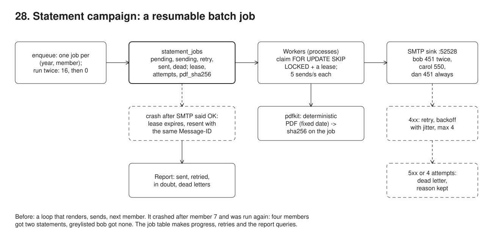
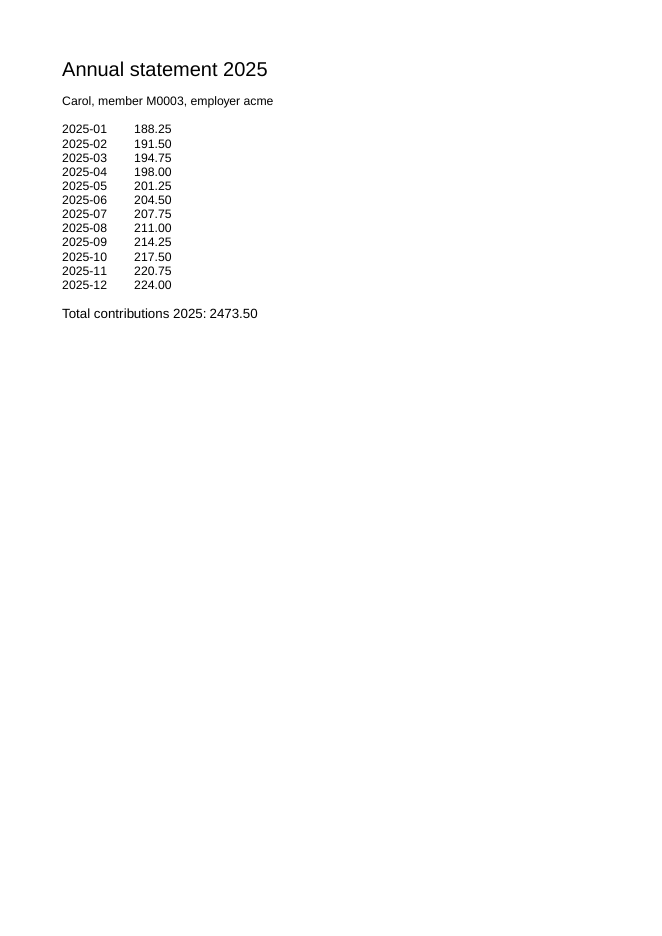

# 28. Yearly statement campaign, a resumable batch job



**Pain: a yearly mail-out that sends twice to some members and never to others.** The first version is a loop: render a PDF, send it, next member. It crashes at member 7 and is run again, so members 1 to 7 get a second statement. A greylisted mailbox answers `451 try again later`, the loop logs it and moves on, and that member never gets one. Afterwards nobody can say who received what, or why someone did not.

**Reach for it when** one job performs the same side effect for many people (statements, notices, invoices, reminders, account migrations), it runs longer than a process can be trusted to stay up, and each person must get it once, with the exceptions listed and explained.

**Do not reach for it when** the email provider offers batch sends with an idempotency key per message and a queryable delivery log: then the job table only needs the key and the provider's message id. The volume calls for a queue (SQS, RabbitMQ, Kafka): the rules stay the same (one key per member and year, a dead-letter queue, backoff), but claiming moves out of Postgres. The messages are transactional and one at a time (a password reset): send them through an outbox (09).

A campaign table `statement_jobs` with one row per (year, member) and workers (`src/worker.ts`), each a separate process, that claim due rows with `FOR UPDATE SKIP LOCKED` and a lease, render a PDF statement with pdfkit, send it with nodemailer and record the outcome in the same row. The SMTP server is a sink built on the `smtp-server` package (`src/sink.ts`, port 52528) inside the demo process, with scripted faults: bob is greylisted twice, carol's mailbox is unknown (550), dan's server answers 451 every time.

## Run

One shot with proof: `./run-28-campaign.sh` from the repo root (log in [`../logs/28-campaign.log`](../logs/28-campaign.log)).

By hand, from this folder (ports: Postgres 55458, SMTP sink 52528):

```sh
docker compose up -d --wait
npm i
npm run setup                     # 16 members, 12 contributions each for 2025
npm run sink                      # in another terminal: the SMTP sink on :52528
npm run campaign -- enqueue       # one job per member for 2025
npm run campaign -- dry-run 3     # 3 sample PDFs in out/, nothing sent
WORKER=A RATE=5 npm run worker    # run one or several, stop and restart them at will
npm run campaign -- report
npm run demo                      # the whole scenario, with its own sink (stop the one above first; on a fresh database)
```

## Files

- `src/worker.ts` claim (`UPDATE ... FROM (SELECT ... FOR UPDATE SKIP LOCKED)`, lease, attempt count), in-doubt takeover of an expired lease, throttle, send, outcome fenced on `locked_by`, backoff with jitter, dead letter; `CRASH_ON` kills it after SMTP accepted a given member.
- `src/campaign.ts` `enqueue` (idempotent on year + member), `dryRun` (stable sample, files only), `report`.
- `src/statement.ts` the statement data, a deterministic PDF (fixed creation date, uncompressed) and `pdfText` to read it back.
- `src/mailer.ts` the transport, the stable `Message-ID` per year and member, and 4xx-versus-5xx classification.
- `src/sink.ts` the SMTP sink with scripted faults; `src/naive.ts` the loop that shows the pain.
- `src/demo.ts` the 8 steps and their checks; `src/setup.ts` the tables and seed.
- `out/` the dry-run sample PDFs from the last run.
- `screenshots/statement-2025-M0003.png` the first page of one generated statement, rendered by `run-28-campaign.sh` with `tools/render.mjs`.

## Concepts

- **The job table is the campaign**: `statement_jobs` has one row per member and year with a status (`pending`, `sending`, `retry`, `sent`, `dead`), the attempt count, the next attempt time, the lease, the last error and the hash of the PDF sent. Progress, resumption and the final report are queries on it; a process that dies loses nothing but the job it held.
- **Idempotency on member and year**: the primary key `(year, member_id)` makes creating the campaign idempotent (`ON CONFLICT DO NOTHING`, run twice: 16 then 0 jobs), and a job in `sent` is never claimed again, so restarting the batch, or a cron firing twice, sends nothing twice.
- **Claim with `FOR UPDATE SKIP LOCKED`**: `UPDATE ... FROM (SELECT ... WHERE due ... LIMIT 1 FOR UPDATE SKIP LOCKED)` picks one due job and marks it `sending` in one statement. Concurrent workers skip rows another worker holds instead of waiting on them, so they spread the work without coordination (worker B and C in the run).
- **Lease, not a long transaction**: the claim commits at once and sets `locked_until`; the SMTP call happens outside any transaction. A job whose worker died stays `sending` until the lease expires, then any worker may take it over. Every outcome is written `WHERE locked_by = me`, so a worker that was too slow and lost its lease cannot overwrite the new owner's result (the fencing idea of 19).
- **The in-doubt window**: SMTP accepted the message, then the worker died before recording it. No database can close that gap, because the send is not part of its transaction. The sample chooses at-least-once: the job is taken over and resent with the same `Message-ID` (`<statement-2025-M0007@portal.example>`), recorded as `in_doubt`, so the duplicate is countable and the receiving side can recognise it. For a payment instruction you would choose the other side: park the job for a person to check the mail log.
- **Retries with backoff and jitter**: a 4xx reply or a network error is transient; the job goes to `retry` with `next_attempt_at = now() + base * 2^(attempt-1) * random(0.5..1)`, up to 4 attempts. A 5xx reply is a final answer and goes straight to `dead`. Jitter keeps a batch of greylisted addresses from all coming back in the same instant.
- **Dead-letter list**: jobs that are `dead` keep their last error; the report lists them for a person to act on. Fixing the cause (carol's address) and requeueing that one job sends it without touching anything else.
- **Throttling**: each worker spaces its sends by `1000 / RATE` ms, measured from the start of each SMTP attempt; two workers at 5/s give 10/s in total, and the run checks that no 1-second window held more than 10 attempts. A global limit across any number of workers needs a shared counter (a token bucket row, or the provider's own rate limit answered with 4xx).
- **Dry run on a sample**: renders the PDFs of three members chosen by `md5(member_no || year)` (a stable sample, the same each run), writes them to `out/` and prints what would be sent, with no SMTP connection and no job touched. A person checks them before starting the batch.
- **Deterministic documents**: the PDF has a fixed creation date and uncompressed streams, so the same data gives the same bytes. The sha256 stored on the job identifies exactly what was sent, and matches the sample rendered in the dry run (carol's `706d110ececb`). The demo reads the text back from the PDF to check the total.
- **Campaign report**: per status and employer, first-try versus retried, in-doubt resends, and each dead letter with its reason: what the business asks the day after.
- **Trade-offs**: polling the table costs a query per idle worker every few hundred ms; `LISTEN/NOTIFY` or a queue removes that at scale. The lease must be longer than the slowest send, or a live worker loses its job and the work is done twice (fenced, so the current lease holder's outcome counts and the slow worker logs its lost lease and moves on, but the mail is sent twice). The in-doubt resend can still produce a duplicate; only the receiving side or the provider can remove it. Attachments mean personal data in transit and in mailboxes: many portals send a notification with a link to the statement behind the login instead.

## Proof (`logs/28-campaign.log`)

The naive loop: crashed at M0007, run again: four members got two statements, bob never got his (greylisted on both runs), carol and dan neither, and nothing records it (abridged):

```
   [naive] M0001 alice@acme.example: sent
   [naive] M0002 bob@acme.example: Can't send mail - all recipients were rejected: 451 4.7.1 greylisted, try again later (logged, skipped)
   [naive] M0003 carol@acme.example: Can't send mail - all recipients were rejected: 550 5.1.1 mailbox unknown (logged, skipped)
   [naive] M0004 dan@acme.example: Can't send mail - all recipients were rejected: 451 4.3.0 mailbox temporarily unavailable (logged, skipped)
   [naive] M0005 erin@acme.example: sent
   [naive] M0006 frank@acme.example: sent
   [naive] M0007 grace@globex.example: sent
   [naive] crash (SIGKILL)
   run 1 -> SIGKILL
   ...
   run 2 -> exit 0
   SMTP sink received 17 messages: alice x2, erin x2, frank x2, grace x2, heidi x1, ivan x1, judy x1, ken x1, lena x1, mike x1, nina x1, oscar x1, paula x1
```

The campaign is created once, and the dry run renders real PDFs without sending (text read back from one of them):

```
   enqueue 2025: 16 jobs created; again: 0
   would send to ken@globex.example: "Your 2025 annual statement", Message-ID <statement-2025-M0011@portal.example>, out/statement-2025-M0011.pdf (3065 bytes, sha256 87bf01be6256)
   would send to judy@globex.example: "Your 2025 annual statement", Message-ID <statement-2025-M0010@portal.example>, out/statement-2025-M0010.pdf (3074 bytes, sha256 2d23bfc4dd27)
   would send to carol@acme.example: "Your 2025 annual statement", Message-ID <statement-2025-M0003@portal.example>, out/statement-2025-M0003.pdf (3053 bytes, sha256 706d110ececb)
   text read back from out/statement-2025-M0011.pdf:
     | Annual statement 2025
     | Ken, member M0011, employer globex
     | Total contributions 2025: 4153.50
   rendering twice gives the same sha256; SMTP received 0 messages; jobs touched: 0
```

Worker A crashes after SMTP accepted M0007, before recording it; M0007 is left `sending` with A's lease:

```
   [worker A] started: 10 msg/s, lease 2000 ms, max 4 attempts, will crash after sending M0007
   [worker A] M0001 alice@acme.example   attempt 1: sent <statement-2025-M0001@portal.example>
   [worker A] M0002 bob@acme.example     attempt 1: 451 4.7.1 greylisted, try again later -> retry in 191 ms
   [worker A] M0003 carol@acme.example   attempt 1: 550 5.1.1 mailbox unknown -> dead letter (permanent)
   [worker A] M0004 dan@acme.example     attempt 1: 451 4.3.0 mailbox temporarily unavailable -> retry in 225 ms
   [worker A] M0005 erin@acme.example    attempt 1: sent <statement-2025-M0005@portal.example>
   [worker A] M0006 frank@acme.example   attempt 1: sent <statement-2025-M0006@portal.example>
   [worker A] M0007 grace@globex.example attempt 1: 250 accepted by SMTP, now crashing (SIGKILL) before recording it
   worker A -> SIGKILL
   dead      1  M0003
   pending   9  M0008,M0009,M0010,M0011,M0012,M0013,M0014,M0015,M0016
   retry     2  M0002,M0004
   sending   1  M0007
   sent      3  M0001,M0005,M0006
   in doubt: [{"member_no":"M0007","locked_by":"A","lease_live":true}]
```

Two workers resume in parallel: nothing already sent is sent again, M0007 is taken over once the lease expires and resent with the same Message-ID, bob gets his after two 451s, dan becomes a dead letter after 4 attempts, and the throttle holds:

```
   [worker C] started: 5 msg/s, lease 2000 ms, max 4 attempts
   [worker B] started: 5 msg/s, lease 2000 ms, max 4 attempts
   [worker B] M0007 attempt 1 by worker A has no outcome (lease expired): the mail may or may not have gone; resending with the same Message-ID
   [worker B] M0007 grace@globex.example attempt 2: sent <statement-2025-M0007@portal.example>
   [worker C] M0008 heidi@globex.example attempt 1: sent <statement-2025-M0008@portal.example>
   [worker C] M0010 judy@globex.example  attempt 1: sent <statement-2025-M0010@portal.example>
   [worker B] M0009 ivan@globex.example  attempt 1: sent <statement-2025-M0009@portal.example>
   [worker C] M0011 ken@globex.example   attempt 1: sent <statement-2025-M0011@portal.example>
   [worker B] M0012 lena@initech.example attempt 1: sent <statement-2025-M0012@portal.example>
   [worker C] M0013 mike@initech.example attempt 1: sent <statement-2025-M0013@portal.example>
   [worker B] M0014 nina@initech.example attempt 1: sent <statement-2025-M0014@portal.example>
   [worker C] M0015 oscar@initech.example attempt 1: sent <statement-2025-M0015@portal.example>
   [worker B] M0016 paula@initech.example attempt 1: sent <statement-2025-M0016@portal.example>
   [worker C] M0002 bob@acme.example     attempt 2: 451 4.7.1 greylisted, try again later -> retry in 499 ms
   [worker B] M0004 dan@acme.example     attempt 2: 451 4.3.0 mailbox temporarily unavailable -> retry in 322 ms
   [worker B] M0004 dan@acme.example     attempt 3: 451 4.3.0 mailbox temporarily unavailable -> retry in 982 ms
   [worker C] M0002 bob@acme.example     attempt 3: sent <statement-2025-M0002@portal.example>
   [worker C] M0004 dan@acme.example     attempt 4: 451 4.3.0 mailbox temporarily unavailable -> dead letter (4 attempts used)
   [worker C] done: 6 sent, 1 retries scheduled, 1 dead letters
   [worker B] done: 5 sent, 2 retries scheduled, 0 dead letters
   workers B -> exit 0, C -> exit 0
   SMTP sink received 15 messages: alice x1, erin x1, frank x1, grace x2, heidi x1, judy x1, ivan x1, ken x1, lena x1, mike x1, nina x1, oscar x1, paula x1, bob x1
   grace: 2 copies, Message-IDs ["<statement-2025-M0007@portal.example>"]
   busiest 1-second window of SMTP attempts while resuming: 10 (limit 10/s); messages received before the resume: 4
```

The dead letters, carol's fixed and requeued, a rerun that sends nothing, and the final report:

```
     dead letters 2:
       M0003 carol@acme.example after 1 attempt(s): 550 5.1.1 mailbox unknown
       M0004 dan@acme.example after 4 attempt(s): 451 4.3.0 mailbox temporarily unavailable
   support corrects carol's address to carol.petit@acme.example and requeues her job
   [worker D] M0003 carol.petit@acme.example attempt 1: sent <statement-2025-M0003@portal.example>
   campaign 2025 report
     dead     1
     sent     15
     acme     5/6 sent
     globex   5/5 sent
     initech  5/5 sent
     sent on the first attempt 13, after retries 2; SMTP attempts 22; in-doubt resends 1
     dead letters 1:
       M0004 dan@acme.example after 4 attempt(s): 451 4.3.0 mailbox temporarily unavailable
```

Every attempt, by worker, for the members with a story (from the `statement_attempts` proof table):

```
 id | member_no | attempt | worker | outcome  |                                                           detail                                                            
----+-----------+---------+--------+----------+-----------------------------------------------------------------------------------------------------------------------------
  2 | M0002     |       1 | A      | retry    | 451 4.7.1 greylisted, try again later
 18 | M0002     |       2 | C      | retry    | 451 4.7.1 greylisted, try again later
 21 | M0002     |       3 | C      | sent     | 250 OK: message queued
  3 | M0003     |       1 | A      | dead     | 550 5.1.1 mailbox unknown
 23 | M0003     |       1 | D      | sent     | 250 OK: message queued
  4 | M0004     |       1 | A      | retry    | 451 4.3.0 mailbox temporarily unavailable
 19 | M0004     |       2 | B      | retry    | 451 4.3.0 mailbox temporarily unavailable
 20 | M0004     |       3 | B      | retry    | 451 4.3.0 mailbox temporarily unavailable
 22 | M0004     |       4 | C      | dead     | 451 4.3.0 mailbox temporarily unavailable
  7 | M0007     |       1 | B      | in_doubt | attempt 1 by worker A has no outcome (lease expired): the mail may or may not have gone; resending with the same Message-ID
  8 | M0007     |       2 | B      | sent     | 250 OK: message queued
```

## Screenshots

Rendered from `out/statement-2025-M0003.pdf` by `run-28-campaign.sh` (`node ../tools/render.mjs pdf`). The emails are plain text in the sink, so there is nothing to render for them.

The first page of carol's 2025 statement: twelve months of contributions and the total.



## Origins and further reading

- Docs: `SELECT ... FOR UPDATE SKIP LOCKED`, PostgreSQL 16 ("The Locking Clause"). https://www.postgresql.org/docs/16/sql-select.html#SQL-FOR-UPDATE-SHARE
- Article: "What is SKIP LOCKED for in PostgreSQL 9.5?", Craig Ringer, 2016. https://www.2ndquadrant.com/en/blog/what-is-select-skip-locked-for-in-postgresql-9-5/
- Article: "Exponential Backoff And Jitter", Marc Brooker, AWS Architecture Blog, 2015. https://aws.amazon.com/blogs/architecture/exponential-backoff-and-jitter/
- Book: *Enterprise Integration Patterns*, Gregor Hohpe and Bobby Woolf, 2003 (Dead Letter Channel, Idempotent Receiver). https://www.enterpriseintegrationpatterns.com/patterns/messaging/DeadLetterChannel.html
- RFC: 5321 "Simple Mail Transfer Protocol" (4xx transient and 5xx permanent replies, retry strategy in section 4.5.4). https://www.rfc-editor.org/rfc/rfc5321
- RFC: 5322 "Internet Message Format" (`Message-ID`, section 3.6.4). https://www.rfc-editor.org/rfc/rfc5322
- Article: "How to do distributed locking", Martin Kleppmann, 2016 (leases and fencing tokens). https://martin.kleppmann.com/2016/02/08/how-to-do-distributed-locking.html
- Docs: PDFKit, the PDF generator used here. https://pdfkit.org/
- Docs: Nodemailer and its `smtp-server` package, the sender and the sink used here. https://nodemailer.com/extras/smtp-server/
