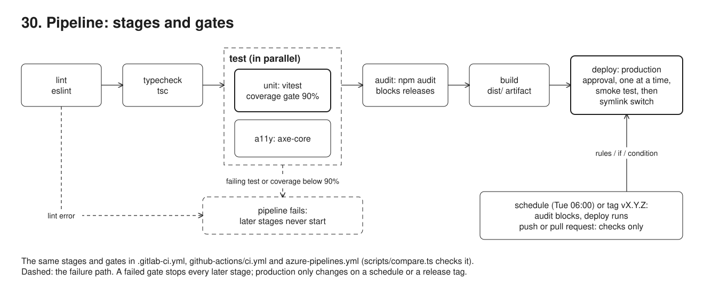
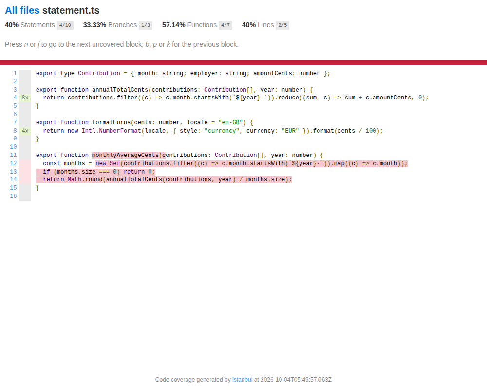
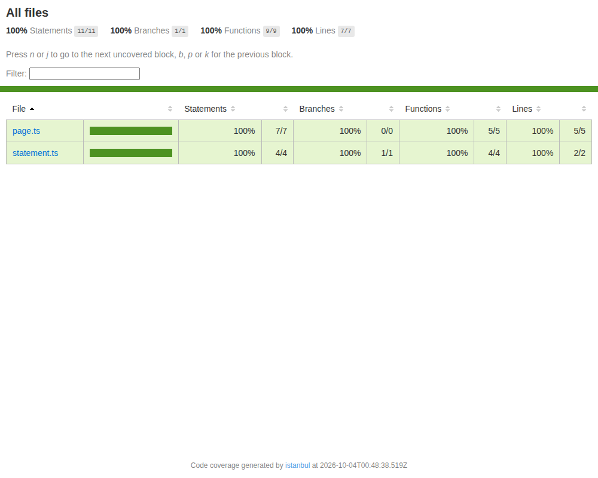

# 30. CI/CD pipeline with scheduled releases



**Pain: checks that only run when someone remembers, and releases that happen whenever someone pushes.** A lint error, a type error or an inaccessible page reaches the main branch because nobody ran the checks locally. New code arrives without a test: every test still passes, and line coverage quietly drops from 100% to 70%. A deploy goes out from a laptop on a Friday evening, nobody can say which commit is live, and a vulnerable dependency ships because the audit was "only a warning". The same pipeline is kept for a second CI platform and drifts: one copy deploys `v1.4.0-rc1`, the other does not.

**Reach for it when** more than one person changes the code, or the same person ships more than once: every change goes through the same lint, type, test, coverage, accessibility and audit gates, and production only changes on an agreed schedule or a release tag. Also when the code is mirrored on more than one CI platform (GitLab, GitHub, Azure DevOps), and the copies must stay equivalent.

**Do not reach for it when** the project is a throwaway script. You deploy many times a day behind feature flags: deploy every green main build (continuous deployment) instead of waiting for a schedule. The jobs need services (Postgres, a browser): use a runner with the Docker executor and `services:`, which `gitlab-ci-local` also runs. Coverage is already near 100% and the team writes tests first: the gate adds little; a mutation-testing run (Stryker) says more about the tests' quality.

A tiny TypeScript app (an annual statement page, `src/`) with a `.gitlab-ci.yml`: stages lint (eslint), typecheck (tsc), test (vitest with a coverage gate and a JUnit report, and axe-core on the rendered page in jsdom), audit (npm audit), build, and a deploy that only exists in scheduled or tagged pipelines. `gitlab-ci-local` runs the file on this machine with the shell executor, each job in its own copy of the project, no container images. `github-actions/ci.yml` and `azure-pipelines.yml` are the same pipeline for GitHub Actions and Azure Pipelines, kept where they do not run. A script parses all three files and checks that each job runs the same commands in the same order on the same kind of runner, that all three deploy on exactly the same triggers and block on the audit for the same ones; another validates each file against its platform's published JSON schema.

## Run

One shot with proof: `./run.sh` in this folder, or `./30-pipeline/run.sh` from the repo root (log in [`../logs/30-pipeline.log`](../logs/30-pipeline.log)).

By hand, from this folder (ports: HTTP 53040 app (npm start, hand run)):

```sh
npm i
npm run lint && npm run typecheck && npm test -- --coverage && npm run a11y && npm run audit && npm run build   # the checks, by hand
npx gitlab-ci-local --list                                                       # jobs of a push pipeline
npx gitlab-ci-local --list --variable CI_PIPELINE_SOURCE=schedule                # jobs of a scheduled pipeline (with deploy)
npx gitlab-ci-local --shell-isolation                                            # run the push pipeline (needs rsync)
npx gitlab-ci-local --shell-isolation unit                                       # one job: the unit tests and the coverage gate
npx gitlab-ci-local --shell-isolation --variable CI_PIPELINE_SOURCE=schedule --variable DEPLOY_DIR=$PWD/.deploy
npm run compare                                                                  # the three pipeline files, job by job
npm run validate                                                                 # the three files against their platforms' schemas (downloads them)
npm run demo                                                                     # the nine steps below
```

Needs `rsync` (gitlab-ci-local copies the project per job with it), `curl` (schema downloads), and `cd ../tools && npm install` once for the screenshots. gitlab-ci-local copies tracked files only: `git add` a new file before a pipeline run can see it.

## Files

- `.gitlab-ci.yml` stages, workflow rules, npm cache keyed on `package-lock.json`, the coverage gate and its `coverage:` regex, artifacts (JUnit, Cobertura coverage, a11y report, `dist/`), the audit that only blocks releases, and the deploy job (`rules`, `needs`, runner `tags`, `environment`, `resource_group`, smoke check of the new release, then the symlink switch).
- `github-actions/ci.yml` the same jobs for GitHub Actions: `needs`, `if`, `concurrency`, `continue-on-error`, `upload-artifact`; the deploy runs on a self-hosted runner on the production host (`runs-on: [self-hosted, production]`) and checks the tag against `^v[0-9]+\.[0-9]+\.[0-9]+$` first.
- `azure-pipelines.yml` the same jobs for Azure Pipelines: stages, `trigger`/`pr`/`schedules`, stage `condition`, a compile-time `continueOnError` for the audit, `Cache@2`, `PublishTestResults@2`, `PublishCodeCoverageResults@2`, `PublishPipelineArtifact@1`, and a deployment job on the `production` environment's VM resource, with the same tag check step.
- `vitest.config.ts` the coverage gate: v8 coverage of `src/` (without the test files and the `server.ts` entry point), thresholds lines, statements and functions 90%, branches 85%, reports in text, Cobertura and HTML.
- `src/statement.ts`, `src/page.ts`, `src/server.ts` the app: a statement total, the HTML page, a node:http server (`npm run build && npm start`, port 53040, or `PORT`).
- `src/statement.test.ts`, `src/page.test.ts` the vitest unit tests.
- `scripts/a11y.ts` axe-core on the rendered page in jsdom (WCAG 2.x A and AA rules that do not need layout), report in `reports/a11y.json`.
- `scripts/compare.ts` parses the three pipeline files and compares, per job, the commands in order and the runner, which triggers (schedule, push, release and non-release tags) deploy, and which make the audit blocking. It evaluates each platform's own condition syntax (GitLab rules, GitHub expressions, Azure functions such as `and()`, `startsWith()`, `variables['Build.Reason']`).
- `scripts/validate.ts` parses each file as YAML (duplicate keys are an error) and validates it with ajv against the platform's JSON schema, downloaded into `.cache/schemas/`.
- `scripts/demo.ts` drives `gitlab-ci-local`: jobs per trigger, a lint failure, a coverage-gate failure, the green pipeline, a scheduled deploy, a tagged deploy, the comparison of the three files (and of two drifted copies), the schema validation (and five typos it catches).
- `diagrams/build.mjs` draws `diagrams/overview.svg` and `.excalidraw`.
- `eslint.config.js`, `tsconfig.json`, `tsconfig.build.json` lint rules, the typecheck (no emit) and the build (emits `dist/`).
- `reports/junit.xml`, `reports/coverage/` (HTML and `cobertura-coverage.xml`), `reports/a11y.json` the reports of the last pipeline run, and `screenshots/` the coverage report when the gate failed and when it passed, all committed. `dist/`, `.npm/`, `.gitlab-ci-local/`, `.deploy/` and `.cache/` are build output and caches, left out.

## Concepts

- **Pipeline as code**: the pipeline is a file in the repository, reviewed and versioned with the code it checks. `gitlab-ci-local` runs that same file locally, so a pipeline change can be tried before it is pushed.
- **Stages and fail fast**: jobs in a stage run in parallel (`unit` and `a11y`), stages run in order, and a failed job stops the later stages. The cheap checks go first: a lint error fails in under 10 s instead of after the build. The order also documents intent: tsc accepts `age: any` and `==`, eslint does not.
- **Coverage gate (test pyramid)**: the base of the test pyramid is many fast unit tests; the gate keeps it from eroding. `vitest run --coverage` measures which lines, statements, functions and branches the unit tests execute, and the thresholds in `vitest.config.ts` make vitest exit non-zero below them, which fails the job in all three platforms with no extra script. Here a function added without a test passes lint and tsc and every existing test, and still fails the pipeline: lines 70% < 90%. The thresholds live in the repository, next to the tests, not in a platform setting, so the same number applies everywhere and changes by review. Coverage says what ran, not what was checked: a test without assertions still covers lines; review the tests, or add mutation testing, for that. The report (Cobertura XML) goes to GitLab (`coverage_report`, coverage shown in the merge request diff), Azure (`PublishCodeCoverageResults@2`, the Code Coverage tab) and GitHub (an artifact).
- **Rules decide which jobs exist**: `workflow: rules` decides whether a pipeline runs at all (no duplicate branch pipeline when a merge request is open); job `rules` decide which jobs it has. A push gets every check and the build; a pipeline started by a schedule, or by a tag matching `vX.Y.Z`, also gets `deploy`. `rc-1` is a tag but not a release, so it has no deploy.
- **Scheduled releases**: a pipeline schedule (a cron in GitLab, here Tuesdays 06:00) starts a pipeline with `CI_PIPELINE_SOURCE=schedule`. Production changes in a known window that partner organisations can be told about, from whatever is on the main branch then, with every gate re-run on that exact commit.
- **A gate that only blocks releases**: the audit is `allow_failure: true` on pushes, so an advisory published overnight does not block unrelated work, and `allow_failure: false` on schedules and tags, so a known high-severity vulnerability never ships.
- **Cache versus artifacts**: the cache (`.npm/`, keyed on the hash of `package-lock.json`) is a speed-up that may be missing: every job still runs `npm ci`, which only reads it. Artifacts are outputs a later job or a person needs and must be there: `reports/junit.xml` (GitLab shows test results in the merge request), the coverage report, `reports/a11y.json`, and `dist/`, which `deploy` downloads from `build` (`needs: [build]`) instead of rebuilding, so what was tested is what ships.
- **Job isolation**: with `--shell-isolation` each job runs in its own copy of the project, as on a real runner, so one job cannot pass by reusing another job's `node_modules` or leftover files.
- **Deploy job**: `environment: production` records each deployment in GitLab's environment history; `resource_group: production` lets only one deploy run at a time; `interruptible: false` keeps a newer pipeline from cancelling it halfway. The job runs on a runner on the production host (`tags: [production]`), since it writes there. The release goes into its own directory and is smoke-tested there (its page renders) before anything points at it; only then is a symlink renamed over `current`, an atomic switch: a reader sees the old release or the new one, never half of each. A failed smoke test stops the job with `current` still on the previous release. The previous release stays on disk, so rolling back is pointing `current` back (31 does it with a runbook).
- **GitHub Actions equivalent**: stages become `needs:` between jobs, `rules` become `if:` and `on:` triggers (`schedule: cron`, tags), `resource_group` becomes `concurrency`, `allow_failure` becomes `continue-on-error`, artifacts go through `upload-artifact`/`download-artifact`, and `setup-node` caches npm. Runner tags become `runs-on` labels: the checks run on `ubuntu-latest`, a fresh VM thrown away after each job, so the deploy runs on `[self-hosted, production]`, a runner installed on the production host. GitLab's tag rule `/^v\d+\.\d+\.\d+$/` becomes a push filter `v[0-9]+.[0-9]+.[0-9]+` (filter patterns are globs, not regexes) and a first deploy step that checks the exact regex, so `v1.4.0-rc1` never deploys.
- **Azure Pipelines equivalent**: stages stay stages, each running after the previous one unless `dependsOn` says otherwise; jobs in a stage run in parallel. `rules` become `trigger`/`pr`/`schedules` (when a run starts) and stage or step `condition:` expressions on `variables['Build.Reason']` and `variables['Build.SourceBranch']` (what runs in it). Azure tag filters are wildcards (`v*`), so, as on GitHub, a step checks the exact regex. `allow_failure` depending on the trigger becomes `continueOnError: ${{ ... }}`, a template expression evaluated when the run is created (runtime `$[ ]` expressions are meant for variables and conditions). The deploy is a deployment job: `environment: production` gives the deployment history, and the environment's checks, set in the UI, not in YAML, add the approval and the exclusive lock (with `lockBehavior: sequential`). The production host is registered as the environment's VM resource (`resourceType: VirtualMachine`), so the job runs on that machine, the equivalent of a runner tag. `scripts/compare.ts` checks the three files agree, and names each difference in a drifted copy.
- **Schema validation of pipeline files**: a pipeline file that does not parse only fails once it is pushed, before any job runs. `scripts/validate.ts` checks each file locally against the JSON schema its platform publishes for editors: GitLab's `ci.json`, SchemaStore's `github-workflow.json`, and the `service-schema.json` of the Azure Pipelines VS Code extension (v1.261.1). It catches unknown keys, wrong value types and enum values, and per-task inputs on Azure (`version` instead of `versionSpec` on `NodeTool@0`); YAML parsing catches duplicate keys, which most parsers silently resolve to the last one. A schema cannot check meaning: expressions, variables, whether the environment or a task exists in the organisation. For that, use the platform's own linter: GitLab's CI Lint (`/api/v4/projects/:id/ci/lint`), Azure's "Validate" (or the pipeline preview API), `actionlint` for GitHub.
- **Trade-offs**: every job reinstalls dependencies (correct and isolated, but it is most of the run time; a job image with dependencies baked in is faster). The accessibility check runs axe in jsdom, which has no layout, so contrast and focus are not covered: run axe in a browser (21) for those. A scheduled release batches a week of changes, so a failure has more suspects than with continuous deployment. A coverage threshold invites tests written for the number; keep it a floor that catches untested code, not a target. Three pipeline files triple the maintenance: keep one as the source of truth and a comparison like `compare.ts` in CI if the others must exist. `gitlab-ci-local` imitates GitLab closely but not exactly (protected variables, runner tags and environments' approvals only exist on the server).

### GitLab CI, GitHub Actions and Azure Pipelines, side by side

| Concept | GitLab CI (`.gitlab-ci.yml`) | GitHub Actions (`github-actions/ci.yml`) | Azure Pipelines (`azure-pipelines.yml`) |
|---|---|---|---|
| Ordered stages | `stages: [lint, typecheck, test, audit, build, deploy]`, each job names its `stage:` | no stages: `needs:` between jobs | `stages:`, each `- stage:` runs after the previous one (implicit `dependsOn`) |
| Job and its commands | `lint:` with `script:` | `jobs: lint:` with `steps: - run:` | `- job: lint` with `steps: - script:` |
| Jobs in parallel | two jobs in stage `test` | two jobs with the same `needs: typecheck` | two jobs in `- stage: test` |
| Shared setup | `default: before_script:` | repeated steps (`setup-node`, `npm ci`), or a composite action | repeated steps, or a steps template file |
| When a pipeline runs | `workflow: rules:` (merge request, schedule, tag, branch without an open merge request) | `on: push: branches, tags`, `pull_request`, `schedule` | `trigger: branches, tags`, `pr:`, `schedules:` |
| Which jobs run | job `rules: - if:` (`$CI_PIPELINE_SOURCE == "schedule"`, `$CI_COMMIT_TAG =~ /^v\d+\.\d+\.\d+$/`) | job `if:` (`github.event_name`, `github.ref`) | stage `condition:` (`eq(variables['Build.Reason'], 'Schedule')`, `startsWith(variables['Build.SourceBranch'], 'refs/tags/v')`) |
| Release tag pattern | a regex in the rule | glob filter `v[0-9]+.[0-9]+.[0-9]+`, then a step checks the regex | wildcard `v*`, then a step with a `condition:` checks the regex |
| Schedule | pipeline schedule (cron, set in the UI) | `on: schedule: - cron:` | `schedules: - cron:` with `branches:` and `always: true` |
| Gate that only blocks releases | `allow_failure: true` or `false` per rule | `continue-on-error: ${{ expression }}` | `continueOnError: ${{ expression }}` (template expression; the run ends "partially succeeded") |
| Coverage gate | `npx vitest run --coverage` fails the job below the thresholds; `coverage:` regex shows the number | the same command fails the step | the same command fails the step |
| Dependency cache | `cache: key: files: [package-lock.json]`, `paths: [.npm/]` | `actions/setup-node` with `cache: npm` | `Cache@2` task, key `npm \| "$(Agent.OS)" \| package-lock.json`, `path: $(npm_config_cache)` |
| Test report | `artifacts: reports: junit:` | `upload-artifact` (or a test-report action) | `PublishTestResults@2` (Tests tab) |
| Coverage report | `artifacts: reports: coverage_report:` (Cobertura) | `upload-artifact` | `PublishCodeCoverageResults@2` (Code Coverage tab) |
| Artifacts | `artifacts: paths:`, `when: always`, `expire_in: 1 week` | `upload-artifact`, `if: always()`, `retention-days: 7` | `PublishPipelineArtifact@1`, `condition: succeededOrFailed()`; retention is a project setting |
| Artifact into the deploy | `needs: [build]` downloads `dist/` | `download-artifact` | `- download: current` with `artifact: dist` |
| Run on the production host | `tags: [production]` (a runner registered there) | `runs-on: [self-hosted, production]` | `environment: { name: production, resourceType: VirtualMachine }` (the host registered as a VM resource) |
| Deployment history | `environment: name: production` | `environment: production` | deployment job `- deployment:` with `environment:` and `strategy: runOnce: deploy:` |
| Approval before deploy | protected environment with required approvals (server setting) | environment protection rule: required reviewers (repository setting) | "Approvals" check on the environment (UI) |
| One deploy at a time | `resource_group: production` | `concurrency: production` | "Exclusive lock" check on the environment, `lockBehavior: sequential` |
| Cancel superseded runs | `interruptible: true` (`false` on deploy) | `concurrency: cancel-in-progress` | `pr: autoCancel: true`, `trigger: batch: true` |

## Proof (`logs/30-pipeline.log`)

The jobs a pipeline gets depend on what started it:

```
   lint       stage lint       allow_failure false
   typecheck  stage typecheck  allow_failure false
   unit       stage test       allow_failure false
   a11y       stage test       allow_failure false
   audit      stage audit      allow_failure true
   build      stage build      allow_failure false

   schedule    jobs: lint, typecheck, unit, a11y, audit, build, deploy; audit allow_failure false
   tag v1.4.0  jobs: lint, typecheck, unit, a11y, audit, build, deploy; audit allow_failure false
   tag rc-1    jobs: lint, typecheck, unit, a11y, audit, build; audit allow_failure false
```

A function that type-checks but breaks three lint rules, appended to `src/statement.ts` (gitlab-ci-local, like a runner, only sees tracked files), stops the pipeline at its first stage; no later job starts:

```
   lint      $ npm run lint
   lint      > .gitlab-ci-local/builds/lint/src/statement.ts
   lint      >   11:30  error  Unexpected any. Specify a different type     @typescript-eslint/no-explicit-any
   lint      >   12:9   error  'unused' is assigned a value but never used  @typescript-eslint/no-unused-vars
   lint      >   13:14  error  Expected '===' and instead saw '=='          eqeqeq
   lint      > ✖ 3 problems (3 errors, 0 warnings)
    FAIL  lint
   lint      finished in 7.2 s  FAIL 1
   pipeline finished in 7.68 s
```

A function with no test passes lint, tsc and all 8 tests, and the unit job still fails: coverage is below every threshold:

```
   unit $ npx vitest run --coverage --reporter=default --reporter=junit --outputFile.junit=reports/junit.xml
   unit >       Tests  8 passed (8)
   unit > All files     |    64.7 |    33.33 |      75 |      70 |
   unit >  statement.ts |      40 |    33.33 |   57.14 |      40 | 12-14
   unit > Statements   : 64.7% ( 11/17 )
   unit > Branches     : 33.33% ( 1/3 )
   unit > Functions    : 75% ( 9/12 )
   unit > Lines        : 70% ( 7/10 )
    FAIL  unit
   unit > ERROR: Coverage for lines (70%) does not meet global threshold (90%)
   unit > ERROR: Coverage for functions (75%) does not meet global threshold (90%)
   unit > ERROR: Coverage for statements (64.7%) does not meet global threshold (90%)
   unit > ERROR: Coverage for branches (33.33%) does not meet global threshold (85%)
   unit finished in 6.72 s  FAIL 1
```

Without that function, the whole pipeline passes, the gate at 100%; from the second job on, each restores the npm cache the previous jobs saved:

```
   typecheck imported cache '0_package-lock-b2cce7cbd90c69939344723b0eca0e399085c694' in 153 ms
   unit      >       Tests  8 passed (8)
   unit      > Statements   : 100% ( 11/11 )
   unit      > Branches     : 100% ( 1/1 )
   unit      > Functions    : 100% ( 9/9 )
   unit      > Lines        : 100% ( 7/7 )
    PASS  lint
    PASS  typecheck
    PASS  unit      100% coverage
    PASS  a11y
    PASS  audit
    PASS  build
   pipeline finished in 34 s
```

A scheduled pipeline, then a release tag, each deploy into their own directory, smoke-tested there before `current` is switched to it; `current` points at the last one and the previous one is kept:

```
   deploy    $ mkdir -p "$DEPLOY_DIR/releases/$RELEASE"
   deploy    $ cp -r dist/. "$DEPLOY_DIR/releases/$RELEASE/"
   deploy    $ echo '{"type":"module"}' > "$DEPLOY_DIR/releases/$RELEASE/package.json"
   deploy    $ printf '{"release":"%s","commit":"%s","source":"%s"}\n' "$RELEASE" "$CI_COMMIT_SHA" "$CI_PIPELINE_SOURCE" > "$DEPLOY_DIR/releases/$RELEASE/release.json"
   deploy    $ node -e "import('$DEPLOY_DIR/releases/$RELEASE/page.js').then((m) => { if (!m.statementPage('smoke', 2026, []).includes('<html lang=\"en\">')) process.exit(1); console.log('smoke ok') })"
   deploy    > smoke ok
   deploy    $ ln -sfn "releases/$RELEASE" "$DEPLOY_DIR/current.tmp" && mv -T "$DEPLOY_DIR/current.tmp" "$DEPLOY_DIR/current"
   deploy    $ echo "deployed $RELEASE to $DEPLOY_DIR/current"
   deploy    > deployed scheduled-907db30f-1002 to .deploy/current
   .deploy/current -> releases/scheduled-907db30f-1002
   current -> releases/v1.4.0, release.json {"release":"v1.4.0","commit":"907db30f513e7fb0e7b98098a6169878e34c5421","source":"push"}; previous releases/scheduled-907db30f-1002 still on disk: true
```

The three pipeline files run the same commands in the same order (the coverage flag included), on the same kind of runner, deploy on the same triggers and block on the audit for the same ones:

```
   job        gitlab stage  github needs  azure stage (after)  runner      commands
   lint       lint                        lint                 any         npm run lint
   typecheck  typecheck     lint          typecheck (lint)     any         npm run typecheck
   unit       test          typecheck     test (typecheck)     any         npx vitest run --coverage
   a11y       test          typecheck     test (typecheck)     any         npm run a11y
   audit      audit         unit, a11y    audit (test)         any         npm run audit
   build      build         audit         build (audit)        any         npm run build
   deploy     deploy        build         deploy (build)       production  mkdir, cp dist, package.json, release.json, smoke releases/$RELEASE, ln -sfn, mv -T
   deploys on: schedule yes; push main no; tag v1.4.0 yes; tag v1.4.0-rc1 no; tag v1.4 no; tag rc-1 no
   audit blocks on: schedule yes; push main no; tag v1.4.0 yes
```

A drifted Azure copy (coverage flag dropped, audit always only warning, tag check step removed, deploy on a hosted agent) is caught on every point:

```
   unit       test          typecheck     test (typecheck)     any         DIFFERENT: gitlab npx vitest run --coverage | github npx vitest run --coverage | azure npx vitest run
   deploy     deploy        build         deploy (build)       gitlab production, github production, azure any mkdir, cp dist, package.json, release.json, smoke releases/$RELEASE, ln -sfn, mv -T
   deploys on: schedule yes; push main no; tag v1.4.0 yes; tag v1.4.0-rc1 DIFFERENT (gitlab no, github no, azure yes); tag v1.4 DIFFERENT (gitlab no, github no, azure yes); tag rc-1 no
   audit blocks on: schedule DIFFERENT (gitlab yes, github yes, azure no); push main no; tag v1.4.0 DIFFERENT (gitlab yes, github yes, azure no)
```

Each file is valid YAML and valid against its platform's schema, and one typo per file is rejected:

```
   .gitlab-ci.yml         yaml ok, GitLab ci.json: valid
   github-actions/ci.yml  yaml ok, SchemaStore github-workflow.json: valid
   azure-pipelines.yml    yaml ok, azure-pipelines-vscode service-schema.json v1.261.1: valid
   (Azure schema patched: PublishCodeCoverageResults@2 inputs added (summaryFileLocation, pathToSources, failIfCoverageEmpty))
   .gitlab-ci.yml         with "when: allways": 1 schema error(s), /unit/artifacts/when must be equal to one of the allowed values
   .gitlab-ci.yml         with "stage: lint; stage: lint": yaml error: Map keys must be unique at line 34, column 3
   github-actions/ci.yml  with "run-on: ubuntu-latest": 6 schema error(s), /jobs/lint must NOT have additional properties 'run-on'
   azure-pipelines.yml    with "dependOn: build": 25 schema error(s), /stages/5 must NOT have additional properties 'dependOn'
   azure-pipelines.yml    with "inputs: { version: 22.x }": 868 schema error(s), /stages/0/jobs/0/steps/0/inputs must NOT have additional properties 'version'
```

The Azure schema check is the published editor schema, patched for one task version it lacks: it proves structure, key names, value types and task inputs, not that the run would start in an organisation (variables, environments and installed tasks are checked by the server).

## Screenshots

The coverage report the failed unit job exported: the untested function, in red.



The same report from the green pipeline.



## Origins and further reading

- Book: *Continuous Delivery*, Jez Humble and David Farley, 2010 (the deployment pipeline, build once and promote the same artifact).
- Article: "Continuous Integration", Martin Fowler, 2006, revised 2024. https://martinfowler.com/articles/continuousIntegration.html
- Article: "TestPyramid", Martin Fowler, 2012, and "The Practical Test Pyramid", Ham Vocke, 2018. https://martinfowler.com/bliki/TestPyramid.html, https://martinfowler.com/articles/practical-test-pyramid.html
- Article: "TestCoverage", Martin Fowler, 2012 (coverage finds untested code; it is not a target). https://martinfowler.com/bliki/TestCoverage.html
- Book: *Accelerate*, Nicole Forsgren, Jez Humble, Gene Kim, 2018 (deployment frequency, lead time, change failure rate, time to restore).
- Docs: GitLab CI/CD YAML syntax reference (`rules`, `workflow`, `cache`, `artifacts`, `coverage`, `needs`, `environment`, `resource_group`). https://docs.gitlab.com/ci/yaml/
- Docs: GitLab scheduled pipelines. https://docs.gitlab.com/ci/pipelines/schedules/
- Docs: GitHub Actions workflow syntax. https://docs.github.com/en/actions/reference/workflows-and-actions/workflow-syntax
- Docs: Azure Pipelines YAML schema reference (stages, jobs, deployment jobs, conditions, expressions, triggers, schedules). https://learn.microsoft.com/en-us/azure/devops/pipelines/yaml-schema/
- Docs: Azure Pipelines environments, approvals and checks, exclusive lock. https://learn.microsoft.com/en-us/azure/devops/pipelines/process/approvals
- Docs: Vitest coverage and thresholds. https://vitest.dev/guide/coverage
- Tool: gitlab-ci-local, Mads Jon Nielsen. https://github.com/firecow/gitlab-ci-local
- Schemas: GitLab `ci.json` (gitlab-org/gitlab, `app/assets/javascripts/editor/schema/ci.json`), SchemaStore `github-workflow.json`, Azure Pipelines `service-schema.json` (microsoft/azure-pipelines-vscode).
