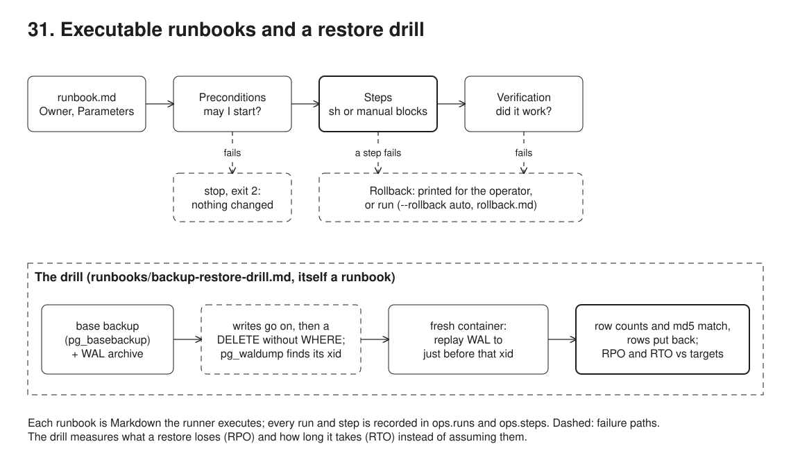

# 31. Executable runbooks, ADRs, docs-lint and a restore drill



**Pain: operations that live in one person's head, and backups nobody has restored.** The release goes fine when the person who always does it is in; when they are away, the backup is skipped, the migration runs after the restart, and nobody knows how to go back. The wiki page for the monthly data load drifted from what people actually type. A new team member cannot tell a deliberate decision from an accident, so they undo it or are afraid to touch it. And the nightly dump is "the backup" until the day someone runs `DELETE FROM contributions` without its WHERE clause: restoring that dump alone would have given back 3 of 6 contributions, 1 of 2 import batches and 2 of 3 member changes, and nobody knew how long a restore takes because nobody had done one.

**Reach for it when** a small team runs a service: releases, data loads, member requests and rollbacks are repeated by different people, some steps need a human, and every run should leave a record. The service keeps data that cannot be typed in again, and someone has to be able to say "we lose at most a minute of writes and are back within five" and prove it.

**Do not reach for it when** the procedure is fully automated and runs on every change: put it in the pipeline (30) or a deploy tool, and keep a runbook only for what happens when that fails. You need incident response at scale (paging, escalation, status pages): use an incident tool and link the runbooks from its alerts. A step is long or tricky: write it as a tested script in `ops/` and call it from the runbook. The database is a managed service with point-in-time restore (a cloud provider's PostgreSQL): the drill still applies, but its steps become the provider's "restore to a point in time" call, not `pg_basebackup` and a WAL archive of your own.

Five runbooks in Markdown in `runbooks/` (scheduled release, rollback, monthly data update, a member's change request, a backup and restore drill), each with four required sections: Preconditions, Steps, Verification and Rollback. `src/runner.ts` parses them, runs each step's fenced `sh` block, asks the operator at each `manual` block, stops at the first failure, prints the Rollback section and, with `--rollback auto`, runs it. Every run and step is recorded in Postgres (`ops.runs`, `ops.steps`). The release runbook migrates the schema, restarts a member service (node:http) and smoke-tests it; release v3 ships a bug the smoke test catches, and the rollback runbook brings v2 back. The drill takes a base backup of the Postgres container (which archives its WAL), lets the monthly load and a member request run, deletes every contribution, finds the deleting transaction in the WAL archive, restores a fresh `postgres:16` container to just before it, checks row counts and checksums, puts the rows back, and prints the achieved RPO and RTO against their targets. `docs/adr/` holds three decision records, `docs/onboarding.md` a checklist, and `src/docs-lint.ts` checks all of them.

## Run

One shot with proof: `./run-31-runbook.sh` from the repo root (log in [`../logs/31-runbook.log`](../logs/31-runbook.log)).

By hand, from this folder (ports: Postgres 55461, HTTP 53041 member service; the drill's restore container has no port):

```sh
docker compose up -d --wait
npm i
npm run docs-lint                                     # runbooks, ADRs, onboarding checklist
npm run docs-lint -- fixtures/broken-docs             # what it rejects
npm run runbook -- runbooks/scheduled-release.md --set VERSION=v1 --set MIGRATION=1 --rollback auto
npm run runbook -- runbooks/scheduled-release.md --set VERSION=v2 --set MIGRATION=2 --rollback auto
npm run runbook -- runbooks/monthly-data-update.md --set FILE=data/contributions-2026-09.csv --set PERIOD=2026-09
npm run runbook -- runbooks/user-request.md --set MEMBER_ID=1 --set NEW_EMAIL=alice@new.example --set TICKET=SUP-1042   # asks at each manual step
npm run runbook -- runbooks/scheduled-release.md --set VERSION=v3 --set MIGRATION=3 --rollback auto                    # fails, rolls back
npm run runbook -- runbooks/backup-restore-drill.md --set RPO_TARGET=60 --set RTO_TARGET=300 --rollback auto        # needs the 2026-09 load above
ops/service.sh stop
docker compose --profile drill down -v                # also removes a restore container a failed drill left
```

## Files

- `runbooks/scheduled-release.md`, `rollback.md`, `monthly-data-update.md`, `user-request.md`, `backup-restore-drill.md` the procedures.
- `src/parse.ts` reads a runbook: title, `Owner:` and `Parameters:` lines, `##` sections, `###` steps, fenced blocks (a block before a section's first step is kept apart, for docs-lint to report).
- `src/runner.ts` runs it: parameters as environment variables (SQL blocks pass them on as `psql -v` variables in a quoted heredoc, never as SQL text), `bash -euo pipefail` per block, manual confirmation (terminal, or `--yes`), stop on failure, rollback printed or run, `ops.runs` and `ops.steps`.
- `src/docs-lint.ts` the documentation checks; `fixtures/broken-docs/` a runbook and an ADR it rejects.
- `data/contributions-2026-09.csv` the monthly file; `data/contributions-2026-09-corrected.csv` a corrected re-send for the same period, which the runbook refuses until the loaded batch is rolled back; `data/contributions-2026-10.csv` the next month, loaded during the drill after the base backup.
- `docs/adr/0001-0003` decision records in Nygard's format; `docs/onboarding.md` the checklist.
- `docker-compose.yml` Postgres with WAL archiving (`archive_mode=on`, `archive_command` into the `drill` volume, `archive_timeout=60`), and the `restore` service (profile `drill`): a fresh `postgres:16` that, on first start, copies the base backup into its empty data directory and starts in recovery.
- `ops/fingerprint.sql` one line per business table: row count and an md5 of all its rows in order; two databases with the same lines hold the same data.
- `ops/migrate.ts` numbered up and down migrations from `migrations/`, recorded in `schema_migrations`.
- `ops/service.sh`, `ops/smoke.sh`, `ops/psql.sh` start and stop the service, the smoke test, psql inside the container.
- `src/app.ts` the member service; `APP_VERSION` picks v1, v2 or v3 (v3 reads a column that does not exist).
- `src/demo.ts` the seven steps and their checks.
- `diagrams/build.mjs` draws `diagrams/overview.svg` and `.excalidraw`.

## Concepts

- **Runbook**: a written procedure for a recurring operational task, with an owner and parameters. The four sections answer the operator's questions in order: may I start (Preconditions), what do I do (Steps), did it work (Verification), how do I undo it (Rollback).
- **Executable documentation**: steps are fenced `sh` blocks in the Markdown, so the document a person reads and the commands the runner executes are the same text and cannot drift apart. Parameters (`--set VERSION=v3`) become environment variables; each block runs under `bash -euo pipefail`, so any failing command fails the step.
- **Manual steps and do-nothing scripting**: a `manual` block is a step only a person can do (call the member back to verify their identity). The runner shows it and waits for a confirmation, from a terminal or `--yes`; with no operator it stops there and nothing after it runs. Manual steps stay visible in the same flow and are automated one at a time, which is how a procedure moves from a document to a script without a big rewrite.
- **Preconditions guard, rollback undoes**: a failed precondition means nothing changed (exit 2, no rollback needed): the second load of the same file stops at "not loaded before" because its sha256 is already in `import_batches`, and a corrected file for a period already loaded stops at "no batch for this period yet": replacing a verified load is a deliberate rollback of that batch first, never a side effect. A failed step or verification stops the runbook, prints its Rollback section, and with `--rollback auto` runs it. Verification and rollback are scoped to the batch (found by the file's sha256), so a rollback never deletes rows another load put there.
- **One rollback procedure**: the release's Rollback section calls `runbooks/rollback.md` through the runner, so the automatic rollback and the one an engineer runs by hand the next morning are the same tested procedure, recorded as a child run (`parent` in `ops.runs`). The drill uses the same mechanism to run the monthly load and a member request as its own child runs.
- **Release steps in a safe order**: record the running release (so rollback knows where to return), back up, migrate (additive, expand/contract as in 02, so the old version keeps working on the new schema), restart, smoke-test the few requests that prove members are served, and only then record the new release. Each migration has a `.down.sql` that removes exactly what its `.up.sql` added.
- **Run log**: `ops.runs` and `ops.steps` keep who ran what, with which parameters, how each step ended and the tail of its output: an audit trail of operations, and the place to look first after an incident.
- **Base backup and WAL archiving**: Postgres writes every change to its write-ahead log (WAL) before the data files. `pg_basebackup` copies the data directory of the running server (a base backup); `archive_command` copies each finished 16 MB WAL segment to the archive. Base backup plus archive can rebuild the database at any moment after the backup, not only at the moment of the backup, which is all a nightly `pg_dump` gives. `archive_timeout=60` ships a segment at least every minute, so losing the whole server loses at most a minute of writes.
- **Point-in-time recovery (PITR)**: a fresh server starts from the base backup with `recovery.signal`, fetches archived segments with `restore_command`, replays them, and stops at a target: a time, an LSN or, here, `recovery_target_xid` with `recovery_target_inclusive = off`, "just before this transaction commits". `recovery_target_action = 'promote'` then opens it for writes on a new timeline (2), so its WAL can never be confused with the original's.
- **Finding the transaction that lost the data**: people rarely know the exact second of an accident. `pg_waldump` reads the archived WAL; filtered on the table's file (`--relation`) and the heap records, it lists the six DELETE records and their transaction id, and the transaction's commit record gives the time. Restoring to that xid loses nothing committed before it; restoring to a time someone remembers loses or keeps the wrong seconds.
- **Restore beside, then repair**: the restore goes into a fresh container, never over the live database, and is checked before anything is trusted. For a logical accident (a bad DELETE or UPDATE) the live database is still up and has later good writes, so the lost rows are copied back from the restored copy in one transaction (`INSERT ... ON CONFLICT DO NOTHING`), rather than replacing the whole database and losing everything after the accident. For a lost server, the restored copy becomes the new primary instead.
- **Verify with row counts and checksums**: "the restore succeeded" means Postgres started; it does not mean the data is right. `ops/fingerprint.sql` gives each business table a row count and an md5 of all its rows in a fixed order; the restored copy and then the repaired live database must match the fingerprint taken before the accident, table by table.
- **RPO and RTO**: the recovery point objective is how much data, measured in time, the service may lose; the recovery time objective is how long getting it back may take. Both are targets agreed with the service owner, and both are only true if measured: the drill prints the achieved RPO (the restore reached 0.7 s before the DELETE, with no row lost) and RTO (6.2 s from finding the transaction to the rows being back) against the targets (60 s, 300 s), and fails if either is missed. The base backup alone would have reached back 9.6 s and missed every write since.
- **Restore drill**: a backup that has never been restored is a hope. The drill is itself a runbook, so it is run the same way by whoever is on call, recorded in `ops.runs`, and checked by docs-lint; run it on a schedule (each quarter, and after any change to the backup set-up) against a copy of production.
- **ADR (Architecture Decision Record)**: a short numbered file per decision that is expensive to reverse, in Michael Nygard's format: title, date, status, context, decision, consequences. Records are not edited once accepted; a new one supersedes the old, whose status links to it.
- **Onboarding checklist**: what a new team member reads and does in the first two weeks, linked to the ADRs and runbooks, ending with running each runbook under supervision (the restore drill included) and improving one.
- **docs-lint**: documentation is checked like code. Every runbook needs an owner, a parameters line, the four sections in order, and steps that each hold an `sh` or `manual` block, with no block between a section heading and its first step (the runner would never run it); every ADR needs a number matching its file name, a date, a status from a fixed list (a "Superseded by" must link to an existing record) and the three other sections; relative links must resolve. Run it in the pipeline (30).
- **Trade-offs**: shell in Markdown is harder to test than a script, so long logic belongs in `ops/`. Parameters never become SQL text: each SQL block is a quoted heredoc (`<<'SQL'`, so bash expands nothing in it) and gets its values as `psql -v` variables, read as `:'email'` (quoted by psql) or `:'id'::int` (anything but a number fails), so `bob.o'brien@example.org` is stored as typed. `psql -c` does not expand variables, which is why those statements go through stdin. Down migrations drop columns, so data written to them since the release is lost on rollback; past that point, restore the backup instead (the rollback runbook says so). The run log lives in the database it operates on; in production keep it elsewhere, or a failed restore also loses its record. The WAL archive here is a Docker volume on the same machine as the database: in production it goes to other storage (object storage, another site), with retention and a tool that manages it (pgBackRest, WAL-G, Barman), or the archive dies with the server. The drill's database is tiny, so its RTO says little about a 500 GB one: measure on a production-sized copy, where replay time dominates.

## Proof (`logs/31-runbook.log`)

docs-lint rejects a runbook with missing sections and a block outside any step, and an ADR without a status, and passes the real documents, the drill included:

```
   fixtures/broken-docs/runbooks/restore-backup.md: no 'Parameters:' line (write 'Parameters: none')
   fixtures/broken-docs/runbooks/restore-backup.md: no '## Preconditions' section
   fixtures/broken-docs/runbooks/restore-backup.md: '## Verification' has no '### step'
   fixtures/broken-docs/runbooks/restore-backup.md: '## Verification' has a sh block outside any '### step' (it never runs)
   fixtures/broken-docs/runbooks/restore-backup.md: no '## Rollback' section
   fixtures/broken-docs/docs/adr/0004-use-a-message-queue.md: no '# N. Title' heading
   fixtures/broken-docs/docs/adr/0004-use-a-message-queue.md: no 'Date: YYYY-MM-DD' line
   fixtures/broken-docs/docs/adr/0004-use-a-message-queue.md: no '## Status' section
   fixtures/broken-docs/docs/adr/0004-use-a-message-queue.md: no '## Consequences' section
   fixtures/broken-docs/docs/onboarding.md: missing: every team needs an onboarding checklist
   real docs: runbooks/backup-restore-drill.md, runbooks/monthly-data-update.md, runbooks/rollback.md, runbooks/scheduled-release.md, runbooks/user-request.md, docs/adr/0001-record-architecture-decisions.md, docs/adr/0002-executable-runbooks.md, docs/adr/0003-scheduled-releases-with-down-migrations.md, docs/onboarding.md: 0 problem(s)
```

Release v3 migrates and restarts, the smoke test gets a 500, and the rollback runbook brings back v2 and schema 2 (abridged):

```
    3. Migrate the schema
      | migrate up 003_statement_preference
      | schema version 3
      [ok] 2.0s
    4. Restart the service on the new version
      | stopped pid 17475
      | started v3 (pid 28856)
      [ok] 2.8s
    5. Smoke test
      | GET /health -> {"status":"ok","version":"v3"}
      | GET /members/1 -> {"error":"column \"statement_pref\" does not exist"} 500
      | member page is broken
      [FAILED (exit 1)] 0.2s
  stopped at "5. Smoke test". Rollback (runbooks/scheduled-release.md):
    1. Roll back to the recorded release
      $ npx tsx src/runner.ts runbooks/rollback.md --operator "$RUNBOOK_OPERATOR" --parent "$RUNBOOK_RUN_ID"
  rollback
    1. Roll back to the recorded release
      | runbook #10: Roll back a release (runbooks/rollback.md), operator alice
      |     2. Migrate the schema down to the previous release
      |       | migrate down 003_statement_preference
      |       | schema version 2
      |       | GET /health -> {"status":"ok","version":"v2"}
      |       | GET /members/1 -> {"id":1,"name":"alice","email":"alice@new.example","preferred_name":null} 200
      | runbook #10: succeeded
      [ok] 7.8s
runbook #9: failed, rolled back
```

The same file a second time, then a corrected file for the same period: a precondition stops each run before anything changes, and the verified load stays as it was (abridged):

```
    1. The file is there and has not been loaded before
      | sha256 92e7a1ad1c61, batches already loaded from this file: 1
      [FAILED (exit 1)] 0.6s
runbook #4: precondition failed: nothing was changed
runbook #5: Monthly data update (runbooks/monthly-data-update.md) FILE=data/contributions-2026-09-corrected.csv PERIOD=2026-09, operator alice
    3. No batch is loaded for this period yet
      | already loaded for 2026-09: batch 1 from data/contributions-2026-09.csv
      [FAILED (exit 1)] 0.3s
runbook #5: precondition failed: nothing was changed
   => exit 2
   contributions: 3 rows, total 1102.75, 1 batch
```

Without an operator, the member request stops at its first manual step and prints its rollback; nothing ran after it:

```
    1. Verify the member's identity
      | MANUAL: Call the member back on the phone number their employer holds (not the one in the email) and confirm the request.
      [not confirmed] 0.0s
  stopped at "1. Verify the member's identity". Rollback (runbooks/user-request.md):
runbook #6: failed, rollback printed for the operator
```

Parameters reach SQL as psql variables, so a quote in an address is data: the verification reads it back and the audit row has it as typed:

```
      | stored bob.o'brien@example.org, changes on SUP-1043: 1
   member 2: {"email":"bob.o'brien@example.org","old_value":"bob@example.org","new_value":"bob.o'brien@example.org"}
```

The drill: a base backup, then the monthly load and a member request as child runs, then the fingerprint the restore must give back (abridged):

```
    1. Take a base backup
      | base backup 39M, WAL from 0/3000028
      | contributions 3 rows md5 d25894ab18ca73abdba30a7509453562
      | import_batches 1 rows md5 265e9cd468cc0d748f74966a130dd5b7
      | member_changes 2 rows md5 d4c71c66e17b65062efedee0fd981d20
      | members 3 rows md5 fdd53bb8c4a92f7c2b69157e5c1cf3c9
      | runbook #12: Monthly data update (runbooks/monthly-data-update.md) FILE=data/contributions-2026-10.csv PERIOD=2026-10, operator alice
      | runbook #13: Handle a member's change request (runbooks/user-request.md) MEMBER_ID=3 NEW_EMAIL=carol@initech.example TICKET=SUP-1050, operator alice
    3. Record the state the restore must give back
      | contributions 6 rows md5 6f763189eb96c90922bc76be499ed4aa
      | import_batches 2 rows md5 032634d8430aefab4514f47d5af5ec45
      | member_changes 3 rows md5 663c4c0b92f473c095327316a54d15bd
      | members 3 rows md5 503f67bc91fe0888777ac3fdc4a640fd
```

The DELETE, its transaction found in the WAL archive, and a fresh container recovered to just before it, on a new timeline:

```
    4. Lose data: a DELETE without its WHERE clause
      | 6 contributions before
      | 0 contributions after
    5. Find the transaction that lost the data
      | 6 DELETE records on contributions in transaction 860
      | COMMIT 2026-10-04 00:47:08.596818 UTC
    6. Restore a copy to just before that transaction, in a fresh container
      |  Container 31-runbook-restore-1 Started 
      | starting point-in-time recovery to XID 860
      | recovery stopping before commit of transaction 860, time 2026-10-04 00:47:08.596818+00
      | redo done at 0/4009790
      | selected new timeline ID: 2
      | database system is ready to accept connections
```

The copy matches the fingerprint table by table, the rows go back, the live database matches too, and RPO and RTO are measured against their targets; the base backup alone would have missed every write since it:

```
    7. Check the copy before trusting it
      | contributions 6 rows md5 6f763189eb96c90922bc76be499ed4aa
      | import_batches 2 rows md5 032634d8430aefab4514f47d5af5ec45
      | member_changes 3 rows md5 663c4c0b92f473c095327316a54d15bd
      | members 3 rows md5 503f67bc91fe0888777ac3fdc4a640fd
      | the restored copy matches the state before the loss, table by table
    8. Put the lost rows back
      | 6 rows put back
      | live database matches, table by table: contributions 6 rows, import_batches 2 rows, member_changes 3 rows, members 3 rows
    2. RPO and RTO are within their targets
      | RPO 0.7 s (target 60 s): restored to 0.7 s before the DELETE committed, 0 of 4 tables differ from the state before the loss
      | RTO 6.2 s (target 300 s): from finding the transaction to the rows being back
      | the base backup alone would reach back 9.6 s and miss what was written since: contributions 3 of 6 rows, import_batches 1 of 2 rows, member_changes 2 of 3 rows, members changed (same 3 rows)
runbook #11: succeeded
```

Every run is recorded; the second load of the same file and the corrected file were stopped by a precondition, run 10 is the rollback run 9 started, and 12 and 13 ran inside drill 11:

```
 id |             runbook              |                                      params                                      | operator | parent |                  outcome                  | seconds 
----+----------------------------------+----------------------------------------------------------------------------------+----------+--------+-------------------------------------------+---------
  1 | runbooks/scheduled-release.md    | {"VERSION": "v1", "MIGRATION": "1"}                                              | alice    |        | succeeded                                 |     5.2
  2 | runbooks/scheduled-release.md    | {"VERSION": "v2", "MIGRATION": "2"}                                              | alice    |        | succeeded                                 |     5.7
  3 | runbooks/monthly-data-update.md  | {"FILE": "data/contributions-2026-09.csv", "PERIOD": "2026-09"}                  | alice    |        | succeeded                                 |     4.2
  4 | runbooks/monthly-data-update.md  | {"FILE": "data/contributions-2026-09.csv", "PERIOD": "2026-09"}                  | alice    |        | precondition failed: nothing was changed  |     0.6
  5 | runbooks/monthly-data-update.md  | {"FILE": "data/contributions-2026-09-corrected.csv", "PERIOD": "2026-09"}        | alice    |        | precondition failed: nothing was changed  |     0.7
  6 | runbooks/user-request.md         | {"TICKET": "SUP-1042", "MEMBER_ID": "1", "NEW_EMAIL": "alice@new.example"}       | alice    |        | failed, rollback printed for the operator |     0.5
  7 | runbooks/user-request.md         | {"TICKET": "SUP-1042", "MEMBER_ID": "1", "NEW_EMAIL": "alice@new.example"}       | alice    |        | succeeded                                 |     2.9
  8 | runbooks/user-request.md         | {"TICKET": "SUP-1043", "MEMBER_ID": "2", "NEW_EMAIL": "bob.o'brien@example.org"} | alice    |        | succeeded                                 |     1.8
  9 | runbooks/scheduled-release.md    | {"VERSION": "v3", "MIGRATION": "3"}                                              | alice    |        | failed, rolled back                       |    15.1
 10 | runbooks/rollback.md             | {}                                                                               | alice    |      9 | succeeded                                 |     6.3
 11 | runbooks/backup-restore-drill.md | {"RPO_TARGET": "60", "RTO_TARGET": "300"}                                        | alice    |        | succeeded                                 |    20.7
 12 | runbooks/monthly-data-update.md  | {"FILE": "data/contributions-2026-10.csv", "PERIOD": "2026-10"}                  | alice    |     11 | succeeded                                 |     3.8
 13 | runbooks/user-request.md         | {"TICKET": "SUP-1050", "MEMBER_ID": "3", "NEW_EMAIL": "carol@initech.example"}   | alice    |     11 | succeeded                                 |     1.2
```

## Origins and further reading

- Article: "Documenting Architecture Decisions", Michael Nygard, 2011. https://cognitect.com/blog/2011/11/15/documenting-architecture-decisions
- Docs: ADR templates and tooling (adr-tools, MADR), the adr.github.io community. https://adr.github.io/
- Article: "Do-nothing scripting: the key to gradual automation", Dan Slimmon, 2019. https://blog.danslimmon.com/2019/07/15/do-nothing-scripting-the-key-to-gradual-automation/
- Book: *Site Reliability Engineering*, Beyer, Jones, Petoff, Murphy (eds.), 2016, chapters 7 "The Evolution of Automation at Google", 8 "Release Engineering" and 26 "Data Integrity: What You Read Is What You Wrote" (what people need is restores, not backups: test the restore). https://sre.google/sre-book/data-integrity/
- Docs: PostgreSQL 16, "Continuous Archiving and Point-in-Time Recovery (PITR)". https://www.postgresql.org/docs/16/continuous-archiving.html
- Docs: PostgreSQL 16 reference pages for `pg_basebackup`, `pg_waldump`, and the recovery target settings (`recovery_target_xid`, `recovery_target_inclusive`, `recovery_target_action`). https://www.postgresql.org/docs/16/app-pgbasebackup.html, https://www.postgresql.org/docs/16/pgwaldump.html, https://www.postgresql.org/docs/16/runtime-config-wal.html#RUNTIME-CONFIG-WAL-RECOVERY-TARGET
- Book: *The Checklist Manifesto*, Atul Gawande, 2009 (read-do and do-confirm checklists).
- Book: *Docs for Developers*, Bhatti, Corleissen, Lambourne, Nunez, Waterhouse, 2021 (documentation as code, linting docs).
