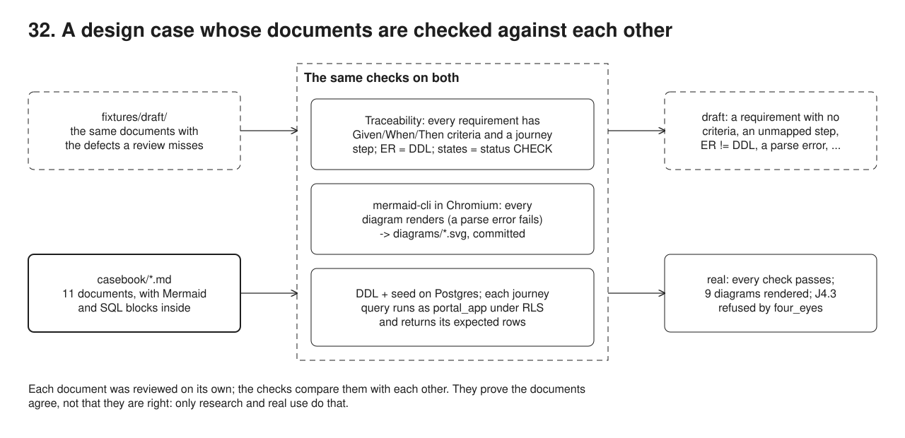

# 32. A design case, checked



**Pain: a design document that reads well and does not hold together.** A requirement has no acceptance criteria, so nobody can say when it is done. A journey step needs something no requirement asks for. The ER diagram shows a table the DDL does not create, the state diagram has a state the database refuses, a sequence diagram does not even parse, and the data model lets one person approve a bank details change twice. Each document was reviewed on its own; nobody checked them against each other.

**Reach for it when** you plan a rebuild or a new service on paper first (a discovery, a design review, a time-boxed design case) and want its parts to agree: requirements with testable criteria, journeys that map to them, diagrams that render, a data model that answers the journeys' questions.

**Do not reach for it when** the requirements live in a tracker with its own links: use its traceability report. The design fits on one page. Code exists: the acceptance criteria become executable specifications (23), which check the system rather than the plan.

A worked design case, a self-set exercise on a fictional organisation, time-boxed to three hours: rebuild a legacy member portal used by about forty partner organisations. Eleven Markdown documents in `casebook/`: the scenario with a time plan and assumptions, a discovery plan and stakeholder map, personas and journeys, a functional specification with acceptance criteria, the architecture (C4 context and containers, sign-in and change request sequences), the ER data model with its DDL and the journeys' queries, the change request state machine, the accessibility and security approach, a strangler migration plan with a gantt, a risk register and KPIs. The demo first checks a flawed draft of the same documents, then the real ones: traceability, every Mermaid diagram rendered to SVG (committed), the DDL applied to Postgres and each journey's query run against it.

## Run

One shot with proof: `./run-32-casebook.sh` from the repo root (log in [`../logs/32-casebook.log`](../logs/32-casebook.log)).

By hand, from this folder (ports: Postgres 55462):

```sh
docker compose up -d --wait
PUPPETEER_SKIP_DOWNLOAD=1 npm i   # no browser download: mermaid-cli uses a local Chromium, see below
export PUPPETEER_EXECUTABLE_PATH=/path/to/chrome   # any Chromium or Chrome; the run script finds a Playwright one
npm run trace                     # requirement -> criteria -> journey steps, ER = DDL, states = CHECK
npm run render                    # every ```mermaid block -> diagrams/*.svg
npm run schema                    # DDL + seed + journey queries on an empty database
npm run demo                      # all of it, the flawed draft first
```

Rendering needs a Chromium. Puppeteer reads its path from `PUPPETEER_EXECUTABLE_PATH`; `../run-32-casebook.sh` sets it, when it is not set already, to the newest Playwright Chromium it finds (`$PLAYWRIGHT_BROWSERS_PATH`, `~/.cache/ms-playwright`, `/opt/pw-browsers`). Without one, install with downloads enabled (`npm i`) and puppeteer uses its own.

## Files

- `casebook/00-brief.md` ... `casebook/10-kpis.md` the design case.
- `diagrams/*.svg` the rendered diagrams, committed for viewers that do not render Mermaid.
- `fixtures/draft/` the same documents with the defects a review misses (a requirement without criteria, a criterion that is not testable, an unmapped step, a dangling reference, an uncovered requirement, ER and DDL out of step, a state the database refuses, a diagram that does not parse, a missing constraint).
- `src/extract.ts` fenced blocks with the `<!-- diagram: name -->` or `<!-- sql: ... -->` marker above them.
- `src/trace.ts` the traceability and consistency checks.
- `src/render.ts` mermaid-cli per diagram, `--no-font-embed`; `puppeteer.json` holds only the browser flags, and puppeteer takes the browser from `PUPPETEER_EXECUTABLE_PATH`.
- `src/schema.ts` applies the DDL and seed, runs each journey query, compares with its `expect`: a row count, or `error <constraint>` (another error is a mismatch). The user's steps run in a transaction as `portal_app`, under row-level security.
- `src/demo.ts` the seven steps and their checks.
- `build/` the intermediate files of the last run, committed: one `.mmd` per diagram as handed to mermaid-cli, `build/draft/*.svg` the flawed draft's diagrams that did render, and `build/nogrant/05-data-model.md`, the data model without its `GRANT USAGE ON ALL SEQUENCES` line, for the negative check.

## Concepts

- **Time box**: three hours split by deliverable (`00-brief.md`), with the last ten minutes reserved for the checks. Assumptions are written down and numbered so discovery can confirm or replace them, and open questions name who must answer.
- **Discovery before requirements**: research questions, methods and a six-week plan (logs and support tickets first, then research sessions with members including assistive technology users, HR administrators and staff), a stakeholder map by influence and interest, and the outputs that close discovery: top tasks, KPI baselines, validated personas.
- **Personas and journeys**: four personas (two members, an employer administrator, a support agent) and four journeys written as numbered steps. Each step names the requirements it needs, which makes the journeys the test of the specification's completeness.
- **Acceptance criteria**: every requirement has criteria in Given / When / Then form, concrete enough to become an automated test. Cross-cutting requirements (accessibility, two languages, reliability, data protection) say `Applies to: all journeys`.
- **Traceability**: a check, not a spreadsheet. Every requirement has criteria and is used by a step or applies to all; every step maps to requirements that exist; every journey query belongs to a step. A criterion without Given, when and then ("should get an email") is reported as untestable.
- **Diagrams as code**: Mermaid in the Markdown, so diagrams are reviewed in the same diff as the text. Context as C4, containers as a flowchart (Mermaid's C4 layout cannot place external systems around a boundary), sequences for OIDC sign-in and the change request with its outbox, an ER diagram, a state machine, a gantt. mermaid-cli renders each one in headless Chromium, so a syntax error fails the build (a `;` ends a sequence message, which a reviewer reading the source does not see).
- **Consistency between views**: the ER diagram and the DDL must name the same tables, and the state machine must allow exactly the states the `status` CHECK allows. Two views of one thing drift unless something compares them.
- **The data model answers the journeys**: the DDL and a seed are applied to an empty database and each journey step's query runs in order, with an expected row count, or the named constraint that must refuse (any other error is a mismatch): J4.3 proves that the `four_eyes` constraint stops one person giving both approvals of a bank details change. The steps a signed-in user takes run as the application would: in a transaction, as the `portal_app` role, with the user's identity set by `set_config(..., true)` so it ends with the transaction. Row-level security on members, contributions, statements, change requests and uploads lets staff see everything, an employer administrator her employer's rows and a member his own; J3.4 shows the employer scope, and the same query with no identity set sees nothing, because the policies fail closed. A missing grant fails a journey too: without USAGE on the sequences, J2.4 cannot insert a change request.
- **Strangler migration plan**: phases by capability behind a routing facade (05), one data owner per capability, sync through an outbox (09) or CDC (10), parallel run on reads (04), uploads moved with a pilot of three employers then waves, and decommission when the old portal gets no traffic for 30 days.
- **Risk register and KPIs**: risks scored likelihood x impact with a mitigation, an owner and a link to the requirement or phase; KPIs with formula, baseline from the old portal, target and owner (computed as in 29).
- **Trade-offs**: the checks prove the documents agree with each other, not that they are right: only research and real use do that. Markers (`<!-- diagram: name -->`, `<!-- sql: J1.2 expect 1 -->`) and table formats are conventions the authors must follow. A time-boxed plan is a starting point for discovery, not a commitment; the scenario says what would be done with more time.

## Proof (`logs/32-casebook.log`)

The draft: each defect a review missed, found by the checks:

```
   PROBLEM REQ-06 has no acceptance criteria
   PROBLEM REQ-08 criterion is not Given/When/Then: "The member should get an email when her request is approved."
   PROBLEM J2.3 maps to no requirement
   PROBLEM J3.2 refers to REQ-19, which does not exist
   PROBLEM REQ-12 is used by no journey step
   PROBLEM table outbox is missing from the ER diagram
   PROBLEM state on_hold is not allowed by the status CHECK

   fixtures/draft/04-architecture.md:86       FAILED Parse error on line 13, got 'NEWLINE'
   J4.3 expected error four_eyes, got 0 row(s)
```

The real documents: every requirement has criteria and is used by a journey, or applies to all of them:

```
   REQ-01 Sign in with an organisation account          3 AC  J1.1 J2.1 J3.1
   REQ-02 View my profile                               1 AC  J1.2 J2.2
   REQ-03 View my contribution history                  2 AC  J1.3
   REQ-04 Request a change of address                   3 AC  J2.2 J2.3 J2.4
   REQ-05 Request a change of bank details              3 AC  J4.3
   REQ-06 Track my requests                             1 AC  J2.4 J2.5
   REQ-07 Download my annual statement                  1 AC  J1.4
   REQ-08 Be told when something changes                1 AC  J2.6
   REQ-09 Upload the monthly contributions file         2 AC  J3.2 J3.3
   REQ-10 See only my organisation's members            1 AC  J3.1 J3.4
   REQ-11 Work the change request queue                 2 AC  J4.1 J4.2 J4.3
   REQ-12 Audit every change                            1 AC  J4.2 J4.4
   REQ-13 Accessible to WCAG 2.2 AA and RGAA 4.1        2 AC  all journeys
   REQ-14 Available in French and English               1 AC  all journeys
   REQ-15 Reliable and fast enough                      1 AC  all journeys
   REQ-16 Personal data protected                       1 AC  all journeys
   18 journey steps, each mapped; ER entities = tables: 10; lifecycle states = status CHECK values: submitted, in_review, awaiting_second_approval, approved, rejected, cancelled, applied
```

Nine diagrams rendered:

```
   casebook/01-discovery.md:32                -> diagrams/01-stakeholder-map.svg          quadrantChart, 7831 bytes
   casebook/02-personas-journeys.md:38        -> diagrams/02-journey-change-address.svg   journey, 18262 bytes
   casebook/04-architecture.md:8              -> diagrams/04-c4-context.svg               c4, 38546 bytes
   casebook/04-architecture.md:33             -> diagrams/04-c4-container.svg             flowchart-v2, 132457 bytes
   casebook/04-architecture.md:62             -> diagrams/04-sequence-login.svg           sequence, 32895 bytes
   casebook/04-architecture.md:86             -> diagrams/04-sequence-change-request.svg  sequence, 34893 bytes
   casebook/05-data-model.md:6                -> diagrams/05-er-model.svg                 er, 195258 bytes
   casebook/06-change-request-lifecycle.md:6  -> diagrams/06-state-change-request.svg     stateDiagram, 50176 bytes
   casebook/08-migration-plan.md:16           -> diagrams/08-gantt-migration.svg          gantt, 13100 bytes
```

The journeys' queries against the DDL, the user's steps as `portal_app` under row-level security; the second approval by the first approver is refused by the `four_eyes` constraint, and the same model without the sequence grant fails the first write journey:

```
   10 tables created
   J1.2 expect 1               ok  1 row(s), first: name=alice employer=Acme status=active
   J1.3 expect 12              ok  12 row(s), first: period=2025-01 employer=Acme amount=412.50 year_total=4950.00
   J1.4 expect 1               ok  1 row(s), first: year=2025 total=4950.00 matches_history=true
   J2.2 expect 1               ok  1 row(s), first: address=8 avenue Foch, 69006 Lyon
   J2.4 expect 1               ok  1 row(s), first: reference=CR-1002 status=submitted
   J2.5 expect 1               ok  1 row(s), first: reference=CR-1002 type=address status=submitted submitted_at=2026-09-30
   J3.3 expect 2               ok  2 row(s), first: period=2026-09 line=4 reason=unknown member 999
   J3.4 expect 2               ok  2 row(s), first: id=2 name=bob employer_id=globex
   J3.4 expect 0               ok  0 row(s)
   J4.1 expect 2               ok  2 row(s), first: reference=CR-1001 type=bank_details status=awaiting_second_approval submitted_at=2026-09-29 sla_due=2026-10-02
   J4.2 expect 1               ok  1 row(s), first: reference=CR-1002 status=applied address=12 rue Garibaldi, 69003 Lyon
   J4.3 expect error four_eyes ok  new row for relation "change_requests" violates check constraint "four_eyes"
   J4.4 expect 1               ok  1 row(s), first: at=2026-10-03 actor=idp|dan reference=CR-1002 before=8 avenue Foch, 69006 Lyon after=12 rue Garibaldi, 69003 Lyon
   the same model without "GRANT USAGE ON ALL SEQUENCES IN SCHEMA public TO portal_app;": J2.4 expected 1, got permission denied for sequence change_requests_id_seq
```

## Origins and further reading

- Book: *Software Requirements*, Karl Wiegers and Joy Beatty, 3rd edition, 2013 (requirements traceability, acceptance criteria).
- Book: *User Story Mapping*, Jeff Patton, 2014 (journeys as the backbone of a backlog).
- Docs: "Discovery phase", GOV.UK Service Manual. https://www.gov.uk/service-manual/agile-delivery/how-the-discovery-phase-works
- Article: "The C4 model for visualising software architecture", Simon Brown. https://c4model.com/
- Docs: Mermaid diagram syntax (sequence, ER, state, gantt, C4, quadrant, journey). https://mermaid.js.org/intro/
- Article: "StranglerFigApplication", Martin Fowler, 2004, updated 2024. https://martinfowler.com/bliki/StranglerFigApplication.html
- Article: "Introducing BDD" (Given / When / Then), Dan North, 2006. https://dannorth.net/introducing-bdd/
- Book: *Mapping Experiences*, James Kalbach, 2nd edition, 2020 (journey maps, stakeholder mapping).
