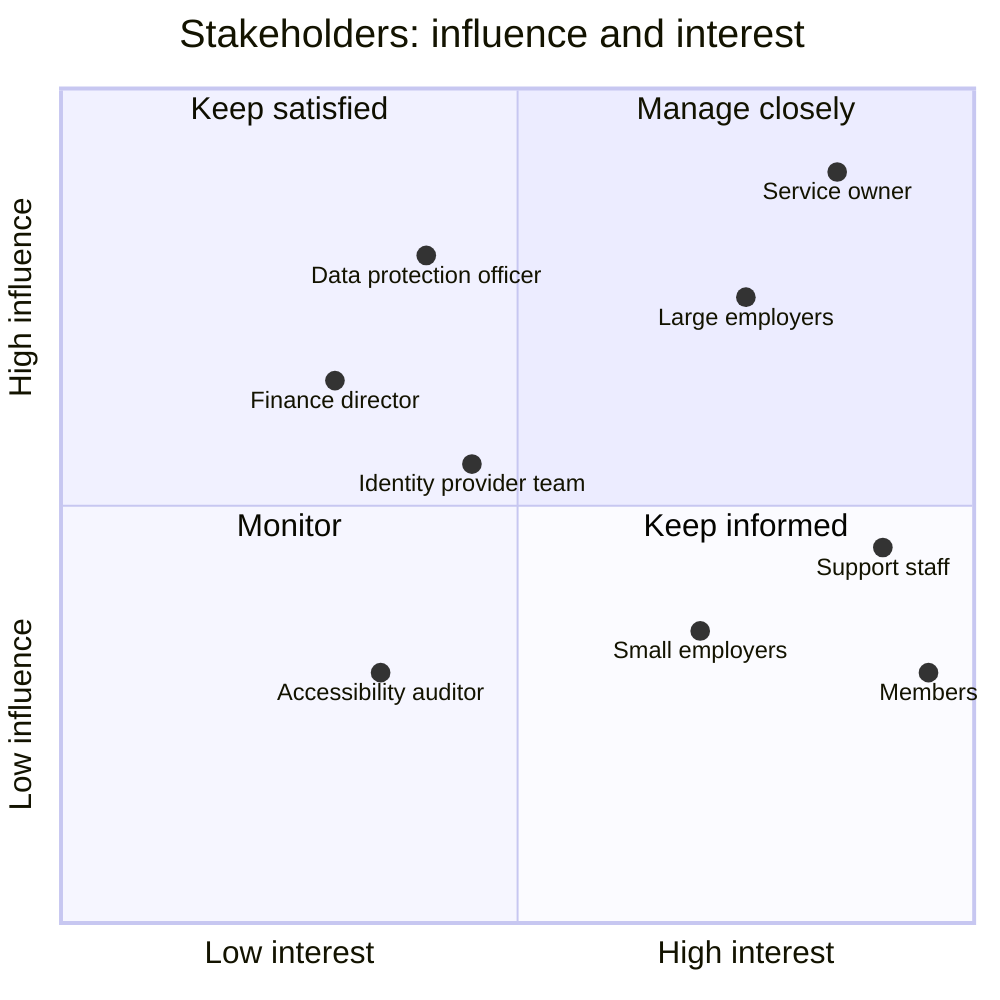

# Discovery plan and stakeholder map

Six weeks, before any requirement is fixed. The goal is to replace assumptions A1-A7 with evidence, and to find which tasks matter most to members, employers and staff.

## Research questions

1. Which tasks do members come to the portal for, how often, and which do they fail at? (old portal logs, support tickets)
2. Why do members call support instead of using the portal? (ticket categories, call listening)
3. How do employers produce the monthly file, and what goes wrong? (rejected files, research sessions with HR administrators)
4. How do staff process change requests, and where do they wait or re-key data? (shadowing)
5. Which barriers do disabled members meet in the old portal? (accessibility audit, sessions with assistive technology users)
6. What must stay the same for contractual or legal reasons? (contracts, data protection officer)

## Methods

| Week | Activity | Who | Output |
| --- | --- | --- | --- |
| 1 | Analyse 12 months of old portal logs and support tickets | product owner, developer | top tasks, failure points, baseline KPIs |
| 1-2 | Shadow staff processing change requests | product owner | current process map, pain points |
| 2-3 | Research sessions with 4 HR administrators (large and small employers) | product owner, developer | employer journey, file problems |
| 2-4 | Research sessions with 8 members across 3 employers, 2 using assistive technology | product owner, designer (contract) | personas, journeys |
| 3 | Accessibility audit of the 5 most used pages | external auditor | RGAA / WCAG 2.2 findings |
| 4 | Technical review of the old database and integrations | developers, operations | data ownership, migration constraints |
| 5 | Prototype the change request form, test with 5 members | designer, developer | validated form design |
| 6 | Playback to stakeholders, prioritise | whole team | prioritised backlog, updated plan |

## Stakeholder map

Influence (can change the project) against interest (is affected by it). Manage closely: keep informed and involved in decisions; keep satisfied: consult before decisions that affect them; keep informed: regular updates; monitor: light touch.

<!-- diagram: stakeholder-map -->

## Outputs that close discovery

- The top 5 member tasks by volume and by failure, with a baseline for each KPI in [10-kpis.md](10-kpis.md).
- Personas and journeys ([02-personas-journeys.md](02-personas-journeys.md)) validated by the research sessions.
- A decision on Q1-Q4 from [00-brief.md](00-brief.md).
- A prioritised list of requirements ([03-requirements.md](03-requirements.md)) the team and the service owner agree on.
