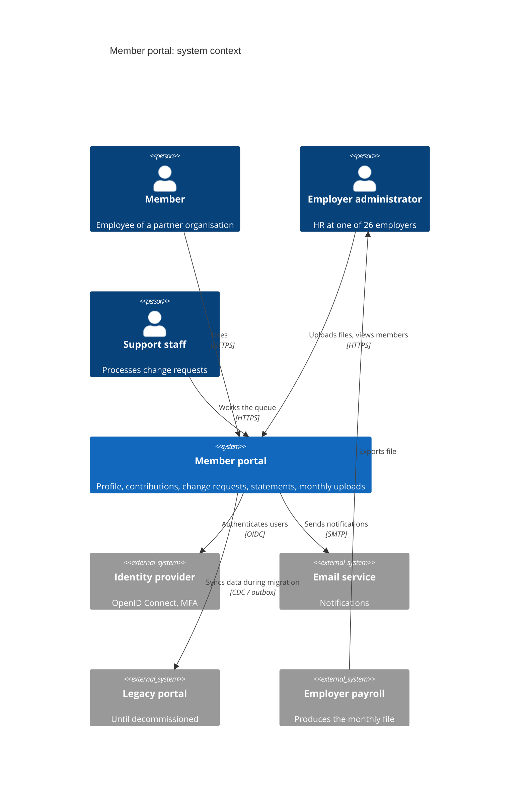
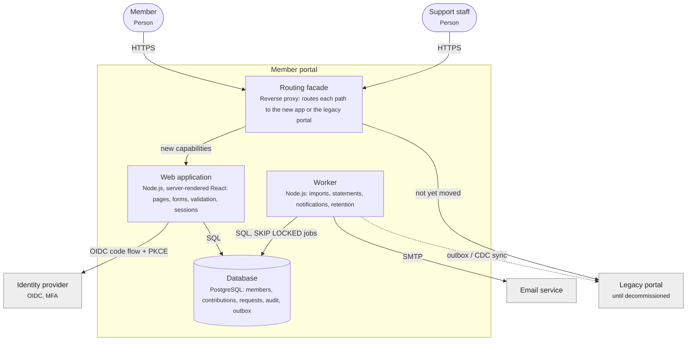
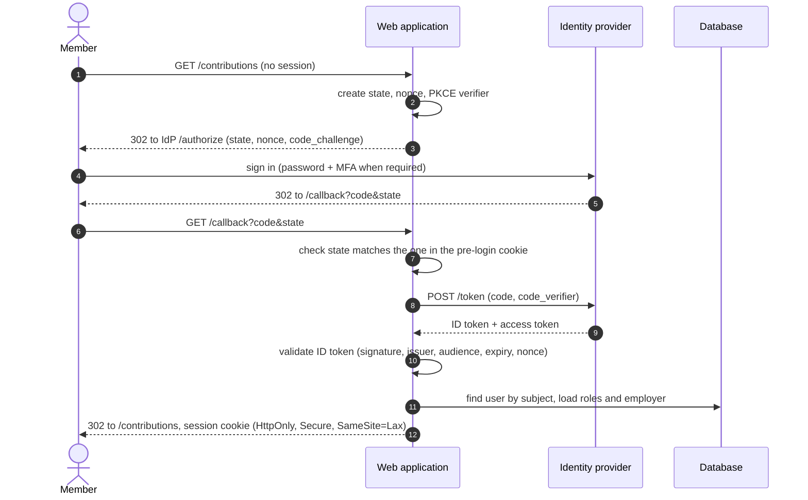
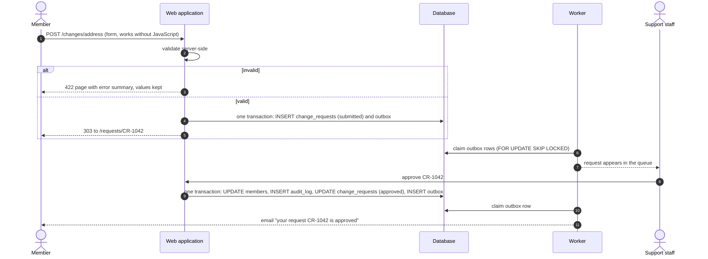

# Architecture

A deliberately boring stack the team of five can run: one server-rendered web application (progressive enhancement, works without JavaScript), one Postgres database, a worker for batch jobs, and the organisation's identity provider for sign-in. No microservices: the domain is small and the team is smaller. The old portal stays behind the same routing facade until each capability has moved (see [08-migration-plan.md](08-migration-plan.md)).

## System context (C4 level 1)

<!-- diagram: c4-context -->

## Containers (C4 level 2)

Drawn as a flowchart: Mermaid's own C4 layout cannot place the external systems around the boundary.

<!-- diagram: c4-container -->

## Sign-in (OpenID Connect, authorization code with PKCE)

<!-- diagram: sequence-login -->

## Change request (address)

<!-- diagram: sequence-change-request -->

## Decisions worth recording as ADRs

- Server-rendered pages with progressive enhancement, not a single-page app: accessibility, mobile performance, one deployable.
- No passwords in the portal: OpenID Connect against the organisation's identity provider, MFA step-up for bank details.
- One Postgres database with an outbox for side effects (emails, sync to legacy), not a message broker: the volumes are small.
- Employer scoping enforced in the database (row-level security keyed on the employer), not only in the application.
