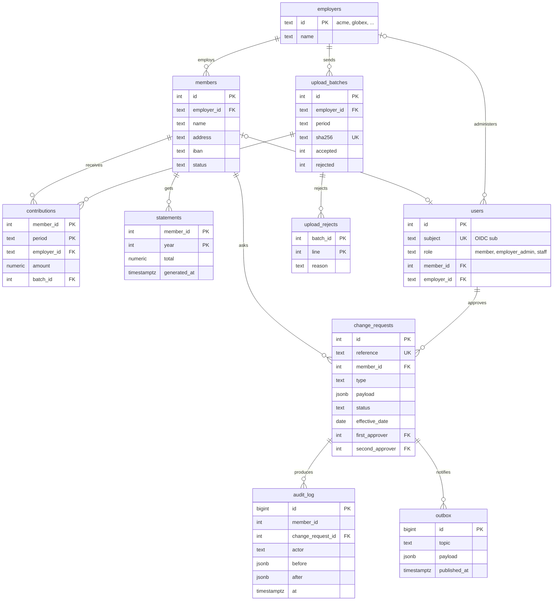

# Data model

The entities the journeys need, as an ER diagram and as DDL. `npm run schema` applies the DDL and the seed to an empty Postgres and runs every journey query below; `npm run trace` checks that the diagram and the DDL name the same tables, and that the change request states match [06-change-request-lifecycle.md](06-change-request-lifecycle.md).

<!-- diagram: er-model -->


## DDL

<!-- sql: ddl -->
```sql
CREATE TABLE employers (id text PRIMARY KEY, name text NOT NULL);

CREATE TABLE members (
  id int PRIMARY KEY,
  employer_id text NOT NULL REFERENCES employers,
  name text NOT NULL,
  address text NOT NULL,
  iban text,
  status text NOT NULL CHECK (status IN ('active', 'deferred', 'left'))
);

CREATE TABLE users (
  id int PRIMARY KEY,
  subject text NOT NULL UNIQUE,
  role text NOT NULL CHECK (role IN ('member', 'employer_admin', 'staff')),
  member_id int REFERENCES members,
  employer_id text REFERENCES employers,
  CHECK ((role = 'member') = (member_id IS NOT NULL)),
  CHECK ((role = 'employer_admin') = (employer_id IS NOT NULL))
);

CREATE TABLE upload_batches (
  id int PRIMARY KEY,
  employer_id text NOT NULL REFERENCES employers,
  period text NOT NULL,
  sha256 text NOT NULL UNIQUE,
  accepted int NOT NULL,
  rejected int NOT NULL,
  uploaded_by int NOT NULL REFERENCES users,
  uploaded_at timestamptz NOT NULL DEFAULT now()
);

CREATE TABLE upload_rejects (batch_id int REFERENCES upload_batches, line int, reason text NOT NULL, PRIMARY KEY (batch_id, line));

CREATE TABLE contributions (
  member_id int REFERENCES members,
  period text CHECK (period ~ '^\d{4}-\d{2}$'),
  employer_id text NOT NULL REFERENCES employers,
  amount numeric(10, 2) NOT NULL CHECK (amount >= 0),
  batch_id int REFERENCES upload_batches,
  PRIMARY KEY (member_id, period)
);

CREATE TABLE statements (member_id int REFERENCES members, year int, total numeric(12, 2) NOT NULL, generated_at timestamptz NOT NULL, PRIMARY KEY (member_id, year));

CREATE TABLE change_requests (
  id serial PRIMARY KEY,
  reference text GENERATED ALWAYS AS ('CR-' || (1000 + id)) STORED UNIQUE,
  member_id int NOT NULL REFERENCES members,
  type text NOT NULL CHECK (type IN ('address', 'bank_details')),
  payload jsonb NOT NULL,
  status text NOT NULL DEFAULT 'submitted'
    CHECK (status IN ('submitted', 'in_review', 'awaiting_second_approval', 'approved', 'rejected', 'cancelled', 'applied')),
  effective_date date NOT NULL DEFAULT current_date,
  submitted_at timestamptz NOT NULL DEFAULT now(),
  first_approver int REFERENCES users,
  second_approver int REFERENCES users,
  reason text,
  CONSTRAINT four_eyes CHECK (second_approver IS NULL OR second_approver <> first_approver),
  CONSTRAINT bank_needs_two CHECK (type <> 'bank_details' OR status NOT IN ('approved', 'applied') OR second_approver IS NOT NULL),
  CONSTRAINT rejection_has_reason CHECK (status <> 'rejected' OR reason IS NOT NULL)
);

CREATE TABLE audit_log (
  id bigserial PRIMARY KEY,
  member_id int NOT NULL,
  change_request_id int REFERENCES change_requests,
  actor text NOT NULL,
  before jsonb,
  after jsonb,
  at timestamptz NOT NULL DEFAULT now()
);

CREATE TABLE outbox (id bigserial PRIMARY KEY, topic text NOT NULL, payload jsonb NOT NULL, created_at timestamptz NOT NULL DEFAULT now(), published_at timestamptz);

-- REQ-10: an employer administrator only ever sees her employer's members, enforced by the database for the application's role
DO $$ BEGIN CREATE ROLE portal_app; EXCEPTION WHEN duplicate_object THEN NULL; END $$;
GRANT SELECT, INSERT, UPDATE ON ALL TABLES IN SCHEMA public TO portal_app;
ALTER TABLE members ENABLE ROW LEVEL SECURITY;
CREATE POLICY employer_scope ON members
  USING (current_setting('app.role', true) IS DISTINCT FROM 'employer_admin' OR employer_id = current_setting('app.employer_id', true));
```

## Seed (three of the 26 employers)

<!-- sql: seed -->
```sql
INSERT INTO employers VALUES ('acme', 'Acme'), ('globex', 'Globex'), ('initech', 'Initech');
INSERT INTO members VALUES
  (1, 'acme', 'alice', '3 rue des Lilas, 75011 Paris', 'FR7630006000011234567890189', 'active'),
  (2, 'globex', 'bob', '8 avenue Foch, 69006 Lyon', 'FR7630004000031234567890143', 'active'),
  (3, 'globex', 'erin', '1 place Bellecour, 69002 Lyon', 'FR7610107001011234567890129', 'active'),
  (4, 'initech', 'frank', '5 quai Saint-Pierre, 33000 Bordeaux', NULL, 'deferred');
INSERT INTO users VALUES
  (1, 'idp|alice', 'member', 1, NULL), (2, 'idp|bob', 'member', 2, NULL), (3, 'idp|erin', 'member', 3, NULL),
  (10, 'idp|carol', 'employer_admin', NULL, 'globex'), (20, 'idp|dan', 'staff', NULL, NULL), (21, 'idp|eve', 'staff', NULL, NULL);
INSERT INTO upload_batches VALUES (1, 'acme', '2025-12', 'a1b2', 1, 0, 20, '2026-01-05'), (2, 'globex', '2026-09', 'c3d4', 2, 2, 10, '2026-10-01');
INSERT INTO upload_rejects VALUES (2, 4, 'unknown member 999'), (2, 7, 'amount -12.00 is negative');
INSERT INTO contributions SELECT 1, '2025-' || lpad(m::text, 2, '0'), 'acme', 412.50, 1 FROM generate_series(1, 12) m;
INSERT INTO contributions VALUES (2, '2026-09', 'globex', 389.00, 2), (3, '2026-09', 'globex', 301.25, 2);
INSERT INTO statements VALUES (1, 2025, 4950.00, '2026-02-01');
INSERT INTO change_requests (member_id, type, payload, status, first_approver, submitted_at)
  VALUES (3, 'bank_details', '{"iban": "FR7614508000301234567890115"}', 'awaiting_second_approval', 20, '2026-09-29');
```

## Queries the journeys need

Each block runs in document order against the seeded database, on one connection; a block with several statements runs as one transaction and the last statement's rows count. `expect` is the number of rows, or `error` when the database must refuse. J4.2 walks the lifecycle: in review, approved, then applied because its effective date is today.

<!-- sql: J1.2 expect 1 -->
```sql
SELECT m.name, e.name AS employer, m.status FROM members m JOIN employers e ON e.id = m.employer_id WHERE m.id = 1;
```

<!-- sql: J1.3 expect 12 -->
```sql
SELECT c.period, e.name AS employer, c.amount, sum(c.amount) OVER () AS year_total
FROM contributions c JOIN employers e ON e.id = c.employer_id
WHERE c.member_id = 1 AND c.period LIKE '2025-%' ORDER BY c.period;
```

<!-- sql: J1.4 expect 1 -->
```sql
SELECT s.year, s.total, s.total = (SELECT sum(amount) FROM contributions WHERE member_id = 1 AND period LIKE '2025-%') AS matches_history
FROM statements s WHERE s.member_id = 1 AND s.year = 2025;
```

<!-- sql: J2.2 expect 1 -->
```sql
SELECT address FROM members WHERE id = 2;
```

<!-- sql: J2.4 expect 1 -->
```sql
WITH cr AS (
  INSERT INTO change_requests (member_id, type, payload, submitted_at) VALUES (2, 'address', '{"address": "12 rue Garibaldi, 69003 Lyon"}', '2026-09-30') RETURNING *
), event AS (INSERT INTO outbox (topic, payload) SELECT 'change_request.submitted', jsonb_build_object('reference', reference) FROM cr)
SELECT reference, status FROM cr;
```

<!-- sql: J2.5 expect 1 -->
```sql
SELECT reference, type, status, submitted_at::date FROM change_requests WHERE member_id = 2 ORDER BY submitted_at DESC;
```

<!-- sql: J3.3 expect 2 -->
```sql
SELECT b.period, r.line, r.reason FROM upload_rejects r JOIN upload_batches b ON b.id = r.batch_id
WHERE b.employer_id = 'globex' AND b.id = (SELECT max(id) FROM upload_batches WHERE employer_id = 'globex') ORDER BY r.line;
```

<!-- sql: J3.4 expect 2 -->
```sql
SET ROLE portal_app;
SELECT set_config('app.role', 'employer_admin', false), set_config('app.employer_id', 'globex', false);
SELECT id, name, employer_id FROM members ORDER BY id;
```

<!-- sql: J4.1 expect 2 -->
```sql
RESET ROLE;
SELECT reference, type, status, submitted_at::date, (submitted_at + interval '3 days')::date AS sla_due
FROM change_requests WHERE status IN ('submitted', 'in_review', 'awaiting_second_approval') ORDER BY submitted_at;
```

<!-- sql: J4.2 expect 1 -->
```sql
UPDATE change_requests SET status = 'in_review' WHERE reference = 'CR-1002' AND status = 'submitted';
UPDATE change_requests SET status = 'approved', first_approver = 20 WHERE reference = 'CR-1002' AND status = 'in_review';
WITH cr AS (
  UPDATE change_requests SET status = 'applied' WHERE reference = 'CR-1002' AND status = 'approved' AND effective_date <= current_date RETURNING *
), old AS (SELECT m.* FROM members m JOIN cr ON cr.member_id = m.id),
upd AS (UPDATE members m SET address = cr.payload->>'address' FROM cr WHERE m.id = cr.member_id RETURNING m.*),
audit AS (
  INSERT INTO audit_log (member_id, change_request_id, actor, before, after)
  SELECT upd.id, cr.id, 'idp|dan', jsonb_build_object('address', old.address), jsonb_build_object('address', upd.address) FROM upd, cr, old
), event AS (INSERT INTO outbox (topic, payload) SELECT 'change_request.applied', jsonb_build_object('reference', reference) FROM cr)
SELECT cr.reference, cr.status, upd.address FROM cr, upd;
```

<!-- sql: J4.3 expect error -->
```sql
UPDATE change_requests SET second_approver = 20, status = 'approved' WHERE reference = 'CR-1001';
```

<!-- sql: J4.4 expect 1 -->
```sql
SELECT a.at::date, a.actor, cr.reference, a.before->>'address' AS before, a.after->>'address' AS after
FROM audit_log a JOIN change_requests cr ON cr.id = a.change_request_id WHERE a.member_id = 2 ORDER BY a.at;
```
