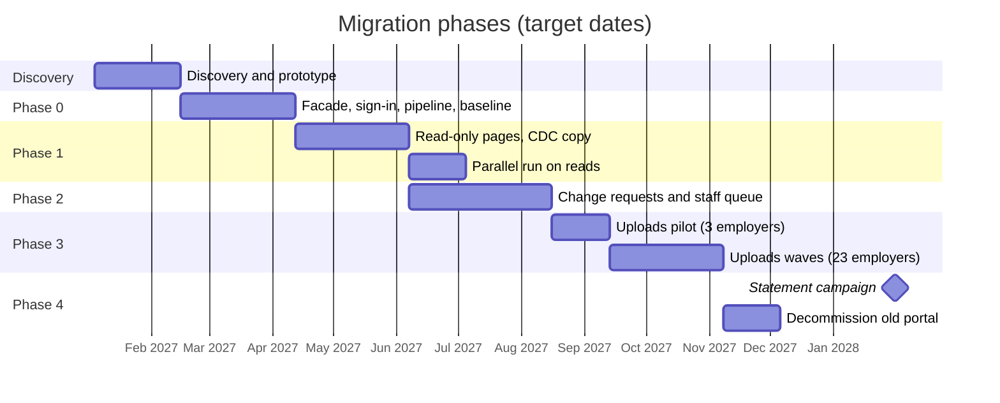

# Migration plan: strangler, not big bang

The old portal keeps running while the new one takes over one capability at a time behind a routing facade (sample 05). Each phase ends with the old code path unused for that capability, and every step can be routed back in one change. Data has one owner per capability at any time; while both systems run, changes flow between them through an outbox (09) or change data capture (10).

## Phases

| Phase | What moves | Who owns the data | Exit criterion |
| --- | --- | --- | --- |
| 0. Foundations | Routing facade in front of the old portal, sign-in through the identity provider for both, analytics baseline, pipeline | old portal | every request goes through the facade; KPI baselines recorded |
| 1. Read-only pages | Profile, contributions, statements download, in the new app | old portal (new app reads a copy synced by CDC) | 4 weeks with parallel-run mismatches at zero (04); old pages get no traffic |
| 2. Change requests | Address and bank detail requests, staff queue | new app owns requests; approved changes are written back to the old database through the outbox | old back office no longer used for requests |
| 3. Employer uploads | Monthly file import with staging, rejects and dry run (27) | new app owns contributions | pilot with 3 employers, then the other 23 in waves of 5-6 |
| 4. Statements and decommission | Yearly statement campaign from the new app (28); old portal switched off | new app owns everything | old portal receives zero requests for 30 days; database archived |

<!-- diagram: gantt-migration -->

## Rules for every cutover

- Announce to employers two weeks ahead; cut over in the scheduled release window (31).
- Route a cohort first (one employer, or 10% of members), watch the KPIs and error budget (29), then widen.
- Keep the route back for at least one statement cycle; rehearse the rollback before the cutover.
- Reconcile data counts and control totals between the two systems daily while both hold copies.
