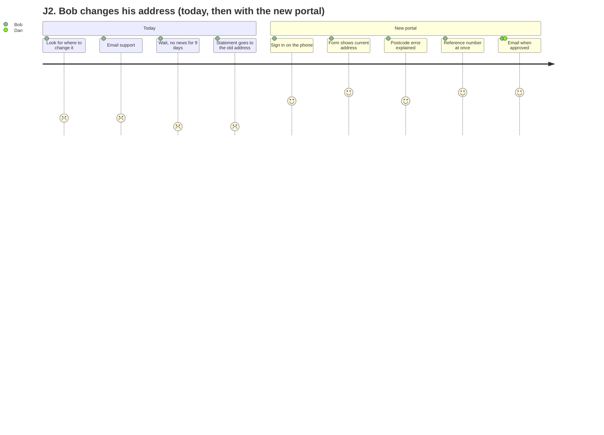

# Personas and user journeys

Personas are drafts from assumptions; discovery research confirms or replaces them. Each journey step names the requirements it needs (see [03-requirements.md](03-requirements.md)); `npm run trace` checks that every step maps to an existing requirement.

## Personas

**Alice, member, 58, Acme.** Checks her contributions once or twice a year and downloads the annual statement before meeting a financial adviser. Uses a laptop at home, with screen magnification. Calls support when a page "moves around" or a PDF is unreadable. Needs: find this year's total quickly, a statement she can read and print.

**Bob, member, 34, Globex.** Uses his phone for everything. Moved house in the spring and did not know where to change his address; his statement went to the old one. Needs: change details on a phone in two minutes, know it was received, know when it is done.

**Carol, HR administrator, Globex.** Exports a contributions file from the payroll system every month and uploads it. When a row is wrong the old portal rejects the whole file with "error line 214". Needs: see which rows are wrong and why, fix them, and see only Globex's members.

**Dan, support staff.** Processes change requests from a shared mailbox and the old back office, re-keying data. Bank detail changes are a fraud risk and need a second person. Needs: one queue ordered by age, the full history of a member, a second approver for risky changes.

## Journeys

### J1. Alice checks her contributions and downloads her statement

| Step | What happens | Requirements |
| --- | --- | --- |
| J1.1 | Alice signs in with her organisation account | REQ-01 |
| J1.2 | She sees a summary: name, employer, membership status | REQ-02 |
| J1.3 | She opens her contribution history and sees the 2025 total | REQ-03 |
| J1.4 | She downloads her 2025 annual statement as an accessible PDF | REQ-07 |

### J2. Bob changes his address on his phone

| Step | What happens | Requirements |
| --- | --- | --- |
| J2.1 | Bob signs in on his phone | REQ-01 |
| J2.2 | He opens "Change my address"; the form shows his current address | REQ-02, REQ-04 |
| J2.3 | He mistypes the postcode; the page lists the error at the top and next to the field | |
| J2.4 | He submits a valid address and gets a reference number | REQ-04, REQ-06 |
| J2.5 | Later he checks the request: submitted, then in review | REQ-06 |
| J2.6 | He gets an email when it is approved | REQ-08 |

<!-- diagram: journey-change-address -->

### J3. Carol uploads Globex's monthly file

| Step | What happens | Requirements |
| --- | --- | --- |
| J3.1 | Carol signs in; she has the employer administrator role for Globex | REQ-01, REQ-10 |
| J3.2 | She uploads the September file | REQ-19 |
| J3.3 | Two rows are rejected with reasons (unknown member, negative amount); the rest are accepted | REQ-09 |
| J3.4 | She looks up a member: she can only see Globex's members | REQ-10 |

### J4. Dan works the change request queue

| Step | What happens | Requirements |
| --- | --- | --- |
| J4.1 | Dan opens the queue, oldest first, with the time left before the service level is missed | REQ-11 |
| J4.2 | He approves Bob's address change; the address is updated and the change is audited | REQ-11 |
| J4.3 | He cannot be the second approver of a bank detail change he approved first | REQ-05, REQ-11 |
| J4.4 | He reads a member's history: who changed what, when, from what to what | REQ-11 |
