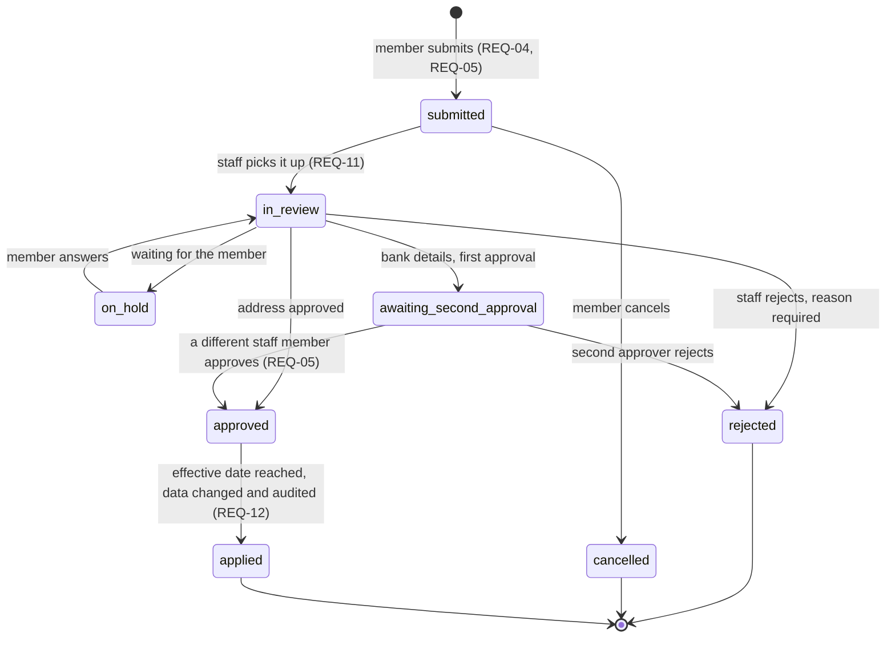

# Change request lifecycle

Every change a member asks for (address, bank details) is a change request with one status at a time. The diagram is the contract: the `status` CHECK constraint in [05-data-model.md](05-data-model.md) allows exactly these states, and `npm run trace` fails if the two drift apart.

<!-- diagram: state-change-request -->

## Rules

| Transition | Who | Guard | Side effects (same transaction) |
| --- | --- | --- | --- |
| submit | member | server-side validation passes; for bank details, MFA in the last 15 minutes; effective date not in the past | outbox `change_request.submitted` |
| cancel | member | status is `submitted` | outbox `change_request.cancelled` |
| pick up | staff | status is `submitted` | none |
| reject | staff | a reason is given | outbox `change_request.rejected` (email to the member) |
| approve (address) | staff | none | outbox `change_request.approved` |
| first approval (bank details) | staff | none | none |
| second approval | staff | approver differs from the first (`four_eyes` constraint) | outbox `change_request.approved` |
| apply | worker | effective date reached | member data updated, `audit_log` row, outbox `change_request.applied` |

Terminal states are never left; a correction is a new request. The service level (3 days) runs from `submitted` to `approved` or `rejected`.
