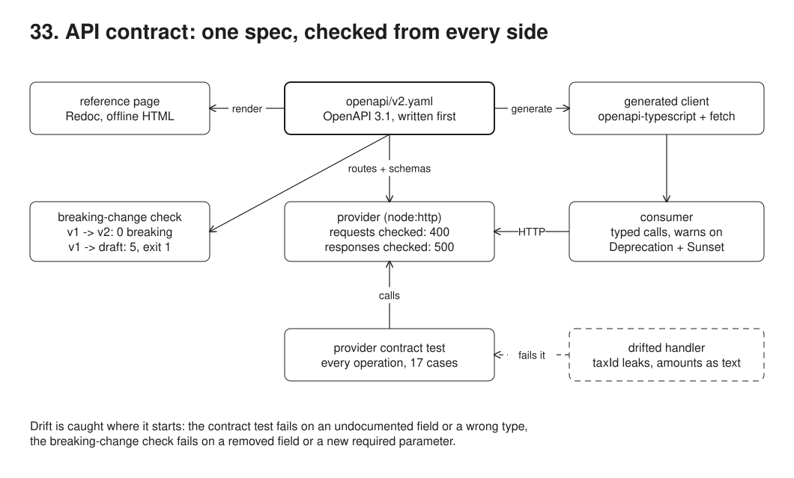
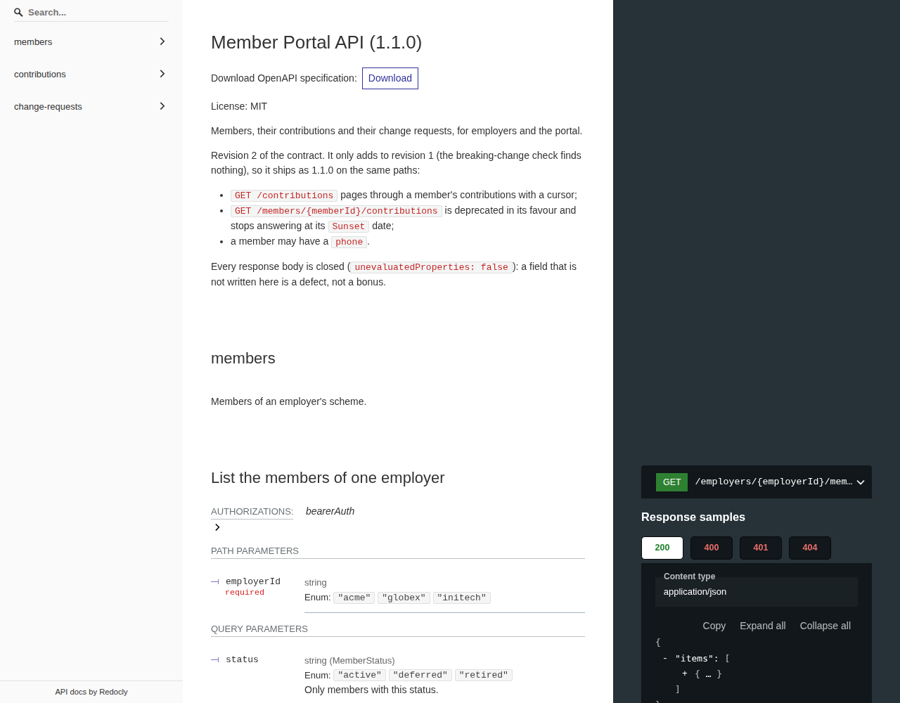
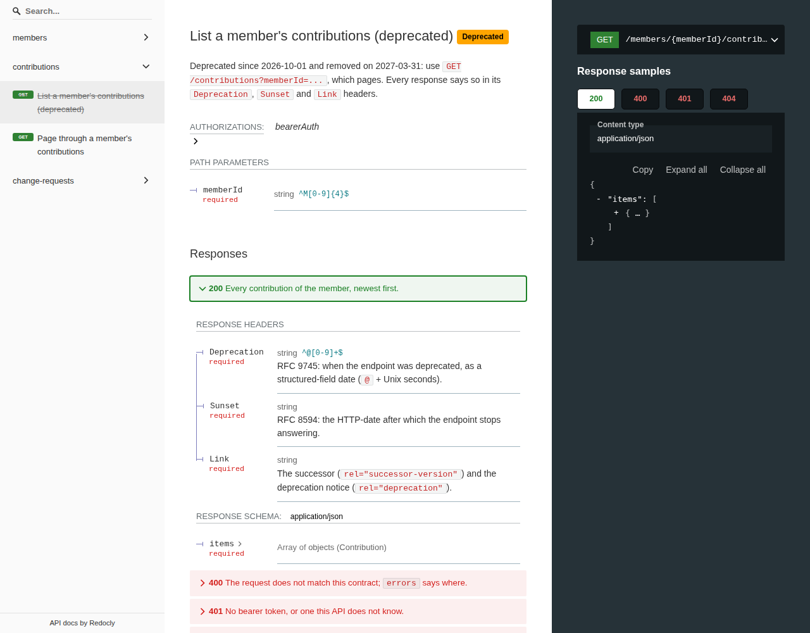

# 33. API contract



**Pain: an API that drifts from its docs.** The docs say a member has seven fields; the handler returns the stored row with an eighth, a `taxId` nobody meant to publish. The docs say amounts are numbers; a refactor formats them as `"125.50"` and every consumer that adds them up concatenates strings instead. In this run the drifted provider still answers 12 of 17 calls correctly, so a smoke test passes; the contract test fails the other 5 and names the field and the type. Meanwhile a "small" revision renames `joinedOn` and adds a required `year` parameter: the breaking-change check finds 5 breaking changes before any consumer does, and the same consumer, regenerated against that draft, stops compiling.

**Reach for it when** other teams or other organisations (employer payroll systems, a portal, a mobile app) call your HTTP API and deploy on their own schedule; when you publish an API reference; when an endpoint has to be retired without breaking whoever still calls it.

**Do not reach for it when** the only client ships with the server in the same deploy (a server-rendered app, a BFF owned by the same team): share TypeScript types or use tRPC instead. When consumers are many and you want each one's real expectations tested, add consumer-driven contracts (Pact) on top: a provider test against the spec proves the provider matches the spec, not that the spec matches what each consumer uses.

The spec (`openapi/v2.yaml`, OpenAPI 3.1) is written first and linted with Redocly. A `node:http` provider routes by the spec: every operation must have a handler and every deprecated operation a sunset date, or it refuses to start. Requests are validated with Ajv (JSON Schema 2020-12) before a handler runs; responses are validated before they leave (enforce mode turns a drifted response into a 500, warn mode logs it). A consumer uses a client generated with openapi-typescript and openapi-fetch, with a middleware that reports `Deprecation` and `Sunset` headers. A Vitest provider contract test calls every operation and checks each response against the spec. `src/breaking.ts` compares two revisions and exits 1 on a breaking change. The same spec renders to an offline HTML reference.

## Run

One shot with proof: `./run.sh` in this folder, or `./33-api-contract/run.sh` from the repo root (log in [`../logs/33-api-contract.log`](../logs/33-api-contract.log)).

By hand (no Docker needed):

```sh
npm i
npm run lint                     # Redocly lint of v1, v2 and the breaking draft
npm run server                   # the provider on :53043 (DRIFT=1 for the drifted handlers on :53143, RESPONSE_VALIDATION=warn|enforce)
PROVIDER_URL=http://localhost:53043 npm run contract   # the provider contract test against a running provider
npm run breaking -- openapi/v1.yaml openapi/v2.yaml    # exit 0; with openapi/v2-breaking.yaml, exit 1
npm run generate                 # regenerate src/generated/api.d.ts from the spec
npm run docs                     # out/api-reference.html
npm run demo                     # the whole story; starts its own providers on :53043 and :53143
```

Every call needs `Authorization: Bearer acme-demo-token` (or `portal-demo-token`).

## Files

- `openapi/v1.yaml` revision 1, as released (1.0.0).
- `openapi/v2.yaml` revision 2 (1.1.0), served: adds `GET /contributions` with a cursor and an optional `phone`, and deprecates `GET /members/{memberId}/contributions`.
- `openapi/v2-breaking.yaml` a draft of revision 2 that edits v1 in place; the check refuses it.
- `redocly.yaml` lint rules (recommended, minus the rule against a `localhost` server URL).
- `src/spec.ts` loads the YAML, lists operations with resolved parameters and responses, compiles schemas with Ajv 2020.
- `src/contract.ts` `checkRequest()` (path, query with coercion, unknown parameters, JSON body) and `checkResponse()` (documented status, media type, body, required headers).
- `src/server.ts` the provider: routing by the spec, bearer token, 400 problems, response validation in enforce or warn mode, start-up check that spec and handlers agree.
- `src/handlers.ts` one handler per `operationId`, the deprecation headers, and the two drift mistakes behind `drift: true`.
- `src/data.ts` nine members of Acme, Globex and Initech and their contributions, in memory.
- `src/generated/api.d.ts` generated by openapi-typescript; committed and checked in sync.
- `src/consumer.ts` an employer system using the typed client, and the deprecation middleware.
- `src/breaking.ts` the breaking-change check (CLI and `diff()`).
- `src/docs.ts` builds `out/api-reference.html` with Redocly and inlines the Redoc script.
- `src/screenshot.mjs` opens the reference with the network blocked and takes the two screenshots.
- `contract/cases.ts`, `contract/provider.test.ts` the provider contract test.
- `src/demo.ts` the nine steps and their checks.
- `out/api-reference.html` the reference page from the last run.

## Concepts

- **Spec first (design first)**: the contract is written and reviewed before the handlers, and the code is checked against it, not the other way round. Generating the spec from code annotations documents whatever the code happens to do, drift included.
- **OpenAPI 3.1 and JSON Schema 2020-12**: 3.1 schemas are plain JSON Schema, so a standard validator (Ajv's 2020 build) reads them unchanged; nullable is `type: [string, "null"]`, examples are `examples`.
- **Closed response schemas**: `unevaluatedProperties: false` on every response object makes an undocumented field a validation error. It is what catches the leaked `taxId`. It does not stop the provider adding documented optional fields later: consumers should still be tolerant readers.
- **Runtime request validation**: the provider rejects a request that does not match the spec before any handler sees it: path and query parameters (coerced from text, so `limit=12` is the integer 12), unknown query parameters (`year` on an operation that has none), and the JSON body (closed with `additionalProperties: false`). The 400 is an RFC 9457 problem whose `errors` lists every mismatch at once.
- **Runtime response validation, enforce or warn**: the same validator runs on the way out. Enforce turns a drifted response into a 500, so a leak never leaves (right for test and staging, and for sensitive data); warn sends it and logs, which keeps production up while the log tells you what drifted.
- **Spec and code agree at start-up**: the provider refuses to start when an operation has no handler, a handler has no operation, or a deprecated operation has no sunset date.
- **Generated typed client**: openapi-typescript turns the spec into `paths` and `components` types; openapi-fetch is a thin `fetch` wrapper typed by them, so the path, its parameters, the body and both the success and error responses are checked by `tsc`. The generated file is committed and CI regenerates it to prove it is current.
- **Provider contract test**: calls the running provider over HTTP for every operation (16 cases: successes, 400, 401, 404, 409) and checks each response with `checkResponse()`. It also fails if an operation in the spec has no success case, so a new endpoint cannot ship untested.
- **Deprecation and sunset**: the old endpoint keeps working and says so on every response: `Deprecation: @1790812800` (RFC 9745, a structured-field date: deprecated since 2026-10-01), `Sunset: Wed, 31 Mar 2027 23:59:59 GMT` (RFC 8594, when it stops answering), and `Link` with `rel="successor-version"` (the replacement) and `rel="deprecation"` (the notice). The spec marks it `deprecated: true` and documents the three headers, so the generated client tags it `@deprecated` and the contract test checks the headers are there.
- **Breaking versus compatible changes**: for a consumer written against the old spec, removing or retyping a response field, making a sent field optional, adding a required parameter or request field, or removing an operation breaks it. Adding an operation, an optional parameter, an optional response field or a deprecation does not. A compatible revision ships as a minor version on the same paths (1.1.0); a breaking one needs a new major version alongside the old one, or a deprecation period first.
- **Reference page**: Redocly CLI renders the spec as one HTML file. By default it loads Redoc from a CDN; `src/docs.ts` inlines the bundle from `node_modules/redoc` so the page works from a file, offline.
- **Trade-offs**: the in-house breaking-change check covers the common rules only (no `oneOf`, no header or status-code changes); oasdiff covers far more rules and is what to run in CI for a public API. Response validation costs a schema check per response: cheap here, worth measuring on large lists. A spec-validated provider still needs tests of its behaviour; the contract test checks shapes, not that the right member came back.

## Proof (`logs/33-api-contract.log`)

The drifted provider passes 12 of 17 cases; the contract test fails the other five and says exactly what drifted, and the runtime validator (warn mode) logged the same:

```
   [drift provider] response drift in getMember 200: body must NOT have unevaluated properties (taxId) (sent anyway: warn mode)
   |  FAIL  contract/provider.test.ts > getMember: a member -> 200
   | +   "body must NOT have unevaluated properties (taxId)",
   |  FAIL  contract/provider.test.ts > listContributions: first page -> 200
   | +   "body/items/*/memberAmount must be number (x5)",
   | +   "body/items/*/employerAmount must be number (x5)",
   |       Tests  5 failed | 12 passed (17)
   -> exit 1
```

In enforce mode the same drift fails closed, and the fixed handlers pass every case:

```
   same drift with response validation in enforce mode: GET /members/M0001 -> 500 {"type":"https://contract.local/problems/internal-server-error","title":"Internal server error","status":500,"detail":"the response did not match the API description"}
   |       Tests  17 passed (17)
   -> exit 0
```

One bad request, every problem listed:

```
   POST /members/M0002/change-requests {kind: phone, value: "", effectiveDate: 2026-02-30, urgent: true} -> 400
     body: must NOT have additional properties (urgent)
     body/kind: must be equal to one of the allowed values
     body/value: must NOT have fewer than 1 characters
     body/effectiveDate: must match format "date"
```

The deprecated endpoint's headers, and the consumer's middleware reporting them once:

```
deprecation: @1790812800
sunset: Wed, 31 Mar 2027 23:59:59 GMT
link: </contributions?memberId=M0001>; rel="successor-version", </docs#tag/contributions/operation/listMemberContributions>; rel="deprecation"; type="text/html"
   [consumer] DEPRECATED GET /members/{memberId}/contributions since 2026-10-01, sunset Wed, 31 Mar 2027 23:59:59 GMT, use /contributions?memberId=M0001
```

The breaking-change check passes v2 and refuses the draft:

```
   |    openapi/v1.yaml (1.0.0) -> openapi/v2-breaking.yaml (2.0.0-draft)
   |      BREAKING  GET /employers/{employerId}/members 200 body.items[].joinedOn: removed from the response
   |      BREAKING  GET /members/{memberId} 200 body.joinedOn: removed from the response
   |      BREAKING  GET /members/{memberId}/contributions query.year: new required parameter
   |      BREAKING  GET /members/{memberId}/contributions 200 body.items[].memberAmount: type number -> string
   |      BREAKING  GET /members/{memberId}/contributions 200 body.items[].employerAmount: type number -> string
v1 -> v2:          exit 0
v1 -> v2-breaking: exit 1
```

The unchanged consumer, compiled against a client generated from the draft:

```
   | .tmp/breaking/consumer.ts(48,50): error TS2339: Property 'joinedOn' does not exist on type '{ id: string; employerId: string; firstName: string; lastName: string; email: string; status: "acti...
   | .tmp/breaking/consumer.ts(53,83): error TS2741: Property 'query' is missing in type '{ path: { memberId: string; }; }' but required in type '{ query: { year: number; }; header?: undefined; p...
```

## Screenshots

The reference page, opened from the file with every network request blocked:



The deprecated operation with its three documented headers:



## Do / Don't

- Do close response schemas and validate responses in tests; an open schema accepts any leak.
- Do run the breaking-change check on every pull request that touches the spec, against the released revision, not the previous commit.
- Do announce a removal in the API itself (`Deprecation`, `Sunset`, `Link`) and in the spec, then watch who still calls it before the sunset date.
- Don't hand-edit generated client code; regenerate and check it in sync.
- Don't let the provider accept unknown fields or parameters silently: a typo like `limt=5` would quietly use the default.

## Origins and further reading

- OpenAPI Specification 3.1.0: https://spec.openapis.org/oas/v3.1.0
- JSON Schema 2020-12 (`unevaluatedProperties`): https://json-schema.org/draft/2020-12/json-schema-core
- RFC 9745, The Deprecation HTTP Response Header Field: https://www.rfc-editor.org/rfc/rfc9745
- RFC 8594, The Sunset HTTP Header Field: https://www.rfc-editor.org/rfc/rfc8594
- RFC 9457, Problem Details for HTTP APIs: https://www.rfc-editor.org/rfc/rfc9457
- RFC 8288, Web Linking (`successor-version` comes from RFC 5829): https://www.rfc-editor.org/rfc/rfc8288
- openapi-typescript and openapi-fetch: https://openapi-ts.dev/
- Ajv, JSON Schema 2020-12 support: https://ajv.js.org/json-schema.html
- Redocly CLI (`lint`, `build-docs`): https://redocly.com/docs/cli/
- oasdiff, a full breaking-change checker: https://github.com/oasdiff/oasdiff
- Martin Fowler, "Tolerant Reader": https://martinfowler.com/bliki/TolerantReader.html
- Pact, consumer-driven contracts: https://docs.pact.io/
