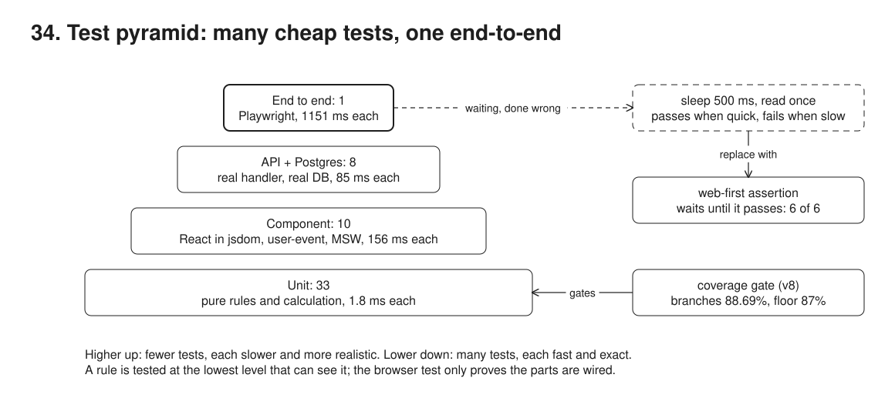
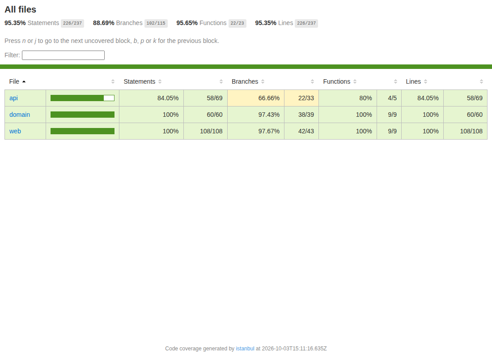
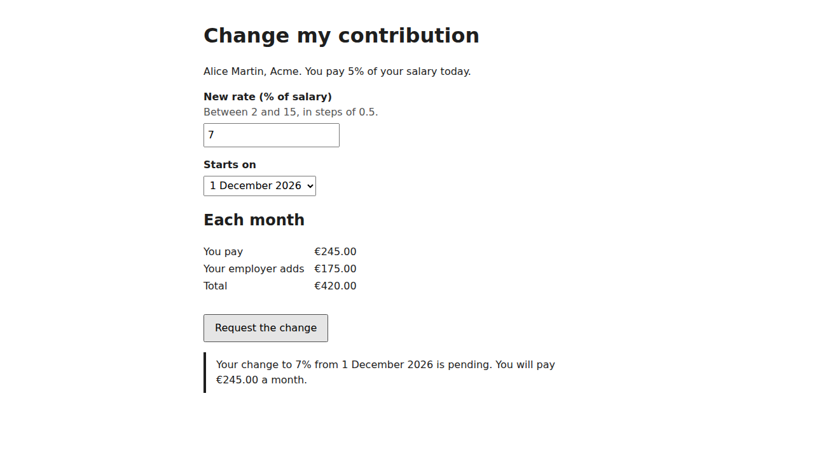

# 34. Test pyramid



**Pain: slow, flaky, end-to-end-only tests.** When every rule is checked through a browser, each check pays for a page load, a server and a database: in this run the one end-to-end test costs 1151 ms on its own and 9.3 s with its start-up, while 33 unit tests of the same rules take 61 ms together. Browser tests that wait with a fixed sleep pass on a quiet machine and fail on a busy one: the same test here passes 3 times and fails 3 times in 6 runs, with no code change. And with no coverage gate, deleting a test file goes unnoticed: here it drops branch coverage from 88.69% to 84.68%, and the gate fails the run.

**Reach for it when** a feature has rules (validation, calculation, dates), a UI and a database, and you want a suite that stays fast and trustworthy as it grows: each rule tested once at the lowest level that can see it, and a few end-to-end tests that only prove the parts are wired together.

**Do not reach for it when** the code is a thin layer with no rules of its own (a CRUD screen over a well-tested API): an integration-heavy "trophy" shape gives more confidence per test there. Do not chase the coverage number either: the gate catches tests that disappear, not tests that check nothing.

One small feature, a member changing their contribution rate, tested at each level. The rules are pure functions in `src/domain/contribution.ts` (rate 2-15% in steps of 0.5, start on the first of a month within six months, employer match capped at 5%). A React form uses them for its live preview and its errors; an API on `node:http` uses them again and leaves "one pending change per member" to a partial unique index in Postgres. Vitest runs three projects (unit in Node, component in jsdom with Testing Library, user-event and MSW, API against a real Postgres 16 in Docker); Playwright runs one smoke test in Chromium. The demo runs each level on its own and times it, draws the shape, shows a flaky wait next to a robust one, and runs the coverage gate twice.

## Run

One shot with proof: `./run.sh` in this folder, or `./34-test-pyramid/run.sh` from the repo root (log in [`../logs/34-test-pyramid.log`](../logs/34-test-pyramid.log)).

By hand (Postgres on 55464, the app on 53044):

```sh
docker compose up -d --wait
npm i
npm run setup            # database pyramid: three members of Acme, Globex, Initech
npm run build            # esbuild bundles the form into public/app.js
npm run server           # the form and the API on :53044 (LATENCY_MS=0,1000 delays POSTs in turn)
npm run test:unit        # each level on its own: test:unit, test:component, test:api (needs Postgres), test:e2e (starts the server)
npm run coverage         # every Vitest level with the thresholds; HTML in out/coverage/
npm run demo             # the whole story; writes out/levels.json and out/pyramid.svg
```

Playwright uses the Chromium in `PLAYWRIGHT_BROWSERS_PATH`.

## Files

- `src/domain/contribution.ts` the rules: `parseRate`, `rateError`, `effectiveFromError`, `validateChange`, `monthlyPreview`, `startOptions`.
- `src/domain/contribution.test.ts` unit level, 33 tests (boundaries as `it.each` tables).
- `src/web/ContributionForm.tsx` the React form: preview, errors tied to fields, status and alert regions.
- `src/web/api.ts` the browser's `fetch` calls, resolved against the page URL (so MSW can answer under jsdom).
- `src/web/mocks.ts`, `src/web/setup.ts` MSW handlers and the jsdom setup (unhandled requests fail the test).
- `src/web/ContributionForm.test.tsx` component level, 10 tests.
- `src/web/main.tsx`, `public/index.html` the page the browser loads.
- `src/api/app.ts` the API: GET a member, POST a change (422 field errors, 409 on a pending change), static files.
- `src/api/db.ts` schema (CHECK, partial unique index), seed, `recreate()`.
- `src/api/app.int.test.ts` API level against Postgres, 8 tests.
- `src/server.ts`, `src/setup.ts` the app on :53044 and its database.
- `e2e/smoke.spec.ts` the one end-to-end test. `e2e/flaky.spec.ts` the flaky and robust waits (run only by the demo).
- `vitest.config.ts` the three projects and the coverage thresholds. `playwright.config.ts` one worker, the app as `webServer`.
- `src/chart.ts` draws `out/pyramid.svg` from `out/levels.json`.
- `src/demo.ts` the seven steps and their checks.
- `out/levels.json`, `out/pyramid.svg`, `out/coverage/` the measurements, the chart and the coverage report from the last run.

## Concepts

- **Test pyramid**: many small, fast, exact tests at the bottom; fewer, slower, broader ones above; very few end-to-end tests at the top. Here 33 unit, 10 component, 8 API and 1 end-to-end test: 83% of the tests run without a server or a database.
- **Lowest level that can see it**: a date window or a rounding rule is a unit test (1.9 ms each here); an error tied to its field, focus and keyboard use are component tests; SQL, numeric columns returned as strings, constraints and concurrency are API tests; "the page, the bundle, the API and the database are wired together" is the one thing only the browser test can see.
- **Unit level**: pure functions, no DOM, no network, no database. `it.each` tables walk every boundary (1.5% and 2%, 15% and 15.5%, this month and the sixth month ahead, 30 February).
- **Component level**: the real React component in jsdom. Testing Library queries by role, label and accessible description, what a screen reader announces, so a test breaks when the form stops being usable, not when a class name changes. user-event types, tabs and clicks with the real event sequence. `toHaveAccessibleDescription` proves the error is tied to its field.
- **MSW (Mock Service Worker)**: intercepts `fetch` at the network layer, so the component code is the code that ships; a test overrides one handler (`server.use`) for the 422 or 409 case, and `onUnhandledRequest: "error"` fails any call nobody mocked. The handlers return the shapes the API tests pin down.
- **API integration level**: the real handler over HTTP against Postgres 16 in Docker, in a database of its own, truncated before each test. Two concurrent POSTs prove that the partial unique index, not the application code, enforces one pending change per member.
- **End-to-end smoke test**: one journey in Chromium (fill, preview, submit, reload, still pending). It is a smoke test: if it fails, something is not wired; the levels below say what.
- **Flaky wait versus web-first assertion**: `waitForTimeout(500)` then reading the text once encodes one machine's speed into the test. With the server answering at once, then after 1000 ms, it passes and fails in turn. `await expect(locator).toContainText(...)` retries until the text appears or the timeout passes, so it passes every time, and on a fast answer it finishes sooner than the sleep (768 ms versus 1198 ms here). Sample 22 covers locators and waiting in more depth.
- **Count and time per level**: wall time is what CI pays for a level, start-up included (Vitest and jsdom start-up, the browser and the web server); the tests' own time divided by the count says where one more test is cheapest. In this run a component test (155 ms) costs more than an API test against a local Postgres (85 ms): jsdom rendering plus user-event typing is not free, which is why the rules themselves live in the unit level.
- **Coverage gate**: `@vitest/coverage-v8` measures the three Vitest levels together, and `thresholds` (lines, statements and functions 90%, branches 87%) make Vitest exit 1 when coverage falls. Running without the unit tests shows the drop: branches 84.68%, run failed. Coverage tells you which lines no test executed (here the static-file branch of `app.ts`, which only the browser test reaches, and its unexpected-error path); it cannot tell you whether a test checked anything.
- **Trade-offs**: per-test time on this machine varies from run to run (other jobs share it), so the checks assert the shape, not the numbers. A component test with MSW can pass while the real API changed shape: that is what the API tests, or a contract test (sample 33), are for.

## Proof (`logs/34-test-pyramid.log`)

Count and time per level, each level run on its own:

```
   level            tests    wall tests' own  per test
   End to end           1   9.3 s    1151 ms 1151.0 ms
   API + Postgres       8   5.7 s     678 ms   84.8 ms
   Component           10   6.9 s    1555 ms  155.5 ms
   Unit                33   4.7 s      61 ms    1.9 ms
   52 tests: 83% below the API, 2% end to end
```

The database decides between two concurrent requests:

```
   |  ✓ |api| src/api/app.int.test.ts > POST /api/members/:id/contribution-changes > lets exactly one of two concurrent requests through (the partial unique index decides) 165ms
 CREATE UNIQUE INDEX one_pending_change ON public.contribution_changes USING btree (member_id) WHERE (status = 'pending'::text)
```

The same sleep-based test, six runs, no code change; the web-first assertion passes all six:

```
   sleep + read once:     0ms:pass 1000ms:FAIL 0ms:pass 1000ms:FAIL 0ms:pass 1000ms:FAIL
   web-first assertion:   0ms:pass 1000ms:pass 0ms:pass 1000ms:pass 0ms:pass 1000ms:pass
flaky: passed 1407ms, failed 1416ms, passed 1198ms, failed 1281ms, passed 1530ms, failed 1282ms
robust: passed 1209ms, passed 2724ms, passed 768ms, passed 2319ms, passed 1071ms, passed 3080ms
```

The coverage gate passes with every level, and fails when the unit tests are gone:

```
   totals: lines 95.35%, statements 95.35%, functions 95.65%, branches 88.69%; HTML report in out/coverage/index.html
   | ERROR: Coverage for branches (84.68%) does not meet global threshold (87%)
   -> exit 1 in 7.0 s
```

## Screenshots

The pyramid as measured ([`out/pyramid.svg`](out/pyramid.svg), drawn from [`out/levels.json`](out/levels.json)):


The coverage report ([`out/coverage/index.html`](out/coverage/index.html)):



The form at the end of the end-to-end journey:



## Do / Don't

- Do put each rule in a pure function and test its boundaries there; the UI and the API call the same function.
- Do query by role and label in component and browser tests; a test that cannot find the button by its name has found an accessibility bug.
- Do give each test its own data (truncate, or a database per worker as in sample 22) so tests do not depend on order.
- Don't sleep in a test; wait for the thing you expect, with a web-first assertion.
- Don't test every validation message through the browser; one journey per outcome at most.
- Don't lower the threshold to make a failing gate pass; find which tests went missing.

## Origins and further reading

- Mike Cohn, *Succeeding with Agile* (2009), where the test automation pyramid was introduced.
- Martin Fowler, "TestPyramid": https://martinfowler.com/bliki/TestPyramid.html
- Ham Vocke, "The Practical Test Pyramid": https://martinfowler.com/articles/practical-test-pyramid.html
- Kent C. Dodds, "The Testing Trophy and Testing Classifications": https://kentcdodds.com/blog/the-testing-trophy-and-testing-classifications
- Testing Library, guiding principles and query priority: https://testing-library.com/docs/queries/about#priority
- user-event: https://testing-library.com/docs/user-event/intro
- Mock Service Worker: https://mswjs.io/docs/
- Vitest projects and coverage thresholds: https://vitest.dev/guide/projects and https://vitest.dev/config/#coverage-thresholds
- Playwright, auto-waiting and web-first assertions: https://playwright.dev/docs/test-assertions
- Google Testing Blog, "Just Say No to More End-to-End Tests" (2015): https://testing.googleblog.com/2015/04/just-say-no-to-more-end-to-end-tests.html
