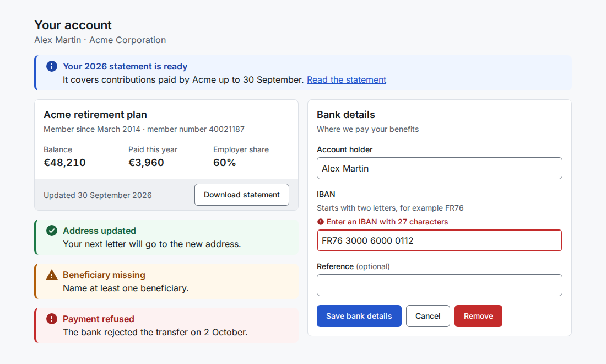
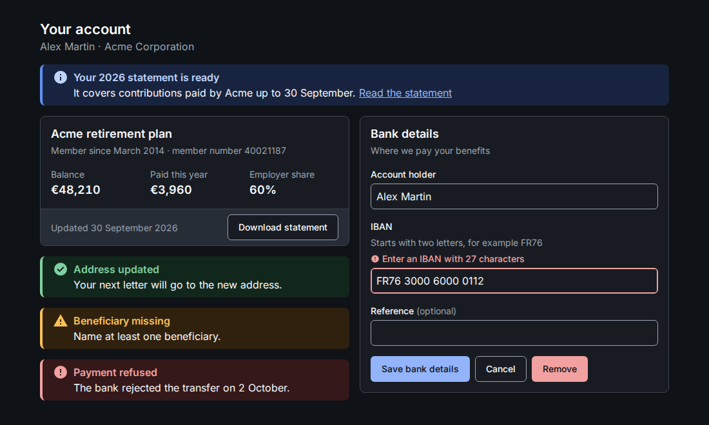
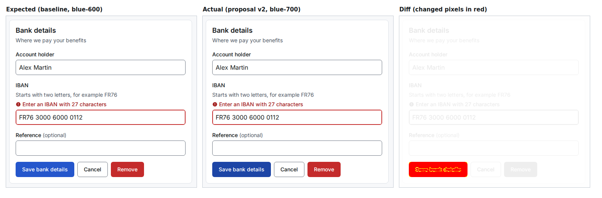
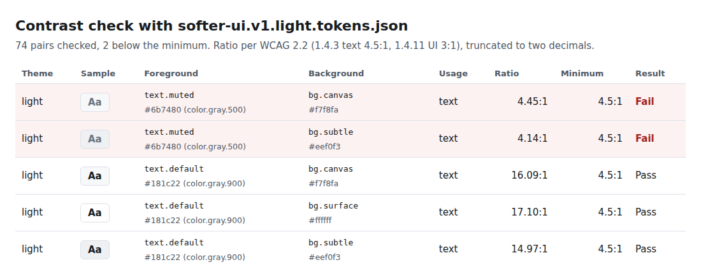
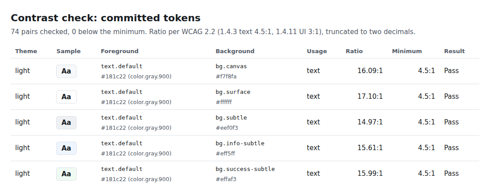

# 35. Design tokens



**Pain: inconsistent, inaccessible UI.** Every screen picks its own grey and its own blue, and nobody can say which of them pass contrast. A designer softens secondary text to gray-500, checks it on white (4.73:1, fine) and ships it; on the page background it is 4.45:1 and on card footers 4.14:1, both under the 4.5:1 that WCAG asks for body text. Dark mode is a second stylesheet that drifts. A rebrand that darkens the primary blue is merged without anyone seeing which screens change, and Playwright's default screenshot tolerance does not notice it either.

**Reach for it when** more than one screen, team or app shares a look: a component library, a portal with a dark mode, a product that will be rebranded, a design file that changes while code ships. Tokens give design and code one source, and the checks make "accessible" a build failure rather than an audit finding.

**Do not reach for it when** the UI is one small app with a handful of styles: a CSS file with a few custom properties is enough. Do not expect the contrast gate to replace an accessibility audit: it checks colour pairs you declared, not focus order, labels or screen reader output (axe sees some of that, a person must check the rest). Screenshot baselines are only valid for one browser build and one OS: run them in the same container image everywhere, or they fail on font hinting.

The tokens live in `tokens/` in the W3C Design Tokens format (DTCG 2025.10), the JSON a design tool exports for its variables: a primitive layer (colour ramps, a 4 px size scale, type) and a semantic layer that says what a value is for (`color.text.muted`, `space.md`, `radius.control`), with one semantic colour file per theme. A small build (`src/tokens/build.ts`) resolves aliases and writes `out/tokens.css`: primitives and semantic tokens as CSS custom properties, the light theme on `:root`, the dark theme under `prefers-color-scheme: dark` and under `[data-theme="dark"]`. A contrast gate computes the WCAG ratio of every declared foreground/background pair in both themes. Four React components (button, text field with label, hint and error, alert, card) are styled only with semantic tokens. A static Storybook shows them; Playwright runs axe-core on every story in both themes and compares every story with a committed screenshot. The demo feeds two proposals from the design file through all of it: the first is caught by the contrast gate (and by axe), the second passes contrast but is caught by visual regression.

## Run

One shot with proof: `./run.sh` in this folder, or `./35-design-tokens/run.sh` from the repo root (log in [`../logs/35-design-tokens.log`](../logs/35-design-tokens.log)). No Docker; Chromium comes from `PLAYWRIGHT_BROWSERS_PATH` (`/opt/pw-browsers` by default).

By hand, in `35-design-tokens/`:

```sh
npm i
npm run tokens            # tokens/*.tokens.json -> out/tokens.css
npm run contrast          # the gate; add --proposal tokens/proposals/softer-ui.v1.light.tokens.json to see it fail
npm run storybook         # Storybook dev server on :53145, with the a11y panel and a light/dark toolbar switch
npm run build-storybook   # static Storybook in storybook-static/
npm run serve             # serves storybook-static/ on :53045
npx playwright test       # axe and screenshots on every story x theme (starts the :53045 server itself)
npm run demo              # the whole story below, with checks
```

## Files

- `tokens/primitives.tokens.json` colour ramps (gray, blue, green, amber, red) as DTCG `srgb` colour objects, the size scale, font family, sizes, weights and line heights.
- `tokens/semantic.tokens.json` spacing, radii, border widths, focus ring, control height and text roles, all aliases into the primitives.
- `tokens/theme.light.tokens.json`, `tokens/theme.dark.tokens.json` the semantic colours (backgrounds, text, borders) per theme; same names, different primitives.
- `tokens/contrast.pairs.json` which foreground token is drawn on which background, as text (4.5:1) or UI (3:1); `color.border.default` is declared decorative.
- `tokens/proposals/softer-ui.v1.light.tokens.json` the design file's first export: muted text gray-500, accent blue-700. Fails contrast.
- `tokens/proposals/softer-ui.v2.light.tokens.json` the second export: accent blue-700 only. Passes contrast, changes pixels.
- `src/tokens/dtcg.ts` the DTCG reader: groups, inherited `$type`, alias resolution with cycle detection, colour, dimension, font and duration values to CSS.
- `src/tokens/build.ts` writes `out/tokens.css` (layers, theme selectors, theme parity check).
- `src/tokens/wcag.ts` relative luminance and contrast ratio, as the WCAG glossary defines them.
- `src/tokens/contrast-check.ts` the gate (CLI, exit 1 on failure) and the HTML report.
- `src/components/` `Button`, `TextField`, `Alert`, `Card`, inline icons, and `components.css` (only `var(--semantic-token)`).
- `src/stories/*.stories.tsx` the stories, one per state, and `Gallery` (a member account screen with every component).
- `.storybook/` Storybook 10 config: the a11y addon, the theme toolbar, `out/` served as `tokens/` so the token file is swappable.
- `e2e/a11y.spec.ts` axe-core (`@axe-core/playwright`) on every story in both themes. `e2e/visual.spec.ts` `toHaveScreenshot` on every story in both themes. `e2e/stories.ts` reads the story list from `storybook-static/index.json`.
- `e2e/__screenshots__/` the committed baselines (28 PNGs).
- `playwright.config.ts` the screenshot settings (threshold 0, no diff pixels allowed) and the static server.
- `src/serve.ts` a static file server for `storybook-static/` on :53045. `src/demo.ts` the nine steps and their checks.
- `out/tokens.css` the generated custom properties. `out/contrast.html`, `out/contrast-softer-ui-v1.html` the contrast reports.

## Concepts

- **Design token**: a named design decision (a colour, a spacing, a font size) stored as data, not in a stylesheet, so a design tool, a build and a test can all read it. The W3C Design Tokens Community Group format is JSON: a token is an object with `$value` and `$type` (`color`, `dimension`, `fontFamily`, ...), groups nest, a group's `$type` is inherited, and `"{color.gray.600}"` is an alias to another token. Since 2025.10 a colour is an object with a colour space and components, and a dimension is `{value, unit}`.
- **Primitive and semantic layers**: primitives are the palette and the scales (`color.gray.600`, `size.6`); they say nothing about use. Semantic tokens name a purpose (`color.text.muted`, `space.md`) and point at a primitive. Components read only semantic tokens (the demo checks it), so a theme or a rebrand changes the token files and nothing else.
- **Themes as modes**: light and dark are two files with the same semantic names pointing at different primitives (a design tool calls them modes). The build checks they define the same names, then emits the dark set twice: under `@media (prefers-color-scheme: dark)` for members who set it in their OS, and under `[data-theme="dark"]` for a toggle in the page. `color-scheme` is set too, so form controls and scrollbars follow.
- **Aliases kept as references**: `--color-text-muted: var(--color-gray-600)` rather than a copied hex, so the CSS shows the same layering as the tokens and a primitive changed in DevTools changes everything that uses it.
- **WCAG contrast ratio**: (L1 + 0.05) / (L2 + 0.05), where L is the relative luminance of each colour (sRGB channels linearised, weighted 0.2126, 0.7152, 0.0722). 1.4.3 asks 4.5:1 for text and 3:1 for large text (24 px, or 18.66 px bold); 1.4.11 asks 3:1 for the boundary of a control and a focus indicator. The ratio is compared without rounding up: 4.456 is not "at least 4.5".
- **Contrast pairs**: a colour has no contrast on its own, only against what it is drawn on. `contrast.pairs.json` lists every pair the components use, in both themes (74 here). A text or border token missing from the list fails the gate, so a new token cannot skip it.
- **axe per story**: the gate checks declared pairs; axe-core checks what the browser actually painted, plus what tokens cannot see (a missing label, a wrong ARIA role). Running it on every story in both themes finds a regression in the one component that has it. Storybook's a11y addon runs the same engine in a panel while you work.
- **Visual regression**: a screenshot of each story compared pixel by pixel with a committed baseline (`toHaveScreenshot`, pixelmatch underneath). A token change that is accessible can still be unwanted; the failing test and its diff image make someone decide. Accepting it means committing the token file and the new baselines (`--update-snapshots`) in the same change. The per-pixel threshold matters: at Playwright's default (0.2) a primary button going from blue-600 to blue-700 does not count as different; this sample uses 0.
- **Static Storybook**: `storybook build` writes plain files: `index.json` lists the stories and `iframe.html?id=<story>&globals=theme:dark` renders one, which is what the tests open. The token CSS is served next to it, not bundled, so the demo swaps token builds without a rebuild.

## Proof (`logs/35-design-tokens.log`)

The build keeps the alias chain and emits the dark theme twice:

```
   66 primitives, 25 semantic, 26 themed colours, 169 declarations in out/tokens.css
   --color-gray-600: #525a66;                     in :root
   --color-bg-accent: var(--color-blue-600);      in :root, [data-theme="light"]
   --color-text-muted: var(--color-gray-600);     in :root, [data-theme="light"]
   --color-bg-accent: var(--color-blue-300);      in :root:not([data-theme="light"]) (in the dark media query)
   --color-text-muted: var(--color-gray-400);     in :root:not([data-theme="light"]) (in the dark media query)
   --color-bg-accent: var(--color-blue-300);      in [data-theme="dark"]
   --color-text-muted: var(--color-gray-400);     in [data-theme="dark"]
```

The first proposal passes on white and fails on the two other backgrounds muted text sits on; the CLI exits 1:

```
   FAIL  light  text.muted         on bg.canvas          #6b7480 / #f7f8fa   4.45:1  (min 4.5:1 text)
   FAIL  light  text.muted         on bg.subtle          #6b7480 / #eef0f3   4.14:1  (min 4.5:1 text)
   contrast: 74 pairs in 2 themes, 2 below the minimum, 0 unchecked tokens
   exit code 1
   ok: the gate exits 1 and names the two pairs: muted on canvas (4.45:1) and on subtle; on white it passes (4.73:1)
   ok: 4.4559 is reported as 4.45:1 and fails: the ratio is truncated, never rounded up to 4.5
```

With that proposal served, axe finds the same two colours in the rendered stories, and only in the light theme:

```
   components-card--member-summary light      color-contrast x1: Element has insufficient color contrast of 4.14 (foreground color: #6b7480, background color: #eef0f3, ...
   gallery--member-account light              color-contrast x2: Element has insufficient color contrast of 4.45 (foreground color: #6b7480, background color: #f7f8fa, ...
```

The second proposal passes the gate and is caught by the screenshots; at the default threshold it would have gone through:

```
   changed: components-button--primary light: 4774 pixels (ratio 0.12 of all image pixels) are different.
   changed: gallery--member-account light: 5742 pixels (ratio 0.01 of all image pixels) are different.
   ok: proposal v2 (contrast OK) is caught: 2 screenshots differ, all in the light theme, all with a primary button
   the same comparison at Playwright's default per-pixel threshold (0.2): 0 of 28 fail
```

## Screenshots

The component gallery (Storybook story `Gallery / Member account`), light and dark, both from the same components and the same token names:





The visual regression caught for proposal v2 (cropped to the form card; the full-page diff is `screenshots/visual-diff-gallery-full.png`):



The contrast report for proposal v1, failures first (`out/contrast-softer-ui-v1.html`), and for the committed tokens (`out/contrast.html`):





## Do / Don't

- Do name semantic tokens by purpose (`text.muted`), never by value (`gray-dark`); components read only those.
- Do declare where each foreground is used; check every pair in every theme, not the one on white.
- Do commit screenshot baselines and update them in the same change as the tokens, from the same container image.
- Don't round a contrast ratio up before comparing it. Don't rely on the default screenshot threshold to catch colour changes.
- Don't put raw hex values or pixel sizes in component CSS; the demo fails the build on them.

## Origins and further reading

- [Design Tokens Format Module 2025.10](https://www.designtokens.org/tr/drafts/format/) (W3C Design Tokens Community Group) and the [colour module](https://www.designtokens.org/tr/drafts/color/).
- [WCAG 2.2](https://www.w3.org/TR/WCAG22/): [1.4.3 Contrast (Minimum)](https://www.w3.org/WAI/WCAG22/Understanding/contrast-minimum.html), [1.4.11 Non-text Contrast](https://www.w3.org/WAI/WCAG22/Understanding/non-text-contrast.html), the [relative luminance](https://www.w3.org/TR/WCAG22/#dfn-relative-luminance) and [contrast ratio](https://www.w3.org/TR/WCAG22/#dfn-contrast-ratio) definitions.
- [Style Dictionary](https://styledictionary.com/), the common token build tool, with DTCG support; `src/tokens/` does the same for this sample's needs.
- [Storybook](https://storybook.js.org/docs) and its [accessibility addon](https://storybook.js.org/docs/writing-tests/accessibility-testing); [axe-core](https://github.com/dequelabs/axe-core) and [@axe-core/playwright](https://github.com/dequelabs/axe-core-npm/tree/develop/packages/playwright).
- [Playwright visual comparisons](https://playwright.dev/docs/test-snapshots) and [pixelmatch](https://github.com/mapbox/pixelmatch).
- [CSS custom properties](https://www.w3.org/TR/css-variables-1/), [`prefers-color-scheme`](https://www.w3.org/TR/mediaqueries-5/#prefers-color-scheme) and [`color-scheme`](https://www.w3.org/TR/css-color-adjust-1/#color-scheme-prop).
