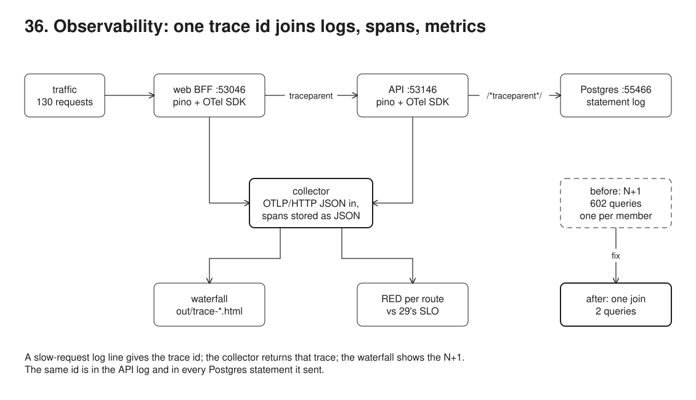
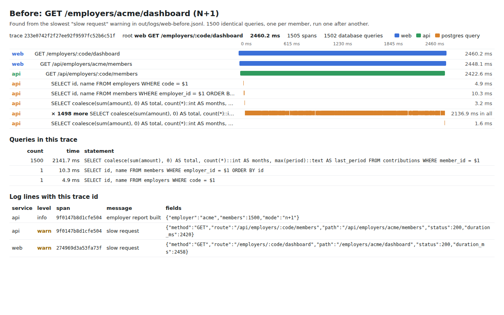
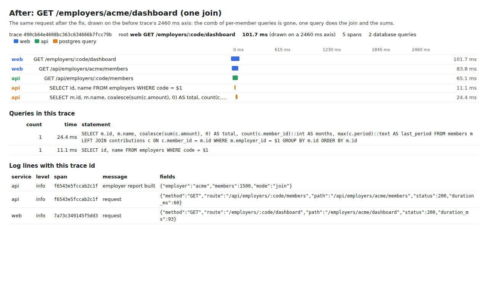
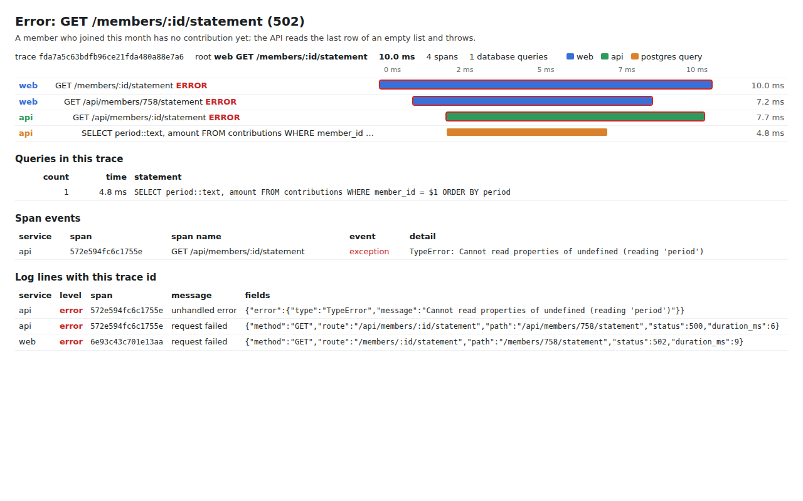

# 36. Observability: logs, traces and RED metrics joined by one trace id



**Pain: an incident nobody can trace.** Members say the Acme employer dashboard is slow. The web process logs "slow request, 970 ms", the API logs "slow request, 967 ms", Postgres logs every statement in well under a millisecond, and nothing ties the three together: which API call, which queries, which of the 130 requests? With a trace id in every log line, the slowest warning leads to one trace of 605 spans: one web request, one API call and 602 queries, 600 of them the same `SELECT ... WHERE member_id = $1`, each fast (median 0.81 ms), run one after another. An N+1. Fixed with one join, the Acme dashboard takes 32 ms instead of 559 ms (median of 10), and the dashboard route goes from 19 of 30 requests within the 300 ms objective to 30 of 30. (Absolute timings move from run to run with the load on the machine; the ratios hold.)

**Reach for it when** a request crosses more than one process (a BFF and an API, a queue and a worker, any service and its database) and "why was this slow" or "why did this fail" needs an answer you can point at. When you have an SLO (29-kpis) and need to know which route spends the error budget, and then why.

**Do not reach for it when** you have one process and a profiler answers the question faster. When you already run a tracing backend: point the same SDK at it (Jaeger, Tempo, Honeycomb, the OpenTelemetry Collector) instead of a hand-written collector; the collector here exists because those images do not pull in this environment. Do not trace every request at full detail in production without sampling: keep the head or tail sampling decision in mind before the bill arrives.

Three processes: a web backend-for-frontend (`src/web.ts`, :53046), an API (`src/api.ts`, :53146) and Postgres (:55466). Both Node processes start with the official OpenTelemetry SDK (`src/telemetry.ts`): the HTTP, undici (fetch), pg and pino instrumentations create spans, carry the W3C `traceparent` header from web to API, append it to every SQL statement as a sqlcommenter comment, and add `trace_id` and `span_id` to every pino log line. Spans and metrics go over OTLP/HTTP (JSON) to a small collector written here (`src/collector.ts`) that stores spans as JSON and answers "give me trace X" and "RED per route". The demo sends the same 130 requests before and after the fix, reads RED per route against 29's latency objective, follows the slowest log line to its trace, draws the trace as a waterfall (`out/trace-*.html`, screenshotted), and does the same for an error.

## Run

One shot with proof: `./run.sh` in this folder, or `./36-observability/run.sh` from the repo root (log in [`../logs/36-observability.log`](../logs/36-observability.log)).

By hand, from this folder:

```sh
docker compose up -d --wait                       # Postgres on :55466, logging every statement
npm install
npm run setup                                     # 760 members (Acme 600, Globex 120, Initech 40), 24 months of contributions
npm run demo                                      # starts the collector, api and web itself; writes out/ and out/logs/
# or run the pieces yourself:
COLLECTOR_PORT=4318 npm run collector
OTEL_SERVICE_NAME=api OTEL_EXPORTER_OTLP_ENDPOINT=http://localhost:4318 REPORT_QUERY=n+1 npm run api   # :53146 (REPORT_QUERY=join for the fix)
OTEL_SERVICE_NAME=web OTEL_EXPORTER_OTLP_ENDPOINT=http://localhost:4318 npm run web                    # :53046
curl localhost:53046/employers/acme/dashboard
curl localhost:4318/api/red; curl localhost:4318/api/traces/<trace_id from the log line>
```

## Files

- `src/telemetry.ts` the OpenTelemetry SDK, preloaded with `--import`: OTLP/HTTP exporters (metrics as deltas), the ESM hook, the four instrumentations, a histogram view with a bucket edge at 300 ms, flush on SIGTERM.
- `src/serve.ts` the router both processes use: route template into the span and the RED histogram (RPC metadata), one pino line per request (`slow request` above 300 ms, `request failed` on 5xx), exceptions recorded on the span.
- `src/web.ts` the BFF: three pages, each built from an API call with `fetch`; an API 5xx becomes a 502.
- `src/api.ts` the API: the employer report (N+1 or one join, `REPORT_QUERY`), a member page, a statement that throws for members with no contribution yet.
- `src/collector.ts` the collector: OTLP/HTTP JSON in, spans flattened to JSON (`.collector/spans.jsonl`), `GET /api/traces/<id>`, `GET /api/red`.
- `src/waterfall.ts` renders one trace as a static HTML waterfall; folds runs of identical sibling spans into one row of ticks; lists the trace's queries, span events and log lines.
- `src/demo.ts` the six steps and their checks. `src/setup.ts`, `src/data.ts`, `src/config.ts` seed, sizes, ports.
- `out/trace-before.html`, `out/trace-after.html`, `out/trace-error.html` the waterfalls, and `out/trace-*.json` their spans as the collector stored them.
- `out/logs/{web,api}-{before,after}.jsonl` the JSON logs of both runs; `out/red.json` RED per route before and after.

## Concepts

- **Three signals**: logs say what one process did, in its words; traces say where the time went across processes; metrics say how often and how bad, cheaply, over all requests. Each answers a different question, and the trace id is what lets you go from one to the other.
- **Trace, span, context**: a trace is one request's tree of spans; a span is one timed operation (a server request, a fetch, a query) with a parent. The SDK keeps the current span in async context, so the pg query span is a child of the API request span without passing anything around.
- **W3C Trace Context**: the `traceparent` header (`00-<trace id>-<parent span id>-<flags>`) carries the context across a process boundary. The undici instrumentation adds it to `fetch`; the HTTP instrumentation on the API reads it and makes its server span a child of the web's client span.
- **sqlcommenter**: the pg instrumentation appends `/*traceparent='00-...'*/` to each statement, so Postgres' own log (or `pg_stat_activity`, or a slow query log) carries the trace id too. Here every one of the 602 statements of the slow trace is found in the Postgres log by its trace id.
- **Log correlation**: the pino instrumentation adds `trace_id`, `span_id` and `trace_flags` to every line logged inside a span. Structured JSON lines make the join a filter (`jq 'select(.trace_id == ...)'`), not a regex.
- **OTLP**: the OpenTelemetry protocol. Over HTTP it is `POST /v1/traces` and `POST /v1/metrics`, protobuf or JSON; ids are hex and timestamps nanoseconds. Any backend that speaks it can replace the collector here without touching the services.
- **Waterfall**: every span of a trace as a bar on one time axis, indented under its parent. An N+1 looks like a comb of short identical bars; one slow query looks like one long bar; waiting on a lock or a pool looks like a gap.
- **N+1 query**: one query for a list, then one per item. Each query is fast (Postgres' log says 42 ms for all 602 executions), but 600 round trips one after another cost close to a second here. The fix is one query that joins and aggregates.
- **RED**: Rate (requests per second), Errors (failed requests), Duration (latency distribution), per route. Here all three come from one standard histogram, `http.server.request.duration`, which the HTTP instrumentation records with `http.route` once the router tells it the route template. The processes export it with delta temporality (each export is what happened since the last), so the collector can start counting at any moment: here, after one warm-up request per route, the way a readiness check warms a process before it takes traffic.
- **Histogram buckets and SLOs**: a histogram keeps counts per bucket, so a p95 is only known as a range ("50-100 ms", or "> 2000 ms" past the last edge). Putting a bucket edge exactly at the objective (300 ms) makes "requests within the objective" an exact count, which is what the SLI of 29-kpis needs: the route meets "95% within 300 ms" or it does not.
- **From SLO to trace**: 29-kpis computes the SLO and the error budget monthly from a request log. RED is the live version of the same SLI per route; when the budget burns, RED says which route, a slow-request log line gives a trace id, and the trace says why.
- **Trade-offs**: instrumentation costs a little per span (the query spans add up to 892 ms of the API span's 968 ms, most of it the client round trips the N+1 itself causes). Statement logging with `log_min_duration_statement=0` is for a demo; in production log only slow statements. The collector keeps everything in memory and one JSON file: fine for a run, not for a week.

## Proof (`logs/36-observability.log`)

RED per route before the fix, counted after one warm-up request per route: only the dashboard misses the objective, and the statement route has 2 errors:

```
   service route                              requests  rate/s  errors  p50           p95           within 300 ms
   web     GET /employers/:code/dashboard           30     3.7       0  50-100 ms     500-1000 ms   19 of 30 (63%)
   web     GET /members/:id                         60     7.6       0  0-5 ms        10-25 ms      60 of 60 (100%)
   web     GET /members/:id/statement               40     5.1       2  0-5 ms        25-50 ms      40 of 40 (100%)
   GET /employers/:code/dashboard: 19 of 30 within 300 ms (63%), objective 95%: MISSED
```

Every log line written inside a request carries the trace id; the slowest warning leads to the API's lines (same trace, its own span), to 602 Postgres statements, and to the trace in the collector:

```
   299 of 299 log lines written while serving a request carry trace_id and span_id (web and api)
   {"level":40,"time":"2026-10-04T05:53:41.606Z","service":"web","trace_id":"e21912b1f2984342bcfb075827d514d3","span_id":"0b4882abb18d30f2","trace_flags":"01","method":"GET","route":"/employers/:code/dashboard","path":"/employers/acme/dashboard","status":200,"duration_ms":970,"msg":"slow request"}
   {"level":40,"time":"2026-10-04T05:53:41.604Z","service":"api","trace_id":"e21912b1f2984342bcfb075827d514d3","span_id":"6133ff38c9e3404e","trace_flags":"01","method":"GET","route":"/api/employers/:code/members","path":"/api/employers/acme/members","status":200,"duration_ms":967,"msg":"slow request"}
   postgres log, grep e21912b1f2984342bcfb075827d514d3: 602 statements, e.g.
   2026-10-04 05:53:40.642 UTC [115] LOG:  duration: 0.093 ms  execute <unnamed>: SELECT coalesce(sum(amount), 0) AS total, count(*)::int AS months, max(period)::text AS last_period FROM contributions WHERE member_id = $1 /*traceparent='00-e21912b1f2984342bcfb075827d514d3-e81504e6f80d4a67-01'*/
   collector, GET /api/traces/e21912b1f2984342bcfb075827d514d3: 605 spans
     web  SERVER GET /employers/:code/dashboard  973.7 ms
     web  CLIENT GET /api/employers/acme/members  parent = web SERVER: true
     api  SERVER GET /api/employers/:code/members  967.9 ms  parent = web CLIENT: true
     api  CLIENT pg.query x 602, all children of the api SERVER span: true
```

The waterfall's diagnosis: hundreds of fast queries, the time spent in round trips:

```
   602 queries; the most repeated, 600 times: SELECT coalesce(sum(amount), 0) AS total, count(*)::int AS months, max(period)::text AS last_period FROM contributions WHERE member_id = $1
   the API span lasts 968 ms; its query spans add up to 892 ms, median 0.81 ms each
   Postgres' own log says executing all 602 took 42 ms: the rest is 600 round trips, one after another
```

After the fix, the same traffic:

```
   web     GET /employers/:code/dashboard           30    23.0       0  10-25 ms      50-100 ms     30 of 30 (100%)
   GET /employers/:code/dashboard: 30 of 30 within 300 ms (100%), objective 95%: met
   trace f62840e38f0094a9212630b0411205de: 5 spans, 2 queries, 52.9 ms (before: 605 spans, 602 queries, 973.7 ms)
   Acme dashboard, median of 10 requests: 559 ms before, 32 ms after (web log duration_ms)
```

An error, from its log line to the exception on the span that threw:

```
   {"level":50,"time":"2026-10-04T05:53:53.570Z","service":"web","trace_id":"fda7a5c63bdfb96ce21fda480a88e7a6","span_id":"6e93c43c701e13aa","trace_flags":"01","method":"GET","route":"/members/:id/statement","path":"/members/758/statement","status":502,"duration_ms":9,"msg":"request failed"}
   span api GET /api/members/:id/statement status ERROR, event exception: TypeError: Cannot read properties of undefined (reading 'period')
```

## Screenshots







## Do / Don't

- Do let the instrumentation libraries create spans and carry context; don't hand-roll `traceparent` parsing.
- Do name server spans and metrics by the route template (`/employers/:code/dashboard`); don't label by raw path (one time series per id).
- Do log JSON with the trace id; don't log a message the next person has to grep with a regex.
- Do put a histogram bucket edge at each latency objective; don't read a p95 off default buckets and call it exact.
- Don't use a trace to count: sample traces, count with metrics.

## Origins and further reading

- Spec: W3C Trace Context (the `traceparent` and `tracestate` headers). https://www.w3.org/TR/trace-context/
- Docs: OpenTelemetry, "Observability primer" and the JavaScript SDK (Node.js, ESM support). https://opentelemetry.io/docs/concepts/observability-primer/ and https://opentelemetry.io/docs/languages/js/
- Spec: OTLP, the OpenTelemetry protocol (OTLP/HTTP, JSON encoding). https://opentelemetry.io/docs/specs/otlp/
- Spec: OpenTelemetry semantic conventions for HTTP metrics (`http.server.request.duration`, `http.route`). https://opentelemetry.io/docs/specs/semconv/http/http-metrics/
- Spec: sqlcommenter (trace context in SQL comments). https://google.github.io/sqlcommenter/
- Paper: "Dapper, a Large-Scale Distributed Systems Tracing Infrastructure", Sigelman et al., Google, 2010. https://research.google/pubs/dapper-a-large-scale-distributed-systems-tracing-infrastructure/
- Article: "The RED Method: key metrics for microservices architecture", Tom Wilkie, 2018. https://grafana.com/blog/2018/08/02/the-red-method-how-to-instrument-your-services/
- Book: *Site Reliability Engineering*, chapter 6 "Monitoring Distributed Systems" (the four golden signals) and chapter 4 "Service Level Objectives" (the SLO 29-kpis computes). https://sre.google/sre-book/monitoring-distributed-systems/
