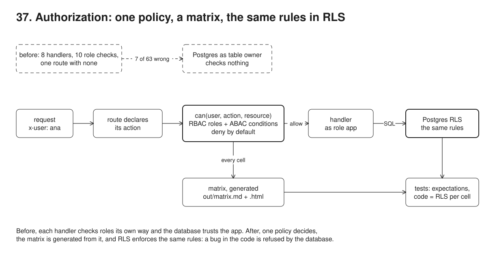
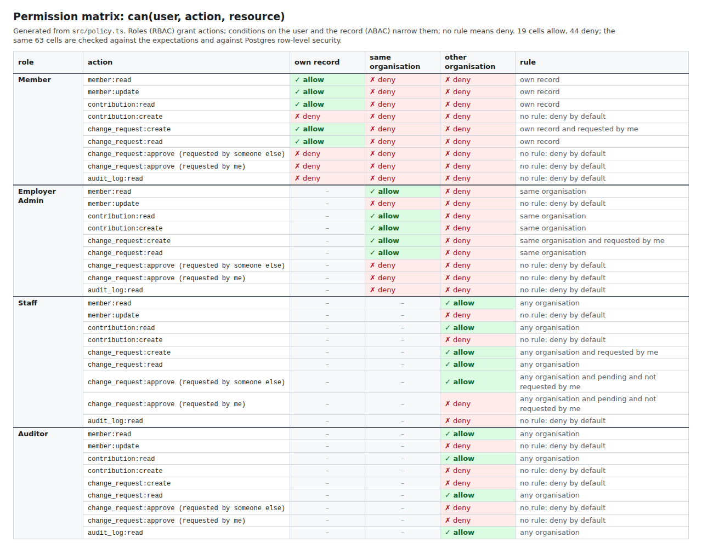

# 37. Authorization: one policy, a permission matrix, the same rules in Postgres RLS



**Pain: permission checks scattered and inconsistent.** The "before" app has 8 routes and 10 lines comparing `user.role`, each written its own way. Asked the 63 questions of the permission matrix over HTTP, it answers 7 wrongly: the contributions route was added later without a check, so a member reads other members' contributions (3 cells); an Acme admin submits contributions for a Globex member; staff approve a bank account change they asked for themselves; staff read the audit trail of their own work; an auditor files change requests. Nobody can say what the rules are without reading every handler, and the database trusts whatever the app sends.

**Reach for it when** more than a couple of roles share the same records and the answer depends on the record, not just the role: whose record it is, which organisation it belongs to, who asked for a change. When auditors or a partner organisation ask "who can do what", and you want to answer with a table generated from the code rather than a wiki page. When one missed check would leak another organisation's data, so a second layer in the database is worth its cost.

**Do not reach for it when** the app has one role, or every user sees everything they can reach (an internal tool behind SSO). When relationships are deep and many (folders shared with groups of groups, Google Docs style): use a relationship-based system (Zanzibar, OpenFGA, SpiceDB) instead of hand-written conditions. When several services must share the rules: put them in a policy engine (OPA/Rego, Cedar) the services all ask. RLS is also no fit when the app reaches the data through something that cannot carry the user's identity per transaction (some poolers in statement mode, a shared reporting user).

The code has one function, `can(user, action, resource)`, in `src/policy.ts`: a table from each role (member, employer admin, staff, auditor) to the actions it may perform, each guarded by a named condition on the user and the resource (own record, same organisation, pending, not requested by me). No entry means deny. `src/matrix.ts` asks `can()` every role x action x relationship and writes the permission matrix as Markdown and HTML. The "after" app (`src/app.ts`) declares an action and a resource loader on every route, and one wrapper calls `can()` before any handler runs; a route without an action refuses to start. Its queries run as a login role `app` that does not own the tables, with the user's identity set for the transaction, so the row-level security policies in `src/schema.sql` apply the same rules again. Two tests check the matrix against hand-written expectations and the database against the code, cell by cell. The demo then plants a bug in the resource loader that no policy test can see, and shows Postgres refusing it.

## Run

One shot with proof: `./run.sh` in this folder, or `./37-authorization/run.sh` from the repo root (log in [`../logs/37-authorization.log`](../logs/37-authorization.log)).

By hand, from this folder:

```sh
docker compose up -d --wait          # Postgres on :55467
npm install
npm run setup                        # schema, RLS policies, 8 users, 4 members (Acme, Globex, Initech)
npm run matrix                       # out/matrix.md and out/matrix.html from the policy
npm test                             # matrix vs expectations, code vs RLS on every cell
npm run demo                         # the six steps (serves HTTP on :53047 while it runs)
MODE=sprinkled npm run server        # or MODE=policy; then:
curl -H 'x-user: ana' localhost:53047/members/m-gil/contributions
```

Users: `ana`, `ben` (Acme members), `gil` (Globex member), `ivo` (Initech member), `erin` (Acme employer admin), `sam`, `sky` (staff), `aud` (auditor).

## Files

- `src/policy.ts` the policy: roles, actions, named conditions, `RULES`, `can()`, `relationship()`.
- `src/matrix.ts` generates the matrix (108 cells) from `can()`; writes `out/matrix.md` and `out/matrix.html`.
- `src/schema.sql` tables, the `app` role, `rel()` and `can_read_member_data()`, the RLS policies, column grants.
- `src/sprinkled.ts` the "before" app: role checks in each handler, connected as the table owner.
- `src/app.ts` the "after" app: `guard()` (declared action, loader, `can()`, RLS transaction, disagreement log) and the 8 routes; `loadChangeRequest()` carries the demo bug behind a switch.
- `src/cells.ts` one cell asked of the database (`dbAllows`, rolled back) and over HTTP (`httpCall`).
- `src/db.ts` the owner and `app` connections, `setUser()` (transaction-local settings), `asUser()`.
- `src/http.ts` a minimal node:http router; identity comes from an `x-user` header.
- `src/fixtures.ts` the users and member records every part shares.
- `src/setup.ts`, `src/server.ts`, `src/demo.ts` setup, a server for hand runs, the six steps and their checks.
- `test/matrix.test.ts` every cell against the hand-written table, and deny-by-default cases.
- `test/rls.test.ts` every live cell: code and database agree; the loader bug that only RLS catches.
- `out/matrix.md`, `out/matrix.html` the generated matrix; `screenshots/matrix.png` its screenshot.

## Concepts

- **Authorization versus authentication**: authentication says who the user is (26-sso does it with OpenID Connect); authorization decides what that user may do to this record. Here the user is a header naming a seeded user, so the sample is only about the second question.
- **RBAC**: role-based access control. A role grants a set of actions (`member:read`, `change_request:approve`). Easy to read and to audit, but a role alone cannot say "only your own record" or "only your employer's members".
- **ABAC**: attribute-based access control. A condition on attributes of the user (organisation, member record, id) and of the resource (organisation, member, requester, status) narrows each grant. Here each role's action has exactly one named condition, built from small ones with `all()` and `not()`, so the matrix can print the rule next to the verdict.
- **Deny by default**: no rule, no access. An unknown role (`contractor`), an action nobody was granted (`member:delete`), a missing user, an action aimed at the wrong kind of resource: all false. Rules are looked up with `Object.hasOwn`, so `__proto__` or `constructor` are not rules. In Postgres, RLS with no policy for a command allows nothing; at the routing level, a route without a declared action refuses to start.
- **Four eyes**: a change is approved by someone other than the person who asked for it. In the policy it is a condition (`pending and not requested by me`); in the database it is the `WITH CHECK` of the approve policy (`requested_by <> app_user()`). Staff filing a change on a member's behalf is exactly the case it exists for.
- **Policy decision point and enforcement point**: `can()` decides (PDP); the `guard()` wrapper enforces (PEP) once, for every route, instead of each handler deciding in its own words. The loaders are the policy information point: they read the attributes the decision needs with the owner's rights, because whether the user may read the row is what is being decided.
- **Permission matrix**: every role x action x relationship of the record to the user (own record, same organisation, other organisation), answered by `can()`. Generated, never edited by hand; committed so a reviewer sees a policy change as a diff in a table. `–` marks a relationship that cannot exist for the role (staff have no member record).
- **Expectations test**: `test/matrix.test.ts` holds the matrix again as a plain table written by hand. A change to the policy that moves any cell fails there, so the change has to be made twice, on purpose.
- **Row-level security**: `ENABLE ROW LEVEL SECURITY` plus policies per command. `USING` filters which existing rows a statement sees (a denied read returns no row, not an error); `WITH CHECK` validates new or changed rows (a denied write raises `42501`). Policies apply to roles that neither own the table nor have `BYPASSRLS`, which is why the app logs in as `app`. Grants come first: `app` may only `UPDATE (address)` on members and `UPDATE (status, approved_by)` on change requests.
- **Identity per transaction**: `set_config('app.user_id', ..., true)` (and role, organisation, member record) is local to the transaction, so a pooled connection never carries the previous user's identity (15-multi-tenancy uses the same `SET LOCAL` pattern for tenants). `rel()` is the matrix's relationship in SQL; it is `SECURITY DEFINER` so it can read a record's organisation that the user may not read.
- **Defence in depth**: the code check gives clear 403s with the rule that failed and protects every route; RLS protects the data even when the code is wrong. When they disagree (code allowed, database refused), the app refuses and logs it, because that is a bug in one of the two.
- **Trade-offs**: the rules live in two languages (TypeScript and SQL), so they can drift; the cell-by-cell test is what keeps them together. RLS conditions run per row: keep them to indexed columns and cheap functions. Error messages from RLS are generic; the code check is what explains a refusal to the user.

## Proof (`logs/37-authorization.log`)

The sprinkled app, asked the 63 live cells of the matrix over HTTP, gets 7 wrong; the first three are the route with no check:

```
   src/sprinkled.ts: 8 routes, 10 lines comparing user.role, 1 route with no check at all
   sprinkled app: 63 requests, one per matrix cell; 56 answered as the policy says, 7 did not
     WRONG ana  (member) contribution:read on same organisation (m-ben): GET /members/m-ben/contributions -> 200, policy says deny
     WRONG ana  (member) contribution:read on other organisation (m-gil): GET /members/m-gil/contributions -> 200, policy says deny
     WRONG erin (employer_admin) contribution:read on other organisation (m-gil): GET /members/m-gil/contributions -> 200, policy says deny
     WRONG erin (employer_admin) contribution:create on other organisation (m-gil): POST /members/m-gil/contributions -> 201, policy says deny
     WRONG sam  (staff) change_request:approve (requested by me) on other organisation (m-gil): POST /change-requests/21/approve -> 200, policy says deny
     WRONG sam  (staff) audit_log:read on other organisation (m-gil): GET /members/m-gil/audit-log -> 200, policy says deny
     WRONG aud  (auditor) change_request:create on other organisation (m-gil): POST /members/m-gil/change-requests -> 201, policy says deny
```

Deny by default, in the policy and at the routing level:

```
   unknown role "contractor": 0 of 63 cells allowed
   no user: can(null, "member:read", ...) = false; unknown action "member:delete" = false
   a route registered without an action: route DELETE /members/:id declares no action: refusing to start (deny by default)
```

The policy app answers every cell as the matrix says, with no role check in a handler; the database agrees with the code on every cell:

```
   src/app.ts: 8 routes, 0 lines comparing user.role; every route names one of 8 actions
   policy app: 63 requests, one per matrix cell; 63 answered as the policy says, 0 did not
   63 of 63 cells: code and database agree
   as ana: SELECT id FROM members -> m-ana (RLS filters, the query does not fail)
   as sam, approving the request sam filed -> 42501 new row violates row-level security policy for table "change_requests"
```

The bug only RLS catches: the loader takes the requester from the member the request is about. Without RLS, sam approves his own request; with RLS, the database refuses and the disagreement is logged; with the loader fixed, the code refuses first:

```
   buggy loader, database not enforcing (connected as owner, like the sprinkled app):
     change_requests row: {"id":79,"member_id":"m-gil","requested_by":"sam","status":"approved","approved_by":"sam"}
   buggy loader, RLS on:
     sam files a bank account change for Gil -> 201; sam approves it -> 403 {"error":"forbidden","why":"refused by the database policy"}
     logged: sam POST /change-requests/:id/approve (change_request:approve): code allowed, RLS refused: new row violates row-level security policy for table "change_requests"
   loader fixed, RLS on:
     sam files a bank account change for Gil -> 201; sam approves it -> 403 {"error":"forbidden","why":"change_request:approve: \"any organisation and pending and not requested by me\" does not hold"}
   loader fixed, RLS on, a second member of staff approves:
     change_requests row: {"id":82,"member_id":"m-gil","requested_by":"sam","status":"approved","approved_by":"sky"}
```

The tests: 108 matrix cells against the hand-written table, 63 cells against the database, the loader bug:

```
 ✓ test/rls.test.ts > a bug only RLS catches > the buggy loader makes the code allow a self-approval that the database refuses 11ms
 Test Files  2 passed (2)
      Tests  178 passed (178)
```

## Screenshots



## Do / Don't

- Do name the action on every route and decide in one place; don't compare `user.role` in handlers.
- Do list what a role may do; don't list what it may not (a new role then inherits everything).
- Do generate the matrix and review its diff; don't keep a hand-written permissions page next to the code.
- Do let the app connect as a role that does not own the tables; don't test RLS as the owner or a superuser (it is bypassed).
- Do set the user per transaction (`set_config(..., true)`); don't set it per session on a pooled connection.

## Origins and further reading

- Standard: NIST RBAC model, Sandhu, Ferraiolo, Kuhn, "The NIST Model for Role-Based Access Control: Towards a Unified Standard", 2000. https://csrc.nist.gov/projects/role-based-access-control
- Standard: NIST SP 800-162, "Guide to Attribute Based Access Control (ABAC) Definition and Considerations", 2014. https://csrc.nist.gov/pubs/sp/800/162/upd2/final
- Docs: PostgreSQL, "Row Security Policies". https://www.postgresql.org/docs/16/ddl-rowsecurity.html and `CREATE POLICY` https://www.postgresql.org/docs/16/sql-createpolicy.html
- OWASP Top 10 2021, A01 "Broken Access Control", and the Authorization Cheat Sheet (deny by default, enforce on every request). https://owasp.org/Top10/A01_2021-Broken_Access_Control/ and https://cheatsheetseries.owasp.org/cheatsheets/Authorization_Cheat_Sheet.html
- Paper: "Zanzibar: Google's Consistent, Global Authorization System", Pang et al., USENIX ATC 2019 (relationship-based access control, for when conditions are not enough). https://www.usenix.org/conference/atc19/presentation/pang
- Docs: Open Policy Agent (Rego) https://www.openpolicyagent.org/docs/latest/ and Cedar https://www.cedarpolicy.com/ (a policy engine shared by several services).
- Separation of duties ("four eyes"): NIST SP 800-53 control AC-5. https://csrc.nist.gov/projects/cprt/catalog#/cprt/framework/version/SP_800_53_5_1_1/home?element=AC-5
