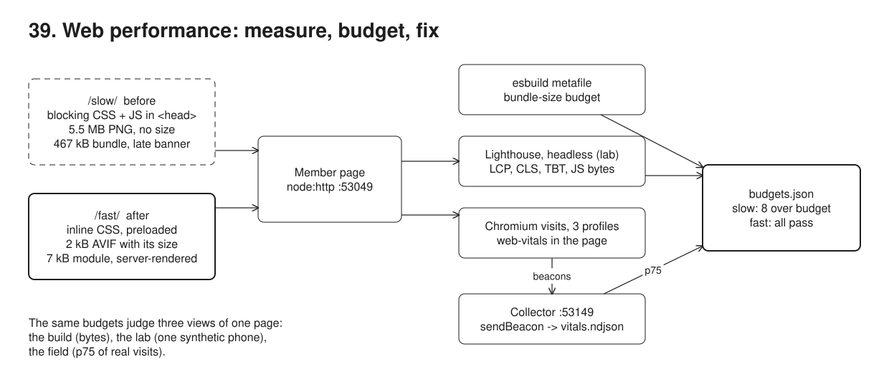
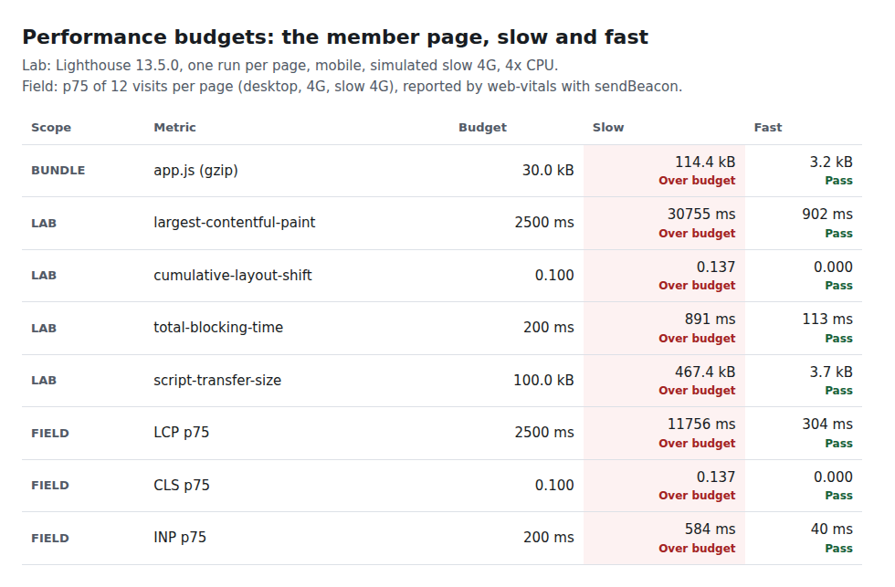
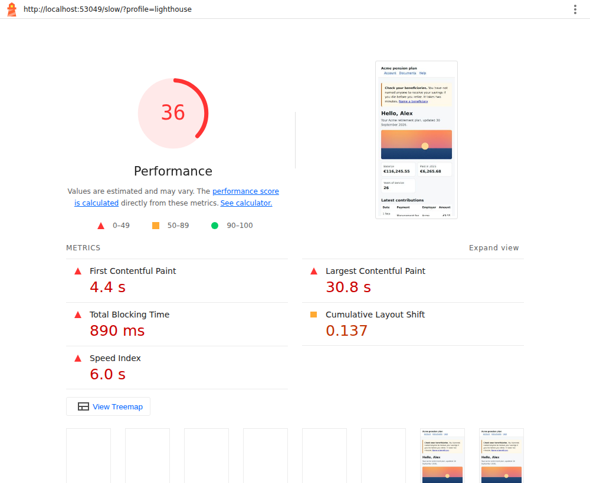
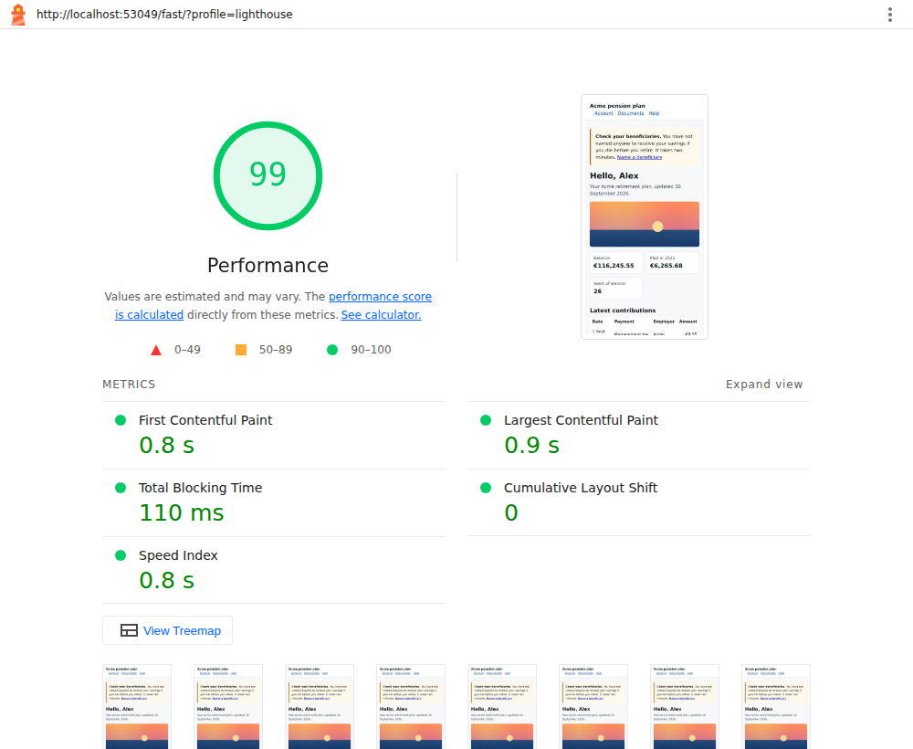
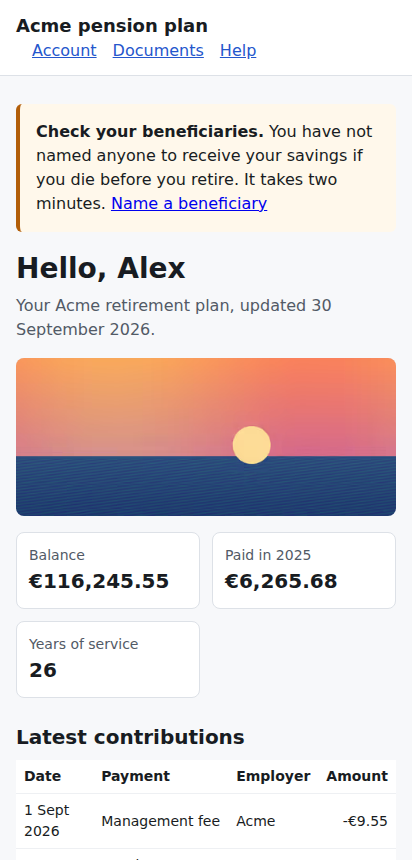

# 39. Web performance



**Pain: a slow portal nobody measures.** The member page loads a 5.5 MB PNG for a 400 px wide banner, blocks rendering on a stylesheet, a third-party tag and a 467 kB script (moment with all its locales, the whole of lodash), runs a synchronous A/B-testing snippet before anything renders, builds its content in the browser, and pushes a notice in above everything once it has loaded. On the team's laptops it feels fine: unthrottled, the p75 LCP is 1.4 s. On a phone on slow 4G, Lighthouse measures an LCP of 30.8 s; across simulated visits the p75 is 11.8 s for LCP and 584 ms for the tap on "Show full history". Nobody knew, because nothing measured it and no budget said what too slow means.

**Reach for it when** a page is public or used on phones, when you add a dependency or an image, and in CI on every change: a bundle budget at build time, Lighthouse on the key pages, and Core Web Vitals from real visits, all judged by the same budgets file.

**Do not reach for it when** you want one number to optimise: the lab and the field disagree on purpose (one synthetic phone versus the spread of real visitors), and a Lighthouse score is a summary, not a goal. For an internal back-office tool on a known desktop fleet, a bundle budget and a check of the slow interactions may be all you need. With real traffic, store the beacons in an analytics store or a RUM service, not an append-only file.

A member page served by `node:http` on :53049 in two versions with the same content and look. `/slow/` has the usual problems: render-blocking CSS and scripts in `<head>`, an unoptimised image with no width and height, a large client-rendered bundle, layout thrashing in the render loop, a notice inserted late at the top. `/fast/` inlines the critical CSS, preloads an AVIF at the size the screen needs with its dimensions, renders the content on the server, loads a 7.5 kB module and the tag async, and renders the full history in chunks after painting feedback. Three measurements, one `budgets.json`: esbuild's metafile gives a bundle-size budget at build time; Lighthouse 13 runs headless on the Chromium in `/opt/pw-browsers` (chrome-launcher, `--no-sandbox`) for the lab; the `web-vitals` library in each page reports LCP, CLS, INP, FCP and TTFB with `navigator.sendBeacon` to a collector on :53149, which stores them in `out/vitals.ndjson` and answers p75 per page and metric. Playwright drives 24 visits under three network and CPU profiles to produce that field data.

## Run

One shot with proof: `./run.sh` in this folder, or `./39-web-performance/run.sh` from the repo root (log in [`../logs/39-web-performance.log`](../logs/39-web-performance.log)). No Docker. Chromium comes from `PLAYWRIGHT_BROWSERS_PATH` (`/opt/pw-browsers` by default); Lighthouse uses `/opt/pw-browsers/chromium-1194/chrome-linux/chrome` unless `CHROME_PATH` is set. Takes about four minutes, mostly the slow page loading on simulated slow networks.

By hand, in `39-web-performance/`:

```sh
npm i
npm run build        # dist/: both bundles, metafiles, the PNG and its AVIF/WebP versions
npm run server       # http://localhost:53049/slow/ and http://localhost:53049/fast/
npm run collector    # POST http://localhost:53149/vitals (beacons), GET /summary (p75); stores out/vitals.ndjson
npm run lighthouse   # with the server running: both pages, writes out/lighthouse-{slow,fast}.html
npm run demo         # everything below, with checks (starts its own server and collector: stop the ones above first)
VISITS=2 npm run demo   # fewer visits per profile, faster
```

## Files

- `src/client/slow.ts` the slow page's script: lodash and moment-with-locales, a synchronous A/B-testing snippet that blocks the main thread for 200 ms on the clock (so TBT stays over budget on fast CI machines), client-side rendering row by row with a layout read after each row, a synchronous click handler, a late notice.
- `src/client/fast.ts` the fast page's script: only the "full history" button; `Intl` instead of moment, feedback painted before the work, rows built in chunks of 100 with a yield between.
- `src/client/vitals.ts` `web-vitals` (`onLCP`, `onCLS`, `onINP`, `onFCP`, `onTTFB`) to `navigator.sendBeacon`, tagged with page and profile.
- `src/client/data.ts` the member's 957 payments over 25 years (Initech, Globex, then Acme), deterministic. `src/client/tag.ts` the stand-in third-party tag (40 ms of main-thread work).
- `src/pages.ts` the two HTML documents and the shared CSS. `src/server.ts` serves them: the slow version uncompressed and uncached, the fast one gzipped with immutable caching, the tag held for 1 s in both.
- `src/build.ts` esbuild for both versions (with metafiles) and sharp for the image pipeline (2400 px PNG to AVIF and WebP at 480, 800, 1200 px).
- `src/lighthouse.ts` runs Lighthouse with chrome-launcher, writes the HTML report, extracts LCP, CLS, TBT, FCP, bytes per resource type, the LCP element and the render-blocking resources.
- `src/collector.ts` the beacon endpoint: validates, appends to `out/vitals.ndjson`, keeps the last report per metric id, computes p75 by nearest rank.
- `src/rum.ts` one simulated visit: a fresh Chromium context (empty cache), CDP network and CPU throttling, wait, tap, leave.
- `src/budgets.ts` and `budgets.json` the budgets and the three checks (bundle, lab, field), and the HTML report.
- `src/demo.ts` the five steps and their checks.
- `out/lighthouse-slow.html`, `out/lighthouse-fast.html` the full Lighthouse reports. `out/lab-summary.json`, `out/field-summary.json`, `out/vitals.ndjson` (every beacon), `out/budgets.html` (every verdict).

## Concepts

- **Core Web Vitals**: three user-centred metrics. LCP (Largest Contentful Paint), when the largest image or text block in the viewport is painted: good is 2.5 s or less. CLS (Cumulative Layout Shift), how much visible content moves unexpectedly, summed over the worst burst: good is 0.1 or less. INP (Interaction to Next Paint), the slowest interaction (tap, click, key) from input to the next frame, roughly the worst of a visit: good is 200 ms or less. They are judged at the 75th percentile of page loads.
- **Lab versus field**: the lab (Lighthouse) loads a page once on one emulated device and network, so a change can be measured before it ships and compared run to run. The field (real user monitoring) collects what real visitors get, across devices and networks, and is what users feel. Here the lab says LCP 30.8 s for the slow page on simulated slow 4G; the field p75 is 11.8 s across a mix of profiles, and 1.4 s on an unthrottled desktop, which is why a team testing on its own laptops sees nothing.
- **Simulated throttling**: Lighthouse loads the page at full speed, records a trace, then models the load on a slow 4G network (150 ms RTT, 1.6 Mbit/s) and a CPU four times slower (Lantern). It is fast and repeatable, but not a real slow device; the field visits here use real throttling through the Chrome DevTools Protocol instead (`Network.emulateNetworkConditions`, `Emulation.setCPUThrottlingRate`).
- **TBT as the lab stand-in for INP**: a navigation in the lab has no user, so there is no interaction to time. Total Blocking Time sums the part of each main-thread task beyond 50 ms between first paint and interactive: long tasks at load are what makes the first taps slow.
- **Render-blocking resources**: a stylesheet, or a script without `async`, `defer` or `type="module"`, in `<head>` stops the first paint until it has downloaded (and, for a script, run). Lighthouse lists them; the fast page has none: critical CSS inline, the module script deferred by default, the tag `async`.
- **LCP image**: the hero is the LCP element on both pages. The fast page makes it small (AVIF, sized with `srcset` and `sizes`), discoverable early (`<link rel="preload">` with `imagesrcset`) and prioritised (`fetchpriority="high"`). Width and height attributes reserve its space, so it cannot shift the layout when it arrives.
- **Layout shift from late content**: an element inserted above content that is already painted moves everything below it. Reserve the space or render it with the page; here the server renders the notice.
- **Long tasks and yielding**: the slow click handler builds 957 rows synchronously and reads `offsetHeight` after each one, forcing a layout per row; nothing paints until it ends. The fast handler paints feedback first, then works in chunks with a `setTimeout(0)` yield between them, so the next frame after the tap comes quickly.
- **Bundle-size budget**: a limit on the compressed size of each entry script, checked at build time from esbuild's metafile, which also says which inputs fill the bundle (here `moment/min/moment-with-locales.js` 383 kB and `lodash/lodash.js` 73 kB of the 467 kB). `Intl.DateTimeFormat` and `Intl.NumberFormat` replace both for this page.
- **RUM with `sendBeacon`**: the browser queues the request and sends it even while the page unloads, which is when web-vitals reports the final LCP, CLS and INP. A string body goes as `text/plain`, a CORS-safelisted type, so a beacon to another origin (the collector on :53149) needs no preflight. The endpoint is public: validate what it stores.
- **p75**: the value 75% of page loads are at or under (nearest rank here). The median would hide the slower quarter of visits; the maximum is one unlucky visit.
- **Budgets**: one file, three scopes. Bundle (gzip of `app.js` at most 30 kB), lab (LCP 2.5 s, CLS 0.1, TBT 200 ms, script transfer 100 kB), field (p75 LCP 2.5 s, CLS 0.1, INP 200 ms). The demo fails if the slow page passes any of them or the fast page fails one.

## Proof (`logs/39-web-performance.log`)

The bundle budget fails the slow page at build time and says why:

```
   FAIL  bundle slow  app.js (gzip)                114.4 kB  budget 30.0 kB
         minified 466.9 kB; largest inputs: moment/min/moment-with-locales.js 383.4 kB, lodash/lodash.js 73.2 kB, web-vitals/dist/web-vitals.js 5.8 kB, src/client/slow.ts 2.0 kB
   pass  bundle fast  app.js (gzip)                  3.2 kB  budget 30.0 kB
```

Lighthouse (mobile, simulated slow 4G) breaks all four lab budgets on the slow page and names its render-blocking resources:

```
   slow: score 36, LCP 30755 ms (body > main > img.hero), FCP 4387 ms, CLS 0.137, TBT 891 ms, 7 requests, scripts 467.4 kB, images 5511.0 kB, total 5980.8 kB
         render-blocking: /slow/tag.js, /slow/app.js, /slow/styles.css; report out/lighthouse-slow.html
   fast: score 99, LCP 902 ms (body > main > picture > img.hero), FCP 752 ms, CLS 0, TBT 113 ms, 6 requests, scripts 3.7 kB, images 2.4 kB, total 8.0 kB
```

Every visit reported its metrics through `sendBeacon`, and the p75 fails the slow page on all three Core Web Vitals:

```
   collector stored 120 metrics from 24 visits; a malformed beacon got HTTP 400
   FAIL  field  slow  LCP p75                      11756 ms  budget 2500 ms
   FAIL  field  slow  CLS p75                         0.137  budget 0.100
   FAIL  field  slow  INP p75                        584 ms  budget 200 ms
   pass  field  fast  LCP p75                        304 ms  budget 2500 ms
   pass  field  fast  CLS p75                         0.000  budget 0.100
   pass  field  fast  INP p75                         40 ms  budget 200 ms
```

The same file recomputed with `jq` per profile: the desktop numbers alone would have hidden the problem:

```
  slow INP desktop: n=4 values=[160,168,176,184] p75=176
  slow INP slow-4g: n=4 values=[584,584,616,632] p75=616
  slow LCP desktop: n=4 values=[1164,1192,1428,1448] p75=1428
  slow LCP slow-4g: n=4 values=[11756,11772,11772,11784] p75=11772
```

## Screenshots

Every budget, before and after (`out/budgets.html`):



The Lighthouse reports (full HTML in `out/`), slow then fast:





The two pages after load on a phone-sized viewport: the same content.

 

## Do / Don't

- Do set budgets before optimising, and fail the build on them; check bytes at build time, where the fix is cheapest.
- Do measure in the field and read p75; test on a throttled profile, not only on a developer laptop.
- Do give every image its width and height; preload and prioritise the LCP image; render above-the-fold content on the server.
- Don't put synchronous scripts or third-party tags in `<head>`. Don't ship a library to format a date: `Intl` is in every browser.
- Don't chase the Lighthouse score; chase the metric that is over budget.

## Origins and further reading

- [Web Vitals](https://web.dev/articles/vitals) and the definitions of [LCP](https://web.dev/articles/lcp), [CLS](https://web.dev/articles/cls), [INP](https://web.dev/articles/inp) and [TBT](https://web.dev/articles/tbt); [how the thresholds were defined](https://web.dev/articles/defining-core-web-vitals-thresholds) (why p75).
- W3C specifications: [Largest Contentful Paint](https://w3c.github.io/largest-contentful-paint/), [Layout Instability](https://wicg.github.io/layout-instability/), [Event Timing](https://w3c.github.io/event-timing/), [Beacon](https://w3c.github.io/beacon/).
- [web-vitals](https://github.com/GoogleChrome/web-vitals), [Lighthouse](https://github.com/GoogleChrome/lighthouse) ([throttling](https://github.com/GoogleChrome/lighthouse/blob/main/docs/throttling.md)), [chrome-launcher](https://github.com/GoogleChrome/chrome-launcher).
- [esbuild metafile](https://esbuild.github.io/api/#metafile), [sharp](https://sharp.pixelplumbing.com/), [Optimize LCP](https://web.dev/articles/optimize-lcp), [Optimize long tasks](https://web.dev/articles/optimize-long-tasks), [Fetch Priority](https://web.dev/articles/fetch-priority).
