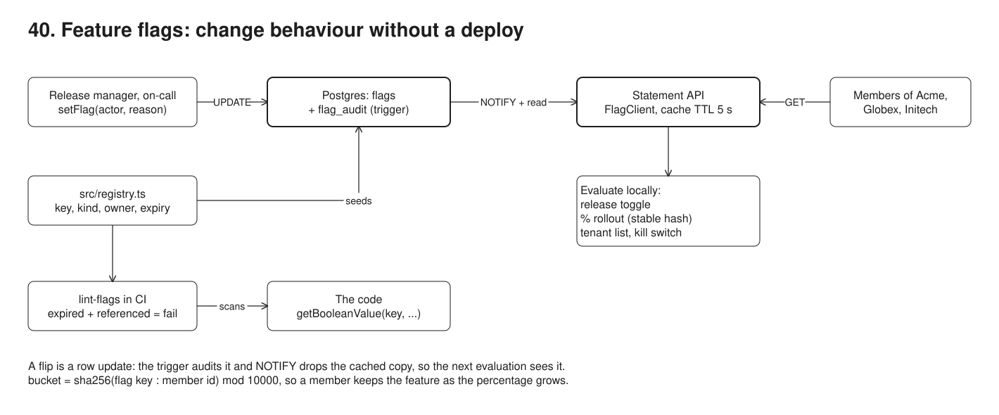

# 40. Feature flags



**Pain: risky big-bang releases.** The rewritten statement page, the new retirement projection and the employers' bulk upload all ship in one release, on one evening, to every member of Acme, Globex and Initech at once. If the projection is wrong, the only way back is a redeploy. When the fund valuation service starts timing out, every statement waits for it (42.9 ms a page in the log) and nobody can turn the call off. A "10% rollout" done with `Math.random()` gives 1,747 of 10,000 members a different answer on their second page load, and takes the feature away from 496 members when the rollout goes from 10% to 50%. Old flags pile up in the code long after the switch is done.

**Reach for it when** you deploy more often than you release: code is merged and deployed dark, then turned on for one tenant, then a percentage of members, then everyone, by a row update rather than a deploy. You need an ops kill switch for an expensive or fragile dependency. You want an audit of who turned what on, when and why.

**Do not reach for it when** the change is a database migration or an API contract (use expand/contract, sample 02). The "flag" would live for years: that is configuration or entitlement, model it as such. You need experiments with statistics (exposure events, metrics, significance): use an experimentation platform, though the stable hashing here is the same. You have more than a handful of services: run a flag service (Unleash, flagd, a vendor) behind the OpenFeature API instead of a table per app.

Flags live in a Postgres table; a trigger writes every change to `flag_audit` (refusing a change that does not name its actor) and sends `NOTIFY flags_changed`. Each process evaluates flags locally from a cache with a 5 s TTL and drops a cached flag the moment the notification arrives. Four kinds: a release toggle, a percentage rollout by stable hash of (flag, member id), a tenant list, and a kill switch. A CI check (`src/lint-flags.ts`) fails the build when code still references a flag past its expiry date. The demo drives a statement API (a separate process) through each kind and draws the rollout.

## Run

One shot with proof: `./run.sh` in this folder, or `./40-feature-flags/run.sh` from the repo root (log in [`../logs/40-feature-flags.log`](../logs/40-feature-flags.log)).

By hand (Postgres on 55470, the statement API on 53050):

```sh
docker compose up -d --wait
npm i
npm run setup                     # flags, flag_audit (trigger + NOTIFY), exposures; flags seeded from src/registry.ts
npm run server                    # GET /statement?member=M00001&tenant=acme, GET /flags/stats (FLAG_TTL_MS, FLAG_LISTEN=off)
npm run demo                      # starts the server itself (stop the one above first)
npm run lint:flags                # the CI check over src/; tsx src/lint-flags.ts fixtures/stale-app fails
```

## Files

- `src/registry.ts` every flag in code: key, kind, owner, description, expiry; seeds the table and feeds the CI check.
- `src/setup.ts` the `flags`, `flag_audit` and `exposures` tables; the audit trigger that also calls `pg_notify`.
- `src/flags.ts` `bucket()` (the stable hash), `evaluate()` (the four kinds), `FlagClient` (TTL cache, `LISTEN flags_changed`, OpenFeature-style `getBooleanValue`), `setFlag()` (the only write path, with actor and reason).
- `src/server.ts` the statement endpoint, every feature behind a flag; the live valuation is the expensive call behind the kill switch.
- `src/lint-flags.ts` the CI check: scans code for registry keys, fails on an expired one still referenced.
- `fixtures/stale-app/statement-pdf.ts` code that still checks a flag that expired in August.
- `src/chart.ts` draws `out/exposure.svg`; `src/demo.ts` the seven steps and their checks.
- `out/exposure.svg`, `screenshots/exposure.png` the rollout chart from the last run.

## Concepts

- **Deploy is not release**: the new statement page is merged and deployed switched off (a *release toggle*); turning it on is a row update the running servers see without a restart. Rolling back is turning it off.
- **Flag kinds**: *release toggle* (on or off for everyone, short-lived), *percentage rollout* (a growing share of members), *tenant targeting* (a list of employers, here Acme first, then Globex), *ops kill switch* (on by default, long-lived, turned off during an incident). They differ by who flips them, how long they live and what the safe default is.
- **Stable hashing**: `bucket = sha256(flag key + ":" + member id) mod 10000`; the member has the feature when `bucket < percentage x 100`. The same member gets the same answer on every request and every server with no stored assignment, and raising the percentage only adds buckets, so nobody loses the feature as it grows from 1 to 10 to 50 to 100%. The flag key is in the hash so each flag picks a different slice of members (108 members are in the first 10% of two flags, about 10% x 10% of 10,000). `Math.random()` per request has neither property.
- **Local evaluation with a short TTL**: a flag is evaluated in-process from a cached row: 10,000 evaluations cost 1 reads from Postgres in the log. The TTL bounds staleness if a notification is lost; when the store is down, the last known value is served instead of every flag flipping to its default.
- **LISTEN/NOTIFY invalidation**: the audit trigger calls `pg_notify('flags_changed', key)`; each process LISTENs on its own connection and drops that key from its cache. A change reaches a running process in milliseconds (9 ms) instead of after the TTL (4,704 ms for a client without LISTEN). A dropped LISTEN connection clears the whole cache, since notifications sent meanwhile are lost.
- **Kill switch within one evaluation cycle**: the statement evaluates its flags on each request. After on-call commits the switch, at most one request that started in the meantime still made the slow call (0 in the log), and the page went from 42.9 ms to 0.9 ms.
- **Audit trail**: the trigger, not the application, writes `flag_audit` with the actor and reason the transaction set (`set_config('app.actor', ...)`) and the row before and after, so no code path can skip it; an UPDATE without an actor is refused.
- **Flag debt and removal**: every flag has an owner and an expiry in `src/registry.ts`. `lint-flags.ts` fails CI when code references a flag past its expiry, naming the file, line and owner; a flag past expiry that nothing references is a warning to delete its row.
- **OpenFeature**: the CNCF vendor-neutral API for flag evaluation (`client.getBooleanValue(key, default, { targetingKey, ... })`) with pluggable providers. `FlagClient` uses the same shape, so the call sites stay the same if this table is replaced by flagd, Unleash or a vendor behind an OpenFeature provider.
- **Trade-offs**: every flag is a branch to test in both states; keep them few and short-lived. Percentages are of members, not requests, and a member who is in at 10% is in at 50%. Flags evaluated client-side leak the targeting rules; keep evaluation on the server.

## Proof (`logs/40-feature-flags.log`)

Turning the release toggle on is a row update that reaches the running server in milliseconds, and the trigger refuses a change that does not say who made it:

```
   setFlag(new-statement-page, enabled=true) -> version 2; the server served the new page 46 ms after the commit
   a raw UPDATE without app.actor: flag change without app.actor: say who changes new-statement-page and why
   audit: alice (release manager): enabled false -> true ("statement rewrite signed off by the statements team")
```

The stable hash never takes the feature away as the rollout grows; a fresh random draw takes it from 79 then 496 members, and gives 1,747 members a different answer on a second page load:

```
     1%: stable    95 on (0.95%), kept 0, lost 0 | naive    90 on, lost 0 | 10000 evaluations, 1 flag read from Postgres
    10%: stable  1018 on (10.18%), kept 95, lost 0 | naive   980 on, lost 79 | 10000 evaluations, 1 flag read from Postgres
    50%: stable  4972 on (49.72%), kept 1018, lost 0 | naive  5019 on, lost 496 | 10000 evaluations, 1 flag read from Postgres
   100%: stable 10000 on (100.00%), kept 4972, lost 0 | naive 10000 on, lost 0 | 10000 evaluations, 1 flag read from Postgres
   at 10%, a second page load gave a different answer to 0 members (stable hash) and 1747 members (fresh random draw)
```

Tenant targeting turns the bulk upload on for Acme, then Globex, and never for Initech:

```
   tenants={acme}: {"acme":true,"globex":false,"initech":false}
   tenants={acme,globex}: {"acme":true,"globex":true,"initech":false}
```

The kill switch: no request that started after the commit made the slow call, and the page went from 43 ms to under 1 ms:

```
   before the switch: 19 requests, mean 42.9 ms, live valuation on 19
   after the commit:  881 requests, mean 0.9 ms, live valuation on 0 (requests that started after the commit)
```

NOTIFY against the TTL alone, and what the cache saves:

```
   LISTEN client saw the change after 9 ms, TTL-only client after 4704 ms
   server cache: 4456 evaluations, 16 reads from Postgres, 10 invalidations by NOTIFY
```

The CI check fails on code that still references a flag past its expiry, with the file, line and owner:

```
       error  fixtures/stale-app/statement-pdf.ts:6  "legacy-pdf-renderer" EXPIRED 33 days ago (2026-08-31, owner: statements team): delete the flag check and the losing branch
     lint-flags: FAILED, 1 expired flag(s) still referenced
```

The run script then dumps `flags`, the 15 rows of `flag_audit` (5 seeded, 10 changes, each with actor and reason) and the exposures per step from SQL.

## Screenshots


## Do / Don't

- Do give every flag an owner and an expiry date when it is created, and fail CI past it.
- Do hash on (flag, member) for percentages; do log who changed a flag and why.
- Don't use `Math.random()` per request for a rollout; don't share one bucket across all flags.
- Don't use a flag for something that should be configuration or a permission.

## Origins and further reading

- Pete Hodgson, [Feature Toggles (aka Feature Flags)](https://martinfowler.com/articles/feature-toggles.html), the four categories and their lifetimes.
- [OpenFeature specification](https://openfeature.dev/specification/), the vendor-neutral evaluation API and providers.
- PostgreSQL documentation: [NOTIFY](https://www.postgresql.org/docs/16/sql-notify.html) and [LISTEN](https://www.postgresql.org/docs/16/sql-listen.html).
- Jez Humble and David Farley, *Continuous Delivery* (2010), on separating deployment from release; [dark launching](https://martinfowler.com/bliki/DarkLaunching.html).
