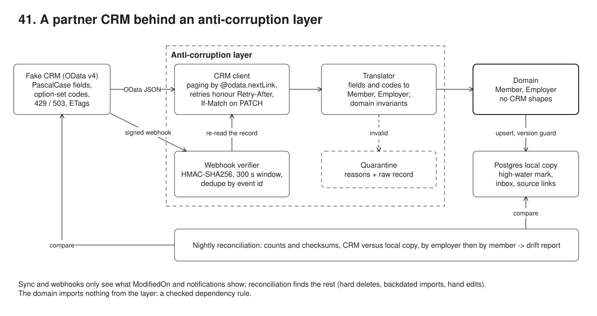
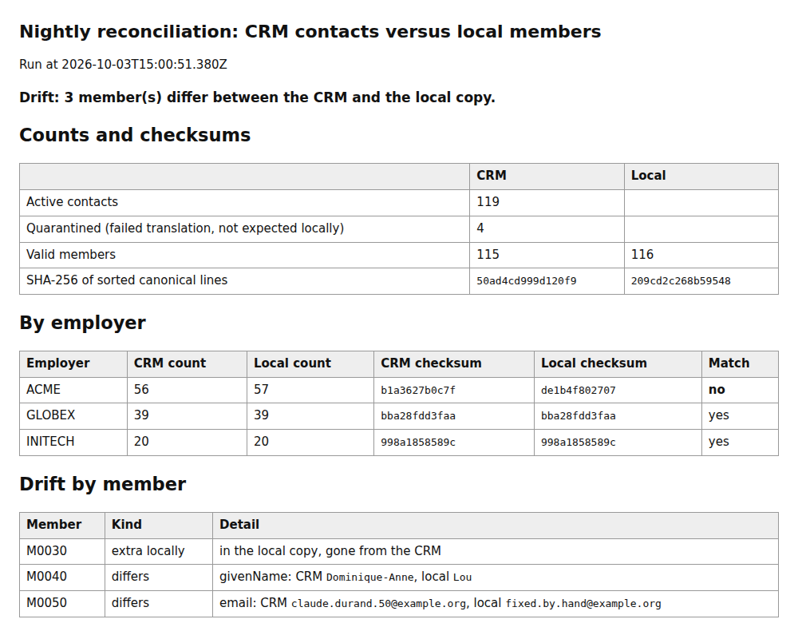

# 41. CRM integration behind an anti-corruption layer



**Pain: a partner API leaking into the domain.** The naive integration reads `GET /Contacts` once and copies what comes back: it stores 50 of the 120 contacts because it ignores `@odata.nextLink`, takes 18 CRM fields per row (internal notes and phone numbers included), keeps an email without an `@` and a member without a number, and has `New_SchemeStatus === 100000000` and account GUIDs written into the app's own code. The first 429 crashes it. The day the CRM adds an option ("Transferred out", 100000003), that member silently becomes "retired". A webhook endpoint that trusts its caller accepts a forged or replayed notification, and a sync driven by `ModifiedOn` never sees a hard delete.

**Reach for it when** your system has its own model and must exchange data with a system whose model you do not control: a CRM or ERP, a partner's API, a legacy database you are strangling. Especially when that system changes on its own schedule, rate-limits you, and pushes change notifications.

**Do not reach for it when** the other system's model *is* your model (a thin admin UI over the CRM itself: use its SDK directly). The volume calls for a bulk export or change data capture rather than paged reads (see 10). A vendor-maintained connector already does the mapping and you have no domain rules of your own.

A fake CRM (`src/crm/`, a separate process on :53151) serves an OData v4-style API in the shape real CRMs use: PascalCase fields with publisher prefixes (`New_MemberNo`, `_ParentCustomerId_Value`), integer option sets, second-precision `ModifiedOn`, `VersionNumber` ETags, server-driven paging at 50 rows, a 429 with `Retry-After: 1` every 10 data requests and a 503 every 10, and a signed webhook on every write. The domain app (:53051, in the demo's process so the demo can move its clock) holds members and employers in Postgres. Between them, `src/acl/` is the anti-corruption layer: a client that pages, retries and sends `If-Match`, a translator from CRM shapes to `Member` and `Employer`, an adapter implementing the domain's `MemberDirectory` port, and a webhook verifier. The demo runs a full sync, an incremental sync, webhooks (genuine, duplicate, forged, replayed), a write-back with an ETag conflict, a nightly reconciliation that finds three drifts sync cannot see, and a check that the domain imports nothing from the layer.

## Run

One shot with proof: `./run-41-crm-integration.sh` from the repo root (log in [`../logs/41-crm-integration.log`](../logs/41-crm-integration.log)).

By hand, from this folder:

```sh
docker compose up -d --wait   # Postgres on :55471
npm i
npm run setup                 # domain tables and integration bookkeeping
npm run demo                  # starts the CRM on :53151 and the app on :53051 itself, runs the 7 steps
npm run crm                   # or: the CRM alone on :53151 ...
npm run app                   # ... and the app alone on :53051 (POST /webhooks/crm, GET /members/:no, POST /members/:no/email)
```

## Files

- `src/crm/server.ts` the fake CRM: OData collection and entity routes, `PATCH` with `If-Match` (412, 428), fault schedule, HMAC-signed webhooks, and `/_admin/*` for the CRM's own users (edit, hard delete, backdated import, frozen clock, redelivery).
- `src/crm/odata.ts` the query engine: a `$filter` parser (`eq ne gt ge lt le and or not`, `startswith`, `contains`), `$orderby` with the key as tie-breaker, and the keyset `$skiptoken`.
- `src/crm/seed.ts` 3 accounts and 120 contacts, four of them invalid in the ways real CRM data is.
- `src/domain/model.ts` `Member`, `Employer`, their invariants, and the canonical line reconciliation hashes.
- `src/domain/ports.ts` `MemberDirectory`, `Incoming<T>` (upsert, removed, rejected), `SourceRef` (opaque id, version, change time), `SourceEvent`.
- `src/acl/crm-types.ts` the CRM's shapes and the `$select` lists; only `src/acl/` imports it.
- `src/acl/client.ts` HTTP: `@odata.nextLink` paging, retries on 429/502/503/504 and network errors honouring `Retry-After` (seconds or HTTP-date), exponential backoff with full jitter otherwise, `If-Match` on `PATCH`.
- `src/acl/translator.ts` field names and option-set codes to domain words; an unknown code is a rejection, not a guess.
- `src/acl/adapter.ts` the port's implementation: incremental query, re-read on 412 and re-apply or report a conflict.
- `src/acl/webhook.ts` signature check in constant time, 300 s window, translation to `SourceEvent`.
- `src/app/store.ts` Postgres: domain upserts behind a version guard, source links, quarantine, high-water mark, webhook inbox.
- `src/app/sync.ts` employers and the incremental member sync. `src/app/webhooks.ts` verify, deduplicate, re-read, apply.
- `src/app/reconcile.ts` counts and checksums by employer then by member, the drift report, repair, `out/reconciliation.html`.
- `src/app/server.ts` the app's HTTP routes. `src/main.ts` the composition root, the only file outside `src/acl/` that names the adapter.
- `src/naive.ts` the leaky version. `src/demo.ts` the seven steps and their checks. `src/setup.ts` the schema.
- `out/reconciliation.html`, `out/reconciliation.json` the drift report from the last run, before and after repair.

## Concepts

- **Anti-corruption layer**: a translation layer between your model and another system's, so the other model's names, codes, quirks and failures stop at the boundary (Evans, *Domain-Driven Design*, ch. 14). Here it is four parts: a client (transport, paging, retries), a translator (shapes and codes), an adapter (implements the domain's port), and a webhook verifier. The domain and app code depend on the port (`MemberDirectory`), never on the layer; `src/main.ts` wires them. Step 7 checks this as a dependency rule: no import of `src/acl/`, no CRM field name, in `src/domain/` or `src/app/`.
- **OData query options**: `$select` (only the fields the translator reads: notes and phones never cross the boundary), `$filter` (`ModifiedOn ge 2026-...Z`, `StateCode eq 0`), `$orderby`, `$top`, `$count=true` (`@odata.count`). **Server-driven paging**: the client asks `Prefer: odata.maxpagesize=50`, the server decides, and returns `@odata.nextLink` until the last page. The link is opaque: follow it, never build it. Here its `$skiptoken` is a keyset cursor (the last row's sort keys), so rows changed behind the cursor do not shift later pages.
- **Option sets**: CRMs store choices as integers whose labels live in metadata (`100000000` Active). The translator maps the known ones to domain words and refuses the rest, so a new option is a quarantined record and an alert, not a silent misclassification.
- **Quarantine**: a record that fails translation or the domain's invariants is stored with its reasons and raw payload, and not applied. Reconciliation counts it on the CRM side (`119 active = 115 valid + 4 quarantined`), so it is visible, not lost.
- **Retry with backoff that honours `Retry-After`**: retry only what can succeed later (429, 502, 503, 504, network errors, timeouts), never a 400 or 412. When the server says `Retry-After` (seconds or an HTTP-date, RFC 9110), wait exactly that; otherwise back off exponentially with full jitter (`random(0, min(cap, base x 2^n))`) so clients do not retry in lockstep. Cap the attempts and give up on an absurd wait. Retrying a `PATCH` is safe here because it is conditional (`If-Match`).
- **ETag and `If-Match`**: the CRM's `VersionNumber` is the ETag (`W/"1131"`). A write sends the version it was based on; 412 means someone changed the record since; 428 means the write forgot to say. On 412 the adapter re-reads: if the other change did not touch the email, it re-applies on the new ETag; if it did, it reports a conflict (409 to the portal) instead of overwriting a human's edit.
- **Incremental sync with a high-water mark**: remember the latest `ModifiedOn` seen, ask for `ModifiedOn ge mark` in `ModifiedOn` order, move the mark only after the whole run succeeds. `ge`, not `gt`: the CRM's clock has second precision, so a second write in the same second as the mark would be skipped forever by `gt` (step 3 shows it: `gt` returns 0 rows, `ge` 5). Rows that come back twice are no-ops thanks to the **version guard**: a source link only moves to a higher `VersionNumber`.
- **Webhooks as hints**: the notification says "contact X changed"; the app re-reads X through the layer instead of applying the payload, so a late or out-of-order event cannot overwrite newer data, and the same code path handles webhooks and sync.
- **Webhook signature**: `HMAC-SHA256(secret, "<timestamp>.<raw body>")` in `x-crm-signature: v1=<hex>`. Verify on the raw bytes before parsing, compare with `crypto.timingSafeEqual` (after a length check) so the comparison time does not leak how many bytes matched, and accept several `v1=` values or secrets to rotate without downtime. The timestamp is inside the signed content, so it cannot be refreshed without the secret.
- **Replay window and idempotency**: a delivery older than 300 s is refused even with a valid signature; inside the window, the event id (taken from the signed body, not a header) is the idempotency key. The inbox keeps one row per event id with a delivery counter; its outcome stays NULL until processing succeeds, so a delivery that failed half-way is processed again on the CRM's retry instead of being lost as a "duplicate".
- **Nightly reconciliation**: sync and webhooks only see what `ModifiedOn` and notifications show. Once a night, read both sides, compare counts and a checksum (SHA-256 of the sorted canonical lines), per employer to locate the drift, then per member to list it: missing locally, extra locally, differing fields. It catches what nothing else does: a hard delete in the CRM, an import that kept an old `ModifiedOn`, a hand edit in the local database. Repair here is "the CRM wins", applied over the version guard; in other setups the report goes to a person.
- **Trade-offs**: paged reads cost one request per 50 records and count against the CRM's limits; a big CRM needs its change-tracking or bulk APIs. Reconciliation reads everything, so it runs at night and by bucket. A local copy is eventually consistent: reads that must be exact go to the CRM.

## Proof (`logs/41-crm-integration.log`)

The naive import stores the first page and whatever is in it:

```
   naive import: 50 rows stored, @odata.nextLink present and ignored: true, 18 CRM fields per row (no $select: phone and notes too)
   stored as is: 1 email without @, 1 member without a number
```

Through the layer: three pages, a 429 retried after exactly its `Retry-After`, four records quarantined with reasons:

```
   [retry] 429 on GET Contacts (next page), Retry-After: 1 -> wait 1000 ms, attempt 2
   members: fetched 120 in 3 pages, applied 116, rejected 4; mark null -> 2026-09-04T10:10:00Z
   quarantined M0058 c0000000-0000-4000-8000-00000000003a: New_SchemeStatus 100000003 is not a known scheme status
   quarantined M0091 c0000000-0000-4000-8000-00000000005b: birth date '2031-02-01' is not a past date
```

Two writes in one second: `gt` on the mark would lose the second for good, `ge` picks it up and the repeat is a no-op:

```
   ModifiedOn gt 2026-10-03T15:00:48Z: 0 rows (M0007 would be lost for good); ModifiedOn ge 2026-10-03T15:00:48Z: 5 rows
   next sync (ge): fetched 5, applied 1, unchanged 4
```

Webhooks: a duplicate is acknowledged but not processed, forged ones are refused, and a captured delivery replayed 6 minutes later is refused by the window:

```
   duplicate delivery (the CRM retried, new timestamp, same event): 200 {"status":"duplicate","deliveries":2,"outcome":"applied"}; inbox: deliveries=2, outcome=applied
   forged: body changed, original signature -> 401 {"error":"signature does not match"}
   forged: signed with a guessed secret -> 401 {"error":"signature does not match"}
   replay of the captured delivery 6 minutes later (exact bytes, valid signature) -> 401 {"error":"timestamp outside the 300s window (age 361s)"}
```

Write-back: a stale ETag gets 412 and is re-applied on the new one; a real conflict is reported, not overwritten:

```
   M0020: a CRM user changed the phone; the member changes the email -> 200 {"outcome":"updated","version":1131,"attempts":2,"conflicts":1}; CRM now has robin.new@example.org
   M0021: a CRM user changed the email too -> 409 {"outcome":"conflict","theirs":"set.by.crm@example.org","attempts":1}; CRM keeps set.by.crm@example.org
```

Reconciliation finds the three drifts sync cannot see, located by employer first, and none after repair:

```
   counts: CRM 119 active = 115 valid + 4 quarantined; local 116
   ACME     CRM 56 local 57  DIFFER
   GLOBEX   CRM 39 local 39  match
   extra locally:   M0030
   differs:         M0040 givenName CRM='Dominique-Anne' local='Lou'
   differs:         M0050 email CRM='claude.durand.50@example.org' local='fixed.by.hand@example.org'
   repaired 3 (the CRM wins); rerun: drift 0, checksums equal
```

The dependency rule, and every fault absorbed by the client:

```
   scanned src/domain and src/app: no ACL import, no CRM vocabulary
   client: 39 requests, 8 retries, 4538 ms waited; CRM served 4 x 429 and 4 x 503 over 40 data requests (one of them the naive import's)
```

## Screenshots



## Do / Don't

- Do send `$select` on every read; don't let fields you never use (notes, phones) into your systems.
- Do treat an unknown code as a rejection; don't default it to the nearest known value.
- Do verify the signature on the raw body with a constant-time compare, then check the timestamp, then deduplicate by an id from the signed body.
- Don't use `gt` on a timestamp mark with coarse precision, and don't move the mark before the run has finished.
- Don't let a write-back overwrite a field someone else changed: `If-Match`, then decide.

## Origins and further reading

- Eric Evans, *Domain-Driven Design* (2003), chapter 14, "Anti-corruption layer"; the [DDD Reference](https://www.domainlanguage.com/ddd/reference/); Microsoft's [Anti-corruption Layer pattern](https://learn.microsoft.com/en-us/azure/architecture/patterns/anti-corruption-layer).
- OASIS [OData v4.01 Part 1: Protocol](https://docs.oasis-open.org/odata/odata/v4.01/odata-v4.01-part1-protocol.html) (server-driven paging, `Prefer: odata.maxpagesize`, ETags) and [Part 2: URL Conventions](https://docs.oasis-open.org/odata/odata/v4.01/odata-v4.01-part2-url-conventions.html) (`$filter`, `$select`, `$orderby`, `$top`, `$count`).
- Microsoft Dataverse: [Query data using the Web API](https://learn.microsoft.com/en-us/power-apps/developer/data-platform/webapi/query-data-web-api) and [Service protection API limits](https://learn.microsoft.com/en-us/power-apps/developer/data-platform/api-limits) (429 and `Retry-After`), the real-world shapes this fake imitates.
- [RFC 9110](https://www.rfc-editor.org/rfc/rfc9110) (ETag, `If-Match`, 412, `Retry-After`), [RFC 6585](https://www.rfc-editor.org/rfc/rfc6585) (428, 429), [RFC 2104](https://www.rfc-editor.org/rfc/rfc2104) (HMAC).
- Marc Brooker, [Exponential Backoff And Jitter](https://aws.amazon.com/blogs/architecture/exponential-backoff-and-jitter/) (AWS Architecture Blog).
- Stripe, [Verify webhook signatures](https://docs.stripe.com/webhooks#verify-events) (timestamp + body, tolerance window), and the [Standard Webhooks](https://www.standardwebhooks.com/) specification.
- In this repo: 06 (retries and idempotency between services), 07 (ETags and `If-Match` on your own API), 10 (CDC when you own the source database), 27 (file imports with control totals and reconciliation).
