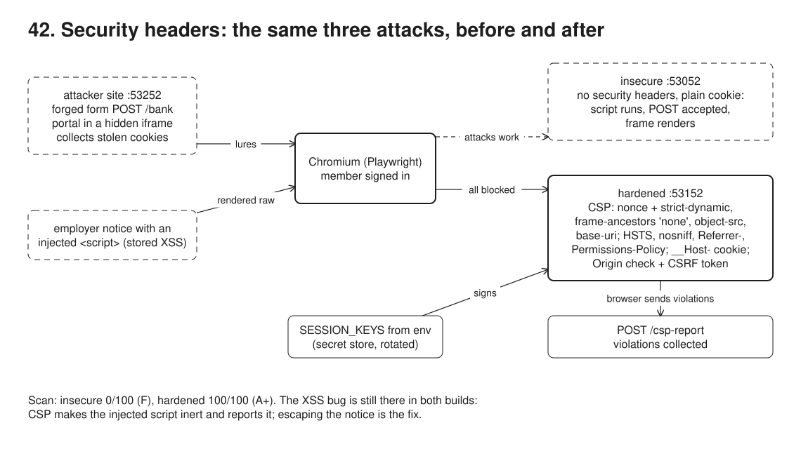
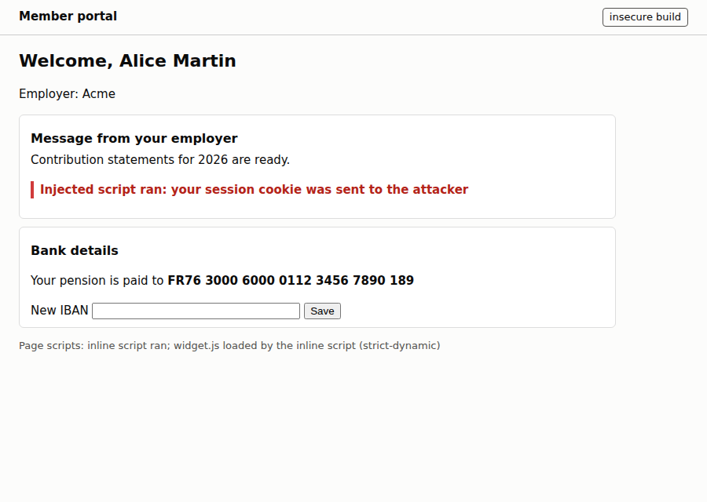
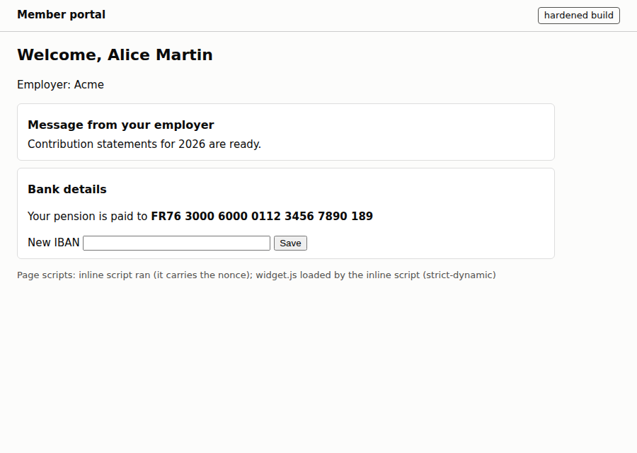
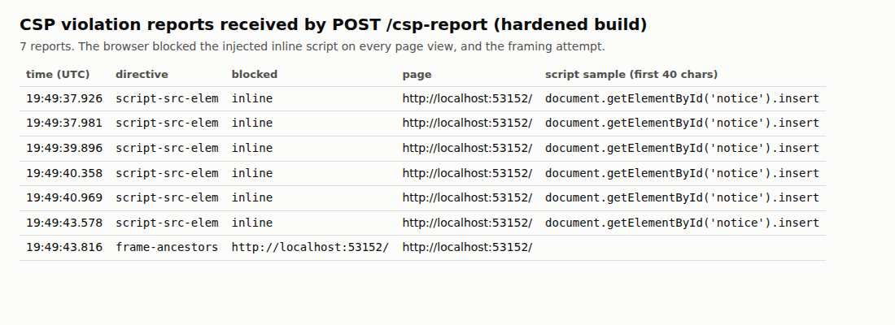
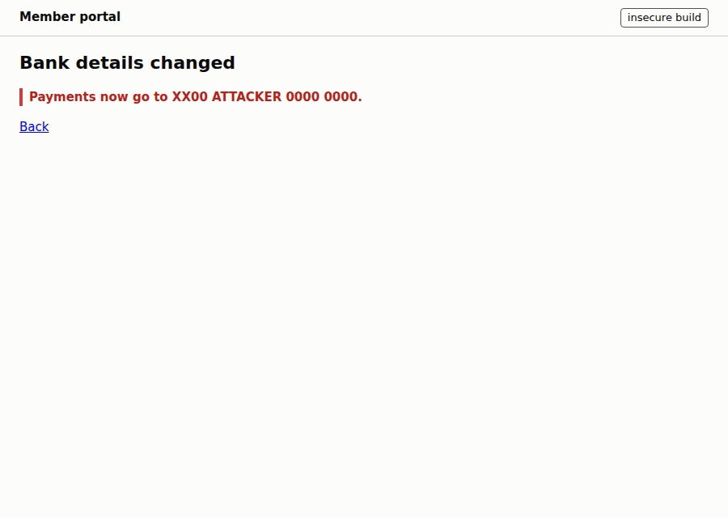
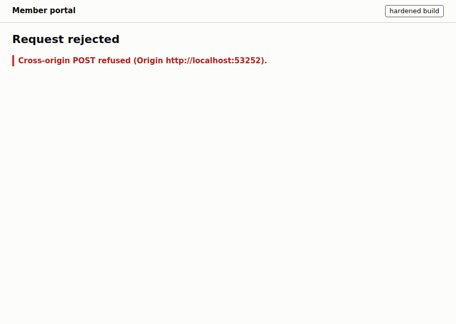
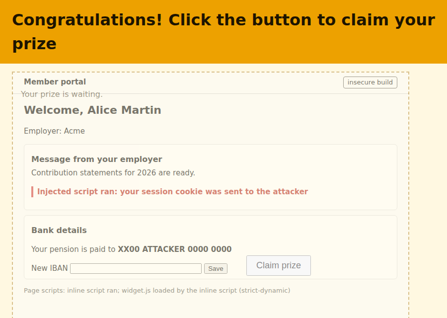
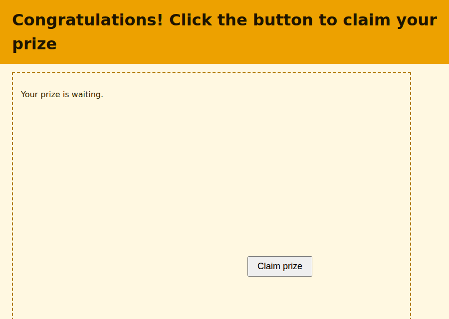
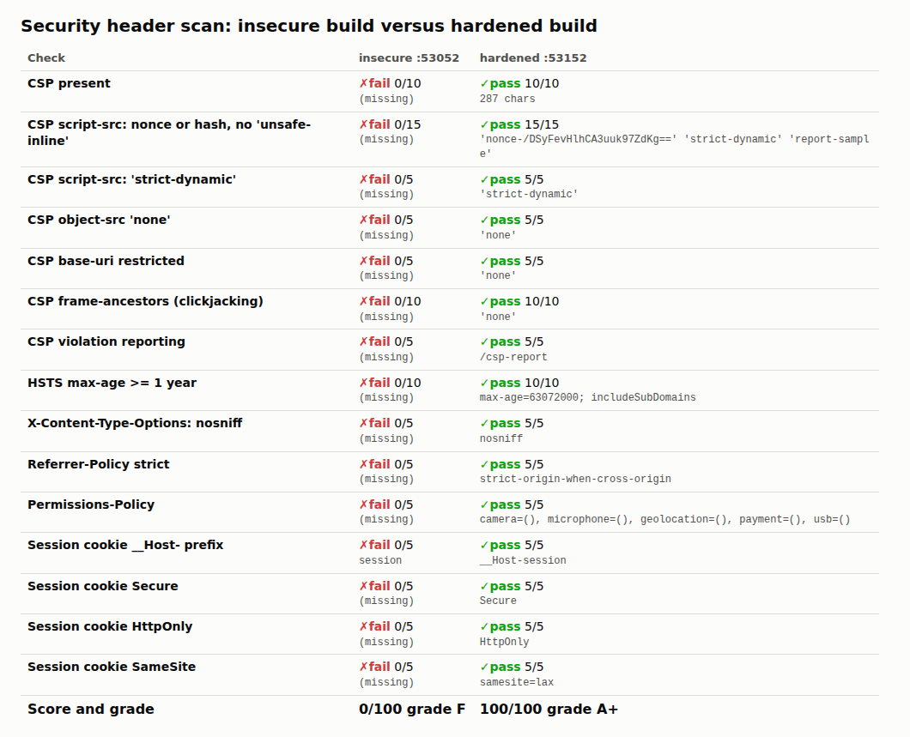

# 42. Security headers: browser-side attacks on a portal



**Pain: browser-side attacks on a portal.** An employer admin's account is phished and a `<script>` lands in the "message from your employer" box; every member who opens their account page sends their session cookie to the attacker. A "you won a prize" page posts new bank details to the portal with the member's cookie attached, and the pension goes to `XX00 ATTACKER 0000 0000`. The same page loads the portal in a transparent iframe under a fake button. Against the insecure build all three work in a real browser, and a header scan scores it 0/100 (F). The hardened build blocks all three, scores 100/100 (A+), and the browser itself reported 7 violations to the portal while it was being attacked.

**Reach for it when** a site has sessions, forms that change things, or content you did not write (CMS text, uploaded names, notices from partner organisations): a member or employer portal, an admin back office. Also when a pen test or a scanner (Mozilla Observatory, securityheaders.com, ZAP) flags missing headers.

**Do not reach for it when** you expect headers to fix the bug: CSP makes an injected script inert, it does not remove the injection; escape output (and sanitise rich text) first. A pure JSON API called only by your own code with a bearer token (no cookies) gains little from CSP or CSRF tokens; it needs CORS done right instead. And a strict CSP is work on an old app full of inline handlers (`onclick=`): roll it out as `Content-Security-Policy-Report-Only` first and read the reports.

One portal (`src/portal.ts`, node:http) built two ways from the same code: `insecure` on :53052 sends no security headers and a plain `session` cookie; `hardened` on :53152 adds a CSP with a fresh nonce per response and `'strict-dynamic'`, HSTS, `X-Content-Type-Options`, `Referrer-Policy`, `Permissions-Policy`, a `__Host-` session cookie (`Secure; HttpOnly; SameSite=Lax`), an Origin check and a session-bound CSRF token on every POST, and collects CSP violation reports at `POST /csp-report`. Both keep the same stored-XSS bug on purpose. An attacker site on :53252 hosts the forged form and the framing page and receives stolen cookies. The demo scans the headers of both builds, then drives Chromium through Playwright: sign in, open the account page, visit the attacker's pages, and checks what happened on the servers and in the browser.

Why node:http and not Next.js: every header and check is a few visible lines here, with no framework in between. In Next.js the same thing lives in `middleware.ts`: generate the nonce there, set the CSP on the response, pass the nonce to the page through a request header, and Next.js adds it to its own scripts; the cookie attributes, the Origin check and the token work the same way in a route handler or server action.

## Run

One shot with proof: `./run-42-security-headers.sh` from the repo root (log in [`../logs/42-security-headers.log`](../logs/42-security-headers.log)).

By hand (no database):

```sh
cd 42-security-headers
npm i
npm start     # insecure http://localhost:53052/login, hardened http://localhost:53152/login, attacker :53252
# sign in on a portal, then open http://localhost:53252/csrf?target=http://localhost:53052
#                                 or http://localhost:53252/frame?target=http://localhost:53152
npm run demo  # the whole story in headless Chromium (stop npm start first); needs PLAYWRIGHT_BROWSERS_PATH or installed browsers
```

Ports: insecure 53052, hardened 53152, attacker 53252 (also reached as `127.0.0.1:53252`, a different site from `localhost`).

## Files

- `src/portal.ts` the portal, both builds: sign-in, account page with the employer notice and the bank form, `POST /bank`, `POST /csp-report`, `/__state` (demo-only).
- `src/security.ts` the defences: CSP builder, the other headers, `__Host-` cookie, key ring, signed session ids, CSRF tokens, Origin check.
- `src/attacker.ts` the attacker site: `/csrf`, `/frame`, `/steal`.
- `src/scan.ts` the header scanner and its rubric (15 checks, 100 points, A+ to F).
- `src/demo.ts` the six steps and their checks, in Chromium via Playwright.
- `src/report.ts` writes `out/header-grades.html` and `out/csp-reports.html`; `src/dump-headers.ts` prints raw headers for the log; `src/start.ts` runs everything by hand.
- `out/csp-reports.json` the violation reports the browser sent in the last run.

## Concepts

- **Content Security Policy (CSP)**: a response header that tells the browser what the page may load and run. `script-src 'nonce-R'` lets only `<script nonce="R">` run; the nonce is 128 random bits, new on every response, so an injected `<script>` cannot carry it. Inline event handlers and `javascript:` URLs never run.
- **`'strict-dynamic'`**: a script that carries the nonce may load further scripts (`createElement('script')`), and those are trusted too; host allowlists are then ignored. This is what makes a nonce policy practical with bundlers and tag loaders, and avoids allowlists like `cdn.example.com` that attackers can often abuse (JSONP, old library versions).
- **`object-src 'none'` and `base-uri 'none'`**: no plugins; no `<base href>` injection to redirect relative script URLs. **`form-action 'self'`** keeps forms on the page posting to the portal only.
- **`frame-ancestors 'none'`**: no other page may frame this one, which stops clickjacking (a transparent iframe over a bait button). `X-Frame-Options: DENY` is the older header for older browsers.
- **CSP reports**: `report-uri /csp-report` makes the browser POST a JSON report for each violation: directive, blocked URL (`inline` for an inline script), page, and with `'report-sample'` the first 40 characters of the script. A new kind of report after a deploy is either a bug in the policy or an attack in progress. `report-to` with a `Reporting-Endpoints` header is the newer API; Chromium batches those reports and prefers them when both are present, so this sample uses `report-uri` to see them at once.
- **HSTS** (`Strict-Transport-Security: max-age=63072000; includeSubDomains`): after one visit over HTTPS the browser refuses plain HTTP to the host for two years, which defeats SSL stripping. Browsers ignore it on plain `http://`, so here it is graded but has no effect; in production the TLS-terminating proxy or the app behind it must send it on HTTPS responses.
- **`X-Content-Type-Options: nosniff`**: the browser trusts `Content-Type` instead of guessing, so an uploaded "image" cannot run as a script. **`Referrer-Policy: strict-origin-when-cross-origin`**: other sites see only the origin, never paths or query strings with ids. **`Permissions-Policy`**: turns off camera, microphone, geolocation, payment and USB for the page and every frame in it.
- **Cookie attributes**: `HttpOnly` (scripts cannot read it: `document.cookie` was empty on the hardened page), `Secure` (HTTPS only; Chromium treats `http://localhost` as secure), `SameSite=Lax` (not sent on cross-site POSTs or subresource requests), and the `__Host-` prefix (the browser accepts the cookie only with `Secure`, `Path=/` and no `Domain`, so a sibling subdomain cannot set or shadow it).
- **Site versus origin**: SameSite is about *sites* (scheme plus registrable domain); ports and subdomains do not count. `localhost:53252` is a different origin but the same site as `localhost:53152`, so `SameSite=Lax` still sent the cookie with the forged POST; `127.0.0.1:53252` is a different site, and the cookie stayed home. A compromised sibling app on the same domain is exactly that same-site case.
- **CSRF defence**: the Origin check (the browser sets `Origin` on cross-origin POSTs and pages cannot fake it; fall back to `Referer`, refuse when neither is present) plus a synchronizer token: `HMAC(key, "csrf:" + session id)` in a hidden field, which a page on another origin can neither read nor compute. Either one stopped the forged post; the demo shows the token refusing a request whose Origin matched.
- **Secrets handling**: the HMAC key comes from `SESSION_KEYS` in the environment. In production the platform injects it from a secret store (Vault, AWS Secrets Manager, GCP Secret Manager, a Kubernetes Secret fed by one); it is never in the repo, an image layer (see `38-containers`), a log or a URL. Rotation uses a key ring: `SESSION_KEYS=new,old` signs with the first and verifies with all; add the new key, deploy, wait out the longest session, drop the old key, deploy. A leaked key is rotated the same way, faster, and every session signed with it dies. `.env*` files are gitignored, and a secret scanner (gitleaks) runs before commit and in CI: it found the token in the local `.env.local` and nothing in the files git would commit.
- **Header scanner**: `src/scan.ts` signs in, fetches the account page and awards points per header and cookie attribute, in the spirit of Mozilla's HTTP Observatory. A grade is a checklist, not a guarantee: the A+ build still has the XSS bug.

## Proof (`logs/42-security-headers.log`)

The scan, before and after (15 checks, 100 points):

```
   CSP script-src: nonce or hash, no 'unsafe-inline'  FAIL 0/15  pass 15/15
   CSP frame-ancestors (clickjacking)                 FAIL 0/10  pass 10/10
   HSTS max-age >= 1 year                             FAIL 0/10  pass 10/10
   Session cookie HttpOnly                            FAIL 0/5   pass 5/5
   score                                              0 F        100 A+
```

The injected script runs on the insecure page and sends the cookie away; on the hardened page it is refused and reported, while the page's own nonce'd script and the script it loads still run:

```
   [attacker :53252] received document.cookie "session=adW-nhkZJuRJ4Dc_3OJM_k44" from http://localhost:53052/
   [hardened :53152] CSP report: script-src-elem blocked inline on http://localhost:53152/ sample "document.getElementById('notice').insert"
   hardened: injected script ran: no; page scripts: "inline script ran (it carries the nonce)", "widget.js loaded by the inline script (strict-dynamic)"; document.cookie visible to scripts: ""
```

The forged post changes the bank details on the insecure build and is refused on the hardened one, by the Origin check and, without it, by the token:

```
   insecure: POST /bank from http://localhost:53252 -> 200; IBAN before "FR76 3000 6000 0112 3456 7890 189", after "XX00 ATTACKER 0000 0000"
   [hardened :53152] 403 POST /bank: cross-origin request (Origin http://localhost:53252), session cookie present
   [hardened :53152] 403 POST /bank: cross-origin request (Origin http://127.0.0.1:53252), session cookie absent
   hardened: POST /bank with a valid session and a matching Origin but no CSRF token -> 403
```

The portal renders inside the attacker's iframe, then cannot:

```
   insecure: iframe rendered the portal ("Welcome, Alice Martin")
   [hardened :53152] CSP report: frame-ancestors blocked http://localhost:53152/ on http://localhost:53152/
   hardened: iframe blocked (frame url chrome-error://chromewebdata/)
```

Rotation and the secret scan:

```
   cookie signed with k1: verifies under "k2,k1": yes; under "k2" alone: no; a new cookie signed under "k2,k1" verifies under "k2": yes
   gitleaks, working tree: 2 finding(s)
      generic-api-key in .env.local
      npm-access-token in .env.local
   gitleaks, files git would commit: 0 finding(s); .env.local ignored by git: yes
```

## Screenshots

The injected script runs on the insecure build (red line) and does nothing on the hardened one:




What the browser reported instead:



The forged form post from the attacker's page: accepted, then refused:




The portal framed under the fake "Claim prize" button, then not rendered at all:




The header scan:



## Do / Don't

- Do generate a new nonce per response and put it on every script tag you own; never reuse one or derive it from the session.
- Do ship a new CSP as `Content-Security-Policy-Report-Only` first, then enforce.
- Do check Origin and a CSRF token on every state-changing request, and keep state changes off GET.
- Don't rely on `'unsafe-inline'` in `script-src`: it lets every injected inline script run. It is only acceptable as a fallback for very old browsers next to a nonce, which makes current browsers ignore it. Don't allowlist whole CDNs either.
- Don't put secrets in `.env` files that are committed, in Docker build args, or in URLs.

## Origins and further reading

- W3C [Content Security Policy Level 3](https://www.w3.org/TR/CSP3/); Google, [Strict CSP](https://csp.withgoogle.com/docs/strict-csp.html) and Weichselbaum et al., [CSP Is Dead, Long Live CSP!](https://research.google/pubs/csp-is-dead-long-live-csp-on-the-insecurity-of-whitelists-and-the-future-of-content-security-policy/) (2016).
- [RFC 6797](https://www.rfc-editor.org/rfc/rfc6797) (HSTS); [RFC 6265bis](https://datatracker.ietf.org/doc/draft-ietf-httpbis-rfc6265bis/) (cookies: SameSite, `__Host-` prefix).
- OWASP: [CSRF Prevention Cheat Sheet](https://cheatsheetseries.owasp.org/cheatsheets/Cross-Site_Request_Forgery_Prevention_Cheat_Sheet.html), [HTTP Headers Cheat Sheet](https://cheatsheetseries.owasp.org/cheatsheets/HTTP_Headers_Cheat_Sheet.html), [Secrets Management Cheat Sheet](https://cheatsheetseries.owasp.org/cheatsheets/Secrets_Management_Cheat_Sheet.html), [Clickjacking Defense](https://cheatsheetseries.owasp.org/cheatsheets/Clickjacking_Defense_Cheat_Sheet.html).
- MDN: [CSP](https://developer.mozilla.org/en-US/docs/Web/HTTP/CSP), [Set-Cookie](https://developer.mozilla.org/en-US/docs/Web/HTTP/Headers/Set-Cookie), [Permissions-Policy](https://developer.mozilla.org/en-US/docs/Web/HTTP/Headers/Permissions-Policy); Mozilla [HTTP Observatory](https://developer.mozilla.org/en-US/observatory).
- Next.js, [Content Security Policy with a nonce in middleware](https://nextjs.org/docs/app/guides/content-security-policy).
- [gitleaks](https://github.com/gitleaks/gitleaks).
