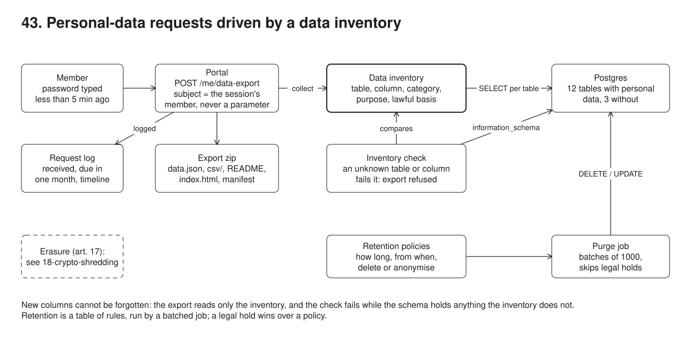
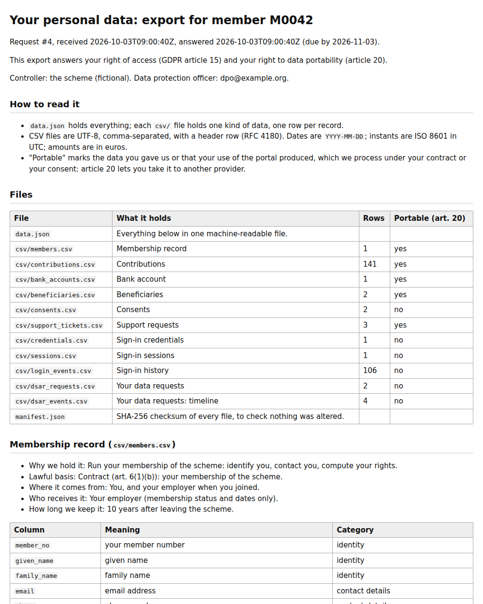

# 43. Data subject requests: an inventory-driven export, and retention



**Pain: personal-data requests handled by hand.** A member asks "what do you hold about me?". Someone queries the tables they remember, pastes the results into a spreadsheet and emails it, a few weeks later. They miss the sign-in history and last year's new chat table, include the password hash, include the date of birth of the member's child, and nobody can say when the one-month deadline falls or whether it was met. Meanwhile nothing is ever deleted: in this sample's seed, 10,003 rows across 11 tables are past their retention period (7,992 sign-in events older than a year, 1,382 contributions of members who left more than 10 years ago, 279 expired sessions, 203 closed support tickets older than 2 years, 20 members who should be anonymised), and one of those members is under a legal hold that a careless cleanup would ignore.

**Reach for it when** you hold personal data about people who can ask for it (GDPR art. 15 and 20, or the UK GDPR, or similar laws), you must keep some of it for years and delete the rest on time, and the schema keeps changing.

**Do not reach for it when** you hold almost no personal data: a written procedure is enough. Your data lives mostly in SaaS tools: use their export APIs and a data map rather than SQL. The request is for erasure in stores you cannot rewrite: see [18-crypto-shredding](../18-crypto-shredding/).

A data inventory (`src/inventory.ts`) declares every table and column: category, purpose, lawful basis, source, recipients, and how to find a member's rows. A check compares it with `information_schema` and fails on any table or column it does not know; the export refuses to run while it fails. A member portal (node:http on :53053) lets a signed-in member ask for an export, but only after typing their password in the last 5 minutes; the request is logged with its one-month deadline; the export is collected from the inventory alone and delivered as a zip of `data.json`, one CSV per table, a README explaining each file, an HTML index and a SHA-256 manifest. The export of the fictional member M0042 is committed in [`out/export-M0042/`](out/export-M0042/) and [`out/export-M0042.zip`](out/export-M0042.zip). A retention policy table drives a purge job that deletes or anonymises expired rows in batches and skips members under a legal hold. The clock is fixed at 2026-10-03T09:00Z, so the seed, the deadlines, the purge and the zip (byte for byte) are reproducible.

## Run

One shot with proof: `./run-43-data-subject-export.sh` from the repo root (log in [`../logs/43-data-subject-export.log`](../logs/43-data-subject-export.log)).

By hand, from this folder:

```sh
docker compose up -d --wait    # Postgres on :55473
npm i
npm run setup                  # 15 tables, 12 retention policies, 200 members, M0042
npm run check-inventory        # schema versus inventory: exit 1 on any gap
npm run demo                   # the 5 steps; starts the portal on :53053 itself
npm run purge                  # the retention job alone
```

## Files

- `src/inventory.ts` the data inventory: per table its title, purpose, lawful basis, source, recipients, subject predicate (`t.member_id = $1`, or a subquery for indirect links), and per column its meaning and category; columns or tables withheld from the export carry the reason. `notPersonal` lists the tables without personal data, with why.
- `src/inventory-check.ts` compares the inventory with `information_schema`: unknown tables, unknown columns, stale entries, personal-looking columns in "not personal" tables, tables without a retention policy.
- `src/export.ts` collects a member's rows table by table from the inventory and writes `data.json`, `csv/*.csv`, `README.md`, `index.html`, `manifest.json`; refuses with `InventoryIncomplete` when the check fails.
- `src/zip.ts` a 50-line ZIP writer (deflate, CRC-32, fixed timestamps) so the archive is reproducible.
- `src/server.ts` `POST /reauth`, `POST /me/data-export`, `GET /me/data-export/:id`; the member is always the session's member.
- `src/auth.ts` scrypt passwords, hashed session tokens, the 5-minute re-authentication rule.
- `src/deadline.ts` one month from receipt, end-of-month and weekend rules, the extension.
- `src/policies.ts` the retention schedule loaded into `retention_policies`. `src/retention.ts` the eligibility report and the batched purge.
- `src/setup.ts` schema and seed. `src/demo.ts` the five steps and their checks.
- `out/export-M0042/` the unzipped export of the last run; `out/export-M0042.zip` the archive the member downloaded.

## Concepts

- **Right of access (art. 15)**: a copy of the personal data, plus the information around it: purposes, categories, recipients, retention period, source, and the member's other rights. The export's README is generated from the inventory, so each file comes with that information and none of it is written by hand.
- **Right to data portability (art. 20)**: data the member provided (or produced by using the service), processed under consent or contract, in a structured, commonly used, machine-readable format. Here: JSON and RFC 4180 CSV in UTF-8, ISO 8601 dates; the README marks which files are portable (contract or consent basis) and which are not (security logs under legitimate interests, request history under a legal obligation).
- **Data inventory**: a column-level record of processing (art. 30), kept in code next to the schema: table, column, category, purpose, lawful basis (art. 6(1)), source, recipients, and the predicate that finds one member's rows. The export reads only this map. **The inventory check** fails closed: a table or column the map does not know, or a personal-looking column in a table declared not personal, fails CI and blocks the export, so a new column cannot be silently left out of the next request.
- **Withheld, with a reason**: secrets (the password hash, the session hash) are left out for the member's own security; another person's data is limited (art. 15(4)): the beneficiaries' names and shares are shown, their dates of birth are not; legal-hold records may be restricted while a claim is pending (art. 23 and national law). Each omission is listed in the export, with its reason, rather than silently skipped.
- **Identity verification**: proportionate to the risk. A valid session is not enough for a copy of everything: the password must have been typed in the last 5 minutes, the `max_age` / `auth_time` idea of OpenID Connect (26-sso) applied to a local session. The subject is the session's member, never a parameter, and someone else's export answers 404, not 403.
- **Deadline (art. 12(3))**: without undue delay and at the latest one month from receipt, extendable by two further months for complex or numerous requests if the member is told within the first month. Months are counted as in Regulation 1182/71: same day number, or the last day of a shorter month (31 January -> 28 February), and a period ending on a weekend ends on the next working day (here 2 March 2026). Public holidays are left out; add the country's calendar.
- **Request log**: each request has a row (received, due date, how identity was verified, status, the export's SHA-256) and a timeline of events (received, identity verified, export generated, downloaded). It is the accountability record (art. 5(2)), and is itself personal data with a retention policy (3 years).
- **Storage limitation (art. 5(1)(e)) and the retention policy table**: one row per table: how long, from which event (left the scheme, ticket closed, consent withdrawn), and the action: delete, or anonymise when the row still serves statistics. The check fails if a table with personal data has no policy.
- **Batched purge**: each batch selects up to 1,000 expired rows `FOR UPDATE SKIP LOCKED` and deletes or updates them in its own short transaction, so the job never holds long locks, does not fight the application, and can stop and resume anywhere. Policies run children first (contributions before the member's anonymisation). A second run finds nothing.
- **Legal hold**: a pending claim suspends the schedule for that member (art. 17(3)(e): establishment, exercise or defence of legal claims). The purge counts what it skipped, and the hold record gets its own retention once released.
- **Anonymisation versus pseudonymisation**: an anonymised member keeps the year of birth, the first two digits of the postcode, the employer and the dates; name, email, phone, national id and address are gone, and the member number becomes `anon-<id>`. Data is only anonymous if nobody can single the person out with reasonable means (recital 26): check small groups (k-anonymity) before trusting a combination of fields. Pseudonymised data is still personal data.
- **Erasure (art. 17)**: a row in a mutable table can be deleted; personal data in append-only stores, events, audit trails and backups cannot. For those, encrypt per person and delete the key: [18-crypto-shredding](../18-crypto-shredding/).
- **Reproducible export**: fixed timestamps in the ZIP entries and a fixed clock make the archive byte-for-byte identical across runs (`sha256sum` in the log), so a committed export only changes when its content does.

## Proof (`logs/43-data-subject-export.log`)

A hotfix adds a column, a table and a personal-looking column without touching the inventory; the check names all three and the export refuses to run:

```
   inventory: table chat_messages is in the database but not in the inventory
   inventory: column members.preferred_name is in the database but not in the inventory
   inventory: column purge_runs.operator_email looks personal, but purge_runs is declared not personal (counts only, no row-level data)
   export attempted with the gap: refused (InventoryIncomplete)
```

A 3-hour-old sign-in is not enough; a wrong password does not help; the right one does:

```
   POST /me/data-export with a 3-hour-old sign-in -> 401 {"error":"reauthentication_required","max_age":300,"auth_age":10800}
   POST /reauth with a wrong password -> 401
   POST /reauth with the right password -> 204
```

The export: one file per inventoried table, the omissions with their reasons, someone else's export a 404:

```
   POST /me/data-export 40 s later -> 201 {"request_id":4,"due_on":"2026-11-03","extended_due_on":"2027-01-04","files":15,"download":"/me/data-export/4"}
   GET /me/data-export/4 -> 200 application/zip, 16769 bytes
   unzip -t: No errors detected in compressed data of out/export-M0042.zip.
   contributions     141 rows  portable
   login_events      106 rows  
   withheld sessions.id_hash: A hash of a live credential: it is left out for your account's security.
   GET /me/data-export/1 (request #1 belongs to another member) -> 404
```

The deadline rules:

```
   received 2026-10-03: one month -> 2026-11-03, due 2026-11-03, extended 2027-01-04
   received 2026-01-31: one month -> 2026-02-28, due 2026-03-02, extended 2026-04-30
```

Retention: rows past their period before the purge, the batches, the hold respected, and nothing left to purge:

```
   table             keep        from                             action     rows  expired  held
   login_events      1 year      after the sign-in                delete     15810     7992     0
   contributions     10 years    after leaving the scheme         delete     39018     1382    61
   members           10 years    after leaving the scheme         anonymise    200       20     1
   deleted      7992 from login_events     in 8 batch(es)
   deleted      1382 from contributions    in 2 batch(es), 61 kept under a legal hold
   anonymised     20 from members          in 1 batch(es), 1 kept under a legal hold
   under a legal hold: M0004, left 2009-01-23, still 61 contributions and a named record
```

```
 run | purged | held | batches 
-----+--------+------+---------
   1 |  10003 |   68 |      19
   2 |      0 |   68 |       0
```

## Screenshots



## Do / Don't

- Do generate the export from a declared inventory and fail CI on any table or column it does not know; don't maintain a list of queries by hand.
- Do re-authenticate before a copy of everything, and take the subject from the session; don't accept a member id.
- Do say what you left out and why; don't silently drop secrets or other people's data.
- Do purge in short batches, children first, with legal holds checked in the same query; don't run one giant `DELETE` at night.
- Don't call data anonymous because the name is gone: check what the remaining fields can single out.

## Origins and further reading

- [Regulation (EU) 2016/679 (GDPR)](https://eur-lex.europa.eu/eli/reg/2016/679/oj): art. 5(1)(e) storage limitation, 5(2) accountability, 6 lawful bases, 12(3) deadline, 15 access, 17 erasure, 20 portability, 23 restrictions, 30 records of processing, recital 26 anonymous data.
- EDPB, [Guidelines 01/2022 on data subject rights: Right of access](https://www.edpb.europa.eu/our-work-tools/our-documents/guidelines/guidelines-012022-data-subject-rights-right-access_en).
- Article 29 Working Party, [Guidelines on the right to data portability (WP242 rev.01)](https://ec.europa.eu/newsroom/article29/items/611233).
- Article 29 Working Party, [Opinion 05/2014 on anonymisation techniques (WP216)](https://ec.europa.eu/justice/article-29/documentation/opinion-recommendation/files/2014/wp216_en.pdf).
- [Regulation (EEC, Euratom) No 1182/71](https://eur-lex.europa.eu/eli/reg/1971/1182/oj) on periods, dates and time limits.
- UK ICO, [Right of access](https://ico.org.uk/for-organisations/uk-gdpr-guidance-and-resources/individual-rights/individual-rights/right-of-access/) guidance.
- [OpenID Connect Core 1.0](https://openid.net/specs/openid-connect-core-1_0.html), `max_age` and `auth_time`; [RFC 4180](https://www.rfc-editor.org/rfc/rfc4180) (CSV); PKWARE [APPNOTE.TXT](https://pkware.cachefly.net/webdocs/casestudies/APPNOTE.TXT) (ZIP).
- In this repo: [18-crypto-shredding](../18-crypto-shredding/) for erasure in stores you cannot rewrite, 26-sso for re-authentication with an identity provider, 28-campaign for `SKIP LOCKED` batches.
