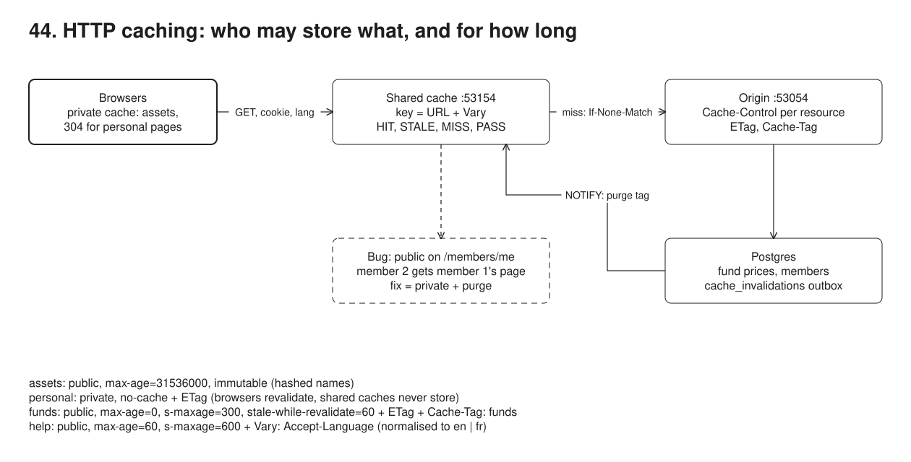
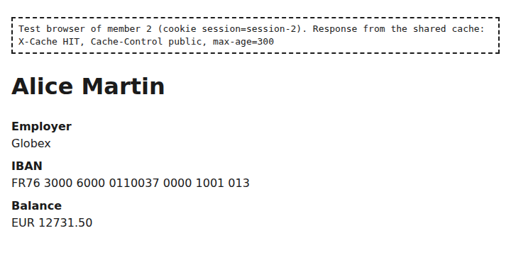
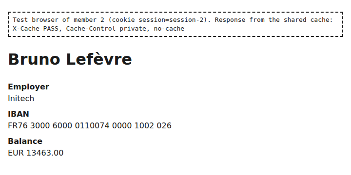

# 44. HTTP caching: Cache-Control, ETags, Vary and invalidation



**Pain: slow pages or stale data.** Every page view recomputes the fund list from ten years of prices: under a morning's traffic (1,500 requests from 16 clients) its p95 is 1,791 ms and the origin answers all 1,500 requests. Put a cache in front carelessly and it gets worse in other ways. A personal page sent with `Cache-Control: public` is stored once and served to everyone: member 2 opens "my account" and sees Alice's name, IBAN and balance. A French reader gets the English help page. A unit price changes and members see the old one for five minutes, because the only way out of a cache is waiting for the TTL.

**Reach for it when** many members read the same things (reference data, help pages, assets) and a few personal pages, the origin or its database is the bottleneck, and you put a CDN, a reverse proxy or a framework cache (Next.js) in front of it. The headers are the contract every cache along the way follows, including the browser.

**Do not reach for it when** almost every response is personal and changes on each request: there is nothing to share, and a shared cache only adds a hop (cache in the browser with `private`, or in the app, keyed by member). Data must never be stale, not even by milliseconds (a balance just after a payment): read it from the source, with `no-store`. Writes bypass the app and you cannot hook them (no trigger, no outbox, no CDC): keep TTLs short.

The origin (`src/origin.ts`, node:http on :53054) serves member pages and an API from Postgres, and gives each resource type its own `Cache-Control`. A small shared cache written for this sample (`src/cache.ts`, :53154) sits in front of it and follows RFC 9111 for what is used here: storability, `s-maxage`/`max-age`, `Age`, `no-cache`, `stale-while-revalidate`, revalidation with `If-None-Match`, `Vary` (with `Accept-Language` normalised to `en` or `fr`), request coalescing, hit-for-pass, and purge by URL or by tag. It also follows an invalidation outbox in Postgres through `LISTEN/NOTIFY`. `src/demo.ts` shows the headers, conditional GETs in a real Chromium, a load test with and without the cache, the privacy bug and its fix, and TTL versus event-driven invalidation.

| Resource | Cache-Control | Also |
|---|---|---|
| hashed assets `/assets/app.<sha256>.css` | `public, max-age=31536000, immutable` | the name changes with the content |
| personal data `/members/me`, `/api/me` | `private, no-cache` | ETag; browsers revalidate, shared caches never store |
| shared reference data `/api/funds` | `public, max-age=0, s-maxage=300, stale-while-revalidate=60` | ETag from a data version; `Cache-Tag: funds` |
| bilingual content `/help/contributions` | `public, max-age=60, s-maxage=600` | `Vary: Accept-Language`, `Content-Language` |

## Run

One shot with proof: `./run-44-http-caching.sh` from the repo root (log in [`../logs/44-http-caching.log`](../logs/44-http-caching.log)).

By hand, from this folder:

```sh
docker compose up -d --wait      # Postgres on :55474
npm i
npm run setup                    # members, sessions, 40 funds x 10 years of prices, help pages, outbox and triggers
npm run origin                   # :53054 (BUGGY=1 for the version with the two bugs)
npm run cache                    # :53154 (INVALIDATION=off to start without the outbox listener)
curl -sI -H 'cookie: session=session-1' http://localhost:53154/members/me
curl -s http://localhost:53154/__cache/stats
npm run demo                     # the whole story (starts both itself: stop the ones above first)
```

## Files

- `src/origin.ts` the origin: routes, `Cache-Control` per resource, ETags and 304s, the version-based ETag for funds, `BUGGY=1`.
- `src/cache.ts` the shared cache: storability, freshness, `stale-while-revalidate`, revalidation, `Vary`, coalescing, hit-for-pass, purge, the test clock, the outbox listener with catch-up.
- `src/shared.ts` language negotiation (used by both), the hashed asset names, the `Cache-Control` parser.
- `src/setup.ts` tables, seeded data, `data_versions`, the `cache_invalidations` outbox and the statement-level triggers that write it and `NOTIFY`.
- `src/demo.ts` the six steps, the load generator and the checks; `src/db.ts` ports and pool.
- `screenshots/leak-member-2-sees-member-1.png` member 2's browser showing Alice's page; `screenshots/fixed-member-2-sees-own-page.png` after the fix and the purge.

## Concepts

- **Private versus shared cache**: the browser's cache is private (one user); a CDN, a reverse proxy or a framework's server cache is shared. `private` lets only the first store a response; `public` and `s-maxage` are for the second; `no-store` is for neither. A shared cache keys entries by URL (plus `Vary`), not by user, so a personal page at a URL like `/members/me` must never be shared.
- **Freshness**: `max-age` is how long any cache may reuse a response without asking; `s-maxage` overrides it for shared caches only. `max-age=0, s-maxage=300` keeps browsers asking while the CDN absorbs the load. `Age` says how long the shared cache has held it.
- **immutable and hashed names**: `app.503f4b48f9.css` is named after its content, so the content behind that name never changes; a year plus `immutable` means browsers do not even revalidate on reload. A new build links a new name. Next.js does the same for `/_next/static/`.
- **ETag and conditional GET**: the response carries a validator (`ETag: "funds-v1"`); the client sends it back in `If-None-Match`, and if nothing changed the origin answers `304 Not Modified` with no body. For `/api/funds` the ETag is a version number bumped by the trigger, so the 304 skips the expensive query (137 ms for the 200, 4.5 ms for the 304); for personal pages it is a hash of the body.
- **no-cache**: "store it, but revalidate before every use", not "do not cache" (that is `no-store`). With `private, no-cache` the browser keeps the member's page and asks with `If-None-Match`; the Chromium in step 2 got a 304 on its second visit.
- **stale-while-revalidate**: after `s-maxage`, the cache may serve the stale copy for this many more seconds while it refreshes in the background, so no member waits for the slow query; past that window it must revalidate first.
- **Vary**: names the request headers that chose this response. The cache stores one variant per value. Raw `Accept-Language` has hundreds of spellings, so caches normalise it (here to the language the origin will pick: six spellings, two entries) or the CDN keys on a header the edge computes. Without `Vary`, the first reader's language is served to everyone.
- **Storability (RFC 9111 section 3)**: a shared cache must not store `no-store` or `private` responses; this one also refuses `Set-Cookie`, `Vary: *`, and a request with `Authorization` unless the response says `public` (the RFC rule). Nothing in the RFC protects a cookie session marked `public`: that is the bug in step 5.
- **Coalescing and hit-for-pass**: concurrent misses for one URL share one origin request (no thundering herd on a cold entry). If the answer turns out to be private, each waiter goes to the origin itself, and the URL is passed straight through for two minutes (Varnish's hit-for-pass), so personal pages are not serialised behind each other and their `If-None-Match` reaches the origin.
- **Purge and tags**: a purge removes entries now instead of waiting for the TTL; it is also the second half of fixing a leak, since a fixed origin does not recall what caches already hold. The origin labels responses with `Cache-Tag: funds` (Fastly's `Surrogate-Key`, Cloudflare's `Cache-Tag`), and one purge by tag removes every URL built from that data.
- **Event-driven invalidation through an outbox**: a statement-level trigger on `fund_prices` bumps the data version, inserts a `cache_invalidations` row and `NOTIFY`s, all in the writer's transaction. The notification is delivered at commit, so the cache never purges before the new data is visible. `NOTIFY` is fire and forget: a listener that is disconnected misses it. The rows make it reliable: on reconnect the cache replays the outbox after the last id it processed (step 6 kills its connection to prove it). This is the transactional outbox of sample 09 (and 17) with `LISTEN` as the wake-up; with many writers or other services, change data capture (sample 10) feeding the purge does the same without a trigger.
- **The purge race**: a request that read the old data just before the commit can still store it just after the purge. A short `s-maxage` bounds it; versioned ETags or keys (the version in the URL or the cache key) remove it.
- **Hit ratio, honestly measured**: share of requests answered from the cache without the origin (`HIT` and `STALE`), per resource type. Personal pages are always `PASS`; the overall ratio depends on the traffic mix, so look at the per-type numbers.

## How Next.js revalidateTag and ISR map to this

- **ISR** (`export const revalidate = 300` on a route) is `s-maxage=300` plus `stale-while-revalidate`: Next serves the prerendered page from its cache, and after 300 seconds the next request gets the stale page while Next regenerates it in the background. Next sends `Cache-Control: s-maxage=300, stale-while-revalidate` for such pages, so a CDN in front follows the same rule. The browser gets `max-age=0` semantics, as `/api/funds` does here.
- **Tags**: `fetch(url, { next: { tags: ["funds"], revalidate: 300 } })`, `unstable_cache(fn, keys, { tags: ["funds"] })`, or `"use cache"` with `cacheTag("funds")` label cached data the way `Cache-Tag: funds` labels responses here.
- **revalidateTag("funds")** is the purge by tag. Call it from the Server Action or route handler that wrote the data; `revalidatePath("/funds")` is the purge by URL. In Next.js 15 it expires the entries so the next request regenerates them; Next.js 16 takes a cache life profile as a second argument (`revalidateTag("funds", "max")`) for stale-while-revalidate behaviour, and adds `updateTag` in Server Actions to expire at once, so the member who just made a change sees it.
- **Writes that bypass Next** (a batch job, another service, a SQL script) never call `revalidateTag`. Wire the outbox or CDC from samples 09 and 10 to a route handler that calls it, which is what the `LISTEN` loop in `src/cache.ts` does for this cache.
- **Personal pages**: reading `cookies()` or `headers()` makes a route dynamic, and Next sends `private, no-cache, no-store, max-age=0, must-revalidate`. The step 5 bug in Next is a personal page made static or cached under a shared tag; the fix is the same: make it dynamic, then purge what was cached.
- **Self-hosting with several instances**: each instance has its own cache unless you configure a shared cache handler (Redis, for example); a `revalidateTag` on one instance must reach the others, the same problem the outbox solves for many cache nodes.

## Proof (`logs/44-http-caching.log`)

With the cache in front, 79% of requests never reach the origin, the origin gets 307 requests instead of 1,500, and the fund list's p95 drops from 1,791 ms to 71 ms:

```
                  origin requests  wall s  req/s   p50 / p95 ms by type: asset, funds, help, personal, all
   without cache             1500    15.2     99   1.0 / 8.5,  408.7 / 1791.1,  8.1 / 244.1,  14.3 / 197.8,  5.8 / 982.1
   with cache                 307     2.5    598   12.1 / 68.8,  12.1 / 71.4,  11.9 / 59.6,  34.2 / 231.6,  14.1 / 83.2
   hit ratio: all 78.8%, assets 99.3%, funds 98.1%, help 96.8%, personal 0.0% (always PASS)
```

Without the cache, the 16 clients spend most of their time waiting on the fund list, so the few cheap requests in flight look fast (assets at 1.0 ms). With it the run is 6 times faster (598 requests per second against 99) and the 16 clients keep the four shared cores busy, so every request queues a little (about 12 ms at p50, more for personal pages that pass through to the origin): read the throughput and the funds p95, not the asset p50.

The browser's own cache follows the same headers: each hashed asset fetched once, the private page revalidated with a 304:

```
   Chromium visited /members/me, /help/contributions, /members/me; the origin saw: {"/members/me 200":1,"asset 200":2,"/help/contributions 200":1,"/members/me 304":1}
```

The privacy bug, and why the fix needs a purge:

```
   member 1 (Alice) opens /members/me: Alice Martin  [MISS, Cache-Control: public, max-age=300]
   member 2 (Bruno) opens /members/me: Alice Martin  [HIT]  <- Alice's name, IBAN and balance
   without Vary: an English reader fills the entry, then a French reader gets How contributions work [HIT]
   member 2 right after the deploy: Alice Martin [HIT]  <- the leaked entry is still fresh for 300 s
   member 2 after the purge: Bruno Lefèvre [PASS, Cache-Control: private, no-cache], again: Bruno Lefèvre [PASS]
```

Waiting for the TTL (a test clock moves the cache forward) versus purging at commit:

```
   fund 1 price 109.5275 [MISS]; 400 s later, nothing changed: [REVALIDATED], origin answered {"/api/funds 304":1}
   UPDATE fund_prices: fund 1 is now 120.4803 in Postgres (invalidation off)
     right after: 109.5275 [HIT, Age 0]
     +290 s: 109.5275 [HIT, Age 290]
     +20 s (age 310, stale): 109.5275 [STALE, Age 310]
     next request: 120.4803 [HIT, Age 0]
   [cache] outbox #2 (UPDATE on fund_prices): purged tag funds, 1 entries, 2 ms after the change
   invalidation on: 120.4803 [HIT] -> UPDATE (now 126.5043) -> 126.5043 [MISS] 248 ms after the commit
```

A lost `NOTIFY` is caught up from the outbox:

```
   [cache] invalidation connection lost; reconnecting and replaying the outbox after #2
   [cache] outbox #3 (UPDATE on fund_prices): purged tag funds, 1 entries, 289 ms after the change
   price 122.7092 served [MISS] 374 ms after the commit: the NOTIFY was lost, the outbox row was not
```

The raw headers with `curl -sI` and the outbox rows are at the end of the log.

## Screenshots





## Do / Don't

- Do decide `Cache-Control` per resource type, in one place, and test it (a check that `/members/me` is `private` would have caught step 5).
- Do send `Vary` for every request header that changes the response, and normalise it at the cache.
- Do pair long shared TTLs with purge by tag from an outbox or CDC; do keep `stale-while-revalidate` so expiry never blocks a member.
- Don't put personal data under a shared URL with `public`; don't rely on "the CDN won't cache cookies" (many do when told `public`).
- Don't treat `no-cache` as `no-store`, and don't forget the purge after fixing a caching bug.

## Origins and further reading

- [RFC 9111](https://www.rfc-editor.org/rfc/rfc9111) HTTP Caching, and [RFC 9110](https://www.rfc-editor.org/rfc/rfc9110) sections 8.8 (validators) and 13 (conditional requests).
- [RFC 5861](https://www.rfc-editor.org/rfc/rfc5861) stale-while-revalidate and stale-if-error; [RFC 8246](https://www.rfc-editor.org/rfc/rfc8246) immutable.
- MDN: [HTTP caching](https://developer.mozilla.org/en-US/docs/Web/HTTP/Guides/Caching) and [Cache-Control](https://developer.mozilla.org/en-US/docs/Web/HTTP/Reference/Headers/Cache-Control).
- Fastly: [Surrogate-Key purging](https://www.fastly.com/documentation/guides/full-site-delivery/purging/working-with-surrogate-keys/); Varnish: [hit-for-pass](https://varnish-cache.org/docs/trunk/users-guide/vcl-built-in-subs.html).
- Next.js: [Incremental Static Regeneration](https://nextjs.org/docs/app/guides/incremental-static-regeneration), [revalidateTag](https://nextjs.org/docs/app/api-reference/functions/revalidateTag), [caching](https://nextjs.org/docs/app/guides/caching).
- PostgreSQL: [NOTIFY](https://www.postgresql.org/docs/16/sql-notify.html) and [LISTEN](https://www.postgresql.org/docs/16/sql-listen.html).
- Samples 09 (outbox with a polling relay), 10 (CDC) and 17 (audit outbox) in this repository.
