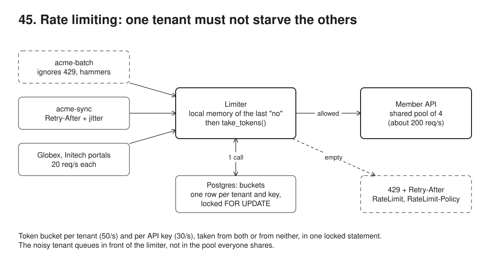
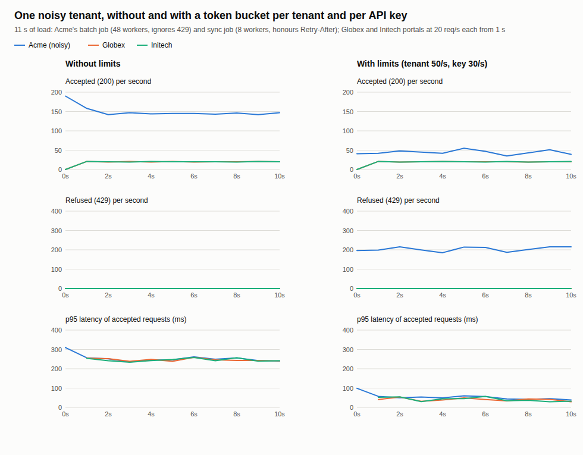

# 45. Rate limiting per tenant



**Pain: one tenant starves the others.** Acme's nightly batch export runs 48 workers against the member API that Globex's and Initech's portals share with it. The API has one pool of 4 database connections (about 200 requests a second for everyone). Alone, the quiet tenants' p95 is 27 ms; next to Acme's batch it is 250 ms, because their requests wait in the same queue as Acme's. Retrying clients make it worse: a job that ignores errors and sends again at once never lets the queue drain.

**Reach for it when** several tenants, API keys or partners share one backend and one of them can send far more than its share: a batch job, a misconfigured integration, a retry loop. You owe each tenant a fair share and want to say so in the protocol (429, `Retry-After`, the `RateLimit` headers) rather than by timing out.

**Do not reach for it when** the problem is total capacity: limits share out what there is, they do not add any (see 46 for finding the capacity). Abuse at internet scale (thousands of requests a second from many addresses): limit at the edge (CDN, API gateway, reverse proxy) before requests cost a database round trip. You need strict per-tenant isolation of resources: give big tenants their own pool or deployment (bulkheads, cells) instead.

A member API (`src/server.ts`, node:http, a separate process) shared by Acme, Globex and Initech. With `LIMITS=on`, every request first passes `limit()`: a token bucket per tenant (50/s, burst 10) and per API key (30/s, burst 6), decided by one call to a Postgres function, `take_tokens()`, that locks the bucket rows, refills them by elapsed time and takes a token from all of them or none. A refused request gets 429 with `Retry-After`, `RateLimit` and `RateLimit-Policy` and a problem+json body. The demo floods the API from a separate load process, first without limits and then with them, and draws requests over time per tenant.

## Run

One shot with proof: `./run-45-rate-limiting.sh` from the repo root (log in [`../logs/45-rate-limiting.log`](../logs/45-rate-limiting.log)).

By hand (Postgres on 55475, the member API on 53055):

```sh
docker compose up -d --wait
npm i
npm run setup                     # tenants, api_keys, members, buckets, take_tokens(), request_log
LIMITS=on npm run server          # GET /members/:id with header x-api-key: acme-sync (or acme-batch, globex-portal, initech-portal)
curl -i -H 'x-api-key: acme-sync' localhost:53055/members/3
npm run demo                      # starts the server itself, twice (stop the one above first)
```

## Files

- `src/setup.ts` the policy tables, the UNLOGGED `buckets` table and `take_tokens()`, the atomic token bucket in PL/pgSQL.
- `src/limiter.ts` `limit()`: one call per tenant at a time, the local memory of the last refusal, and the IETF headers.
- `src/server.ts` the member API; the shared pool of 4 connections for the work, a separate small pool for the limiter.
- `src/load.ts` the three kinds of client: steady portal traffic, a batch job that ignores 429, a sync job that honours `Retry-After` with jitter.
- `src/noisy.ts` Acme's two clients in their own process; `src/demo.ts` the seven steps and their checks.
- `src/chart.ts` draws `out/requests.svg`; `out/requests.svg`, `screenshots/requests.png` the chart from the last run.

## Concepts

- **Token bucket**: a bucket holds up to `burst` tokens and refills at `rate` per second; a request takes one token or is refused. The rate is the sustained share, the burst is how much a client may send at once after being quiet. The state is two numbers per bucket (tokens, last update); refill is computed lazily on the next request, so there is no timer.
- **Atomic in Postgres**: `take_tokens()` inserts missing buckets full, locks the rows `FOR UPDATE` in key order (no deadlock), reads the clock after the lock, refills, and takes the cost from every bucket or from none, all in one statement. In step 1, 100 concurrent requests on a bucket of 10 admit exactly 10; an app-side read-then-write admits all 100.
- **Per tenant and per API key**: Acme's tenant bucket caps the whole employer at 50/s; each key's bucket (30/s) stops one Acme job from taking all of Acme's share, so the sync job still gets work done while the batch job is throttled.
- **One limiter call per tenant at a time**: the row lock serializes a tenant's calls anyway. Queuing them in memory (`inLane`) keeps a flooding tenant from holding every limiter connection while it waits for its own row, which would make the other tenants wait for a connection.
- **Local memory of the last refusal**: after Postgres says no, the process remembers until when the bucket is empty and answers 429 itself until then: 2,117 of the refusals in the log never reached Postgres (154 did). The database stays the authority; the memory only saves round trips for a client that keeps hammering.
- **In-memory limiter, the trade-offs**: a `Map` of buckets in the process is faster (no round trip) and has no single hot row, but each instance enforces the limit alone: three instances behind a load balancer allow three times the rate, and a restart refills everyone. It is fine with one instance, with sticky routing by tenant, or as a coarse first line in front of a shared one (here: the refusal memory). A shared store (Postgres here, often Redis with a Lua script) gives one limit across instances at the cost of a round trip per request.
- **429 and Retry-After**: `429 Too Many Requests` (RFC 6585) with `Retry-After` in whole seconds (RFC 9110). The body is `application/problem+json` (RFC 9457) so a client can tell a quota from any other error.
- **RateLimit and RateLimit-Policy**: the IETF httpapi draft headers. `RateLimit-Policy: "tenant";q=50;w=1, "key";q=30;w=1` names each quota (q requests per w seconds); `RateLimit: "tenant";r=9;t=1, "key";r=5;t=1` says how many are left (r) and in how many seconds the quota is back (t). They are on every response, so a client can slow down before it is refused.
- **Retry with jitter**: the sync job waits `Retry-After x (1 + random up to 50%)`, never earlier than asked, and spread so that the workers refused together do not come back in the same millisecond (1,019 to 1,499 ms in the log). It sees 429 on 29.5% of its requests; the batch job that retries after 200 ms whatever the answer sees it on 87.1%.
- **Fairness, not capacity**: the limits move the queue out of the shared pool and back to the client that caused it. The sum of the tenant rates (150/s) must stay under what the pool serves (about 200/s), or the limits stop protecting anyone; the burst sizes matter too, since a burst lands on the shared pool at once.

## Proof (`logs/45-rate-limiting.log`)

One locked statement admits exactly the bucket; reading and writing from the app lets all 100 concurrent requests through:

```
   bucket of 10 tokens, 100 concurrent requests: read-then-write admitted 100, take_tokens() admitted 10
```

The quiet tenants alone, then next to Acme's flood with no limits: their p95 goes from 27 ms to 250 ms, the same as Acme's own, because everyone waits in one queue:

```
   globex-portal       60     60      0    0.0      23      27
   initech-portal      61     61      0    0.0      24      26
   ...
   acme-batch        1273   1273      0    0.0     227     251
   acme-sync          376    376      0    0.0     226     252
   globex-portal      201    201      0    0.0     229     250
   initech-portal     201    201      0    0.0     228     250
```

A refused request carries everything a client needs to slow down:

```
   40 requests at once from acme-sync: 7 answered 200, 33 answered 429 (in 110 ms); one of the 429s:
     retry-after: 1
     ratelimit-policy: "tenant";q=50;w=1, "key";q=30;w=1
     ratelimit: "tenant";r=0;t=1, "key";r=0;t=1
     content-type: application/problem+json
     body: {"type":"about:blank","title":"Too Many Requests","status":429,"detail":"quota exceeded for acme-sync, retry after 1 s"}
```

With limits, the same load: the quiet tenants stay at 41 ms and never see a 429; the batch job that hammers gets 429 on 87% of its requests, the sync job that waits gets its work done; most refusals never reach Postgres:

```
   acme-batch        2489    321   2168   87.1      28      58
   acme-sync          237    167     70   29.5      25      58
   globex-portal      200    200      0    0.0      25      41
   initech-portal     201    201      0    0.0      25      41
   server: 897 served, 154 refused by take_tokens(), 2117 refused from the local memory of the last refusal
   quiet tenants' p95: 27 ms alone, 250 ms next to Acme without limits, 41 ms with limits
   Acme accepted 488 in 11 s (limit 50/s + a burst of 10 = 560); acme-batch 321 (key limit 30/s + 6 = 336)
   acme-sync waited 70 times, 1019..1499 ms (Retry-After 1 s plus up to 50% jitter)
```

The run script then dumps the policy, the bucket rows, `request_log` per run and client, and Acme's accepted and refused requests per second from SQL. Latencies depend on the machine (the container is shared); the checks compare runs against the baseline measured in the same run.

## Screenshots



## Do / Don't

- Do limit per tenant and per key, return 429 with `Retry-After`, and send the quota headers on every response.
- Do retry after `Retry-After` with jitter, and cap the number of retries.
- Don't read the bucket, decide in the app and write it back: concurrent requests spend the same token.
- Don't let the sum of the limits exceed what the backend serves.

## Origins and further reading

- [RFC 6585](https://www.rfc-editor.org/rfc/rfc6585#section-4) section 4, 429 Too Many Requests; [RFC 9110](https://www.rfc-editor.org/rfc/rfc9110#section-10.2.3) section 10.2.3, Retry-After.
- [draft-ietf-httpapi-ratelimit-headers](https://datatracker.ietf.org/doc/draft-ietf-httpapi-ratelimit-headers/), the `RateLimit` and `RateLimit-Policy` fields.
- [RFC 9457](https://www.rfc-editor.org/rfc/rfc9457), Problem Details for HTTP APIs.
- Marc Brooker, [Exponential Backoff And Jitter](https://aws.amazon.com/blogs/architecture/exponential-backoff-and-jitter/) (AWS Architecture Blog, 2015).
- [Token bucket](https://en.wikipedia.org/wiki/Token_bucket), the algorithm and its relation to the leaky bucket.
