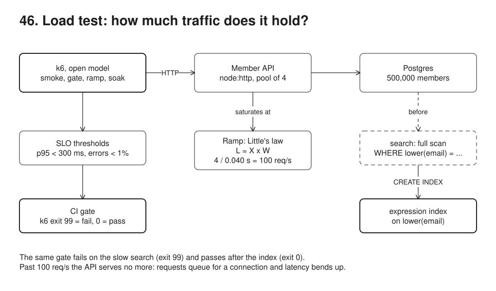
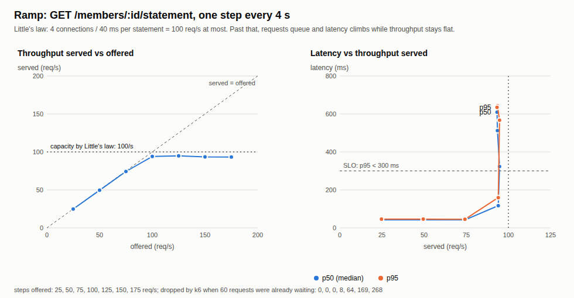

# 46. Load testing with k6



**Pain: no idea how much traffic it holds.** The member API works in every test, then the annual statement campaign sends every member at once and nobody knew where it would fall over. A search by email that takes a millisecond on a laptop's 100-row database reads all 500,000 members in production: at one user it already takes 126 ms, and at 60 searches a second the p95 is 3,135 ms. Nothing in the pipeline says "this release is slower than the last one".

**Reach for it when** a service has a known peak (a campaign, a deadline, month end) or a latency SLO, and you need to know before release whether it holds: a smoke test after each deploy, an SLO gate in CI on the endpoints that matter, a ramp to find the saturation point before a big event, a soak before a long-running release.

**Do not reach for it when** you test against a laptop and read the numbers as production's: the absolute numbers here are only good for comparing runs on the same machine, and a shared CI runner is noisy (the curve's shape travels, the numbers do not). You need to know which line of code is slow: profile and `EXPLAIN` first, load test second. Real-user latency matters more than synthetic latency: measure it from production (sample 29) and use load tests for what production cannot tell you yet.

A member API (`src/server.ts`, node:http, a pool of 4 Postgres connections) over 500,000 members, with three endpoints: a lookup by id, a search by email that compares `lower(email)` with no index for it, and a statement that holds a connection for about 40 ms. k6 (the release binary from GitHub, downloaded by the run script) runs four scripts against it: a smoke test, an SLO gate (before and after adding the index), a ramp that finds the saturation point, and a soak. The demo reads k6's JSON summaries, samples the server's `/metrics`, and draws the throughput/latency curve.

## Run

One shot with proof: `./run.sh` in this folder, or `./46-load-test/run.sh` from the repo root (log in [`../logs/46-load-test.log`](../logs/46-load-test.log)). It downloads k6 v2.1.0 into `.bin/` (not committed) the first time. The whole run takes about two minutes, setup included.

By hand (Postgres on 55476, the member API on 53056):

```sh
docker compose up -d --wait
npm i
npm run setup                          # 500,000 members, no index on lower(email)
npm run server                         # GET /members/:id, /members?email=..., /members/:id/statement, /metrics
.bin/k6 run k6/smoke.js                # one user, 3 s: does it work?
.bin/k6 run k6/gate.js; echo $?        # 99 = SLO crossed, 0 = SLO met
.bin/k6 run k6/ramp.js                 # 25 to 175 statements/s in 4 s steps
.bin/k6 run k6/soak.js                 # 100 req/s mix for 30 s
npm run demo                           # all of the above with the fix in between (starts its own server, on a fresh setup)
```

## Files

- `src/setup.ts` 500,000 members; deliberately no index on `lower(email)`.
- `src/server.ts` the member API; `/metrics` (RSS, heap, pool, requests in flight); a request whose client has gone is dropped when it gets a connection.
- `k6/common.js` the target, the SLO as k6 thresholds, a compact summary and the JSON export.
- `k6/smoke.js`, `k6/gate.js`, `k6/ramp.js`, `k6/soak.js` the four scenarios.
- `src/demo.ts` runs k6, adds the index, reads the summaries, checks; `src/chart.ts` draws `out/throughput-latency.svg`.
- `out/k6/*.json` the full k6 summaries from the last run; `out/throughput-latency.svg`, `screenshots/throughput-latency.png` the curve.

## Concepts

- **Smoke, load, stress, soak**: a *smoke* test is one user for a few seconds, to know the build works before loading it; a *load* test holds the expected traffic (the gate); a *stress* or *ramp* test goes past it to find where it breaks; a *soak* holds a realistic load for a long time (hours in real life, 30 s here) to find drift: memory growth, connection leaks, latency creeping up.
- **Open versus closed model**: a closed model (N virtual users in a loop) slows down when the server slows down, so it hides queueing (coordinated omission). The gate, ramp and soak use k6's `constant-arrival-rate` executor: requests arrive at the set rate whether or not earlier ones have answered, like members do. `maxVUs` caps the requests in flight; k6 reports the arrivals it had to drop as `dropped_iterations`.
- **SLO thresholds as a gate**: `http_req_duration: p(95)<300` and `http_req_failed: rate<0.01`. k6 exits with code 99 when a threshold is crossed, which fails the CI job. The same gate fails on the slow search (exit 99, p95 3,135 ms) and passes once the index exists (exit 0, p95 3.8 ms).
- **The missing index**: the query is `WHERE lower(email) = lower($1)`. A plain index on `email` would not be used; the fix is an expression index on `lower(email)`, which turns a parallel sequential scan of the table into a bitmap index scan (167 ms against 0.1 ms in `EXPLAIN ANALYZE`).
- **Saturation point**: the ramp offers 25 to 175 statements a second. Below capacity, served equals offered and latency stays near the 40 ms service time; past it, served stops growing (95/s at most) and latency climbs (635 ms p95 at the top step), because requests wait for a connection.
- **Little's law**: L = X x W. The average number of requests in the system (L) is the throughput (X) times the time each spends there (W). With 4 connections each held 40 ms, at most L = 4 requests are being served, so X can be at most 4 / 0.040 s = 100 a second: that is where the curve bends. Below saturation, k6's served rate times its mean latency matches the in-flight count the server reports (step 4 of the log). Past it, the extra L is the queue, and W grows with it.
- **Percentiles**: the SLO is on the p95 because the mean hides the slow tail; the p50 and p95 move apart as the queue forms.
- **Dropping abandoned work**: when a client gives up (k6 stopping, a browser closing, a proxy timing out), the requests still queued for a connection are worth nothing. The server checks the socket when it gets a connection and skips the query, so the API recovers as soon as the load stops (7 queued searches dropped after the failing gate).
- **k6**: a Go binary that runs JavaScript test scripts (scenarios, executors, checks, thresholds, `handleSummary`). The run script downloads the release binary from GitHub; no Docker image or npm package is needed.

## Proof (`logs/46-load-test.log`)

The smoke test passes (it checks correctness, not speed), but the search already stands out at one user:

```
       {name:GET /members/:id/statement}: 17 requests, med 41.95 ms, p(95) 45.74 ms
       {name:GET /members/:id}: 17 requests, med 1.67 ms, p(95) 23.35 ms
       {name:GET /members?email}: 17 requests, med 125.92 ms, p(95) 199.10 ms
     threshold PASS  checks rate==1
```

The gate fails on the full scan, and the same gate passes after the expression index:

```
   plan: ->  Parallel Seq Scan on members (actual time=140.194..140.195 rows=0 loops=3)
     requests 98 (9.80/s), failed 0%, dropped iterations 371
     http_req_duration: med 2863.23 ms, p(95) 3135.15 ms, p(99) 3173.10 ms, max 3210.45 ms
     threshold FAIL  http_req_duration p(95)<300
   k6 exit code 99 (thresholds crossed: the gate fails the pipeline)
   ...
   plan: ->  Bitmap Index Scan on members_lower_email (actual time=0.058..0.058 rows=0 loops=1)
     requests 481 (60.10/s), failed 0%, dropped iterations 0
     http_req_duration: med 1.93 ms, p(95) 3.75 ms, p(99) 6.08 ms, max 16.16 ms
     threshold PASS  http_req_duration p(95)<300
   k6 exit code 0
```

The ramp: served follows offered up to 75/s, then stays at about 95/s (Little's law says 100) while latency climbs. Below saturation, k6's served x mean latency (L = X x W) matches what the server counted in flight; above it, the extra is the queue:

```
    offered  served  p50 ms  p95 ms  dropped   L = X x W  in flight
         25      25    42.6    46.6        0         1.1        1.0
         50      50    42.1    46.0        0         2.1        2.1
         75      74    42.0    45.1        0         3.2        3.1
        100      94   116.9   159.4        8        10.6       11.9
        125      95   323.0   566.6       64        30.9       40.5
        150      94   512.0   643.0      169        42.4       55.5
        175      93   609.3   634.6      268        45.9       58.5
   peak served 95/s (Little's law: 100/s); p95 crosses 300 ms at 125/s offered
```

The soak holds: the same p95 in each window, memory flat after warm-up, the pool at its 4 connections, no errors:

```
   window 1: 1001 requests, p95 42.8 ms
   window 2: 1001 requests, p95 42.6 ms
   window 3: 1001 requests, p95 43.3 ms
   server RSS 103 106 108 109 109 109 109 109 109 109 109 109 109 109 109 109 MB; pool connections 4 4 4 4 4 4 4 4 4 4 4 4 4 4 4 4; errors 0
```

The run script then shows the indexes, how many times Postgres scanned the whole table against the index (`pg_stat_user_tables`), and the thresholds of every k6 summary in `out/k6/`. The absolute numbers come from a shared container; the curve's shape and the pass/fail of the gate are what carry over.

## Screenshots



## Do / Don't

- Do run a smoke test first, then load with an open model and SLO thresholds that fail the build.
- Do compare runs on the same machine; keep the absolute numbers for the environment that produced them.
- Don't read a closed-model test's latency as what users would see under that load.
- Don't stop at the average: look at p95 and p99, throughput and errors together.

## Origins and further reading

- [k6 documentation](https://grafana.com/docs/k6/latest/): [scenarios and executors](https://grafana.com/docs/k6/latest/using-k6/scenarios/), [thresholds](https://grafana.com/docs/k6/latest/using-k6/thresholds/), [test types](https://grafana.com/docs/k6/latest/testing-guides/test-types/); releases at [github.com/grafana/k6/releases](https://github.com/grafana/k6/releases).
- John D. C. Little, "A Proof for the Queuing Formula: L = λW", *Operations Research* 9(3), 1961.
- Gil Tene, "How NOT to Measure Latency" (talk, 2015), on coordinated omission and percentiles.
- Google, *Site Reliability Engineering* (2016), chapter 4, [Service Level Objectives](https://sre.google/sre-book/service-level-objectives/).
- PostgreSQL documentation: [Indexes on Expressions](https://www.postgresql.org/docs/16/indexes-expressional.html).
