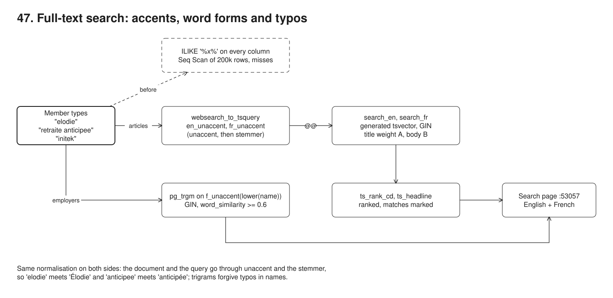
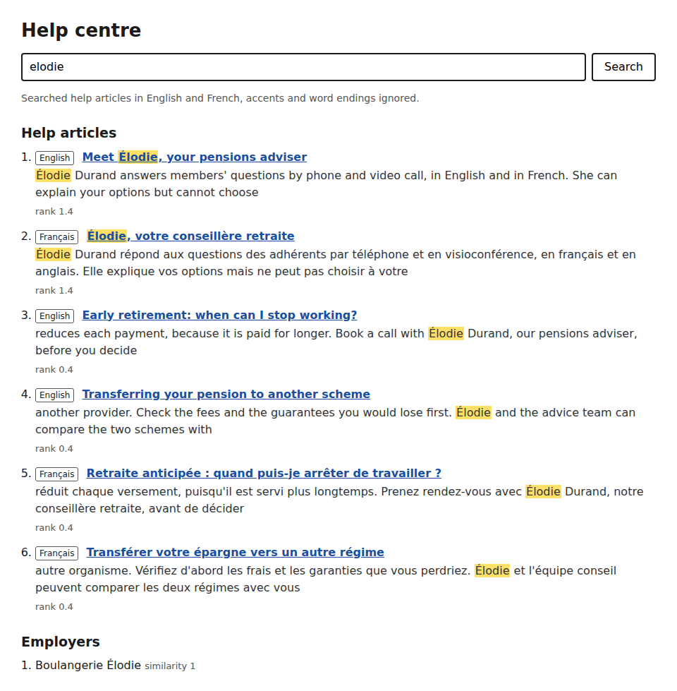

# 47. Full-text search in Postgres: accents, word forms and typos



**Pain: search that misses accents and typos.** The help centre searches with `ILIKE '%x%'`. A member types "elodie" and gets nothing: the articles say "Élodie". "retraite anticipee" misses "Retraite anticipée". "initek" finds no employer although Initech is right there. Even the exact spelling comes back unranked (the article about Élodie is third, after two that mention her in passing), and on 200,000 articles each search is a sequential scan that took 2,345 ms in the log, against 0.4 ms for the indexed full-text query that also finds what the member meant.

**Reach for it when** members search your own content (help articles, letters, notes, employer or member names) in one or a few languages, the data already lives in Postgres, and you want ranking, highlighting, accent-insensitivity and typo tolerance without running another system.

**Do not reach for it when** you need fuzzy matching inside every word of long documents, synonyms and per-field boosting tuned by a search team, facets over millions of documents, or semantic search: use OpenSearch, Meilisearch or a vector index, fed from Postgres by CDC (sample 10). Not when a query matches a large share of the table either: `ts_rank_cd` must score every match before `LIMIT`, so a word in half the rows is slow; keep such words out of the ranking (stop words, a `LIMIT` on candidates) or rank elsewhere.

`src/setup.ts` creates two text search configurations, `en_unaccent` and `fr_unaccent`, that run `unaccent` before the English or French stemmer, and a `help_articles` table with one generated `tsvector` column per language (title weighted A, body B), each with a GIN index. It loads 10 curated bilingual articles and 200,000 generated archive articles, 8 curated employers and 200,000 generated ones, with a trigram GIN index on `f_unaccent(lower(name))`. `src/search.ts` holds the queries: `websearch_to_tsquery` per language, ranked with `ts_rank_cd`, highlighted with `ts_headline`, and employers by `word_similarity`. `src/demo.ts` compares them with the naive `ILIKE` using `EXPLAIN ANALYZE`, and screenshots the search page (`src/server.ts`, :53057).

## Run

One shot with proof: `./run.sh` in this folder, or `./47-full-text-search/run.sh` from the repo root (log in [`../logs/47-full-text-search.log`](../logs/47-full-text-search.log)).

By hand, from this folder:

```sh
docker compose up -d --wait   # Postgres on :55477
npm i
npm run setup                 # extensions, configurations, 400,000 rows, GIN indexes (about a minute)
npm run server                # the search page on :53057, try http://localhost:53057/search?q=elodie
npm run demo                  # the eight steps (starts its own server: stop the one above first)
```

## Files

- `src/setup.ts` extensions, the two configurations, `f_unaccent`, the tables with generated `tsvector` columns, seeded data, the GIN indexes.
- `src/articles.ts` the 10 bilingual help articles and the curated employers.
- `src/search.ts` `searchArticles` (one query per language, ranked, then highlighted), `searchEmployers` (trigrams with a threshold), the naive queries, and the safe highlighter.
- `src/server.ts` the search page.
- `src/demo.ts` the steps and their checks; `src/db.ts` the pool and port.
- `screenshots/search-elodie.png` the page for "elodie".

## Concepts

- **tsvector and tsquery**: `to_tsvector(config, text)` splits text into tokens and turns each into a lexeme (lower case, stemmed, stop words dropped) with its positions: `'retrait':1 'anticipe':2`. A `tsquery` is lexemes joined by `&`, `|`, `!` and `<->` (followed by). `@@` matches one against the other.
- **Generated column per language**: `search_en tsvector GENERATED ALWAYS AS (setweight(to_tsvector('en_unaccent', title_en), 'A') || setweight(to_tsvector('en_unaccent', body_en), 'B')) STORED`. Postgres keeps it in step with the text on every write; no trigger, no application code. Each language has its own column because stemming is language-specific: "retraite" stems to `retrait` in French and would stay `retraite` in English.
- **GIN index**: an inverted index from each lexeme to the rows that contain it. `search_en @@ query` becomes a Bitmap Index Scan on `help_articles_search_en`; with `OR` on the two languages Postgres combines both indexes with a BitmapOr. 6.7 MB for 200,000 rows here.
- **unaccent through a custom configuration**: `CREATE TEXT SEARCH CONFIGURATION fr_unaccent (COPY = french); ALTER ... ALTER MAPPING FOR hword, hword_part, word WITH unaccent, french_stem`. The `unaccent` dictionary rewrites the token and passes it on to the stemmer, so "Élodie" and "elodie" both become `elod`. The same configuration builds the column and parses the query, so both sides are normalised the same way. `asciiword` tokens have no accents, so they skip it.
- **websearch_to_tsquery**: parses what people type: `"early retirement" -tax` becomes `'earli' <-> 'retir' & !'tax'`, `pension OR épargne` becomes `'pension' | 'epargn'`, and stray operators are ignored. `to_tsquery` raises a syntax error on the same input, so it is for queries you build, not for a search box.
- **Ranking with weights**: `ts_rank_cd(weights, vector, query)` (cover density) scores how many matches there are, how close together, and in which weight class. `{0.1, 0.2, 0.4, 1.0}` is `{D, C, B, A}`: a title hit (A) counts 2.5 times a body hit (B), so "Meet Élodie, your pensions adviser" (1.4) ranks above the four that only mention her in the body (0.4).
- **Highlighting with ts_headline**: returns the best fragments of the original text with the matched words marked, using the same configuration, so the query "elodie" marks "Élodie". It re-parses the text, so call it only on the rows you show (the query ranks and limits first, then highlights). It returns raw text with your markers: the page asks for two control characters, escapes the text, then turns them into `<mark>`, so neither article text nor the query can inject markup.
- **pg_trgm for names**: a trigram is three consecutive characters (`"  i"`, `" in"`, `"ini"`, `"nit"`, ...). Similarity is shared trigrams over all trigrams, so "initek" and "Initech" share most of theirs (0.71) and a typo costs only a few. `word_similarity(query, name)` (operator `<%`) compares the query with the best-matching run of words in a long name: "globx" scores 0.67 against "Globex Corporation". A GIN `gin_trgm_ops` index serves `%`, `<%`, and also `LIKE`/`ILIKE '%x%'`.
- **Similarity threshold**: `pg_trgm.word_similarity_threshold` (default 0.6) decides what counts as a match. For "boulanjerie elodi", 0.3 matches 6,583 employers, 0.45 matches 106, 0.6 matches only "Boulangerie Élodie", and 0.8 matches nothing. Set it per query with `set_config(..., true)` inside a transaction.
- **f_unaccent**: `unaccent()` is only `STABLE` (its dictionary could change), and an index expression must be `IMMUTABLE`. The usual wrapper names the dictionary explicitly and declares itself `IMMUTABLE`; the index and the query must use the same expression, `f_unaccent(lower(name))`, or the planner will not use the index.
- **Why ILIKE '%x%' scans**: a B-tree can only use a prefix; with a leading `%` every row is read (Seq Scan, `Rows Removed by Filter: 200007`). And `ILIKE` folds case, not accents, and has no notion of word forms, typos or relevance.

## Proof (`logs/47-full-text-search.log`)

ILIKE misses what the member meant, and the exact spelling comes back in table order:

```
   articles ILIKE '%elodie%': 0 rows
   articles ILIKE '%retraite anticipee%': 0 rows
   articles ILIKE '%Élodie%': 3 rows, in table order: early-retirement, transfer-out, adviser
   employers ILIKE '%initek%': 0 rows
```

The unaccent configuration makes the accented text and the plain query meet:

```
   to_tsvector('french',      'Élodie, retraite anticipée') = 'anticip':3 'retrait':2 'élod':1
   to_tsvector('fr_unaccent', 'Élodie, retraite anticipée') = 'anticipe':3 'elod':1 'retrait':2
   to_tsvector('fr_unaccent', 'elodie retraite anticipee')  = 'anticipe':3 'elod':1 'retrait':2
```

Ranking puts the title hits first, in both languages:

```
   1.400  en  Meet [Élodie], your pensions adviser
   1.400  fr  [Élodie], votre conseillère retraite
   0.400  en  Early retirement: when can I stop working?
```

Typos and missing accents still find the employer:

```
   initek               Initech (0.71)
   boulangerie elodie   Boulangerie Élodie (1), Boulangerie Evans Bellevue & Associés (0.72), Boulangerie Evans Bellevue & Fils (0.72)
   lefevre garage       Garage Lefèvre & Fils (1), Garage Legrand Bellevue Ltd (0.6), Garage Legrand Bellevue SA (0.6)
```

On 200,000 rows each, sequential scan versus GIN (best of five `EXPLAIN ANALYZE` runs; the bad query gets the exact spelling, the good one what was typed):

```
   articles 'Élodie'
     bad  (ILIKE, exact spelling "Élodie"):  2344.7 ms, 3 rows, Seq Scan on help_articles
     good (tsvector, typed "elodie"):     0.4 ms, 6 rows, Bitmap Heap Scan on help_articles + Bitmap Index Scan on help_articles_search_en + Bitmap Index Scan on help_articles_search_fr + Index Scan on help_articles_pkey
   employers 'initek'
     bad  (ILIKE, exact spelling "Initech"):   272.6 ms, 1 rows, Seq Scan on employers
     good (trigram, typed "initek"):     0.2 ms, 1 rows, Bitmap Heap Scan on employers + Bitmap Index Scan on employers_name_trgm
```

The raw plans are in the proof sections at the end of the log (`Rows Removed by Filter: 200007` for the bad one, `BitmapOr` of the two language indexes for the good one).

## Screenshots



## Do / Don't

- Do build the `tsvector` and parse the query with the same configuration; do keep one column (and index) per language.
- Do use `websearch_to_tsquery` for user input, and rank and limit before `ts_headline`.
- Don't mark up `ts_headline` output with HTML tags and insert it raw: escape first.
- Don't put `unaccent()` itself in an index expression; wrap it in an `IMMUTABLE` function.

## Origins and further reading

- PostgreSQL documentation: [Full Text Search](https://www.postgresql.org/docs/16/textsearch.html), in particular [Controlling Text Search](https://www.postgresql.org/docs/16/textsearch-controls.html) (ranking, `ts_headline`) and [Configuration Example](https://www.postgresql.org/docs/16/textsearch-configuration.html).
- [unaccent](https://www.postgresql.org/docs/16/unaccent.html) and [pg_trgm](https://www.postgresql.org/docs/16/pgtrgm.html).
- [GIN indexes](https://www.postgresql.org/docs/16/gin.html).
- Clarke and Cormack, "Shortest-substring retrieval and ranking" (2000), the cover density ranking behind `ts_rank_cd`.
