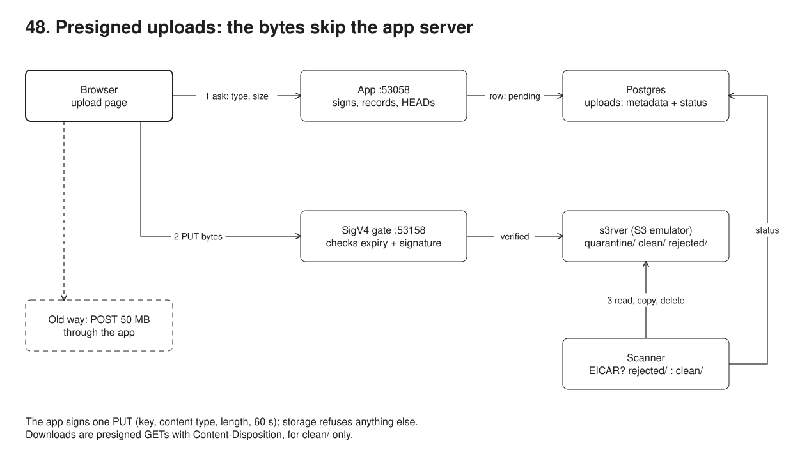
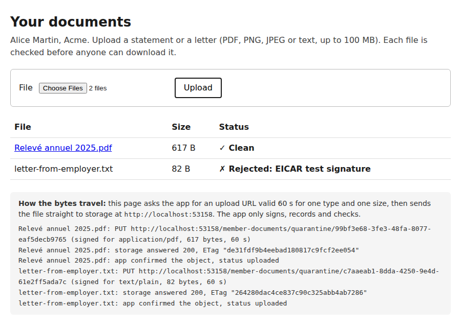

# 48. Object storage with presigned uploads



**Pain: large uploads through the app server.** A member uploads a 50 MB export and the app reads every byte on its way to storage. Buffered, the app's live memory grows by 150 MB for that one upload and it spends 411 ms of CPU; streamed, memory stays flat but the app still reads all 52,428,800 bytes and spends 297 ms of CPU, holding a socket and a request slot for the whole transfer. Ten members doing it at once take the app down. Whatever lands is served straight back, including a file that is really malware or HTML posing as a PDF.

**Reach for it when** members or staff upload files bigger than a form post (statements, scans, exports, photos), files must be checked before anyone downloads them, or the app runs on small instances or serverless functions with request size and time limits.

**Do not reach for it when** files are small and rare (a few KB of JSON or a CSV under a megabyte): a normal API with ETags is simpler and keeps one auth model (sample 07). The app must transform the bytes on the way in (encrypt with a key the storage must never see, re-encode an image): then they pass through a worker anyway. Uploads need to resume across network failures: use S3 multipart uploads with a presigned URL per part, or the tus protocol, on top of the same ideas.

The member app (`src/app.ts`, node:http on :53058) never sees the bytes. It checks the requested type and size, records an `uploads` row in Postgres, and returns a presigned PUT URL (AWS SDK v3, `@aws-sdk/s3-request-presigner`) valid 60 seconds for one key, one content type and one length. The browser sends the file straight to storage, then calls `complete`; the app HEADs the object and compares it with what it signed. The object sits under `quarantine/` until a separate scanner (`src/scanner.ts`) streams it from storage, looks for the EICAR test string, and copies it to `clean/` or `rejected/`. Downloads are a 302 to a presigned GET for `clean/` only, with `Content-Disposition: attachment` and the UTF-8 file name.

Storage is [s3rver](https://github.com/jamhall/s3rver), an S3 emulator on npm, since the MinIO image will not pull here. It stores objects, answers the S3 API, applies the bucket's CORS rules and checks the expiry of a presigned URL, but its source says "Signature version 4 calculation is unimplemented": it accepts any V4 signature, so on its own a URL signed for `application/pdf` would also accept `text/html` (the demo proves this against s3rver's private port). No npm emulator tried here verifies SigV4: s3rver 3.7.1, s3mulator 1.2.0 (expiry only) and fauxqs 2.12.1 (no signature check). The closest honest option is s3rver behind a small gate (`src/sigv4.ts`, `src/storage.ts`) that recomputes the AWS Signature V4 for every request, query-string (presigned) or header (SDK), the way S3 does, then forwards it unchanged. The SDK-generated URLs pass, so the gate agrees with AWS's signer; tampered ones fail.

## Run

One shot with proof: `./run-48-object-storage.sh` from the repo root (log in [`../logs/48-object-storage.log`](../logs/48-object-storage.log)).

By hand, from this folder:

```sh
docker compose up -d --wait   # Postgres on :55478
npm i
npm run setup                 # the uploads table
npm run storage               # s3rver behind the SigV4 gate on :53158 (data in $TMPDIR/48-object-storage-data)
npm run app                   # the member app on :53058, open http://localhost:53058
npm run scanner               # promotes or rejects what lands in quarantine/
npm run demo                  # the whole story (starts all three itself: stop the ones above first)
```

## Files

- `src/s3.ts` the S3 client, ports, limits, `presignPut` (signs `content-type` and `content-length`), `presignGet` with `ResponseContentDisposition`, and the RFC 6266 file name.
- `src/sigv4.ts` AWS Signature V4 verification: canonical request, string to sign, signing key, expiry, constant-time compare.
- `src/storage.ts` starts s3rver on a private port with the bucket's CORS rules, and the gate on :53158.
- `src/app.ts` the member app: sign, complete (HEAD and compare), status, download (302 to a presigned GET), the two proxied comparison routes, and a resource meter.
- `src/page.ts` the upload page and its script: grant, PUT to storage, complete, poll.
- `src/scanner.ts` the scan worker: claims rows `FOR UPDATE SKIP LOCKED`, streams the object, copies to `clean/` or `rejected/`, deletes from `quarantine/`.
- `src/eicar.ts` the EICAR test string, split in two so this repository is not itself flagged by an antivirus.
- `src/demo.ts` the four steps and their checks; `src/setup.ts` the table; `src/db.ts` the pool.
- `screenshots/upload-page.png` the page after the browser uploaded a statement and an EICAR letter.

## Concepts

- **Presigned URL**: a URL that carries its own authorisation: the access key id, the date, the expiry and an HMAC signature in the query string. The app signs with its credentials; the browser, which has none, can make exactly that request until it expires. Anyone holding the URL can use it, so keep the expiry short (60 s here) and the scope narrow (one key).
- **What the signature covers**: AWS Signature V4 signs a canonical request: method, path (bucket and key), every query parameter except the signature (so the expiry too), and the headers listed in `X-Amz-SignedHeaders`. `presignPut` adds `content-type` and `content-length`, so the storage refuses another type or another size with `SignatureDoesNotMatch`. A browser cannot lie about `Content-Length`; it is the size of the body.
- **The SDK's default checksum**: since early 2025 the AWS SDK adds a CRC32 of the body to `PutObject`. A presigned URL is signed before the body exists, so it would carry the checksum of an empty body and S3 would reject the real upload. `requestChecksumCalculation: "WHEN_REQUIRED"` turns it off for presigning.
- **Do not trust the browser's "done"**: the `complete` call HEADs the object and compares its size and type with the row; completing before uploading answers 409. In production an S3 event notification (`ObjectCreated` to SQS or EventBridge) can drive the same step without the browser.
- **Quarantine prefix**: every upload lands under `quarantine/`, which nothing presigns for download. The scanner reads it from storage (the app still never sees the bytes), then copies it to `clean/` or `rejected/` and deletes the original; S3 has no rename. `FOR UPDATE SKIP LOCKED` lets several scanners share the queue (as in sample 09's relay). A lifecycle rule should expire `quarantine/` objects whose `complete` never came.
- **EICAR**: a 68-byte string that every antivirus engine reports as a virus although it is harmless, so a scanning pipeline can be tested end to end. The fake scanner here only knows that string; a real one is ClamAV or a cloud malware scanning service on the same hook.
- **Download with `Content-Disposition`**: the presigned GET sets `response-content-disposition` and `response-content-type`, so storage answers `attachment; filename="Releve annuel 2025.pdf"; filename*=UTF-8''Relev%C3%A9%20annuel%202025.pdf`. `attachment` stops the browser from rendering an uploaded HTML or SVG file on your origin; `filename*` (RFC 6266, RFC 8187) keeps the accents, the plain `filename` is the ASCII fallback.
- **CORS on the bucket**: the page on :53058 PUTs to :53158, another origin, with a `Content-Type` header, so the browser sends a preflight. S3 answers it from the bucket's CORS configuration (allowed origin, methods, headers, `ExposeHeader ETag`), not from the app.
- **Buffer, stream, presign**: buffering holds the whole file in the app's memory (plus copies); streaming with back-pressure keeps memory flat but still costs CPU, a socket and request time per byte; presigning costs one HMAC. The meter in `src/app.ts` counts request-body bytes, `process.cpuUsage()` and peak live memory (JS heap + Buffers) sampled every 20 ms.
- **How this relates to sample 07**: 07 is the file API itself (idempotent creates, `If-Match` on overwrite, ETags, ranged downloads) with the bytes in Postgres; its README already says to move large bytes to object storage behind a presigned URL. This is that move: keep 07's metadata, versions and state machine, and let `upload_file_url` be a presigned PUT.

## Proof (`logs/48-object-storage.log`)

The browser sent both files to the storage endpoint; the app only received JSON:

```
   browser request: POST http://localhost:53058/api/uploads
   browser request: PUT http://localhost:53158/member-documents/quarantine/99bf3e68-3fe3-48fa-8077-eaf5decb9765?X-Amz-...(presigned)
   browser request: POST http://localhost:53058/api/uploads/99bf3e68-3fe3-48fa-8077-eaf5decb9765/complete
   app process during the browser uploads: 157 request-body bytes read (JSON only), 93 ms CPU
   page shows: Relevé annuel 2025.pdf = clean; letter-from-employer.txt = rejected (EICAR test signature)
```

50 MB through the app (buffered, streamed) versus presigned, as the app process measured itself:

```
   mode        wall ms   app bytes read   app CPU ms   app peak memory +MB
   buffer          791         52428800          411              150.6
   stream          939         52428800          297               16.6
   presigned       994               81           26                  1
```

Every change to a signed part of the URL is refused, and so is an expired URL:

```
   wrong content type (text/html): 403 SignatureDoesNotMatch
   wrong length (one byte more): 403 SignatureDoesNotMatch
   another key with the same signature: 403 SignatureDoesNotMatch
   longer expiry written into the URL: 403 SignatureDoesNotMatch
   GET with a PUT signature: 403 SignatureDoesNotMatch
   URL signed for 1 s, used after 2.1 s: 403 Request has expired (issued 2026-10-03T14:46:15.000Z, valid 1s)
```

Without the gate, s3rver takes the wrong content type, which is why the gate exists:

```
   the same wrong-type PUT sent to s3rver directly (port 34289, no gate): 200
   ok   s3rver on its own accepts the wrong content type: the SigV4 gate is what enforces the signed headers
```

Nothing is downloadable from quarantine; the scanner promotes or rejects, and the download carries the name:

```
   download before the scan: 409 not downloadable while uploaded
   [scanner] quarantine/38590108-c27a-4485-8aef-a89361f0b884 -> rejected/38590108-c27a-4485-8aef-a89361f0b884 (EICAR test signature, 69 bytes read in 26 ms)
   clean file: 200, Content-Disposition: attachment; filename="Attestation employeur.pdf"; filename*=UTF-8''Attestation%20employeur.pdf
   rejected file: 409 not downloadable while rejected
```

## Screenshots



## Do / Don't

- Do sign the content type and length, keep the expiry in seconds or minutes, and give each upload its own key the app chose (never the user's file name).
- Do keep the bucket private and every download presigned and short; set `Content-Disposition: attachment` for anything a member uploaded.
- Don't hand the browser long-lived credentials or a URL for a prefix. Don't serve `quarantine/`.
- Don't trust `complete` without a HEAD, and don't trust the declared content type for security: the scanner should sniff the content.

## Origins and further reading

- AWS: [Uploading objects with presigned URLs](https://docs.aws.amazon.com/AmazonS3/latest/userguide/PresignedUrlUploadObject.html) and [Authenticating requests: query parameters (SigV4)](https://docs.aws.amazon.com/AmazonS3/latest/API/sigv4-query-string-auth.html).
- AWS SDK for JavaScript v3: [`@aws-sdk/s3-request-presigner`](https://www.npmjs.com/package/@aws-sdk/s3-request-presigner) and S3's [checking object integrity](https://docs.aws.amazon.com/AmazonS3/latest/userguide/checking-object-integrity.html) (the checksums the SDK now adds by default).
- [RFC 6266](https://www.rfc-editor.org/rfc/rfc6266) Content-Disposition in HTTP, and [RFC 8187](https://www.rfc-editor.org/rfc/rfc8187) for `filename*`.
- [EICAR anti-malware test file](https://www.eicar.org/download-anti-malware-testfile/).
- OWASP [File Upload Cheat Sheet](https://cheatsheetseries.owasp.org/cheatsheets/File_Upload_Cheat_Sheet.html).
- [s3rver](https://github.com/jamhall/s3rver), the emulator used here.
