# 49. Capstone: one member portal from the samples' pieces

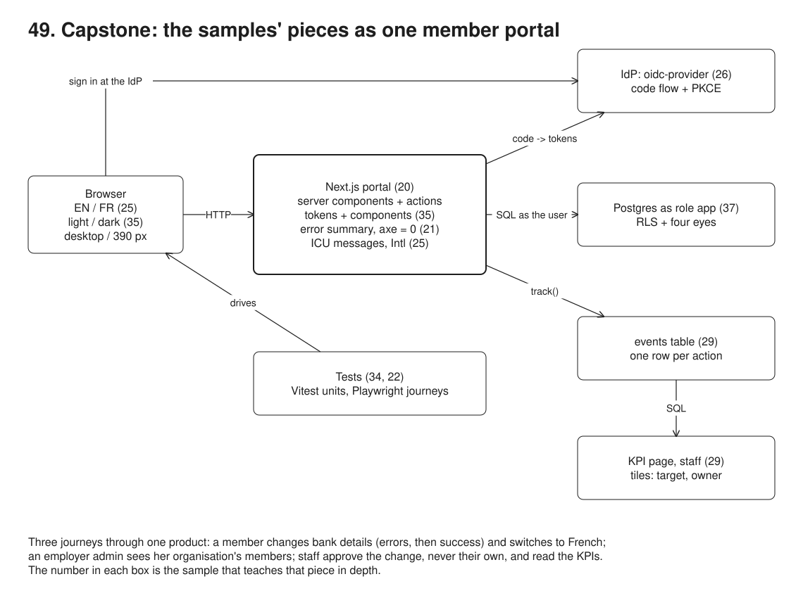

**Pain: pieces that never form one product.** Each earlier sample proves one idea in its own small app, and none of them would pass for a product on its own. 20-portal signs members in with their username alone (its session is a stub). 26-sso signs them in properly, then answers with JSON. 37-authorization knows who you are from an `x-user` header. 21-accessibility styles its form with hand-picked hex colours; 35-design-tokens has the real look but only in Storybook. 25-bilingual translates a page built from template strings, and 29-kpis computes KPIs over 120 simulated members. Four samples even have four different casts of members. Nothing shows that the pieces fit: that RLS still works behind an OIDC login, that 35's components survive a translated error message, that the events a real page records feed the KPIs. This sample puts nine of them into one portal, drives three journeys through it in Chromium, and checks 33 claims along the way, including zero axe violations on 14 page states in English and French, light and dark, desktop and phone.

**Reach for it when** you need to show (to yourself, a team or a reviewer) that a stack's choices hold together end to end: one sign-in, one look, one policy, one language switch, one event stream. When you start a new portal and want a small, complete skeleton whose every part is already explained somewhere else.

**Do not reach for it when** you want to learn one of the pieces: each one is shallower here than in its own sample, on purpose. The table below says where to go instead.

A Next.js 16 portal (server components, server actions, route handlers) on Postgres 16, with an OpenID Provider (`oidc-provider`) as a second process. Members, employer admins and staff sign in at the IdP with the authorization code flow and PKCE; the portal maps their IdP groups to a role and keeps a server-side session. Every query runs as the Postgres role `app` with the user's identity set for the transaction, so row-level security filters it whatever the page asked. Pages are styled with 35's `tokens.css` and `components.css`, copied byte for byte, plus one layout file that uses semantic tokens only. Every string comes from an ICU catalogue in English or French, every amount and date from `Intl`. Every page and action records a usage event, and the staff KPI page is SQL over those events. The run script runs the unit tests (Vitest), builds the app, runs the three journeys as Playwright tests, then runs the demo: the same journeys step by step with checks, axe scans and the screenshots below.

## Which sample teaches each feature

| Feature in the portal | Where it is here | Sample that teaches it |
| --- | --- | --- |
| Server-rendered pages, server actions, Post/Redirect/Get, one pending change per member (partial unique index) | `src/app/**/page.tsx`, `src/app/bank/actions.ts` | [20-portal](../20-portal/) |
| The look: design tokens (light and dark), Button, TextField, Alert, Card | `src/styles/tokens.css`, `src/styles/components.css`, `src/ds/` | [35-design-tokens](../35-design-tokens/) |
| English and French: ICU messages, plural and select, `Intl` money and dates, Accept-Language, catalogue check | `messages/*.json`, `src/lib/i18n.ts`, `src/lib/negotiate.ts`, `src/lib/catalogues.ts` | [25-bilingual](../25-bilingual/) |
| OIDC sign-in: authorization code flow with PKCE, ID token checks, IdP groups to roles, hashed sessions | `src/idp.ts`, `src/app/login/`, `src/app/callback/`, `src/lib/oidc.ts` | [26-sso](../26-sso/) |
| Accessible form: error summary that takes focus and links to fields, `aria-invalid`, "Error:" in the title, axe at zero | `src/app/bank/BankForm.tsx`, `e2e/helpers.ts` | [21-accessibility](../21-accessibility/) |
| A member sees only their own data, an employer admin their organisation, staff approve with four eyes; RLS | `src/lib/policy.ts`, `src/schema.sql`, `src/lib/db.ts` | [37-authorization](../37-authorization/) |
| Unit tests at the bottom, a few browser journeys at the top | `src/lib/*.test.ts`, `e2e/journeys.spec.ts` | [34-test-pyramid](../34-test-pyramid/) |
| Playwright journeys: user-facing locators, web-first assertions | `e2e/journeys.spec.ts` | [22-playwright](../22-playwright/) |
| Usage events, KPI definitions with target and owner, tiles whose status is not colour alone | `src/lib/request.ts` (`track`), `src/lib/kpis.ts`, `src/app/staff/kpis/` | [29-kpis](../29-kpis/) |

## Run

One shot with proof: `./49-capstone/run.sh` from the repo root, or `./run.sh` inside this folder (log in [`../logs/49-capstone.log`](../logs/49-capstone.log)).

By hand, from this folder:

```sh
docker compose up -d --wait     # Postgres on :55479
npm install
npm run setup                   # schema, RLS policies, 24 members, four weeks of usage history
npm run test:unit               # Vitest: IBAN rules, policy, catalogues, Intl
npm run build                   # next build
npm run test:e2e                # Playwright: starts the IdP (:53159) and next start (:53059) itself
npm run setup && npm run demo   # the story, with checks, axe and screenshots
npm run idp & npm start         # or by hand: IdP on http://127.0.0.1:53159, portal on http://localhost:53059
```

Accounts at the IdP (username / password):

| User | Password | IdP group | Portal role |
| --- | --- | --- | --- |
| `ana` | `ana-pw` | `portal-members`, member M0001 | member of Acme |
| `ben` | `ben-pw` | `portal-members`, member M0002 | member of Acme |
| `erin` | `erin-pw` | `acme-hr` | employer admin of Acme |
| `sam` | `sam-pw` | `portal-staff` | staff |

## Files

- `run.sh` the one-shot run: fresh Postgres, unit tests, build, Playwright journeys, demo, proof queries.
- `src/config.ts` ports and URLs of the portal, the IdP and Postgres.
- `src/schema.sql` tables, the `app` role, RLS policies (37), sign-in tables (26), the events table (29), the trigger that applies an approved change.
- `src/setup.ts` creates the schema and seeds 3 organisations, 24 members, contributions, one change filed by staff, and four weeks of usage history.
- `src/idp.ts` the OpenID Provider (`oidc-provider`) with four accounts, its sign-in page styled with the same tokens.
- `src/app/layout.tsx`, `src/app/NavLinks.tsx`, `src/app/TableScroll.tsx` header, navigation with `aria-current`, language switch, sign-out; a focusable region for tables that scroll on a phone.
- `src/app/page.tsx` the landing page; `login/`, `callback/`, `logout/`, `lang/` route handlers.
- `src/app/dashboard/`, `src/app/bank/` the member's pages and the bank details server action.
- `src/app/employer/` the employer admin's members page.
- `src/app/staff/approvals/`, `src/app/staff/kpis/` the staff pages and the approve action.
- `src/lib/policy.ts` `can(user, action, resource)`, 37's policy cut down to this portal's actions.
- `src/lib/db.ts` the `app` pool and `asUser()` (identity set per transaction).
- `src/lib/data.ts` every query the pages run, each as the signed-in user.
- `src/lib/request.ts` `currentUser()`, `requireUser(...roles)`, `locale()`, `track()` (usage events).
- `src/lib/oidc.ts` openid-client discovery and the redirect check.
- `src/lib/i18n.ts`, `src/lib/negotiate.ts`, `src/lib/catalogues.ts` the translator, Accept-Language negotiation and the catalogue comparison of 25.
- `src/lib/bank.ts` IBAN normalising, masking and the ISO 13616 mod-97 check.
- `src/lib/kpis.ts` the four KPI definitions (29's shape) and `computeKpis()`.
- `src/lib/*.test.ts` the unit tests (28).
- `src/ds/` 35's React components; `src/styles/` 35's CSS, unchanged, plus `portal.css`.
- `messages/en.json`, `messages/fr.json` the catalogues.
- `e2e/journeys.spec.ts`, `e2e/helpers.ts` the three journeys, sign-in through the IdP's page, the axe helper.
- `src/demo.ts` the story with its checks, axe scans and screenshots.
- `diagrams/build.mjs` the overview diagram.

## Concepts

- **Capstone**: one small product that uses the pieces together, so the seams show: what each piece needs from the others (a user identity for RLS, a locale for the error messages, a session id for the events) and where one sample's simplification had to go.
- **Seams that needed a change**: 35's `TextField` gained an `id` (the error summary links to the input) and an `errorPrefix` (its hidden "Error: " was English only); its components import `./icons` instead of `./icons.js` (Turbopack does not map `.js` to `.tsx`). 20's stub session became 26's OIDC session; 37's `x-user` header became that session; 37's page-level role checks became `requireUser(...roles)`. The CSS is unchanged, and the demo checks it byte for byte.
- **One identity, three layers**: the IdP says who you are (ID token: subject, groups, member number); the portal maps groups to a role and checks the role per page (`requireUser`) and per record (`can()`); Postgres checks again with RLS, because the portal tells it who is asking (`set_config('app.user_id', ..., true)`) on every transaction.
- **Four eyes**: staff approve a change, never one they asked for. The page hides the button (`can()`), and the database refuses the update anyway (`WITH CHECK (requested_by <> app_user())`), as the demo shows by trying it in SQL.
- **Language**: a cookie set by the switch wins, then Accept-Language; `<html lang>` follows. Server actions translate their errors with the same catalogue as the page. Data that is not text to translate (IBANs) carries `translate="no"`.
- **Usage events**: `track()` writes one row per page view or action, as the user (RLS: only your own events; only staff read them). The KPI page is SQL over them, so the journeys in this run change the tiles: Ana's and Ben's sign-ins lift adoption to 15 of 24 members.
- **Dark mode**: nothing in the portal: `tokens.css` redefines the semantic colours under `prefers-color-scheme: dark`, and `portal.css` uses semantic tokens only.
- **Trade-offs**: copying 35's CSS keeps this sample self-contained, but a token change now has to be copied too (the byte-for-byte check says when they drift; a real product would publish the tokens as a package). The rules live in TypeScript and SQL (37's trade-off). The IdP keeps its state in memory, so restarting it signs everyone out of it.

## Proof (`logs/49-capstone.log`)

The sign-in is the authorization code flow with PKCE, and the session cookie is only stored as a hash:

```
   GET http://127.0.0.1:53159/auth ? redirect_uri, scope, state, nonce, code_challenge, code_challenge_method, client_id, response_type
     code_challenge_method=S256, code_challenge=4cOrjSbYNSfZ..., scope=openid email profile portal
   ok: the browser is sent to the IdP with a PKCE S256 challenge, a state and a nonce, and no secret
   back at /dashboard; cookie sid: HttpOnly=true, SameSite=Lax; users row: {"sub":"ana","role":"member","org_id":"acme","member_id":"M0001"}
   ok: the session table holds the cookie's sha256, never the cookie
```

RLS limits each role behind the login, even for a query with no `WHERE` clause:

```
   as app role with Ana's identity, no WHERE clause: contributions 6 of 144, members 1 of 24, events 0 of 69
   as app role with Erin's identity, no WHERE clause: members 12 (organisations: acme), events 0
```

The bank form's errors, as 21 wants them, with 35's components, in both languages:

```
     summary link: Enter the account holder’s name
     summary link: Check the IBAN: its check digits do not match
   focus on the error summary; aria-invalid on: holder, iban; #iban aria-describedby="iban-hint iban-error"; title "Error: Change your bank details · Member portal"
   ok: a summary link moves focus to its field
   Saisissez le nom du titulaire du compte | Saisissez l’IBAN; title "Erreur : Modifier vos coordonnées bancaires · Espace adhérent"; hidden prefix "Erreur : "
```

The language switch changes messages and formats, not just words:

```
   <html lang="fr"> | Bonjour Ana | total 2⍽343,75 € (⍽ = narrow no-break space) | first month "septembre 2026" | status: Demande envoyée
```

Four eyes, in the page and in the database:

```
     Gil Novak Globex Sam Okafor DE89 •••• 3000 3 Oct 2026, 10:03 You asked for this change: another member of staff approves it
     Ana Martin Acme Ana Martin FR76 •••• 0189 4 Oct 2026, 06:03 Approve the change for Ana Martin
   as Sam, approving his own request #18 straight in SQL: 42501 new row violates row-level security policy for table "change_requests"
   as Sky (another member of staff), the same UPDATE: 1 row (rolled back, so the screenshot and the proof below still show it pending)
```

The journeys' events feed the KPI tiles:

```
   events recorded during this run: bank_change_rejected=2, bank_change_started=2, bank_change_submitted=1, change_approved=1, dashboard_viewed=4, employer_members_viewed=3, language_switched=1, login=4
     adoption       62.5%  Target met     15 members out of 24 signed in
     task_success   81.8%  Target missed  18 sessions out of 22 sent a request
     form_errors      28%  Target missed  7 submissions out of 25 rejected
     approval_sla   94.1%  Target met     16 approvals out of 17 on time
```

Every page state the journeys reach passes axe:

```
   axe: 14 page states scanned, 0 violations
   ok: axe finds no violation on any page, in English and French, light and dark, desktop and phone
```

## Screenshots

Taken by the demo in Chromium at 1280 x 800 (and 390 x 844 for the phone).

Journey 1, a member: sign in, dashboard, bank details (errors, then success), French.

| | |
| --- | --- |
| 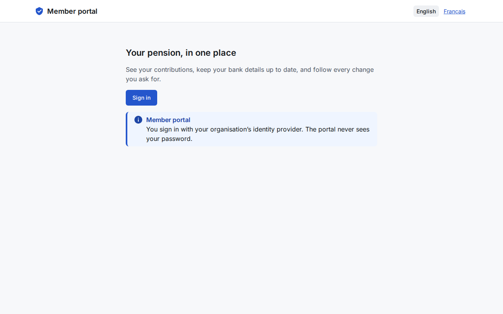 | 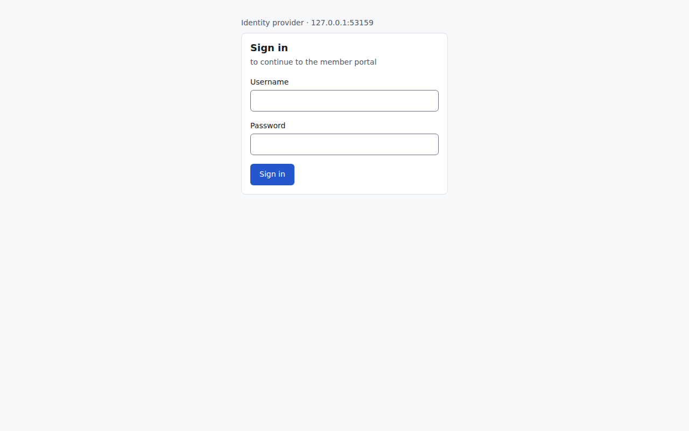 |
| Landing page, signed out | Sign-in at the identity provider |
| 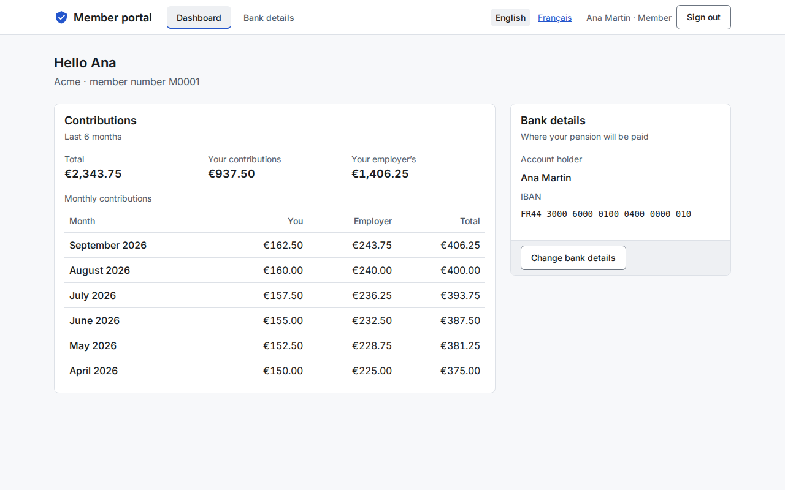 | 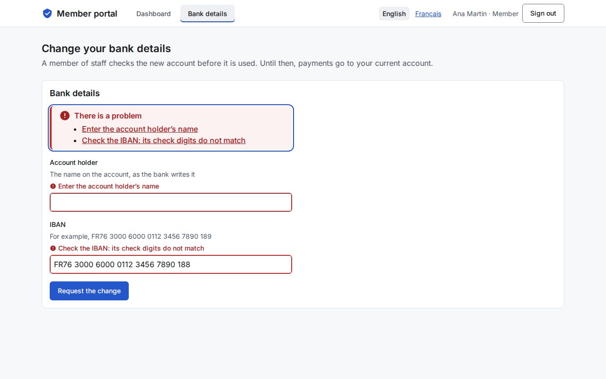 |
| Dashboard: contributions and bank details | Bank form: error summary, focused, and field errors |
| 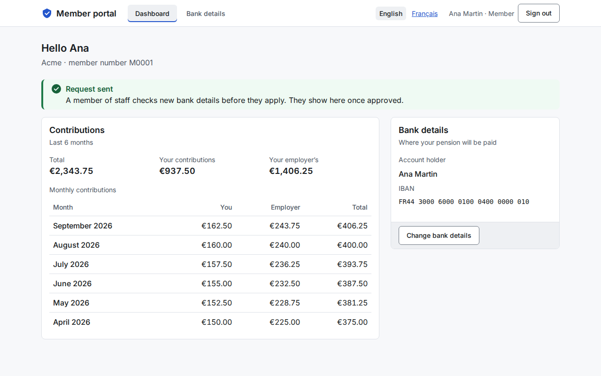 | 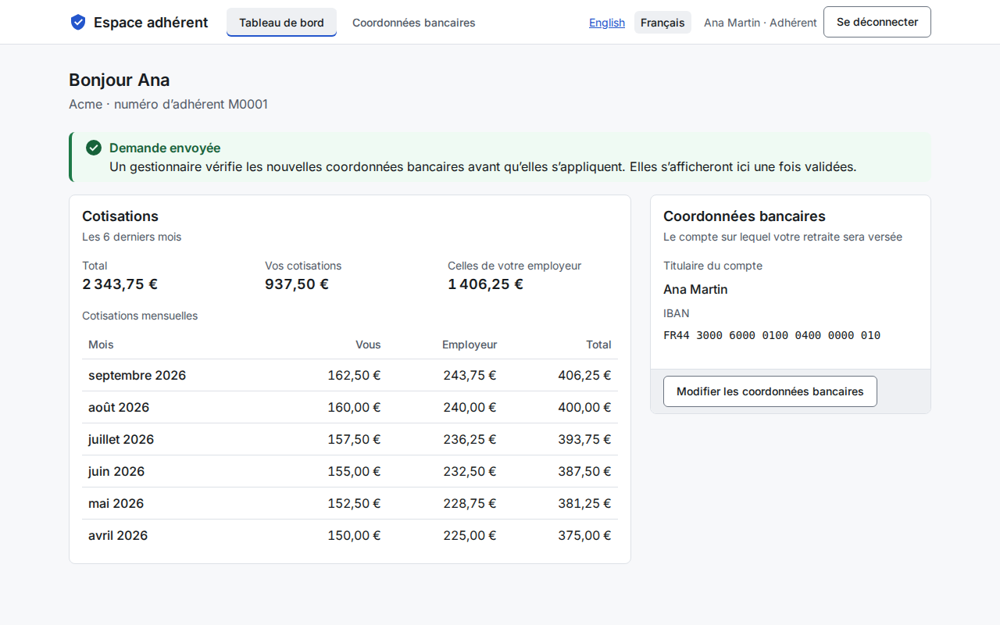 |
| Request sent (Post/Redirect/Get) | After switching to French: messages, euros and months in fr-FR |

In French from the first page (Ben's browser sends `Accept-Language: fr-FR`):

| | |
| --- | --- |
| 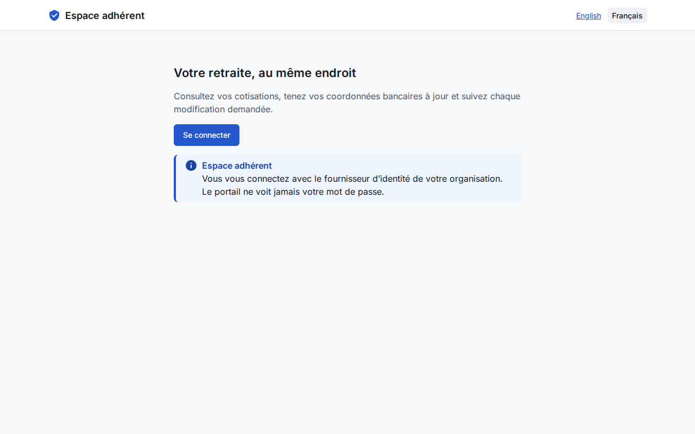 | 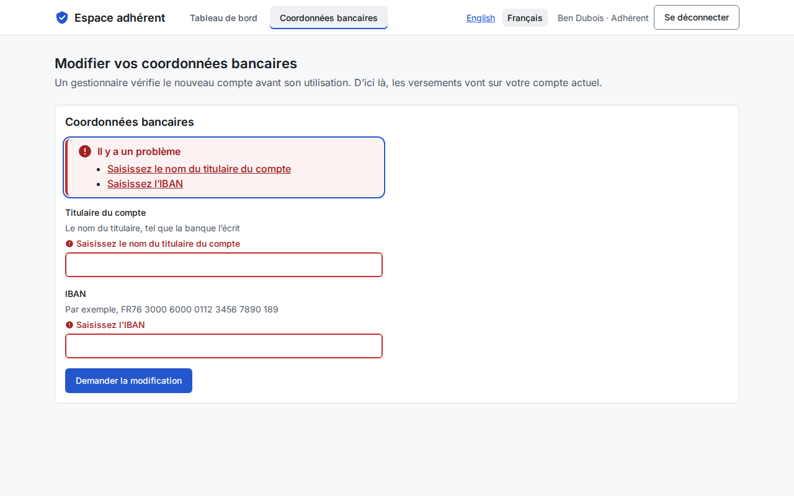 |
| Landing page, negotiated from Accept-Language | Bank form errors in French |

Journey 2, an employer admin, and journey 3, staff:

| | |
| --- | --- |
| 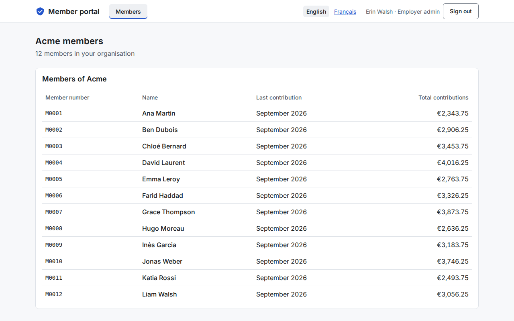 | 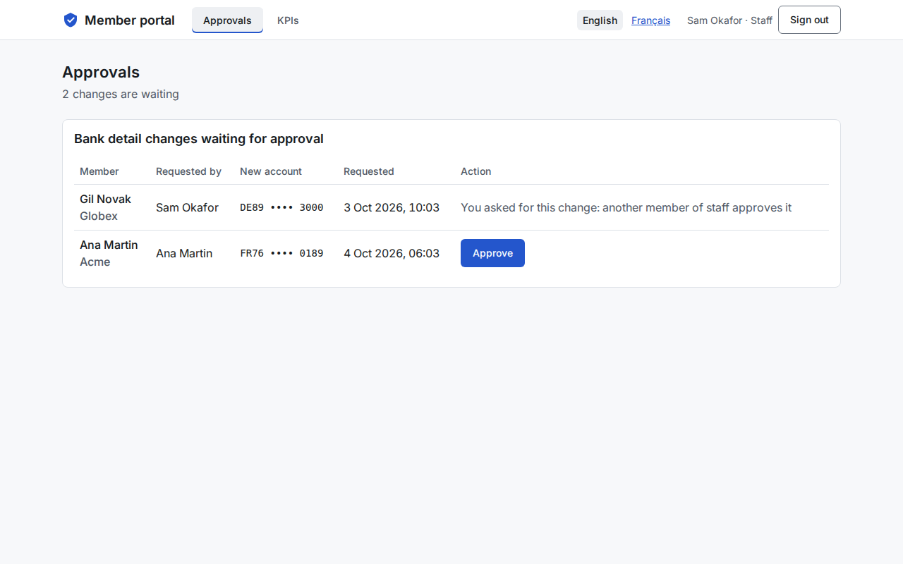 |
| Erin sees Acme's members only | Sam: Ana's change can be approved, his own cannot |
| 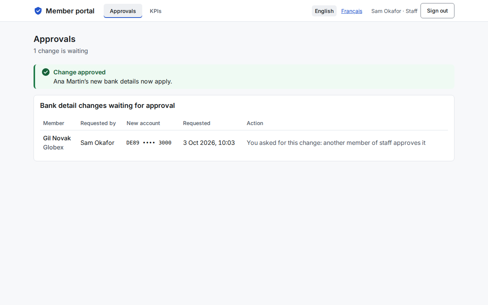 | 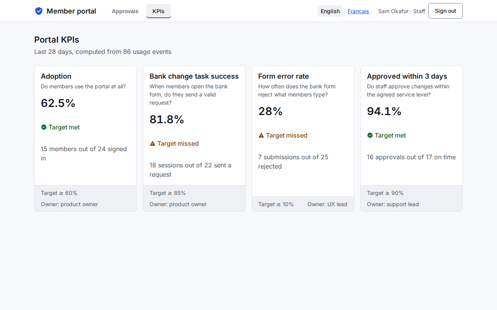 |
| Approved; the one he filed still waits for another approver | KPI tiles over the usage events |

Ana's dashboard after the approval (the new IBAN applies), in dark mode and on a phone:

| | |
| --- | --- |
| 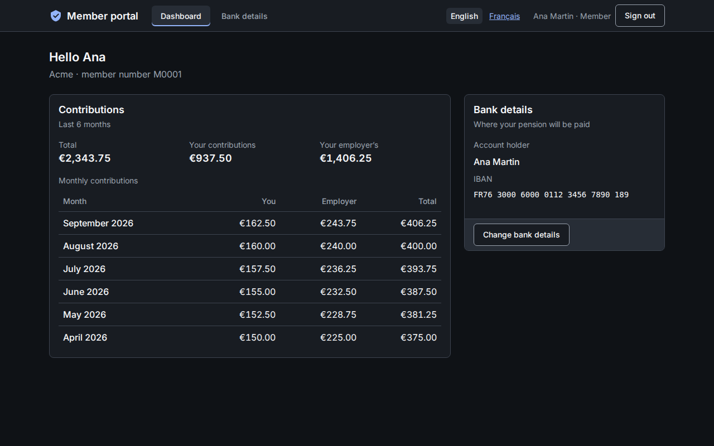 | 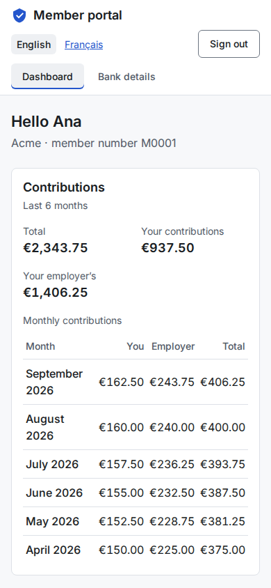 |
| Dark mode: the tokens' `prefers-color-scheme` block | 390 px: one column, no horizontal scrolling |

## Do / Don't

- Do reuse the pieces as they are first, and write down each change a seam forces (here: three small ones in 35's components).
- Do keep one identity from the IdP down to the database: the session gives the user, the user gives the RLS settings, the events carry the same subject.
- Do run axe on the states people actually reach (errors, French, dark, phone), not just the first page.
- Don't put depth here: a capstone that grows its own features stops being a map of the others.
- Don't let the copies drift silently: check them against their source, or publish the shared part as a package.

## Origins and further reading

- [OpenID Connect Core 1.0](https://openid.net/specs/openid-connect-core-1_0.html), [RFC 7636: PKCE](https://www.rfc-editor.org/rfc/rfc7636), [RFC 9700: OAuth 2.0 Security Best Current Practice](https://www.rfc-editor.org/rfc/rfc9700)
- [PostgreSQL: Row Security Policies](https://www.postgresql.org/docs/16/ddl-rowsecurity.html)
- [Next.js App Router: updating data with Server Functions](https://nextjs.org/docs/app/getting-started/updating-data)
- [Design Tokens Community Group format](https://www.designtokens.org/tr/drafts/format/)
- [ICU MessageFormat](https://unicode-org.github.io/icu/userguide/format_parse/messages/), [RFC 4647: Matching of Language Tags](https://www.rfc-editor.org/rfc/rfc4647)
- [WCAG 2.2](https://www.w3.org/TR/WCAG22/), [GOV.UK Design System: error summary](https://design-system.service.gov.uk/components/error-summary/), [axe-core rules](https://github.com/dequelabs/axe-core/blob/develop/doc/rule-descriptions.md)
- [IBAN validation, ISO 13616 mod 97](https://en.wikipedia.org/wiki/International_Bank_Account_Number#Validating_the_IBAN)
- [Playwright: best practices](https://playwright.dev/docs/best-practices)
