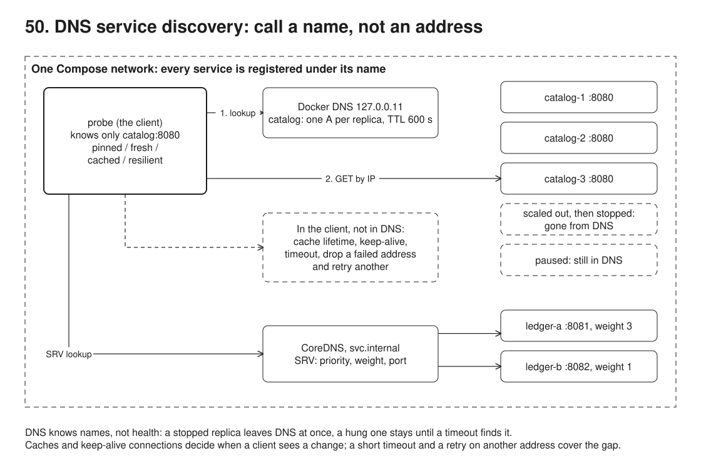
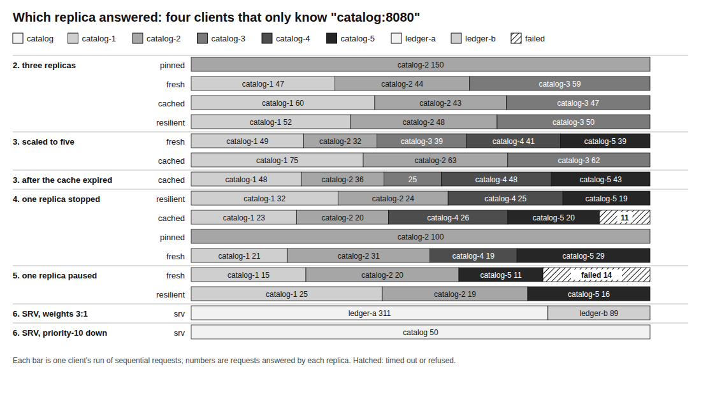

# 50. DNS service discovery: call a name, not an address



**Pain: addresses in config.** orders calls catalog at `10.0.3.17:8080`, copied into a config file. A second catalog instance gets no traffic until someone edits the file and redeploys orders; a dead instance keeps getting traffic until someone notices. Every new replica, every restart that changes an IP, every move to another host is a config change in every caller.

**Reach for it when** services run as several replicas that come and go (containers, autoscaling, rolling deploys) and callers should find them by a stable name. DNS is already there: Docker Compose, Kubernetes (`<service>.<namespace>.svc.cluster.local`, headless services, SRV for named ports), Consul and cloud internal zones all serve it, and every language can resolve a name without a library.

**Do not reach for it when** you need health, fast change or fine routing in the discovery itself: DNS has no idea whether a replica answers, and caches (TTL, the resolver, the runtime, keep-alive connections) decide when a client sees a change. Then put a load balancer or a sidecar in front (see 51), or use a registry with health checks and watches (Consul, Kubernetes endpoints, xDS). Outside your own platform, use the provider's load balancer, not a list of A records.

Sam Newman's *Building Microservices* (2nd edition, the service discovery section of the communication chapter) starts discovery with DNS for exactly this reason: it is simple, universal and good enough for many cases, as long as you know its limits. This sample shows both.

The Compose network runs three replicas of a tiny HTTP service, `catalog` (`src/catalog.ts`, it answers with its own name and IP), two instances of `ledger` on different ports, CoreDNS serving SRV records, and a `probe` container: a client inside the network (`src/probe.ts`). The probe holds four clients that only know the name `catalog:8080` (`src/clients.ts`). The demo, on the host, asks the probe to resolve and send requests, and between steps scales catalog out, stops one replica and pauses another with the docker CLI. It counts which replica answered every request and draws `out/requests.svg`.

## Run

One shot with proof: `./run.sh` in this folder, or `./50-dns-discovery/run.sh` from the repo root (log in [`../logs/50-dns-discovery.log`](../logs/50-dns-discovery.log)).

By hand (the probe's control port is 53060; nothing else is published):

```sh
npm i                                        # the containers mount this folder and use the same node_modules
docker compose up -d --wait                  # 3 catalog replicas, ledger-a, ledger-b, coredns, probe
docker compose exec probe getent ahostsv4 catalog
curl 'localhost:53060/resolve?name=catalog'  # A records with their TTL
curl -X POST 'localhost:53060/run?client=fresh&n=50'
docker compose up -d --scale catalog=5 --no-recreate
curl 'localhost:53060/srv?name=_http._tcp.ledger.svc.internal'
npm run demo                                 # the seven steps below (on a fresh stack: docker compose down -v first)
```

## Files

- `docker-compose.yml` the network: `catalog` (3 replicas), `ledger-a` and `ledger-b`, `coredns`, `probe`; no service is given another's address.
- `src/catalog.ts` one replica: answers `{service, replica, ip}`.
- `src/clients.ts` the four clients: `pinned`, `fresh`, `cached`, `resilient`.
- `src/srv.ts` SRV lookup through CoreDNS and the RFC 2782 order (priority, then weighted random).
- `src/probe.ts` the client service inside the network, driven by the demo over HTTP.
- `dns/Corefile`, `dns/svc.internal.zone` CoreDNS: the `svc.internal` zone with the SRV records; everything else forwarded to Docker's DNS.
- `src/demo.ts` the steps and their checks; `src/chart.ts` draws `out/requests.svg`; `screenshots/requests.png` is the chart from the last run.

## Concepts

- **Service name as the address**: Compose (like Kubernetes) registers each container under its service name in a DNS server that every container uses (`nameserver 127.0.0.11` in `/etc/resolv.conf`). A name with three replicas resolves to three A records. Scaling, restarts and new IPs change the answer, not the callers' config.
- **DNS round robin is the client's job**: DNS returns a list; spreading the load is up to the client. `fresh` resolves on every request and picks at random, and lands about a third on each replica. Most HTTP clients resolve only when they open a connection, through `getaddrinfo`, and take the first address.
- **Keep-alive pins a client to one replica**: `pinned` is an ordinary keep-alive client. It looks up once, opens one connection and sends all 150 requests to one replica. It looks up again only when that connection closes (the replica left, or the server closed it after 5 s idle, Node's default). Long-lived connections (HTTP/2, gRPC) make this worse: one caller, one replica, however many you add. Rotate connections (a maximum connection age) or balance per request in the client or a proxy.
- **TTL and caches**: Docker's DNS answers with a TTL of 600 s. Every layer may cache an answer: the resolver library, the OS (nscd, systemd-resolved), the runtime (the JVM once cached forever by default), the HTTP client's connection pool. `cached` keeps an answer for 8 s. It does not see the 2 new replicas until the cache expires, and it keeps sending to a stopped replica's address until then (11 timeouts in 100 requests). Short TTLs cost DNS traffic; long ones cost staleness.
- **DNS knows names, not health**: a stopped container leaves DNS at once. A paused (hung, overloaded, deadlocked) one does not: it is still running, so it is still registered, and `fresh` times out on 14 of 60 requests. Health has to come from somewhere else: the client, a load balancer, a sidecar, or a registry with health checks.
- **Client-side resilience covers the gap**: `resilient` uses the same 8 s cache with a 300 ms timeout. On a failure it drops that address and retries another. It loses no request in either failure, at the cost of one slow request (about 300 ms). This is passive health checking, also called outlier ejection. Retry only idempotent requests this way (06), and keep timeouts short enough that a retry fits in the caller's deadline.
- **SRV records**: `_http._tcp.ledger.svc.internal` lists targets with a priority, a weight and a port (RFC 2782). The client tries the lowest priority first and splits by weight within it: weights 3 and 1 give 78% and 22%. With both priority-10 targets stopped, all 50 requests go to the priority-20 target. The port comes from DNS, so instances on different ports need no client config. Kubernetes serves SRV for named ports (`_grpc._tcp.payments.shop.svc.cluster.local`), and Consul serves them for every service.
- **Where DNS stops**: discovery by DNS gives you names and nothing else. Once you need health-aware balancing, retries, timeouts, mTLS or traffic shifting for every caller in every language, a sidecar proxy that does the discovery (Envoy's `STRICT_DNS` cluster, or xDS from a control plane) moves all of it out of the apps. That is 51.

## Proof (`logs/50-dns-discovery.log`)

One name, three addresses, a 600 s TTL:

```
   resolve4("catalog") -> 172.18.0.4 (catalog-1, ttl 600 s), 172.18.0.7 (catalog-3, ttl 600 s), 172.18.0.8 (catalog-2, ttl 600 s)
```

Keep-alive sticks to one replica; resolving per request spreads:

```
   pinned      150 sent  catalog-2=150  p50 1 ms, max 14 ms, 214 ms in all
   fresh       150 sent  catalog-1=47 catalog-2=44 catalog-3=59  p50 1 ms, max 8 ms, 361 ms in all
```

Scaled to five with no config change. The cached client sees the new replicas only once its answer expires:

```
   after scaling, resolve4("catalog") -> 5 records: catalog-1, catalog-3, catalog-2, catalog-4, catalog-5 (2.1 s after the cached client last asked)
   fresh       200 sent  catalog-1=49 catalog-2=32 catalog-3=39 catalog-4=41 catalog-5=39  p50 1 ms, max 1 ms, 190 ms in all
   cached      200 sent  catalog-1=75 catalog-2=63 catalog-3=62  p50 1 ms, max 2 ms, 132 ms in all
   waiting 5.8 s for the cached answer to expire
   cached      200 sent  catalog-1=48 catalog-2=36 catalog-3=25 catalog-4=48 catalog-5=43  p50 1 ms, max 2 ms, 129 ms in all
```

A stopped replica is gone from DNS, but not from a cache; a paused one stays in DNS. A timeout plus a retry on another address covers both:

```
   stopped catalog-3 (172.18.0.7); resolve4("catalog") -> 4 records, without catalog-3
   resilient   100 sent  catalog-1=32 catalog-2=24 catalog-4=25 catalog-5=19  (1 retried)  p50 1 ms, max 304 ms, 382 ms in all
   cached      100 sent  catalog-1=23 catalog-2=20 catalog-4=26 catalog-5=20  FAILED: 11 x timeout after 500 ms (catalog-3)  p50 1 ms, max 502 ms, 5596 ms in all
   ...
   paused catalog-4 (172.18.0.9); resolve4("catalog") -> 4 records, still including catalog-4
   fresh        60 sent  catalog-1=15 catalog-2=20 catalog-5=11  FAILED: 14 x timeout after 1000 ms (catalog-4)  p50 1 ms, max 1002 ms, 14088 ms in all
   resilient    60 sent  catalog-1=25 catalog-2=19 catalog-5=16  (1 retried)  p50 1 ms, max 302 ms, 364 ms in all
```

SRV gives the port and the share; priority gives a fallback:

```
   SRV 10 3 8081 ledger-a
   SRV 10 1 8082 ledger-b
   SRV 20 1 8080 catalog
   400 requests: ledger-a:8081=311 ledger-b:8082=89
   ledger-a and ledger-b stopped, 50 requests: catalog:8080=50
```

The run script then shows the containers, the probe's `/etc/resolv.conf`, `getent ahostsv4 catalog`, the SRV zone, and CoreDNS's query log. The replica numbers, IPs and counts change from run to run; the checks hold every time.

## Screenshots



## Do / Don't

- Do give callers a service name, never an IP, and let the platform's DNS answer for it.
- Do put a short timeout on every call and retry another address on a connection failure or a timeout, for idempotent requests.
- Do rotate long-lived connections, or balance per request, when you add replicas behind DNS.
- Don't treat DNS as a health check: a hung replica stays in the answer.
- Don't trust a TTL to be honoured: some layer caches it for longer.

## Origins and further reading

- Sam Newman, *Building Microservices*, 2nd edition (O'Reilly, 2021): the service discovery section (DNS, dynamic service registries) and the section on service meshes and API gateways.
- [RFC 2782](https://www.rfc-editor.org/rfc/rfc2782), a DNS RR for specifying the location of services (SRV), and its selection algorithm.
- Docker, [networking in Compose](https://docs.docker.com/compose/how-tos/networking/) and the embedded DNS server.
- Kubernetes, [DNS for Services and Pods](https://kubernetes.io/docs/concepts/services-networking/dns-pod-service/) (A records, headless services, SRV records for named ports).
- [CoreDNS](https://coredns.io/plugins/file/), the `file` plugin used here.
