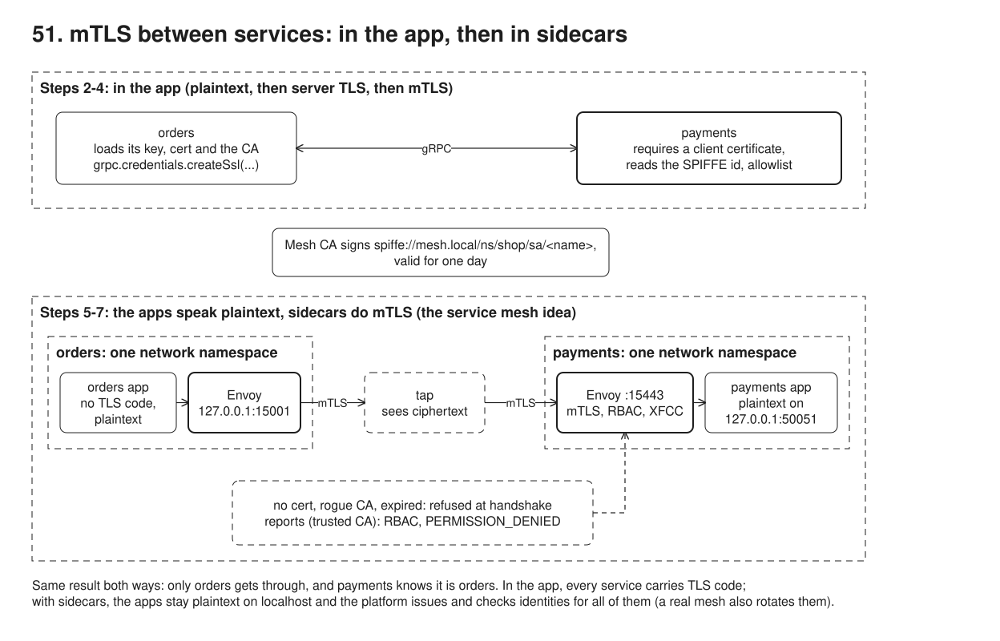
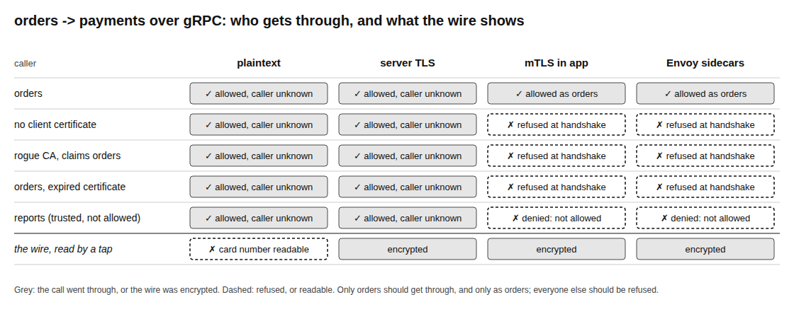

# 51. mTLS between services: in the app, then in sidecars



**Pain: a trusted network that is not.** orders calls payments over plaintext gRPC because "it is our network". Anyone on the path reads the card number: a compromised container, a debug capture, a misrouted tap. payments accepts a Charge from anything that can reach its port, and it cannot even say who called. Once one workload is compromised, an attacker can call every other service as if it were any service.

**Reach for it when** services call each other inside a platform and you want zero trust between them: every call encrypted, every caller proven by a certificate, and a policy that says which service may call which. This is the default in a service mesh (Istio, Linkerd, Consul Connect), and often a compliance requirement (payment card data, health data) for traffic inside the platform, not only at the edge.

**Do not reach for it when** you have two services and one team: TLS from the platform's ingress plus a network policy may be enough, and a mesh adds a control plane, a proxy per pod and new failure modes. In-app mTLS (steps 2 to 4) is fine for a few services in one language. Sidecars pay off when many services, languages or teams need the same encryption, identity and policy, and you want to change it without changing their code. mTLS proves *which workload* is calling, not *which user*: keep end-user authorization (37) on top.

Sam Newman's *Building Microservices* (2nd edition) treats mutual TLS as the way for services to authenticate each other, and the service mesh as the way to give it to every service without each one implementing it. This sample does it both ways and checks that they give the same answers.

The same gRPC call, `payments.Payments/Charge` (`proto/payments.proto`), from orders to payments, four ways. Steps 2 to 4 run both services in the demo process, with a tap (`src/tap.ts`, a TCP relay that keeps a copy of every byte) on the wire between them. Steps 5 to 7 use the Compose stack. `orders-app` and `payments-app` speak plaintext gRPC, each to an Envoy sidecar that shares its network namespace (`network_mode: service:...`, like containers in one Kubernetes pod). The sidecars do mTLS between them, through the same kind of tap. `src/certs.ts` makes a private CA and short-lived certificates whose identity is a SPIFFE URI. It also makes a rogue CA's certificate that claims to be orders, an expired orders certificate, and a valid certificate for reports, which may not charge.

## Run

One shot with proof: `./run.sh` in this folder, or `./51-mtls-mesh/run.sh` from the repo root (log in [`../logs/51-mtls-mesh.log`](../logs/51-mtls-mesh.log)).

By hand (orders on 53061, payments' sidecar on 53161, the tap's stats on 53261):

```sh
npm i
npm run certs                              # certs/: ca, payments, orders, reports, rogue-*, expired-orders
docker compose up -d --wait                # orders-app + sidecar, payments-app + sidecar, tap
curl localhost:53061/checkout              # orders -> its sidecar -> tap -> payments' sidecar -> payments
curl localhost:53261/stats                 # what the tap saw: no card number
curl localhost:53061/stats                 # both sidecars' TLS and RBAC counters
npm run demo                               # the eight steps below
openssl s_client -connect localhost:53161 -CAfile certs/ca.crt -servername payments </dev/null   # no client cert: refused
```

## Files

- `src/certs.ts` the mesh CA and the workload certificates (node-forge), with SPIFFE ids in the URI SAN and both server and client key usage.
- `src/payments.ts` the Charge handler and `callerOf()`: the caller's id from the peer certificate, or from `x-forwarded-client-cert`.
- `src/grpc.ts` the service loaded from the proto at runtime; `charge()` returns the gRPC status instead of throwing.
- `src/tap.ts` the relay that keeps a copy of the bytes; `src/tap-main.ts` runs it between the sidecars.
- `src/orders-main.ts`, `src/payments-main.ts` the two apps as they run in the mesh: plaintext, no certificates.
- `envoy/orders-sidecar.yaml` outbound: plaintext in on `127.0.0.1:15001`, mTLS out with orders' certificate, payments' SPIFFE id required.
- `envoy/payments-sidecar.yaml` inbound: mTLS on `:15443`, client certificate required, RBAC (only orders may call Charge), `x-forwarded-client-cert`, plaintext to `127.0.0.1:50051`.
- `src/demo.ts` the steps and their checks; `src/table.ts` draws `out/results.svg`; `out/certs.txt` lists the certificates from the last run; `screenshots/results.png` is the table.

## Concepts

- **Server TLS is half the job**: with TLS on the server only (like HTTPS), the wire is encrypted and orders knows it reached the real payments. But payments accepts a caller with no certificate at all, and still sees `caller=unknown`.
- **Mutual TLS**: payments also asks for a client certificate and verifies it against the platform's CA. No certificate, a certificate from another CA (even one that claims to be orders), or an expired one: the handshake fails before any gRPC call exists. It works in the other direction too: orders refuses a fake payments whose certificate has the right name but the wrong CA, and the fake receives nothing.
- **Workload identity (SPIFFE)**: the identity is a URI in the certificate's subject alternative name, `spiffe://mesh.local/ns/shop/sa/orders`: a trust domain, a namespace and a service account. It does not depend on an IP or a hostname, which change with every pod. Istio and Linkerd issue exactly these. SPIRE issues them outside a mesh.
- **Authentication is not authorization**: reports holds a valid certificate from the mesh CA, so the handshake succeeds. A rule still has to say that only orders may call Charge. In the app, that rule is an allowlist on the SPIFFE id (`PERMISSION_DENIED`). In the mesh, it is Envoy's RBAC filter on the authenticated principal, which returns the same gRPC status.
- **Short-lived certificates**: the workload certificates are valid for one day (Istio's default is 24 hours). A leaked key soon expires, which is why meshes rotate certificates automatically and rarely bother with revocation. The expired certificate is refused (`certificate expired`).
- **The cost of doing it in the app**: every service loads a key, a certificate and the CA, configures both directions, extracts the identity and reloads certificates before they expire, in every language the platform uses. One service that gets it wrong (`checkClientCertificate=false`) is back to step 3.
- **Sidecar proxy, the mesh idea**: each app talks plaintext to `127.0.0.1`, to an Envoy in its own network namespace. orders' sidecar finds payments by DNS (a `STRICT_DNS` cluster, sample 50), opens TLS 1.3 with orders' certificate and accepts the far end only if its SAN is payments' SPIFFE id. payments' sidecar requires a client certificate, applies RBAC and forwards plaintext to the app on `127.0.0.1:50051`. The two apps contain no TLS code and no certificate (the demo checks the files). Results are identical to the in-app mTLS (see the table).
- **The identity reaches the app in a header**: the payments sidecar sets `x-forwarded-client-cert` (XFCC) with the verified URI (`forward_client_cert_details: SANITIZE_SET`). It replaces any XFCC the caller sent, so orders cannot claim to be admin by sending the header itself.
- **No way around the sidecar**: payments listens on `127.0.0.1` only, so the sidecar is the only way in; dialling `payments-app:50051` is refused. In Kubernetes, iptables rules (or an ambient-mode node proxy) redirect traffic through the sidecar for the same reason, and a NetworkPolicy is the second layer.
- **What the mesh adds beyond this sample**: a control plane that issues and rotates certificates (here `npm run certs` before start-up), pushes config to the proxies over xDS (here static files), and gives every call the same retries, timeouts, outlier ejection and metrics. That is the 06 and 50 client logic, moved out of the apps. You pay for it in extra hops (two proxies per call), resources, and one more thing to operate and debug.

## Proof (`logs/51-mtls-mesh.log`)

Plaintext: anyone is accepted, nobody is identified, and the card number crosses the wire in clear:

```
   no client certificate            OK, payments saw caller=unknown
   the tap saw 437 bytes; card number READABLE; readable strings: HTTP/2.0 | order-plaintext-tapped | 4111111111111111 | pay_7220569e | unknown
```

Server TLS: encrypted, only the SNI is readable, but anyone is still accepted:

```
   no client certificate            OK, payments saw caller=unknown
   the tap saw 5336 bytes; card number not readable; readable strings: payments
```

mTLS in the app: only orders gets through, and payments knows it is orders. The in-process client sees only "Failed to connect" for the rogue and expired certificates; Envoy's alerts in step 6 name the reason:

```
   orders                           OK, payments saw caller=spiffe://mesh.local/ns/shop/sa/orders
   no client certificate            UNAVAILABLE: tlsv13 alert certificate required
   rogue CA, claims orders          UNAVAILABLE: Failed to connect
   orders, expired certificate      UNAVAILABLE: Failed to connect
   reports (trusted, not allowed)   PERMISSION_DENIED: spiffe://mesh.local/ns/shop/sa/reports may not call Charge
   orders -> a fake payments with a rogue-CA certificate for "payments": UNAVAILABLE: unable to verify the first certificate; the fake received 0 charges
```

Sidecars: the same answers, from apps with no TLS code:

```
   orders app -> 127.0.0.1:15001 (its sidecar) -> tap -> payments' sidecar :15443 -> 127.0.0.1:50051: OK, payments saw caller=spiffe://mesh.local/ns/shop/sa/orders
   the tap saw 6123 bytes; card number not readable; readable strings: payments
   TLS calls or key/certificate files in orders-main.ts and payments-main.ts: 0 and 0
   no client certificate            UNAVAILABLE: tlsv13 alert certificate required
   rogue CA, claims orders          UNAVAILABLE: tlsv1 alert unknown ca
   orders, expired certificate      UNAVAILABLE: ssl/tls alert certificate expired
   reports (trusted, not allowed)   PERMISSION_DENIED: RBAC: access denied
   orders sends its own x-forwarded-client-cert claiming admin: OK, payments saw caller=spiffe://mesh.local/ns/shop/sa/orders
   payments' sidecar: handshake=4 fail_verify_no_cert=1 fail_verify_error=2 connection_error=0 rbac.allowed=4 rbac.denied=1
   orders app -> payments-app:50051 directly, plaintext: UNAVAILABLE: connect ECONNREFUSED 172.19.0.3:50051
```

The run script then prints orders' certificate (`openssl x509`), `openssl verify` for each certificate, the containers and their network modes, the sidecars' TLS and RBAC counters, and what the tap holds.

## Screenshots



## Do / Don't

- Do encrypt and authenticate calls inside the platform, not only at the edge.
- Do identify workloads by a SPIFFE id from short-lived certificates, and authorize on that id.
- Do bind the app to localhost behind its sidecar, and let the sidecar set the identity header.
- Don't stop at server-side TLS between services: it hides the data but lets anyone call.
- Don't trust an identity header the caller can send itself; sanitize it at the proxy.
- Don't confuse workload identity with user identity: check the end user too (37).

## Origins and further reading

- Sam Newman, *Building Microservices*, 2nd edition (O'Reilly, 2021): mutual TLS in the security chapter, and service meshes in the communication chapter.
- [SPIFFE](https://spiffe.io/docs/latest/spiffe-about/overview/), the workload identity standard (SPIFFE ID, X.509 SVID).
- Envoy, [TLS](https://www.envoyproxy.io/docs/envoy/latest/intro/arch_overview/security/ssl), the [RBAC filter](https://www.envoyproxy.io/docs/envoy/latest/configuration/http/http_filters/rbac_filter) and [x-forwarded-client-cert](https://www.envoyproxy.io/docs/envoy/latest/configuration/http/http_conn_man/headers#x-forwarded-client-cert).
- Istio, [mutual TLS migration](https://istio.io/latest/docs/tasks/security/authentication/mtls-migration/) (permissive then strict), the path from step 2 to step 5 in a real cluster.
- NIST SP 800-207, [Zero Trust Architecture](https://csrc.nist.gov/pubs/sp/800/207/final).
