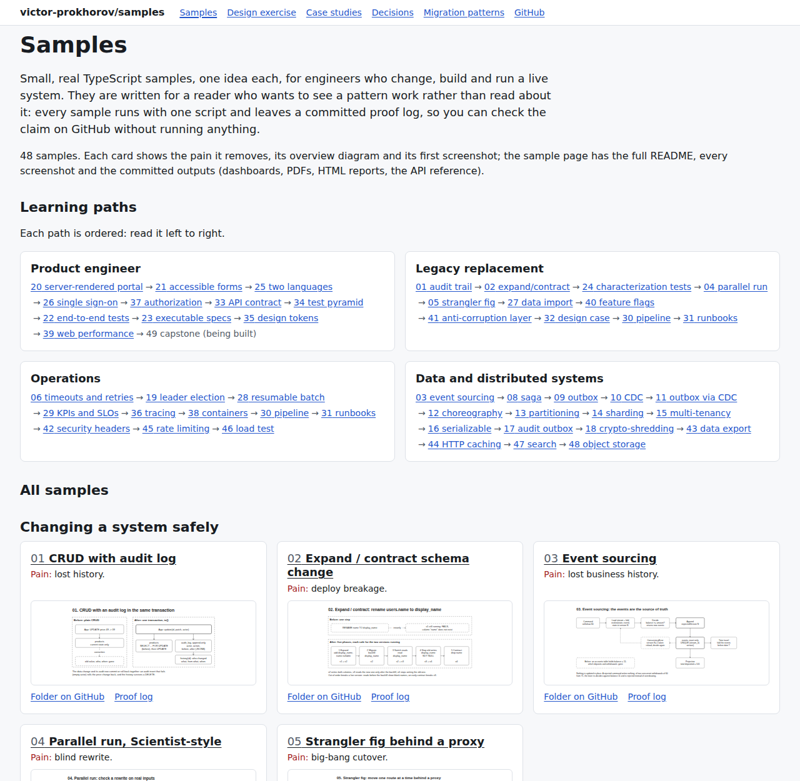

# samples

Browse the samples, diagrams and screenshots at <https://victor-prokhorov.github.io/samples/> (GitHub Pages).

## What this shows

Small, real TypeScript samples, one idea each, for engineers who change, build and run a live system. They are written for a reader who wants to see a pattern work rather than read about it: every sample runs with one script and leaves a committed proof log, so you can check the claim on GitHub without running anything.

- **Skills they prove**: changing a live system without downtime, replacing legacy code safely, calling services that fail, publishing events, scaling and isolating data in Postgres, building an accessible bilingual full-stack portal with single sign-on, testing it at every level, and running it with pipelines, runbooks and KPIs.
- **Three highlights**: [15](15-multi-tenancy/) shows each multi-tenancy pitfall leaking another tenant's rows, then fixes it with row-level security; [24](24-characterization/) pins a legacy PL/pgSQL calculation with a golden master and explains every mismatch; [06](06-service-reliability/) cuts a dependency's wasted database time from 15098 ms to 2393 ms by propagating deadlines.
- **Read the story, not just the code**: three one-page [case studies](docs/case-studies/) (replacing a legacy system, an accessible bilingual portal, running the service) tie the samples to real decisions, and [49](49-capstone/) shows the product pieces working as one portal, with screenshots.
- **Run one in two minutes**: with Node 22 and nothing else, `./04-parallel-run/run.sh` (no Docker) runs a rewrite next to legacy code on 1000 orders and writes [`logs/04-parallel-run.log`](logs/04-parallel-run.log).

Each folder's README has the full story: pain, when to use it and when not, how to run it, concepts, proof excerpts and origins. [MIGRATION-PATTERNS.md](MIGRATION-PATTERNS.md) maps the wider landscape, and [design-exercise/](design-exercise/) is a worked design case that ties the samples together.

## Prerequisites

- **Docker** with Compose, for every sample that lists infrastructure (most use only `postgres:16`; 38 also pulls `node:22-slim`, trivy and gitleaks).
- **Node 22** ([`.nvmrc`](.nvmrc)); every `package.json` declares `"engines": {"node": ">=22"}`.
- **Chromium for Playwright** for the browser tests and every screenshot (21, 22, 30, 32 and most of 33-49): `npx playwright install chromium` (Playwright 1.56.1).
- **Command-line tools** used by the run scripts: `jq`, `rsync` (30), `curl` (30 downloads the pipeline schemas, 46 downloads k6), `perl`, `unzip` (22), and poppler's `pdftoppm` for screenshots of PDFs.
- **Network** on the first run: npm installs, and the downloads above.
- **One click instead**: open the repo in the [devcontainer](.devcontainer/devcontainer.json) (GitHub Codespaces or VS Code Dev Containers), which has Docker-in-Docker, Node 22, Playwright Chromium, jq, rsync, curl, poppler and the Postgres client.

## Learning paths

Each path is ordered: read it left to right. The main table is numbered by complexity, so a sample can lean on lower-numbered ones outside the path; its README says which.

- **Product engineer**: 20 server-rendered portal, 21 accessible forms, 25 two languages, 26 single sign-on, 37 authorization, 33 API contract, 34 test pyramid, 22 end-to-end tests, 23 executable specs, 35 design tokens, 39 web performance, 49 capstone.
- **Legacy replacement**: 01 audit trail, 02 expand/contract, 24 characterization tests, 04 parallel run, 05 strangler fig, 27 data import, 40 feature flags, 41 anti-corruption layer, 32 design case, 30 pipeline, 31 runbooks.
- **Operations**: 06 timeouts and retries, 19 leader election, 28 resumable batch, 29 KPIs and SLOs, 36 tracing, 38 containers, 30 pipeline, 31 runbooks, 42 security headers, 45 rate limiting, 46 load test.
- **Data and distributed systems**: 03 event sourcing, 08 saga, 09 outbox, 10 CDC, 11 outbox via CDC, 12 choreography, 13 partitioning, 14 sharding, 15 multi-tenancy, 16 serializable, 17 audit outbox, 18 crypto-shredding, 43 data export, 44 HTTP caching, 47 search, 48 object storage.

## Skill index

| Skill | Samples |
| --- | --- |
| Auditing and history | [01](01-crud-audit/), [03](03-event-sourcing/), [17](17-audit-outbox/) |
| Zero-downtime schema and deploys | [02](02-expand-contract/), [38](38-containers/), [40](40-feature-flags/) |
| Replacing legacy code | [04](04-parallel-run/), [05](05-strangler-fig/), [24](24-characterization/), [32](32-casebook/), [41](41-crm-integration/) |
| Resilient calls between services | [06](06-service-reliability/), [45](45-rate-limiting/) |
| HTTP API design | [07](07-file-upload/), [33](33-api-contract/), [44](44-http-caching/) |
| Sagas and event publishing | [08](08-saga/), [09](09-outbox-polling/), [10](10-cdc-debezium/), [11](11-outbox-debezium/), [12](12-choreographed-saga/) |
| Scaling Postgres | [13](13-partitioning/), [14](14-sharding-replicas/), [47](47-full-text-search/) |
| Multi-tenancy and access control | [15](15-multi-tenancy/), [26](26-sso/), [37](37-authorization/) |
| Concurrency and coordination | [16](16-serializable/), [19](19-leader-election/), [28](28-campaign/) |
| Privacy and personal data | [18](18-crypto-shredding/), [43](43-data-subject-export/) |
| Full-stack React and Next.js | [20](20-portal/), [49](49-capstone/) |
| Accessibility and UI quality | [21](21-accessibility/), [35](35-design-tokens/), [39](39-web-performance/) |
| Testing at every level | [22](22-playwright/), [23](23-specs/), [24](24-characterization/), [34](34-test-pyramid/) |
| Internationalisation | [25](25-bilingual/), [47](47-full-text-search/) |
| Web security | [26](26-sso/), [37](37-authorization/), [42](42-security-headers/), [48](48-object-storage/) |
| Data loads and integrations | [27](27-import/), [41](41-crm-integration/), [48](48-object-storage/) |
| Observability, KPIs and capacity | [29](29-kpis/), [36](36-observability/), [46](46-load-test/) |
| Delivery and operations | [30](30-pipeline/), [31](31-runbook/), [38](38-containers/), [40](40-feature-flags/) |
| Design and documentation | [31](31-runbook/), [32](32-casebook/), [design-exercise](design-exercise/) |

## Samples

| # | Folder | Pain | New concepts | Infra | Run | Proof |
| --- | --- | --- | --- | --- | --- | --- |
| | **Changing a system safely** | | | | | |
| 01 | [`01-crud-audit/`](01-crud-audit/) | lost history | transactions, before/after audit rows | Postgres | `./01-crud-audit/run.sh` | [`logs/01-crud-audit.log`](logs/01-crud-audit.log) |
| 02 | [`02-expand-contract/`](02-expand-contract/) | deploy breakage | zero-downtime schema change, rolling deploys, backfill | Postgres | `./02-expand-contract/run.sh` | [`logs/02-expand-contract.log`](logs/02-expand-contract.log) |
| 03 | [`03-event-sourcing/`](03-event-sourcing/) | lost business history | events as source of truth, fold, optimistic concurrency, projections | Postgres | `./03-event-sourcing/run.sh` | [`logs/03-event-sourcing.log`](logs/03-event-sourcing.log) |
| 04 | [`04-parallel-run/`](04-parallel-run/) | blind rewrite | control vs candidate, mismatch reporting, cutover | none | `./04-parallel-run/run.sh` | [`logs/04-parallel-run.log`](logs/04-parallel-run.log) |
| 05 | [`05-strangler-fig/`](05-strangler-fig/) | big-bang cutover | routing facade, capability-by-capability replacement, instant rollback | none (3 HTTP servers) | `./05-strangler-fig/run.sh` | [`logs/05-strangler-fig.log`](logs/05-strangler-fig.log) |
| | **Services and APIs** | | | | | |
| 06 | [`06-service-reliability/`](06-service-reliability/) | cascading failure | timeouts, deadline propagation, bulkhead, retryable vs not, full jitter, retry budget, idempotency keys, circuit breaker | Postgres, 2 HTTP processes | `./06-service-reliability/run.sh` | [`logs/06-service-reliability.log`](logs/06-service-reliability.log) |
| 07 | [`07-file-upload/`](07-file-upload/) | lost updates, duplicate creates, torn downloads | two-step upload, bearer scope, idempotency key, ETag as version, `If-Match` and 428/412, `If-None-Match` 304, `Range` / `If-Range` 206/416, change feed on `pg_snapshot_xmin`, `Link` cursor | Postgres, Express | `./07-file-upload/run.sh` | [`logs/07-file-upload.log`](logs/07-file-upload.log) |
| | **Coordinating services and publishing events** | | | | | |
| 08 | [`08-saga/`](08-saga/) | partial failure | no distributed transactions, compensations, saga log, crash recovery, idempotent steps, durable timer and waker | Postgres (4 databases) | `./08-saga/run.sh` | [`logs/08-saga.log`](logs/08-saga.log) |
| 09 | [`09-outbox-polling/`](09-outbox-polling/) | dual write | dual-write problem, outbox table, polling relay, `SKIP LOCKED`, at-least-once, idempotent consumer | Postgres, Kafka | `./09-outbox-polling/run.sh` | [`logs/09-outbox-polling.log`](logs/09-outbox-polling.log) |
| 10 | [`10-cdc-debezium/`](10-cdc-debezium/) | derived data drift | WAL, logical decoding, replication slot, LSN, Debezium, Kafka Connect | Postgres, Kafka, Connect | `./10-cdc-debezium/run.sh` | [`logs/10-cdc-debezium.log`](logs/10-cdc-debezium.log) |
| 11 | [`11-outbox-debezium/`](11-outbox-debezium/) | polling overhead | outbox relayed by CDC, EventRouter, immediate cleanup | Postgres, Kafka, Connect | `./11-outbox-debezium/run.sh` | [`logs/11-outbox-debezium.log`](logs/11-outbox-debezium.log) |
| 12 | [`12-choreographed-saga/`](12-choreographed-saga/) | one coordinator owns every reaction | choreography, per-service outbox + relay, idempotent consumer (`processed_messages`), offset commit vs redelivery, partition by order id, cross-topic reordering, forward-only state machine, correlation and causation ids, cyclic dependencies | Postgres (4 databases), Kafka | `./12-choreographed-saga/run.sh` | [`logs/12-choreographed-saga.log`](logs/12-choreographed-saga.log) |
| | **Scaling, isolating and protecting data** | | | | | |
| 13 | [`13-partitioning/`](13-partitioning/) | table too big | declarative partitioning, partition key, pruning, unique-key limit | Postgres | `./13-partitioning/run.sh` | [`logs/13-partitioning.log`](logs/13-partitioning.log) |
| 14 | [`14-sharding-replicas/`](14-sharding-replicas/) | one-machine ceiling | shard key, app-side router, streaming replication, read replicas, replica lag, CP writes / AP reads | Postgres (2 primaries + scalable replicas) | `./14-sharding-replicas/run.sh` | [`logs/14-sharding-replicas.log`](logs/14-sharding-replicas.log) |
| 15 | [`15-multi-tenancy/`](15-multi-tenancy/) | one tenant sees another's data | pool / bridge / silo, Row-Level Security, `FORCE`, `SET LOCAL` on pooled connections, tenant-leading keys and indexes, per-tenant migrations, per-tenant `statement_timeout`, moving a tenant to its own database | Postgres (5 databases) | `./15-multi-tenancy/run.sh` | [`logs/15-multi-tenancy.log`](logs/15-multi-tenancy.log) |
| 16 | [`16-serializable/`](16-serializable/) | write skew | isolation levels, lost update, write skew, SSI, 40001 retry, materialized conflict | Postgres | `./16-serializable/run.sh` | [`logs/16-serializable.log`](logs/16-serializable.log) |
| | **Audit, erasure and singletons** | | | | | |
| 17 | [`17-audit-outbox/`](17-audit-outbox/) | scattered audit logs | audit events through per-service outboxes, shipper, dedupe by `event_id`, append-only store, the bypass gap | Postgres (3 databases) | `./17-audit-outbox/run.sh` | [`logs/17-audit-outbox.log`](logs/17-audit-outbox.log) |
| 18 | [`18-crypto-shredding/`](18-crypto-shredding/) | erasure versus immutable data | per-subject DEK, envelope encryption (KEK), AES-256-GCM, unique IV, AAD, blind index, KEK rotation, key-store backups undo erasure | Postgres (3 databases, plus 2 restored backups) | `./18-crypto-shredding/run.sh` | [`logs/18-crypto-shredding.log`](logs/18-crypto-shredding.log) |
| 19 | [`19-leader-election/`](19-leader-election/) | a job that fires N times, or a single point of failure | lease row on the database clock, heartbeat, terms, failover after the TTL, self-fencing, fencing tokens, graceful release, `pg_try_advisory_lock` and its pooler trap | Postgres | `./19-leader-election/run.sh` | [`logs/19-leader-election.log`](logs/19-leader-election.log) |
| | **Building, testing and running a product** | | | | | |
| 20 | [`20-portal/`](20-portal/) | pages that need JS, client-only validation, one member seeing another's data | server components, server actions, progressive enhancement, `useActionState`, zod field errors, Post/Redirect/Get (303), signed session cookie, member-scoped queries (404 not 403), partial unique index as a rule, action `Origin` check | Postgres, Next.js | `./20-portal/run.sh` | [`logs/20-portal.log`](logs/20-portal.log) |
| 21 | [`21-accessibility/`](21-accessibility/) | a form keyboard and screen reader users cannot complete | WCAG 2.2 AA and RGAA criteria, axe-core in Chromium, accessible name and description, `aria-describedby` / `aria-invalid`, error summary with focus, keyboard journey, fieldset and legend, `autocomplete` tokens, what automated rules miss | none (`node:http`, Chromium via Playwright) | `./21-accessibility/run.sh` | [`logs/21-accessibility.log`](logs/21-accessibility.log) |
| 22 | [`22-playwright/`](22-playwright/) | flaky, brittle, order-dependent browser tests | role and label locators, auto-waiting and web-first assertions vs `waitForTimeout`, database per worker from a template, truncate reset (why not a rollback), `storageState` login once, trace on failure, JSON reports, Vitest for the rule | Postgres (a database per worker), Chromium via Playwright | `./22-playwright/run.sh` | [`logs/22-playwright.log`](logs/22-playwright.log) |
| 23 | [`23-specs/`](23-specs/) | acceptance criteria that nobody runs | Gherkin `Rule` per requirement, scenario outlines on boundaries, step definitions on a domain + Postgres, fixed clock, failing first against a naive implementation, Cucumber messages, traceability matrix | Postgres | `./23-specs/run.sh` | [`logs/23-specs.log`](logs/23-specs.log) |
| 24 | [`24-characterization/`](24-characterization/) | rewriting rules nobody can state | characterization test, golden master in an approval file, boundary + seeded random inputs, mismatches explained by hypotheses, keep-or-fix decisions as an allowlist, zero unexplained mismatches, decision table | Postgres (PL/pgSQL legacy) | `./24-characterization/run.sh` | [`logs/24-characterization.log`](logs/24-characterization.log) |
| 25 | [`25-bilingual/`](25-bilingual/) | a translated page that is still English underneath | ICU MessageFormat (plural, select), CLDR plural categories, gender-free wording, `Intl` number/currency/date, `Accept-Language` negotiation with q-values and fallback, catalogue key and argument check, pseudo-localisation, `lang` and language of parts | none (node:http) | `./25-bilingual/run.sh` | [`logs/25-bilingual.log`](logs/25-bilingual.log) |
| 26 | [`26-sso/`](26-sso/) | one password per app, a login that trusts whatever comes back | OpenID Connect, authorization code + PKCE, state, nonce, discovery, ID token validation (signature, iss, aud, exp), one-time login transaction, opaque session cookie stored hashed, SSO, role mapping from a groups claim, 401 vs 403, JIT provisioning on (issuer, sub), RP-initiated logout | Postgres, IdP (oidc-provider) and app processes | `./26-sso/run.sh` | [`logs/26-sso.log`](logs/26-sso.log) |
| 27 | [`27-import/`](27-import/) | a file load that duplicates on rerun and half-applies | natural key, `COPY` into a text staging table, `HEADER match`, SQL validation rules with `pg_input_is_valid`, rejects table with reasons, dry run, diff new / changed / unchanged / missing, upsert with `IS DISTINCT FROM`, batch per file hash, control totals, reconciliation, whole-file refusal | Postgres | `./27-import/run.sh` | [`logs/27-import.log`](logs/27-import.log) |
| 28 | [`28-campaign/`](28-campaign/) | a mail-out that sends twice to some and never to others | job table per (year, member), idempotent enqueue, claim with `FOR UPDATE SKIP LOCKED`, lease and fenced outcome, crash and resume, the in-doubt window and a stable `Message-ID`, 4xx vs 5xx, exponential backoff with jitter, dead letters, throttling, dry-run sample, deterministic PDF, campaign report | Postgres, SMTP sink (smtp-server), worker processes | `./28-campaign/run.sh` | [`logs/28-campaign.log`](logs/28-campaign.log) |
| 29 | [`29-kpis/`](29-kpis/) | numbers that look good while members fail | usage events and request log from the app, KPI definitions with owner and target, adoption, task success, funnel, percentiles, availability SLO, error budget and burn rate, SLA, static dashboard | Postgres, node:http | `./29-kpis/run.sh` | [`logs/29-kpis.log`](logs/29-kpis.log) |
| 30 | [`30-pipeline/`](30-pipeline/) | unchecked changes, ad hoc releases, pipeline copies that drift | pipeline as code, stages and fail fast, rules per trigger, scheduled releases, coverage gate (vitest thresholds), cache versus artifacts, job isolation, gate that blocks only releases, deploy job (`environment`, `resource_group`, atomic symlink switch), GitHub Actions and Azure Pipelines equivalents, three-way comparison, JSON-schema validation of pipeline files | none (gitlab-ci-local, shell executor; Chromium for screenshots) | `./30-pipeline/run.sh` | [`logs/30-pipeline.log`](logs/30-pipeline.log) |
| 31 | [`31-runbook/`](31-runbook/) | operations in one person's head, backups nobody restored | runbook sections (preconditions, steps, verification, rollback), executable Markdown, do-nothing scripting, automatic rollback through the same runbook, run log, up/down migrations, ADRs, onboarding checklist, docs-lint, restore drill (base backup and WAL archiving, pg_waldump, point-in-time recovery into a fresh container, checksums, repair, measured RPO and RTO) | Postgres (with WAL archiving, plus a restore container), node:http | `./31-runbook/run.sh` | [`logs/31-runbook.log`](logs/31-runbook.log) |
| 32 | [`32-casebook/`](32-casebook/) | a design that does not hold together | time-boxed design case, discovery plan, stakeholder map, personas and journeys, Given/When/Then criteria, traceability check, diagrams as code (C4, sequence, ER, state, gantt), ER = DDL and states = CHECK, journey queries on the DDL, strangler plan, risk register, KPIs | Postgres, Chromium (mermaid-cli) | `./32-casebook/run.sh` | [`logs/32-casebook.log`](logs/32-casebook.log) |
| | **Contracts, tests, UI and delivery** | | | | | |
| 33 | [`33-api-contract/`](33-api-contract/) | an API that drifts from its docs | OpenAPI 3.1 written first, Redocly lint, request and response validation at runtime (Ajv, JSON Schema 2020-12, closed schemas, enforce or warn), RFC 9457 problems, generated typed client (openapi-typescript + openapi-fetch) checked in sync, provider contract test over every operation, `Deprecation` / `Sunset` / `Link` (RFC 9745 / 8594), breaking-change check between revisions, offline HTML reference (Redoc) | none (node:http, Chromium for screenshots) | `./33-api-contract/run.sh` | [`logs/33-api-contract.log`](logs/33-api-contract.log) |
| 34 | [`34-test-pyramid/`](34-test-pyramid/) | slow, flaky, end-to-end-only tests | test pyramid, rules as pure functions, Vitest projects per level, component tests with Testing Library + user-event + jsdom, accessible queries, MSW, API integration against real Postgres, one Playwright smoke test, sleep vs web-first assertion, count and time per level, v8 coverage thresholds as a gate | Postgres, node:http, React (esbuild), Chromium | `./34-test-pyramid/run.sh` | [`logs/34-test-pyramid.log`](logs/34-test-pyramid.log) |
| 35 | [`35-design-tokens/`](35-design-tokens/) | inconsistent, inaccessible UI | W3C design tokens (DTCG) with primitive and semantic layers, light and dark themes as CSS custom properties, WCAG contrast gate over every fg/bg pair, components on semantic tokens only, static Storybook with the a11y addon, axe per story, Playwright visual regression (toHaveScreenshot) | Storybook (static), Chromium | `./35-design-tokens/run.sh` | [`logs/35-design-tokens.log`](logs/35-design-tokens.log) |
| 36 | [`36-observability/`](36-observability/) | an incident nobody can trace | OpenTelemetry SDK, spans and context, W3C `traceparent`, sqlcommenter trace id in SQL, pino log correlation, OTLP/HTTP, hand-written collector, waterfall, N+1 query, RED from `http.server.request.duration` by `http.route`, bucket edge at the SLO | Postgres, 2 node:http processes, collector | `./36-observability/run.sh` | [`logs/36-observability.log`](logs/36-observability.log) |
| 37 | [`37-authorization/`](37-authorization/) | permission checks scattered and inconsistent | one `can(user, action, resource)`, RBAC + ABAC conditions, deny by default, four eyes, declared action per route (PEP/PDP), generated permission matrix, expectations test, Postgres RLS (`USING` vs `WITH CHECK`, non-owner app role, column grants), code = RLS on every cell, defence in depth | Postgres, node:http | `./37-authorization/run.sh` | [`logs/37-authorization.log`](logs/37-authorization.log) |
| 38 | [`38-containers/`](38-containers/) | works on my machine | multi-stage build, `.dockerignore`, base pinned by digest, non-root, HEALTHCHECK, build secret mounts, `/healthz` vs `/readyz`, SIGTERM drain, blue-green switch, trivy + gitleaks image scan | Docker, Postgres | `./38-containers/run.sh` | [`logs/38-containers.log`](logs/38-containers.log) |
| 39 | [`39-web-performance/`](39-web-performance/) | a slow portal nobody measures | render-blocking resources, LCP image (AVIF, srcset, preload, fetchpriority), layout shift, long tasks and yielding, Lighthouse lab run (TBT), web-vitals RUM with sendBeacon and p75, bundle-size budget from the esbuild metafile, one budgets file for bundle, lab and field | node:http, Lighthouse, Chromium | `./39-web-performance/run.sh` | [`logs/39-web-performance.log`](logs/39-web-performance.log) |
| 40 | [`40-feature-flags/`](40-feature-flags/) | risky big-bang releases | release toggle, stable-hash percentage rollout, tenant targeting, kill switch, local cache + LISTEN/NOTIFY, audit trigger, expired-flag CI check, OpenFeature | Postgres | `./40-feature-flags/run.sh` | [`logs/40-feature-flags.log`](logs/40-feature-flags.log) |
| | **Integrations, security, privacy and performance** | | | | | |
| 41 | [`41-crm-integration/`](41-crm-integration/) | a partner API leaking into the domain | anti-corruption layer (client, translator, adapter on a domain port), OData `$filter`/`$select`/`$orderby`/`$top`/`$count`, server-driven paging with `@odata.nextLink`, option-set codes and quarantine, retries honouring `Retry-After` with jittered backoff, ETag `If-Match` 412/428 and conflict handling, incremental sync on a high-water mark (`ge` not `gt`) with a version guard, HMAC-SHA256 webhooks (constant-time compare, 300 s window, idempotency by event id), nightly reconciliation by counts and checksums | Postgres, fake CRM (node:http) | `./41-crm-integration/run.sh` | [`logs/41-crm-integration.log`](logs/41-crm-integration.log) |
| 42 | [`42-security-headers/`](42-security-headers/) | browser-side attacks on a portal | CSP with per-request nonce + `strict-dynamic`, frame-ancestors, HSTS, nosniff, Referrer-/Permissions-Policy, `__Host-` cookies, Origin check + CSRF token, CSP reports, header grading, secrets key ring + gitleaks | Node (Playwright Chromium) | `./42-security-headers/run.sh` | [`logs/42-security-headers.log`](logs/42-security-headers.log) |
| 43 | [`43-data-subject-export/`](43-data-subject-export/) | personal-data requests handled by hand | GDPR access (art. 15) and portability (art. 20), column-level data inventory with category and lawful basis, inventory check against `information_schema` that fails closed, re-authentication before export, withheld fields with reasons, JSON + CSV + README + manifest in a reproducible zip, request log with the one-month deadline, retention policy table, batched purge with `SKIP LOCKED`, legal hold, anonymisation versus deletion | Postgres, node:http | `./43-data-subject-export/run.sh` | [`logs/43-data-subject-export.log`](logs/43-data-subject-export.log) |
| 44 | [`44-http-caching/`](44-http-caching/) | slow pages or stale data | Cache-Control per resource (immutable, private no-cache, s-maxage + stale-while-revalidate), ETag/304, Vary: Accept-Language, shared cache (coalescing, hit-for-pass, purge by tag), the public-cache privacy leak, invalidation outbox via LISTEN/NOTIFY with catch-up | Postgres, origin + cache (node:http), Chromium | `./44-http-caching/run.sh` | [`logs/44-http-caching.log`](logs/44-http-caching.log) |
| 45 | [`45-rate-limiting/`](45-rate-limiting/) | one tenant starves the others | token bucket per tenant and per API key (atomic PL/pgSQL, row lock), 429 + Retry-After, IETF RateLimit / RateLimit-Policy, retry with jitter, in-memory vs shared limiter | Postgres | `./45-rate-limiting/run.sh` | [`logs/45-rate-limiting.log`](logs/45-rate-limiting.log) |
| 46 | [`46-load-test/`](46-load-test/) | no idea how much traffic it holds | k6 smoke/gate/ramp/soak, open model (arrival rate), SLO thresholds as a CI gate, expression index, saturation point, Little's law, coordinated omission | Postgres, k6 binary | `./46-load-test/run.sh` | [`logs/46-load-test.log`](logs/46-load-test.log) |
| 47 | [`47-full-text-search/`](47-full-text-search/) | search that misses accents and typos | generated tsvector per language + GIN, unaccent text search configurations, websearch_to_tsquery, ts_rank_cd weights, ts_headline, pg_trgm word_similarity threshold, IMMUTABLE f_unaccent | Postgres (unaccent, pg_trgm), search page, Chromium | `./47-full-text-search/run.sh` | [`logs/47-full-text-search.log`](logs/47-full-text-search.log) |
| 48 | [`48-object-storage/`](48-object-storage/) | large uploads through the app server | presigned PUT/GET (AWS SDK v3) with signed content type and length, SigV4 verification, browser direct upload with bucket CORS, quarantine prefix and EICAR scanner, Content-Disposition downloads | Postgres, s3rver behind a SigV4 gate, Chromium | `./48-object-storage/run.sh` | [`logs/48-object-storage.log`](logs/48-object-storage.log) |
| | **Putting it together** | | | | | |
| 49 | [`49-capstone/`](49-capstone/) | pieces that never form one product | one portal from the samples' pieces: OIDC + PKCE into Next.js server components, RLS per transaction, design tokens (35), ICU/Intl EN-FR, error summary, four eyes, usage events to KPI tiles | Postgres, oidc-provider (npm), Chromium | `./49-capstone/run.sh` | [`logs/49-capstone.log`](logs/49-capstone.log) |

Each script starts from a fresh state (`docker compose down -v && up` where there is infra), installs deps, runs the demo, then dumps the raw state as proof. Everything it prints goes to `logs/<name>.log`.

## Ports

Chosen to avoid clashing with other local services. From 21 on: Postgres `55430 + NN`, main HTTP `53010 + NN`, a second HTTP process `53110 + NN`; test workers use free ports.

| # | Ports | # | Ports |
| --- | --- | --- | --- |
| 01 | Postgres 55434 | 26 | Postgres 55456, HTTP 53036 IdP, 53037 app |
| 02 | Postgres 55438 | 27 | Postgres 55457 |
| 03 | Postgres 55433 | 28 | Postgres 55458, SMTP 52528 (sink) |
| 04 | none | 29 | Postgres 55459, HTTP 53039 portal |
| 05 | HTTP 53000 proxy, 53001 legacy, 53002 new | 30 | HTTP 53040 app (npm start, hand run) |
| 06 | Postgres 55445, HTTP 53010 payments, 53011 catalog | 31 | Postgres 55461, HTTP 53041 member service; restore container (drill) has no port |
| 07 | Postgres 55450, HTTP 53020 files API | 32 | Postgres 55462 |
| 08 | Postgres 55439 | 33 | HTTP 53043 provider, 53143 drifted provider (demo) |
| 09 | Postgres 55437, Kafka 59094 | 34 | Postgres 55464, HTTP 53044 app (form + API; Playwright webServer) |
| 10 | Postgres 55435, Kafka 59092, Connect 58083 | 35 | HTTP 53045 static Storybook (tests), 53145 Storybook dev (hand run) |
| 11 | Postgres 55436, Kafka 59093, Connect 58084 | 36 | Postgres 55466, HTTP 53046 web (BFF), 53146 API; collector on a random port |
| 12 | Postgres 55446, Kafka 59095 | 37 | Postgres 55467, HTTP 53047 app (sprinkled or policy, one at a time) |
| 13 | Postgres 55440 | 38 | Postgres 55468, HTTP 53048 proxy, 53148 blue, 53248 green |
| 14 | Postgres 55441 shard 0 primary, 55442 shard 1 primary, replicas on random ports | 39 | HTTP 53049 member page, 53149 RUM collector |
| 15 | Postgres 55447 | 40 | Postgres 55470, HTTP 53050 statement API |
| 16 | Postgres 55443 | 41 | Postgres 55471, HTTP 53051 domain app, 53151 fake CRM |
| 17 | Postgres 55444 | 42 | HTTP 53052 insecure portal, 53152 hardened portal, 53252 attacker |
| 18 | Postgres 55448 | 43 | Postgres 55473, HTTP 53053 member portal |
| 19 | Postgres 55449 | 44 | Postgres 55474, HTTP 53054 origin, 53154 shared cache |
| 20 | Postgres 55451, HTTP 53030 portal (next start) | 45 | Postgres 55475, HTTP 53055 member API |
| 21 | HTTP 53031 forms | 46 | Postgres 55476, HTTP 53056 member API |
| 22 | Postgres 55452, HTTP 53032 portal (hand run; test workers use free ports) | 47 | Postgres 55477, HTTP 53057 search page |
| 23 | Postgres 55453 | 48 | Postgres 55478, HTTP 53058 app, 53158 storage (SigV4 gate) |
| 24 | Postgres 55454 | 49 | Postgres 55479, HTTP 53059 portal (next start), 53159 IdP |
| 25 | HTTP 53035 member page |  |  |

## Which one when

- **CRUD + audit (01)**: most apps. You need "who changed what" for compliance or support, and reads of current state dominate.
- **Expand / contract (02)**: any schema change on a system deployed without downtime. It is the default, not an advanced technique.
- **Event sourcing (03)**: the history *is* the domain (ledgers, workflows, bookings). You need to rebuild state, add new read models later, or answer "what was the state at version N" (or at time T, filtering on the events' `at`).
- **Parallel run (04)**: replacing logic whose exact behavior nobody fully knows (pricing, tax, permissions), before trusting the rewrite.
- **Strangler fig (05)**: replacing a whole system incrementally instead of a big-bang rewrite. It combines naturally with 04 (verify) and 10/11 (move the data).
- **Service reliability (06)**: any synchronous call to another service. Timeouts and a retry policy that knows which failures are transient are the default, not an add-on. Add idempotency keys the moment a retried call has side effects (charges, orders, emails), and a breaker and bulkhead when one dependency's outage must not take the caller or its other dependencies down with it.
- **File upload API (07)**: any HTTP resource that clients overwrite, cache, download in parts or sync: `If-Match` on every write, `If-None-Match` and `If-Range` on reads, an idempotency key on every create, and a change feed paged on a commit-safe cursor rather than a timestamp.
- **Saga (08)**: a business operation spans services that each own their data.
- **Outbox, polling (09)**: one service needs to reliably tell others that something happened in business terms, without dual writes, with the fewest moving parts. Start here.
- **CDC (10)**: getting changes out of a database into other systems (search index, cache, warehouse) without touching the writing code, when row-level diffs are what the consumer wants.
- **Outbox, CDC relay (11)**: same need as 09, when poll latency, DB load or table cleanup start to hurt, or you already run Debezium.
- **Choreographed saga (12)**: a short, stable cross-service flow between services owned by different teams, whose events are useful beyond this flow. Once the flow grows steps, branches or timers, or you need to see one saga's state in one place, go back to 08.
- **Partitioning (13)**: one table got big enough that indexes, vacuum or retention hurt, and the hot queries filter on one key. Try it before sharding: it is config, not code.
- **Sharding + read replicas (14)**: one server can no longer hold the data or absorb the writes (shards), or the reads (replicas), and almost every query stays within one key. Stale reads must be acceptable wherever you read from replicas.
- **Multi-tenancy (15)**: many customers share one product. Pool with RLS by default (app connects as a non-owner, `FORCE`, `SET LOCAL`, `tenant_id` first in every key and index), a schema per tenant only when tenants need their own tables, and a database per tenant for the few that need their own restore, deletion, region or capacity.
- **SERIALIZABLE (16)**: an invariant spans several rows or depends on rows that do not exist yet (capacity, overbooking, on-call rules), and cannot be written as a constraint or reduced to a lock on one parent row. One-row rules only need a conditional `UPDATE` or `FOR UPDATE`.
- **Audit trail through the outbox (17)**: several services need one audit trail of record with actors and reasons, that cannot miss a change made through the app or be edited.
- **Crypto-shredding (18)**: personal data sits in stores you cannot rewrite (an event log, an audit store, Kafka, backups), and erasing one person must make every copy unreadable. It works only if the key store's own backups are short-lived, and your counsel should confirm that key deletion counts as erasure.
- **Leader election (19)**: exactly one replica should run a job at a time (a scheduler, an order-preserving relay) and the work cannot be split by claiming rows; fence every write with the term.
- **Full-stack portal (20)**: a server-rendered React app over its own database, where most pages read the member's data and a few forms change it: server components for the reads, server actions for the writes, validation on the server, every query scoped to the session, and forms that work with JavaScript off.
- **Accessible forms (21)**: every form the public or members fill in: labels, errors in text tied to their field, an error summary that takes focus, a keyboard path to submit; an axe scan and a keyboard journey in the test suite, and a manual audit before claiming conformance.
- **End-to-end tests (22)**: the few journeys that must keep working in a real browser, in parallel on every change: role and label locators, web-first assertions instead of sleeps, a database per worker, login once, traces on failure; the rules themselves in unit tests.
- **Executable specifications (23)**: business rules agreed with people outside the team, with boundaries and exceptions, where you must show which requirement is tested and passing; keep the scenarios at the rule level against the domain, not the UI.
- **Characterization tests (24)**: before rewriting or refactoring deterministic logic whose rules only the code knows: record a golden master on generated boundary and random inputs, explain every mismatch with a rule, and write each keep-or-fix decision down before the rewrite ships.
- **Bilingual (25)**: any product that serves, or will serve, more than one language: whole-sentence ICU messages, `Intl` for every number and date, catalogues checked against each other in CI, and a pseudo-locale run before the first translation arrives.
- **Single sign-on (26)**: people already have an account in an identity provider and the app should not hold passwords; use the authorization code flow with PKCE, state and nonce through a maintained library, keep the session server-side, and map the IdP's groups to app roles checked on every route.
- **Data import (27)**: files from outside feed your tables on a schedule and can be resent, late, truncated or wrong; stage with `COPY`, reject per rule with a reason, upsert on the natural key in one transaction, record each file by its hash, and reconcile the result with the sender's control totals.
- **Resumable batch campaign (28)**: one job sends something to many people and must survive crashes and reruns; keep one row per recipient and period, claim with `SKIP LOCKED` and a lease, retry only transient failures with backoff, list the dead letters, and decide explicitly what happens to a send that may or may not have gone.
- **Product and service KPIs (29)**: as soon as a service has users and someone asks whether it works: define each KPI once with an owner and a target, compute it from events the app emits, measure availability on member requests against an SLO, and read percentiles rather than means.
- **CI/CD pipeline (30)**: from the second person on the code, or the second release: every change through the same lint, type, test, accessibility and audit gates, cheap checks first, and production changed only by a schedule or a release tag that deploys the artifact the pipeline tested.
- **Executable runbooks (31)**: a small team runs recurring operations (releases, data loads, member requests) by hand: write each as a runbook whose steps the runner executes, with preconditions, verification and a rollback it can run, record every run, and keep decisions in ADRs that a docs-lint checks.
- **Design case, checked (32)**: before building a rebuild or a new service, when several people will read the plan: write requirements with testable criteria, journeys that map to them and diagrams as code, then check that they trace, render and that the data model answers the journeys.
- **API contract (33)**: an API with consumers you do not deploy with: write the OpenAPI spec first, validate requests and responses against it, generate the client, and fail the build on a breaking change; announce removals with `Deprecation` and `Sunset`.
- **Test pyramid (34)**: a suite that is slow or flaky because most checks run in a browser: push each rule down to the cheapest level that can catch it, keep integration tests on a real Postgres, and gate on coverage and timing.
- **Design tokens (35)**: several screens or teams styling the same product: one token source compiled to CSS variables and themes, contrast checked in CI, components in stories with visual regression.
- **Observability (36)**: a request crosses the browser, an API and the database and nobody can say where the time went: structured logs carrying the trace id, OpenTelemetry spans joined by `traceparent`.
- **Authorization (37)**: permission checks are copied into handlers and drift: one `can(user, action, resource)` that denies by default, tested as a matrix, with the same rules enforced by row-level security.
- **Containers (38)**: the app runs differently on each machine: a multi-stage, non-root image with a healthcheck, separate readiness and liveness, a scan in the pipeline and a blue-green switch.
- **Web performance (39)**: pages feel slow and nobody has numbers: Lighthouse budgets in CI, Core Web Vitals reported from real browsers, a bundle-size budget.
- **Feature flags (40)**: a release is too big or too risky to ship in one go: a release toggle, a percentage rollout with stable hashing, per-tenant targeting, a kill switch, and a date to delete the flag.
- **CRM integration (41)**: a partner system's API and vocabulary start leaking into your code: an anti-corruption layer, paging and retries that respect 429, signed webhooks with replay protection, and a reconciliation job.
- **Security headers (42)**: any portal served to browsers: a nonce-based CSP, HSTS, cookie flags, CSRF protection and `frame-ancestors`, checked by a header scan, with secrets kept out of the code.
- **Data-subject export (43)**: people ask for a copy of their data, or for it to be kept or purged: a verified, machine-readable export, retention purges, and legal holds that override them.
- **HTTP caching (44)**: pages are slow or show stale data: `Cache-Control`, `ETag` and `Vary` set on purpose, `stale-while-revalidate` where a little staleness is fine, and invalidation driven by change events.
- **Rate limiting (45)**: one tenant or client can starve the others: a token bucket per tenant, 429 with `Retry-After` and `RateLimit` headers, and clients that back off.
- **Load test (46)**: before a launch or a campaign, when nobody knows how much traffic it holds: a realistic load profile, SLO thresholds that fail the run, and the saturation point.
- **Full-text search (47)**: search in French or with typos misses obvious matches: Postgres full-text search with a French configuration and `unaccent`, `pg_trgm` for typos, ranking and highlighting, before reaching for a search engine.
- **Object storage (48)**: large files go through the app server: presigned uploads and downloads with expiry and size limits, and a quarantine step before a file is used.
- **Capstone (49)**: once the pieces work alone: one styled, bilingual, accessible portal with single sign-on, tests and KPIs, showing how they fit in one product.

## How they combine

A strangler migration verifies with parallel runs and feeds the new service through CDC; a choreographed saga (12) publishes its events through per-service outboxes; every retried write between services carries 06's idempotency key; an event-sourced service (03) can publish its events through an outbox/CDC relay and keep its personal data crypto-shredded (18); a singleton relay or waker (09, 08) either claims rows or runs under a leader lease (19). On the product side, the portal (20) is the thing the others protect: its forms follow 21, its journeys are tested by 22 and its rules by 23, a rewrite of a legacy screen starts with 24, every string goes through 25, login comes from 26, the monthly import (27) and yearly campaign (28) are run from 31's runbooks, 29 says whether it works for members, 30 gates every change, and 32 is how the whole plan is written down before any of it is built. Samples 33 to 49 close the loop: 33 and 34 keep the portal's API and tests honest, 37 and 42 harden it, 36, 39 and 46 measure it, 38 and 40 ship it safely, 41 and 48 connect it to partners and files, and 49 puts the whole product together.

## Repo conventions

- **Proof logs**: every sample's `NN-name/run.sh` tees its output to `logs/NN-name.log` (all logs in one folder, easy to browse), with the absolute repo path replaced by `<repo>`, committed from the last green run and never edited by hand ([ADR 3](docs/adr/0003-committed-proof-logs-and-self-checks.md)).
- **Self-checks**: each demo states the README's claims as `check(label, condition)`; one failed check makes the run script exit non-zero.
- **Overview diagrams**: each sample gets a `diagrams/overview.svg`, drawn as code with [`tools/diagrams`](tools/diagrams/) (`node tools/diagrams/build-all.mjs` rebuilds them all), black on white, dashed for legacy or failure paths.
- **Screenshots**: anything visual (pages, PDFs, reports) is captured by the run script into `screenshots/*.png` with [`tools/render.mjs`](tools/render.mjs).
- **Outputs committed**: reports, generated HTML, PDFs, JSON and rendered diagrams sit next to the code (`out/`, `reports/`, `diagrams/`), so you see them on GitHub; only dependencies, caches and secrets are ignored.
- **Decisions**: the repo-wide choices are recorded in [`docs/adr/`](docs/adr/): [Postgres only](docs/adr/0001-postgres-only.md), [no framework in 01-19](docs/adr/0002-no-framework-in-01-19.md), [proof logs and self-checks](docs/adr/0003-committed-proof-logs-and-self-checks.md).
- **Versions**: Node 22, TypeScript run by `tsx`, `pg` for Postgres, one version of each shared dev tool across samples, kept current by [Renovate](renovate.json) in one weekly pull request.

## Licence

The code is under the [MIT License](LICENSE). The prose (READMEs, MIGRATION-PATTERNS.md, docs, the design exercise and casebook), diagrams and screenshots are under [CC BY 4.0](LICENSE-docs). Copyright 2026 Victor Prokhorov.
