# Design exercise: a worked example

A three-hour written design case, solved step by step as a lesson. The case: **rebuild a legacy member portal used by about forty partner organisations**, without stopping the old one, and say how you would find out what users need, what you would build, how you would move from old to new, and how you would know it worked.

Each step has the same shape, so it can be revised fast and recalled under time pressure:

- **A short header** you can remember (the whole method is the list of headers).
- **Remember:** the one sentence to keep if you forget everything else.
- **Worked example:** the step done for this case, at the depth a written answer needs.
- **Do / Don't:** what earns marks and what loses them.
- **Diagram:** a plain box drawing (`diagrams/*.excalidraw` to edit, `*.svg` to read).
- **Go deeper:** the runnable samples in this repository and the references behind the step.

[`../32-casebook/`](../32-casebook/) is the same scenario written as a full casebook and checked by a script (diagrams render, the data model applies, every requirement traces to a journey). This folder is the teaching version: why each step, what to write, what to avoid.

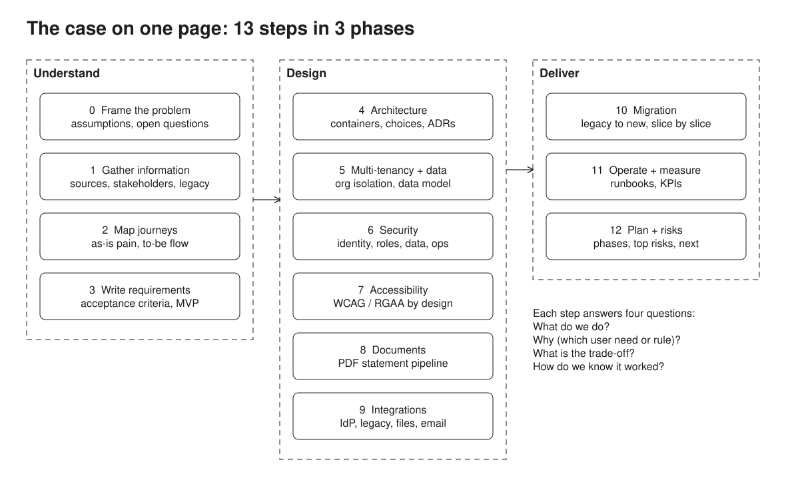

## Contents

| Phase | Step | Header to remember |
| --- | --- | --- |
| Understand | [0](#0-frame-the-problem-assumptions-before-answers) | Frame the problem: assumptions before answers |
| | [1](#1-gather-information-many-sources-one-synthesis) | Gather information: many sources, one synthesis |
| | [2](#2-map-journeys-as-is-pain-to-be-flow) | Map journeys: as-is pain, to-be flow |
| | [3](#3-write-requirements-testable-traced-sliced) | Write requirements: testable, traced, sliced |
| Design | [4](#4-architecture-boring-on-purpose-every-arrow-a-decision) | Architecture: boring on purpose, every arrow a decision |
| | [5](#5-multi-tenancy-and-data-tenant-from-the-session-isolation-in-the-database) | Multi-tenancy: tenant from the session, isolation in the database |
| | [6](#6-security-defence-in-depth-worst-case-first) | Security: defence in depth, worst case first |
| | [7](#7-accessibility-by-design-not-by-audit) | Accessibility: by design, not by audit |
| | [8](#8-documents-a-pdf-pipeline-that-can-crash-and-resume) | Documents: a PDF pipeline that can crash and resume |
| | [9](#9-integrations-core-in-the-middle-adapters-at-the-edge) | Integrations: core in the middle, adapters at the edge |
| Deliver | [10](#10-migration-strangle-never-big-bang) | Migration: strangle, never big-bang |
| | [11](#11-operate-and-measure-runbooks-and-kpis) | Operate and measure: runbooks and KPIs |
| | [12](#12-plan-and-risks-phases-risks-next) | Plan and risks: phases, risks, next |

Then: [time plan](#time-plan), [how an answer is judged](#how-an-answer-is-judged), [final checklist](#final-checklist), [traps](#traps), [presenting the case](#presenting-the-case), [references](#references), [editing the diagrams](#editing-the-diagrams).

---

## The brief (fictional)

A small IT team runs a member portal for about forty partner organisations ("employers"). Their employees ("members") sign in to see their profile and contribution history, request changes (address, bank details) and download a yearly statement. Each organisation sends a contributions file every month. Staff process change requests in an old back office.

The portal is fifteen years old: an unsupported framework, one shared database, passwords stored by the portal, no automated tests, releases twice a year. Support calls are rising, two organisations complained about accessibility, and the framework's end of support is in 18 months. Members use two languages.

**The task:** plan the rebuild. You have three hours, a text editor and a diagram tool.

## Time plan

| Time | Do | Output |
| --- | --- | --- |
| 0:00-0:20 | Read twice, list assumptions and questions | Step 0 |
| 0:20-1:00 | Discovery plan, stakeholders, personas, journeys | Steps 1-2, two diagrams |
| 1:00-1:20 | Requirements and acceptance criteria for the MVP | Step 3 |
| 1:20-2:10 | Architecture, multi-tenancy, data model, security, accessibility, documents, integrations | Steps 4-9, four diagrams |
| 2:10-2:40 | Migration, operations, KPIs, plan and risks | Steps 10-12, one diagram |
| 2:40-3:00 | Re-read against the brief, fix gaps, write the summary on top | Final checklist |

**Do** put a one-paragraph summary at the very top at the end: the reader may only read that. **Don't** spend an hour on one diagram: five clear diagrams beat one perfect one.

## How an answer is judged

Nobody runs your code. A reader looks for:

1. **Users first.** Did you start from who uses it and what hurts today, or from a tech stack?
2. **Reasoned trade-offs.** Every choice says what was rejected and why ("pool with RLS rather than schema per tenant, because ...").
3. **Risk handled.** Data leaks between organisations, the cutover, the yearly campaign, the people side.
4. **Delivery.** Small slices, early value, a way back if something goes wrong.
5. **Clarity.** Short headers, diagrams that match the text, assumptions stated.
6. **Working with people.** Workshops, sign-off, other teams, external providers: the job is not done alone.

---

## 0. Frame the problem: assumptions before answers

> **Remember:** write what you assume and what you would ask, before you design anything.

**Worked example.**

- *Scale:* about 40,000 members; five organisations hold 60% of them. Peak load is the yearly statement week and the first days after a monthly file.
- *Users:* members (occasional, two languages, some with disabilities, many on phones), employer administrators (monthly, expert, desktop), staff (daily, power users).
- *Constraints:* personal and financial data (GDPR), accessibility law (WCAG 2.1/2.2 AA, RGAA in France), an existing identity provider, a team of five that must keep the old portal running.
- *Questions I would ask first:* Who signs off a change to how money is paid? Which organisations have contractual service levels? Can bank detail changes be fully online, or does fraud risk require a call-back? Who owns the data in the old database?

**Do**
- Number assumptions (A1, A2...) so later sections can cite them.
- Turn each big unknown into a question and say how the answer would change the design.

**Don't**
- Hide assumptions inside the design ("we will use 3 servers") where the reader cannot challenge them.
- Ask for more information and stop: assume, state it, and carry on.

**Go deeper:** [`32-casebook/casebook/00-brief.md`](../32-casebook/casebook/00-brief.md).

---

## 1. Gather information: many sources, one synthesis

> **Remember:** talk to people, read the old system, look at the data, then put it all in one place before deciding anything.

**Worked example.** Two weeks of discovery, planned in the answer:

| Source | What it gives | How |
| --- | --- | --- |
| Workshops with business units | goals, rules, who decides | 3 workshops of 2 hours: goals, current process walk-through, priorities |
| Interviews: 6 members, 4 employer admins, 3 staff | real tasks, pain, words they use | 45 minutes each, one script, two people (one asks, one notes) |
| Legacy app: screens, code, database | hidden business rules, real data shapes | screen inventory, read the calculation code, profile the tables |
| Help desk tickets, user requests | what goes wrong most | tag the last 6 months by journey and cause |
| Logs and analytics | what people actually do, on which devices | top pages, drop-off points, mobile share |
| Rules, policies, regulations | what must be true | list each rule with its source and owner |

Then **synthesise** in one place: an affinity map of everything heard, a glossary (what does "member", "effective date", "contribution period" mean to each group?), a rule list (each rule with its source: interview, code, policy), and open questions. The outputs are personas, as-is journeys with pain points, recovered business rules, data owners.

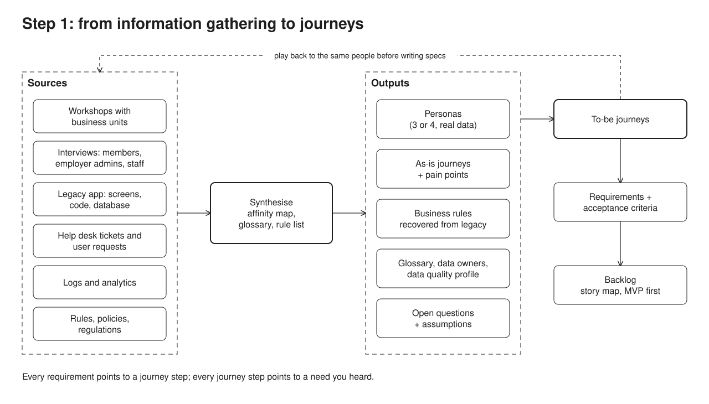

**Who to involve:** a power and interest map tells you how to treat each group. Write for each: what they need, what they fear, what they decide, how often you meet.

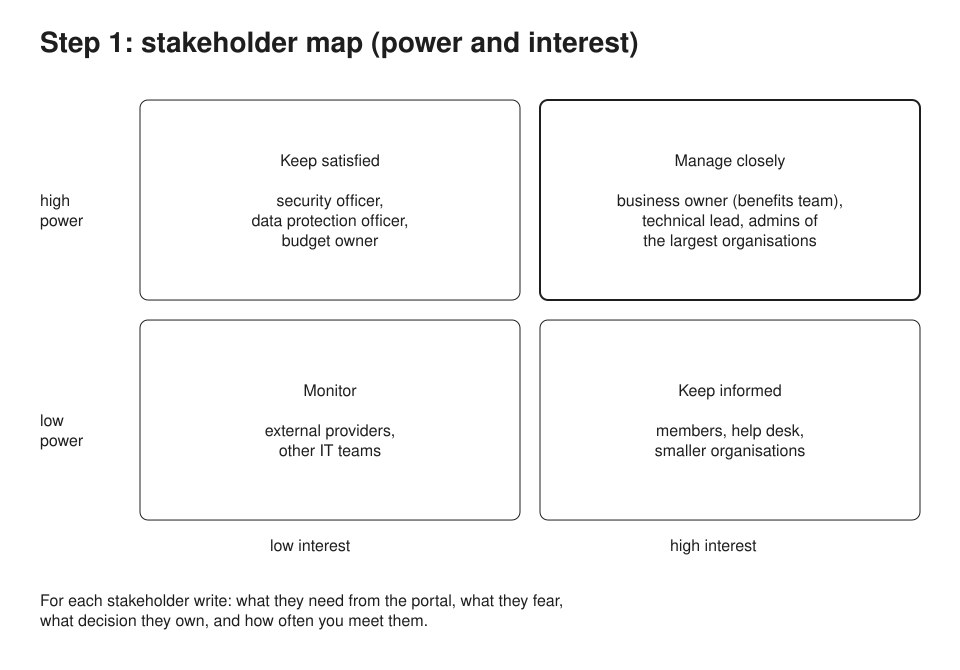

**Do**
- Read the legacy code and database as a source of truth for rules: users forget the edge cases the code still applies.
- Use the users' words in the glossary and later in the interface.
- Plan the playback: show what you understood to the same people before writing specs.

**Don't**
- Treat the old screens as the requirements ("rebuild it the same, but modern"). They show what was built, not what is needed.
- Only talk to managers. The people who do the task daily know where it breaks.
- Run discovery for three months. Time-box it, then learn by shipping.

**Go deeper:** sample [24 characterization](../24-characterization/) (recovering rules from legacy code with a golden master), [`32-casebook/casebook/01-discovery.md`](../32-casebook/casebook/01-discovery.md).

---

## 2. Map journeys: as-is pain, to-be flow

> **Remember:** one journey per important task, drawn across the people and systems it touches, with what hurts today and how you will measure the fix.

**Worked example.** Four core journeys cover most of the value:

1. Sign in and see my data (member).
2. Change my address or bank details (member, staff).
3. Get my yearly statement (member, campaign).
4. Send the monthly contributions file and fix the rejects (employer admin).

Journey 2, to-be, as swimlanes. The as-is version is a paper form, three weeks, no status and many help desk calls; the to-be adds a status the member can see, a second approver above a threshold, and an audit entry.

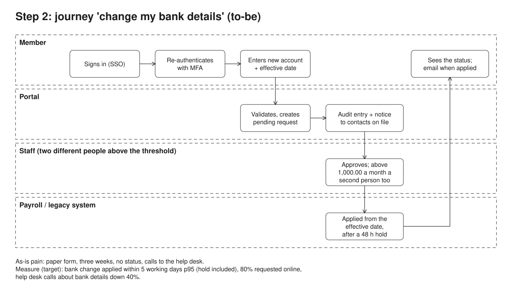

**Do**
- Draw swimlanes (who does what), not just a list of screens.
- Mark the pain on the as-is and the metric on the to-be: "three weeks" becomes "applied within 2 working days, 80% online".
- Include the unhappy paths that matter: rejected request, wrong file, lost email.

**Don't**
- Draw twenty journeys. Four done well show the method.
- Forget staff and employer admins: back-office journeys are where the time goes.

**Go deeper:** [`32-casebook/casebook/02-personas-journeys.md`](../32-casebook/casebook/02-personas-journeys.md); Jeff Patton, *User Story Mapping*.

---

## 3. Write requirements: testable, traced, sliced

> **Remember:** each requirement points to a journey step, has acceptance criteria someone can test, and belongs to a release slice.

**Worked example.** Requirement R5 for journey 2:

```gherkin
Rule: a bank detail change above the threshold needs two different staff members

  Scenario: second approval by the same person is refused
    Given alice requested a change to her bank details
    And staff member carol approved it
    When carol approves it again
    Then the approval is refused with "a different staff member must approve"
    And the request is still pending
```

Then slice: the **MVP** is journeys 1 and 2 for two pilot organisations, read-only contributions, address and bank changes. Statements and imports come later (step 10).

**Do**
- Use Given/When/Then for rules with boundaries (threshold, dates, roles). Include the boundary values.
- Keep a traceability table: requirement, journey step, acceptance criteria, release.
- Separate functional requirements from qualities (performance, availability, accessibility, security) and give the qualities numbers.

**Don't**
- Write "the system shall be user-friendly". Write what a tester can check.
- Specify the user interface in the requirement ("a dropdown"). Specify the need; design solves it.

**Go deeper:** sample [23 specs](../23-specs/) (Gherkin rules run as tests, a traceability matrix), sample [22 playwright](../22-playwright/) (journeys as end-to-end tests); Gojko Adzic, *Specification by Example*.

---

## 4. Architecture: boring on purpose, every arrow a decision

> **Remember:** the simplest architecture that meets the qualities, drawn as containers, with a one-line reason for each choice.

**Worked example.**

- A **routing facade** in front of everything, so each path can go to the new portal or the legacy app (this is what makes step 10 possible).
- A **new portal** in Next.js (React, server-rendered: fast first load, works without JavaScript for forms, good for accessibility), over an **API and domain layer** in Node and TypeScript, REST.
- **PostgreSQL** with Row-Level Security for organisation isolation (step 5) and an outbox table for events.
- **Job workers** for imports, PDFs and email, separate from web requests so a campaign cannot slow the portal.
- **Object storage** for PDFs. **Identity provider** for sign-in (no passwords in the portal).
- A **sync** between the legacy database and the new one during the migration.

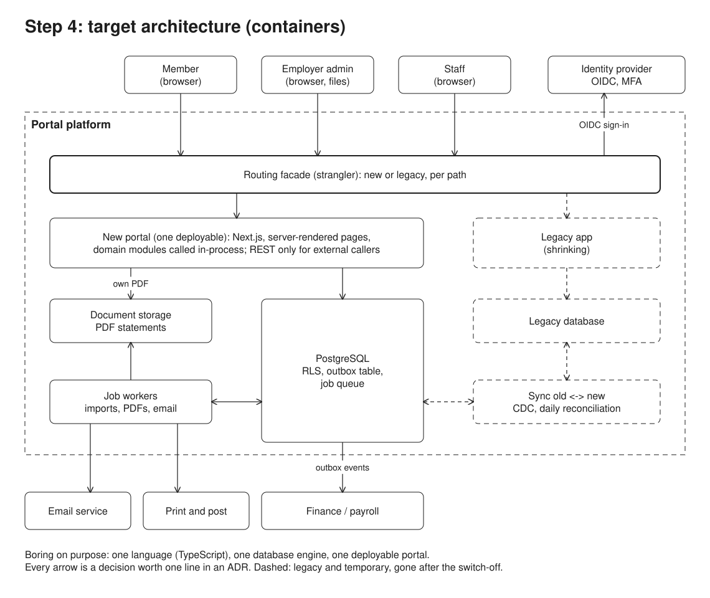

**Architecture decision records**, one short file per choice: context, decision, consequences. Example: *"ADR-3: one PostgreSQL database with RLS for all organisations. Rejected: one database per organisation (forty databases to patch and back up for a five-person team). Consequence: every table carries org_id and every query runs under a policy."*

**Do**
- Name the qualities that drive the design (availability during the campaign, isolation between organisations, accessibility, auditability) and show where each is handled.
- Prefer one language and one database engine for a small team. Fewer things to know at 2 a.m.

**Don't**
- Draw microservices for a team of five. A modular monolith with clear boundaries is the default.
- Draw boxes with no arrows, or arrows with no meaning. Each arrow is a call, an event or a file.

**Go deeper:** sample [20 portal](../20-portal/) (Next.js server components and server actions), [05 strangler fig](../05-strangler-fig/) (routing facade), [06 service reliability](../06-service-reliability/) (timeouts, retries); Simon Brown, C4 model; Michael Nygard, ADRs.

---

## 5. Multi-tenancy and data: tenant from the session, isolation in the database

> **Remember:** the organisation a request belongs to comes from the signed-in session, and the database refuses to return any other organisation's rows even if the code forgets.

This is the step most likely to be probed: one bug here leaks one organisation's members' salaries to another.

**Three models.** A tenant here is a partner organisation.

| Model | How | Good | Bad | Fits when |
| --- | --- | --- | --- | --- |
| **Pool** | shared tables, `org_id` on every row, Row-Level Security | cheap, one migration, scales to thousands | one missing policy leaks, noisy neighbours | many tenants, same features |
| **Bridge** | one schema per organisation, same tables in each, one role per organisation | per-organisation export and restore, clear boundary | a migration runs N times, catalog bloat past a few hundred | tens to a few hundred tenants, some need their own restore |
| **Silo** | one database per organisation | strongest isolation, own backup, region, capacity | cost and operations grow per tenant | the few tenants who demand it |

**Worked example decision:** pool with RLS for all forty organisations, with the option to move one large organisation to a silo later if a contract requires it. Forty is small; a team of five cannot operate forty databases; all organisations use the same features.

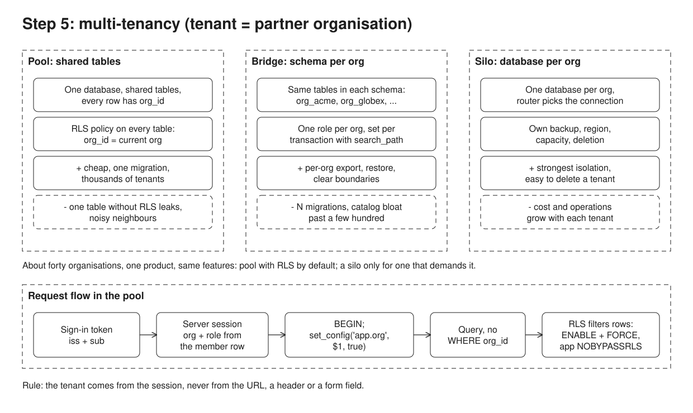

**How the pool is made safe**, in order of importance:

1. **The tenant comes from the session.** After sign-in, the identity provider says which organisation and role the person has. The server keeps it in the session. Never take `org_id` from the URL, a header or a form field.
2. **The database enforces it.** Every table has `org_id` and an RLS policy `USING (org_id = current_setting('app.org')::int)`. The app connects as a role that is **not the table owner** (owners bypass RLS), and tables use `FORCE ROW LEVEL SECURITY`.
3. **Per transaction, not per connection.** Each request runs `BEGIN; SET LOCAL app.org = ...;`. With a connection pool, a plain `SET` stays on the connection and the next request inherits the previous organisation.
4. **Fail closed.** If no organisation is set, the policy returns nothing, not everything. Staff who see all organisations get an explicit role and an audit entry.
5. **Keys lead with `org_id`.** Primary keys, unique constraints, indexes and foreign keys include `org_id`, so a row cannot point into another organisation and queries stay fast per organisation.

**Schema per tenant (bridge), if chosen.** Every schema has the same tables (the normal form of this model). `search_path` only decides where unqualified names are looked up, it does not stop `SELECT * FROM org_globex.members`. Isolation needs one role per organisation with access to its own schema only, and `SET LOCAL ROLE` per transaction. Migrations run once per schema, so a failure halfway leaves some organisations on the new version: the code must handle both shapes until all are done.

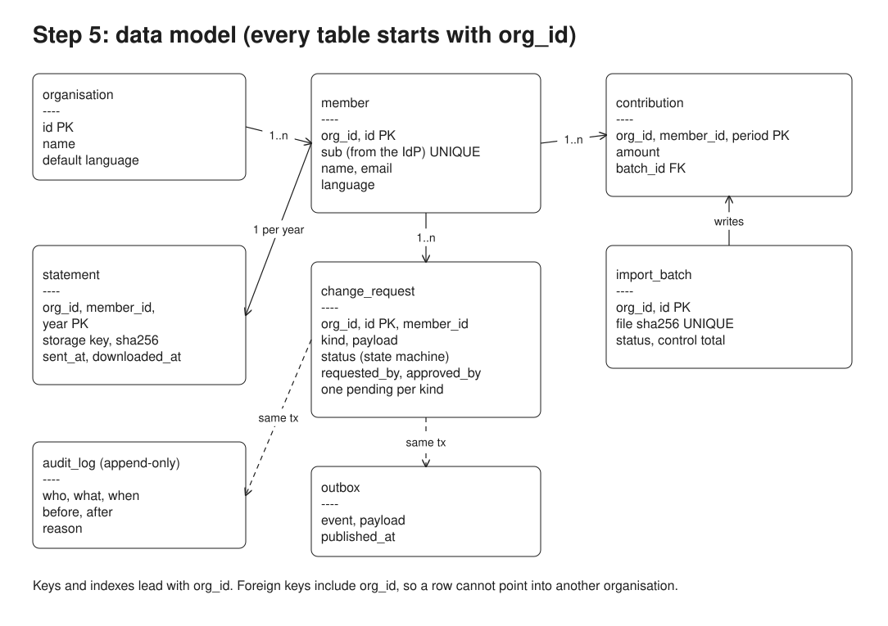

**Do**
- Say which model, why, and what would make you change it.
- Show the request flow from token to query. Readers want to see where the tenant is set.
- Mention the noisy neighbour: one large organisation's import must not slow the others (per-organisation limits, jobs in a queue).

**Don't**
- Rely on every developer remembering `WHERE org_id = ?`.
- Let the application connect as the table owner or a superuser: RLS filters nothing for them.
- Pick a database per tenant "for security" without counting the operations cost.

**Go deeper:** sample [15 multi-tenancy](../15-multi-tenancy/) shows all three models failing and then fixed (forgotten `WHERE`, owner bypass, `SET` vs `SET LOCAL`, `search_path` is not a boundary, migration loop half done, moving a tenant to its own database); sample [01 CRUD + audit](../01-crud-audit/) and [17 audit outbox](../17-audit-outbox/) for the audit log; AWS *SaaS Tenant Isolation Strategies*; PostgreSQL *Row Security Policies*.

---

## 6. Security: defence in depth, worst case first

> **Remember:** name the worst thing that could leak or be changed, then show two independent layers that stop it.

**Worked example.** The worst cases: one organisation sees another's members; someone changes a member's bank account and diverts a payment; personal data leaks from a backup or an email.

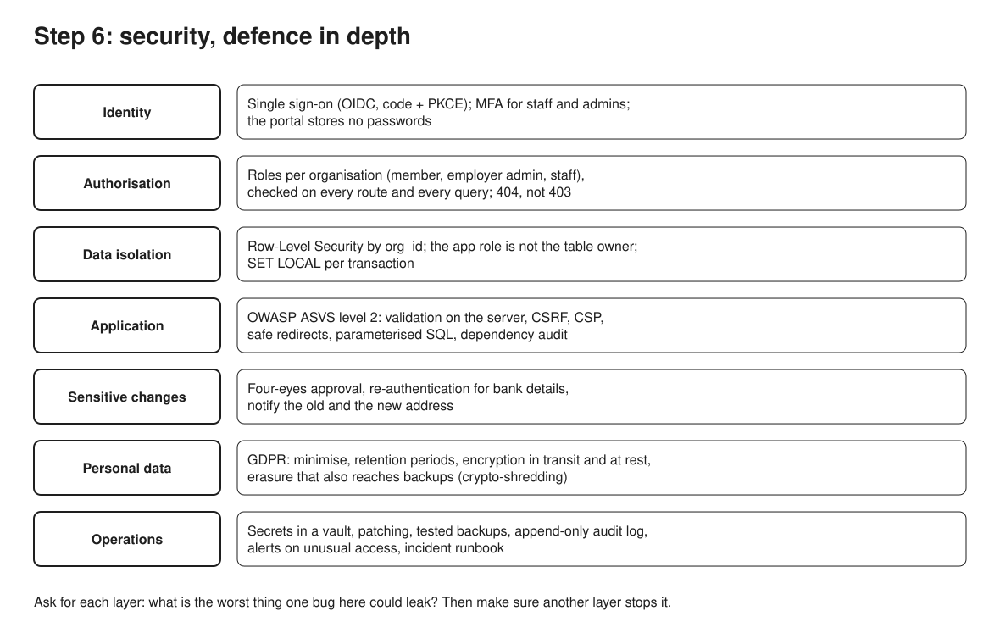

- **Identity:** sign-in through the organisation's identity provider with OpenID Connect (authorisation code with PKCE); MFA for staff and employer admins; the new portal stores no passwords. This also removes the old portal's password table, a real risk today.
- **Authorisation:** roles per organisation (member, employer admin, staff), checked on every route and in every query. Another member's request answers 404, not 403, so ids do not reveal what exists.
- **Data isolation:** step 5.
- **Application:** OWASP ASVS level 2 as the checklist: server-side validation, CSRF protection, a content security policy, safe redirects (only same-site paths after login), parameterised SQL, dependency audit in CI.
- **Sensitive changes:** bank details need re-authentication, a second staff approval above a threshold, and a notification to both the old and the new contact address, so fraud is noticed.
- **Personal data:** minimise what is stored, retention periods, encryption in transit and at rest, an erasure process that reaches event logs and backups (crypto-shredding: delete the person's key).
- **Operations:** secrets in a vault, patching, tested backups, an append-only audit log, alerts on unusual access, an incident runbook.

**Do**
- Start from the threats (who would attack what, and how), then the controls. A short threat list beats a long control list.
- Tie security to journeys: "change bank details" is where fraud happens, so that journey gets the extra controls.

**Don't**
- Write "the system will be secure and GDPR compliant". Say how.
- Put personal data in emails, URLs or logs.

**Go deeper:** sample [26 SSO](../26-sso/) (OIDC with PKCE, state, nonce, safe `returnTo`, role mapping), [15 multi-tenancy](../15-multi-tenancy/), [18 crypto-shredding](../18-crypto-shredding/), [17 audit outbox](../17-audit-outbox/); OWASP ASVS; RFC 9700 (OAuth security best practice).

---

## 7. Accessibility: by design, not by audit

> **Remember:** accessibility is designed, built and tested on every release; the audit at the end only confirms it.

**Worked example.** Target WCAG 2.2 AA (RGAA 4.1 where French law applies), for the portal and the PDF statements.

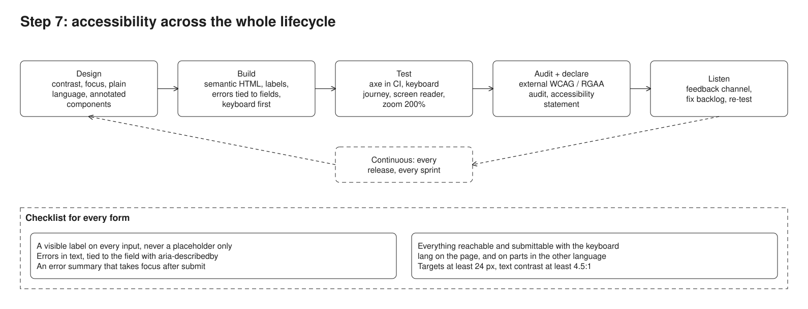

- **Design:** contrast checked in the design tool, visible focus, plain language in both languages, components annotated with their accessible names.
- **Build:** semantic HTML first (real buttons, labels, fieldsets), errors in text tied to their field, an error summary that takes focus, forms that work without JavaScript, `lang` on the page and on any part in the other language.
- **Test:** an automated scan (axe) in CI on every page; a keyboard-only journey test for each core journey; a screen reader check of the four journeys before each release; zoom to 200%.
- **Audit and declare:** an external audit before launch and an accessibility statement with a contact.
- **Listen:** a feedback channel, accessibility issues in the same backlog with a priority.

**Do**
- Say that automated tools find only part of the problems, and plan the manual checks.
- Include documents: tagged PDFs with a language and a reading order.

**Don't**
- Use placeholders as labels, colour alone for errors, or custom controls when native ones exist.
- Leave accessibility to one specialist at the end.

**Go deeper:** sample [21 accessibility](../21-accessibility/) (an inaccessible and an accessible form side by side, axe and a keyboard journey in Chromium), [30 pipeline](../30-pipeline/) (accessibility as a CI gate), [25 bilingual](../25-bilingual/) (two languages, `lang`, formats); WCAG 2.2; RGAA 4.1; GOV.UK Design System error summary.

---

## 8. Documents: a PDF pipeline that can crash and resume

> **Remember:** one job per member and year, claimed safely by workers, retried only for temporary errors, and never sent twice.

**Worked example.** The yearly statement campaign for 40,000 members.

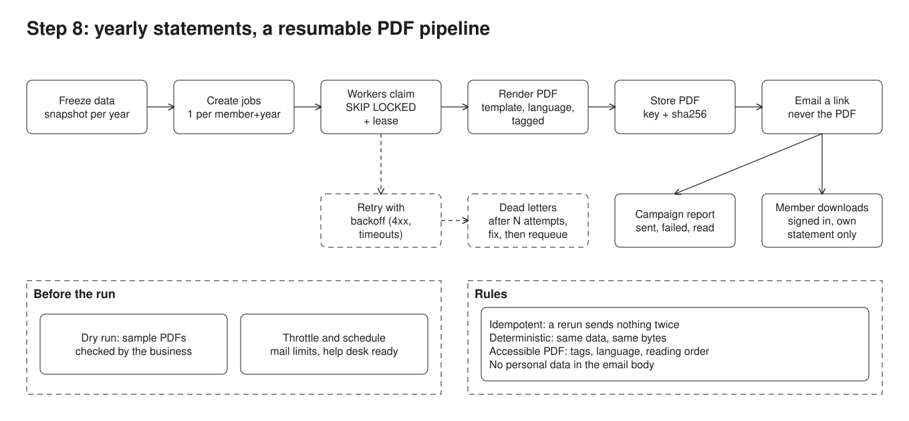

1. **Freeze a snapshot** of the data for the year, so a late correction does not change half the statements.
2. **Create one job per (member, year)** with a unique key. Creating the campaign twice adds nothing.
3. **Workers claim jobs** with `SELECT ... FOR UPDATE SKIP LOCKED` and a lease, so several workers share the work and a crashed worker's jobs are taken over.
4. **Render the PDF** from a template in the member's language, tagged for accessibility. Same data gives the same bytes, so a rerun can be checked.
5. **Store it** with its hash; the database keeps the key, not the file.
6. **Email a link,** never the PDF and no personal data in the body. The member signs in to download their own statement only.
7. **Retry** temporary errors (mail server busy, timeouts) with backoff; **dead letters** after N attempts or for permanent errors (bad address), fixed and requeued by staff.
8. **Report:** sent, failed, downloaded, per organisation.

Before the run: a dry run on sample members checked by the business, throttling to the mail provider's limits, and the help desk told the date.

**Do**
- Say what happens if the job crashes halfway: it resumes, and nobody gets two emails.
- Name the one case you cannot avoid: a crash after the mail server accepted a message but before it was recorded. Decide it explicitly (resend with the same message id, or mark for checking).

**Don't**
- Generate 40,000 PDFs inside a web request or one long loop.
- Attach PDFs with personal data to emails.

**Go deeper:** sample [28 campaign](../28-campaign/) (PDF and email batch with `SKIP LOCKED`, a crash and resume, backoff, dead letters, throttling, a report), [19 leader election](../19-leader-election/) (one scheduler), [09 outbox](../09-outbox-polling/).

---

## 9. Integrations: core in the middle, adapters at the edge

> **Remember:** the domain never speaks another system's model; each integration has an owner, a format, a failure mode and someone who gets alerted.

**Worked example.**

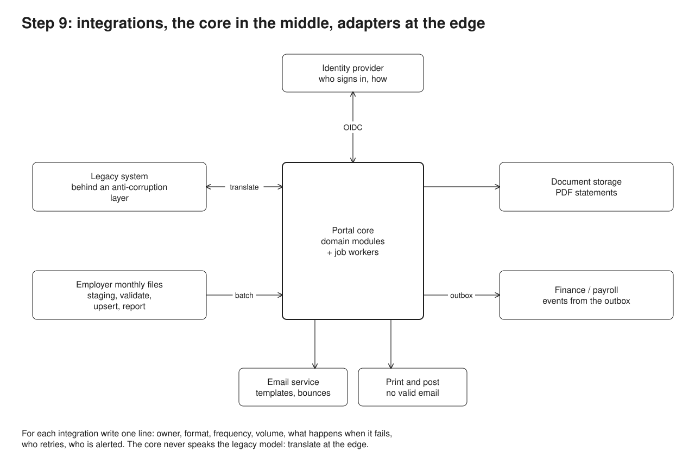

| Integration | Direction | Format | When it fails |
| --- | --- | --- | --- |
| Identity provider | in | OIDC | nobody can sign in: status page, help desk script |
| Legacy system | both, during migration | its database or API, through a translation layer | sync stops: reconciliation report flags the gap |
| Employer monthly files | in | CSV upload with a control total | file refused with reasons, the admin fixes and resends |
| Email service | out | SMTP or API | retry with backoff, dead letters |
| Document storage | out | object store | job retried |
| Finance / payroll | out | events from the outbox | events wait in the outbox until delivered |
| Case management | both | API | requests queue, staff alerted |

**The monthly file, in detail** (a common source of trouble): load into a staging table, validate every line against rules (types, member exists, period, amounts), write rejects with a reason per line, show a dry-run diff (new, changed, unchanged, missing), apply in one transaction with an upsert on the natural key, record the file by its hash so the same file twice does nothing, and reconcile against the sender's control total.

**Do**
- Use an outbox for events: the business change and the event are written in one transaction, then delivered. No lost or phantom events.
- Make every inbound load idempotent and every outbound call retryable.

**Don't**
- Let the legacy data model leak into the new domain: translate at the edge (anti-corruption layer).
- Write to two systems in one request and hope both succeed (the dual-write problem).

**Go deeper:** sample [27 import](../27-import/) (staging, rejects, dry run, upsert, file hash, control totals), [09 outbox polling](../09-outbox-polling/), [10 CDC](../10-cdc-debezium/), [08 saga](../08-saga/); Hohpe and Woolf, *Enterprise Integration Patterns*.

---

## 10. Migration: strangle, never big-bang

> **Remember:** put a facade in front of the old system, move one capability at a time to real users, and keep a one-switch way back at every step.

**Worked example.**

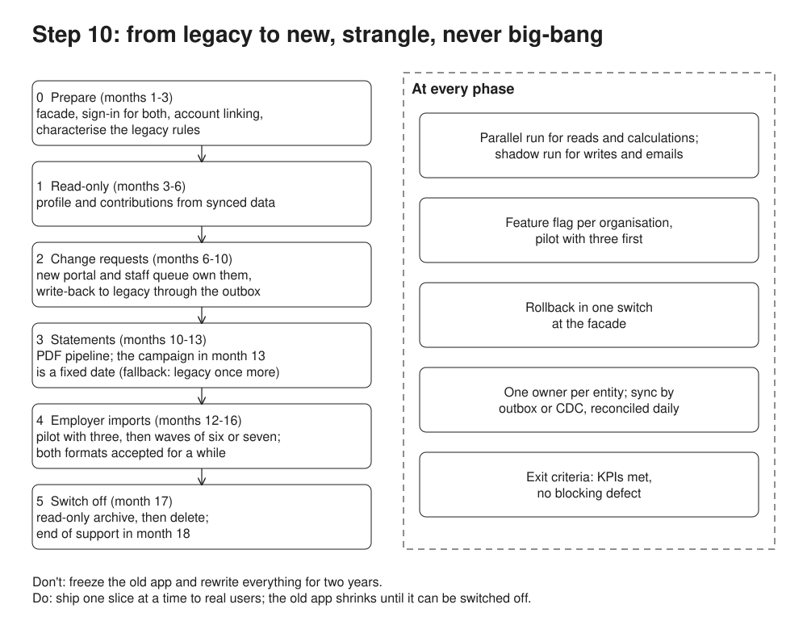

- **Phase 0, prepare:** the routing facade in front of the legacy app; single sign-on for both; characterisation tests that record what the legacy calculations return today.
- **Phase 1, read-only:** profile and contributions served by the new portal from data synced from legacy. Low risk, immediate value, proves the platform.
- **Phase 2, change requests:** the new portal owns the writes and syncs them back to legacy while the back office still uses it.
- **Phase 3, statements:** the PDF pipeline runs the next yearly campaign.
- **Phase 4, employer imports:** the new file format, both formats accepted for a transition period.
- **Phase 5, switch off:** legacy becomes a read-only archive, then is deleted.

At every phase: a **parallel run** comparing old and new results, a **feature flag per organisation** (pilot with two first), **rollback in one switch** at the facade, **daily reconciliation** of the synced data, and **exit criteria** (KPIs met, no blocking defect) before the next phase.

**Do**
- Start with read-only and low-risk slices; move writes when the data sync is proven.
- Schedule the switch-off. A migration that never deletes the old system costs double forever.
- Plan the people side: training for staff, a message to members, the help desk ready.

**Don't**
- Freeze the old system and rewrite everything before anyone uses it.
- Change the data model and the business rules and the interface in the same step: one at a time.

**Go deeper:** samples [05 strangler fig](../05-strangler-fig/), [04 parallel run](../04-parallel-run/), [24 characterization](../24-characterization/), [02 expand / contract](../02-expand-contract/), [10 CDC](../10-cdc-debezium/), and [MIGRATION-PATTERNS.md](../MIGRATION-PATTERNS.md); Martin Fowler, *StranglerFigApplication*; *Patterns of Legacy Displacement*.

---

## 11. Operate and measure: runbooks and KPIs

> **Remember:** every recurring operation is a written runbook that can be run step by step, and every goal is a KPI with a target and an owner.

**Worked example.**

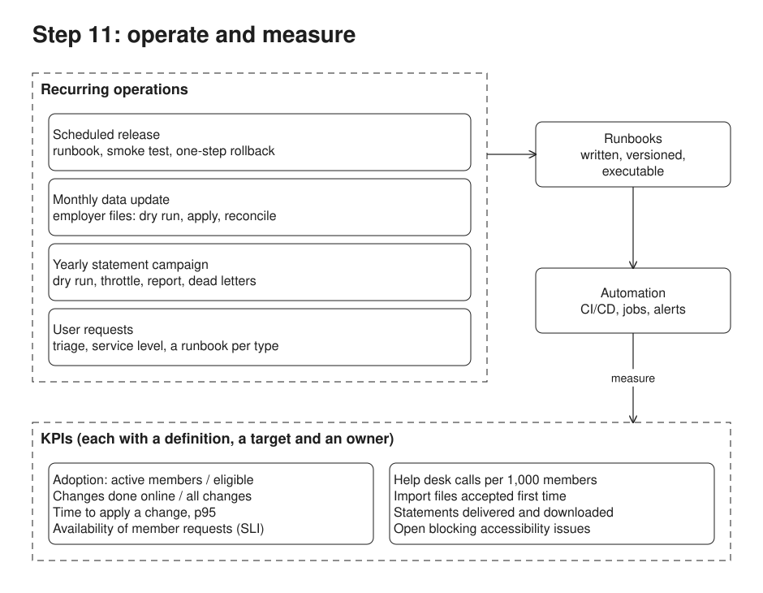

- **Scheduled release** every two weeks: runbook with preconditions, migration, smoke test, one-step rollback.
- **Monthly data update:** dry run, apply, reconcile, report to each organisation.
- **Yearly campaign:** step 8, with its own runbook and a go/no-go.
- **User requests:** triage by type, a service level, a runbook per common type.

Automate the runbooks step by step: first written, then scripted steps with manual confirmations, then fully automated with alerts.

**KPIs** (each with a definition, a target, an owner and a source):

| KPI | Target (example) | Why |
| --- | --- | --- |
| Adoption: active members / eligible | 50% in year one | is the portal used at all |
| Changes done online / all changes | 80% | the journey replaced paper |
| Time to apply a change, p95 | 2 working days | the as-is pain was three weeks |
| Availability against the SLO | 99.5% monthly | service quality, error budget |
| Help desk calls per 1,000 members | down 30% | the real cost of a confusing portal |
| Files accepted first time | 90% | the import journey works for admins |
| Open accessibility issues | 0 blocking | the legal and human requirement |

**Do**
- Measure outcomes (tasks done, time saved, calls avoided), not output (features shipped).
- Use percentiles for time, not averages.

**Don't**
- List KPIs with no target or owner: they will never be looked at.

**Go deeper:** samples [31 runbook](../31-runbook/), [29 KPIs](../29-kpis/), [30 pipeline](../30-pipeline/); Google SRE book, *Service Level Objectives*; Dan Slimmon, *Do-nothing scripting*.

---

## 12. Plan and risks: phases, risks, next

> **Remember:** a plan the reader could start on Monday, the five risks that would kill it, and what you would do with more time.

**Worked example.**

| Risk | Likelihood | Impact | Mitigation |
| --- | --- | --- | --- |
| Data leak between organisations | low | very high | RLS, fail-closed policies, tests that try to read another organisation |
| Legacy rules misunderstood | high | high | characterisation tests, parallel run, business sign-off per rule |
| Data sync drifts during migration | medium | high | daily reconciliation, alerts, one owner per table |
| Campaign fails at scale | medium | high | dry run, throttling, resumable jobs, rehearsal on a copy |
| Team stretched between old and new | high | medium | small slices, freeze features in legacy, external help for the audit |

**Next with more time:** run the discovery for real, validate personas, prototype the two first journeys in the design tool and test them with five users each, estimate the phases.

**Do**
- Give each risk an owner and an action, not just a colour.
- End with what you would validate first and how.

**Don't**
- List twenty risks. Five real ones show judgement.

---

## Final checklist

- [ ] One-paragraph summary at the top.
- [ ] Assumptions numbered and cited.
- [ ] Every requirement traces to a journey step and has acceptance criteria.
- [ ] Multi-tenancy: model chosen with reasons, tenant from the session, isolation in the database.
- [ ] Security: worst cases named, two layers each.
- [ ] Accessibility: target level, how it is built and tested, documents included.
- [ ] The campaign and the monthly import can crash and resume.
- [ ] Migration: phases, a way back at each, a switch-off date.
- [ ] KPIs with targets and owners.
- [ ] Diagrams match the text; names are the same everywhere.

## Traps

| Trap | Instead |
| --- | --- |
| Starting with the tech stack | start with users, journeys and constraints |
| Big-bang rewrite | strangler, slice by slice |
| "Secure", "scalable", "user-friendly" with no detail | say how, with a number or a mechanism |
| One huge diagram | one diagram per question, five or six in total |
| Ignoring the back office | staff and employer admins have journeys too |
| Forgetting the people | workshops, sign-off, training, help desk, external providers |

## Presenting the case

When you walk others through the design, back each choice with a short story from your own work, in the shape situation, task, action, result, what you learned. Have one ready for each:

- running a workshop or interviews with non-technical people;
- recovering rules from or replacing a legacy system;
- improving or automating an operational process;
- a disagreement with a stakeholder and how it was settled;
- a production incident and what changed after it.

## References

Discovery and journeys
- Docs: "How the discovery phase works", GOV.UK Service Manual. https://www.gov.uk/service-manual/agile-delivery/how-the-discovery-phase-works
- Book: *Just Enough Research*, Erika Hall, 2nd edition, 2019.
- Book: *Continuous Discovery Habits*, Teresa Torres, 2021.
- Book: *User Story Mapping*, Jeff Patton, 2014.
- Book: *Mapping Experiences*, James Kalbach, 2nd edition, 2020.

Requirements
- Article: "Introducing BDD", Dan North, 2006. https://dannorth.net/introducing-bdd/
- Book: *Specification by Example*, Gojko Adzic, 2011.

Architecture
- Docs: The C4 model, Simon Brown. https://c4model.com/
- Article: "Documenting Architecture Decisions", Michael Nygard, 2011. https://cognitect.com/blog/2011/11/15/documenting-architecture-decisions

Multi-tenancy
- Whitepaper: *SaaS Tenant Isolation Strategies*, AWS. https://docs.aws.amazon.com/whitepapers/latest/saas-tenant-isolation-strategies/saas-tenant-isolation-strategies.html
- Docs: "Tenancy models for a multitenant solution", Azure Architecture Center. https://learn.microsoft.com/en-us/azure/architecture/guide/multitenant/considerations/tenancy-models
- Docs: "Row Security Policies", PostgreSQL. https://www.postgresql.org/docs/current/ddl-rowsecurity.html

Security
- Standard: OWASP Application Security Verification Standard (ASVS). https://owasp.org/www-project-application-security-verification-standard/
- Docs: OWASP Cheat Sheet Series. https://cheatsheetseries.owasp.org/
- Spec: OpenID Connect Core 1.0. https://openid.net/specs/openid-connect-core-1_0.html
- RFC 9700: Best Current Practice for OAuth 2.0 Security, 2025. https://www.rfc-editor.org/rfc/rfc9700

Accessibility
- Standard: WCAG 2.2, W3C. https://www.w3.org/TR/WCAG22/
- Standard: RGAA 4.1, French government accessibility framework. https://accessibilite.numerique.gouv.fr/
- Docs: Error summary, GOV.UK Design System. https://design-system.service.gov.uk/components/error-summary/

Integration and migration
- Book: *Enterprise Integration Patterns*, Gregor Hohpe and Bobby Woolf, 2003.
- Article: "Pattern: Transactional outbox", Chris Richardson. https://microservices.io/patterns/data/transactional-outbox.html
- Article: "StranglerFigApplication", Martin Fowler. https://martinfowler.com/bliki/StranglerFigApplication.html
- Article series: "Patterns of Legacy Displacement", Ian Cartwright, Rob Horn, James Lewis. https://martinfowler.com/articles/patterns-legacy-displacement/
- Book: *Working Effectively with Legacy Code*, Michael Feathers, 2004.

Operations and measurement
- Book chapter: "Service Level Objectives", *Site Reliability Engineering*, Google. https://sre.google/sre-book/service-level-objectives/
- Article: "Do-nothing scripting: the key to gradual automation", Dan Slimmon, 2019. https://blog.danslimmon.com/2019/07/15/do-nothing-scripting-the-key-to-gradual-automation/
- Research: DORA, software delivery performance metrics. https://dora.dev/

## Editing the diagrams

Each diagram exists twice: `diagrams/NN-name.excalidraw` (open it at https://excalidraw.com with Open, or in the Excalidraw editor plugin of your IDE) and `diagrams/NN-name.svg` (what this page shows). Both are generated from `diagrams/build.mjs` with `node diagrams/build.mjs` (Node 22, no dependencies). Either edit `build.mjs` and regenerate, or edit an `.excalidraw` file by hand and export it to SVG from Excalidraw; regenerating afterwards overwrites hand edits.
