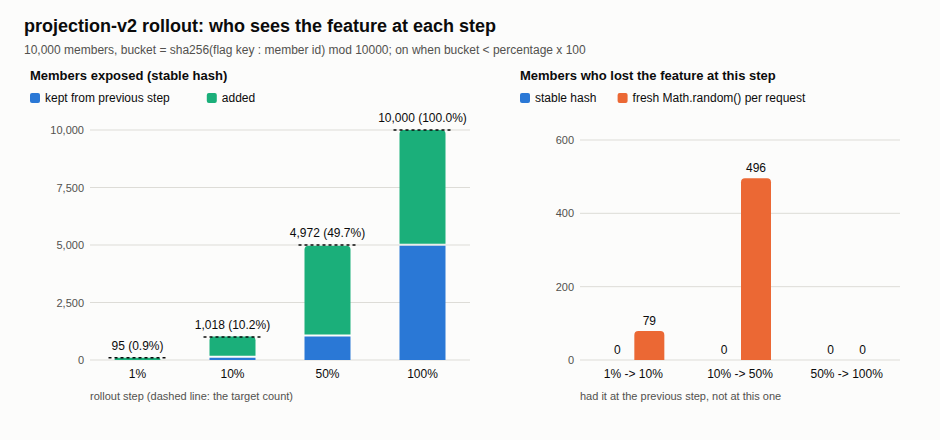

# Replacing a legacy member system safely

## Problem

A member system has run the contributions of Acme, Globex and Initech for years. Its rules are only known by running it, employers feed it monthly files, a CRM holds the member records, and nobody has restored its backup. Every shortcut that looks reasonable fails in the samples' logs:

- A rewrite of the contribution calculation from the member booklet differs from legacy on **676 of 1352** cases ([24](../../24-characterization/)): legacy truncates instead of rounding, skips the month for members who join after the 15th, and counts age as days / 365.
- A rewrite checked only by tests disagrees with legacy on **567 of 1000** real inputs, 188 of them crashes ([04](../../04-parallel-run/)).
- A plain `RENAME` of a column breaks the running old version the moment it commits ([02](../../02-expand-contract/)).
- A row-by-row import run twice doubles a month from 1500.75 to 3001.50; a bad line half-applies the file, and the corrected resend leaves 1736.00 where the file says 1175.50 ([27](../../27-import/)).
- The first CRM import stores **50 of 120** contacts, because it ignores the next-page link, and keeps an email without an `@` ([41](../../41-crm-integration/)).
- A "10%" rollout with `Math.random()` takes the feature away from 496 members when it goes to 50%, and gives 1,747 members a different answer on their second page load ([40](../../40-feature-flags/)).
- After a `DELETE` without its `WHERE`, the last base backup alone would give back 3 of 6 contributions ([31](../../31-runbook/)).

## Constraints

- Members' statements and employers' payroll already depend on legacy's behaviour, quirks included.
- No downtime: old and new code run side by side during every deploy.
- Data keeps arriving during the move: files from employers, changes from a CRM whose model we do not control.
- Every step must be reversible, and the way back must be tested, not assumed.

## Decisions

| Decision | Trade-off |
| --- | --- |
| **Pin legacy before touching it.** A golden master of 1352 inputs (352 boundary values, 1000 seeded random). Every mismatch is explained by the smallest set of rules; four quirks are kept, one bug (the leap-year age) is fixed on an allowlist ([24](../../24-characterization/)). | It covers only the inputs generated, and every change looks like a regression until someone decides. |
| **Compare on real traffic before serving.** Legacy and rewrite both run; callers always get the legacy answer ([04](../../04-parallel-run/)). | Double compute, and only safe for reads without side effects. |
| **Move one capability at a time behind a routing facade.** One routing change per step, one call to roll back ([05](../../05-strangler-fig/)). | Two stacks run until the last route moves; data ownership still has to move too. |
| **Change the schema in expand/contract phases.** Four app versions, four migrations; each phase works for the two versions that overlap ([02](../../02-expand-contract/)). | One rename becomes three deploys spread over days. |
| **Load files idempotently.** `COPY` into staging, rules in SQL with reasons, upsert on the natural key, the file's sha256 and control totals, one transaction per file ([27](../../27-import/)). | A month can be partly loaded until the corrected file arrives. |
| **Release with flags, not deploys.** A stable hash of (flag, member), tenant targeting, a kill switch, an audit row per change, CI failing on expired flags ([40](../../40-feature-flags/)). | Every flag is a branch to test in both states. |
| **Keep the CRM's model at the boundary.** An anti-corruption layer pages, retries, translates option-set codes, verifies webhooks and writes back with `If-Match`; a nightly reconciliation compares both sides ([41](../../41-crm-integration/)). | Paged reads cost requests against the CRM's limits; reconciliation reads everything. |
| **Prove the way back.** A restore drill: base backup, WAL archive, point-in-time recovery to just before the bad transaction ([31](../../31-runbook/)). | The drill's database is tiny, so its RTO says little about a large one. |

## What could go wrong, and how it was guarded

| Risk | Guard, as the logs show it |
| --- | --- |
| The rewrite changes an amount members rely on | Final rewrite: 1310 equal, 42 allowlisted, 0 unexplained. Rounding instead of truncating gives 430 unexplained mismatches and the check goes red. |
| The rewrite crashes on inputs no test had | The experiment swallows 188 candidate exceptions; users are served the legacy total, 1980900, either way. v2 then runs 1000 orders with 0 mismatches. |
| A moved route misbehaves | Rolled back in one call: legacy handles 3/3 requests again, then 1/3, then 0/3 once every route has moved. |
| Old instances still run during the deploy | Each phase keeps both versions working; contracting too early would have failed v3, which is why each phase waits. |
| A file is resent, truncated or has wrong columns | Same bytes under another name: `ALREADY APPLIED batch 5`. Truncated, wrong header, 3 of 3 rows rejected, or a total that does not add up: refused whole, with reasons. |
| The rollout flips members in and out | Stable hash: 0 members lost at every step from 1% to 100%. The kill switch takes the page from 42.9 ms to 0.9 ms. |
| The CRM adds a code or a forged webhook arrives | Code 100000003 is quarantined, not guessed; forged deliveries get 401; a replay 361 s later is outside the 300 s window. Reconciliation finds the 3 drifts sync cannot see, and 0 after repair. |
| Data is lost during the move | Restored to 0.7 s before the `DELETE` (target 60 s), rows back in 6.2 s (target 300 s), checksums equal table by table. |

## Proof

- [24 characterization tests](../../24-characterization/), log [`24-characterization.log`](../../logs/24-characterization.log), decision table [`decision-table.md`](../../24-characterization/decision-table.md)
- [04 parallel run](../../04-parallel-run/), log [`04-parallel-run.log`](../../logs/04-parallel-run.log)
- [05 strangler fig](../../05-strangler-fig/), log [`05-strangler-fig.log`](../../logs/05-strangler-fig.log)
- [02 expand/contract](../../02-expand-contract/), log [`02-expand-contract.log`](../../logs/02-expand-contract.log)
- [27 import](../../27-import/), log [`27-import.log`](../../logs/27-import.log)
- [40 feature flags](../../40-feature-flags/), log [`40-feature-flags.log`](../../logs/40-feature-flags.log), overview [`overview.svg`](../../40-feature-flags/diagrams/overview.svg)
- [41 anti-corruption layer](../../41-crm-integration/), log [`41-crm-integration.log`](../../logs/41-crm-integration.log), overview [`overview.svg`](../../41-crm-integration/diagrams/overview.svg)
- [31 runbooks and restore drill](../../31-runbook/), log [`31-runbook.log`](../../logs/31-runbook.log), overview [`overview.svg`](../../31-runbook/diagrams/overview.svg)
